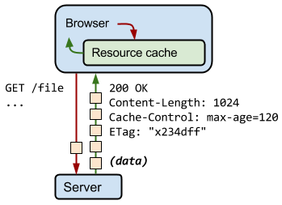
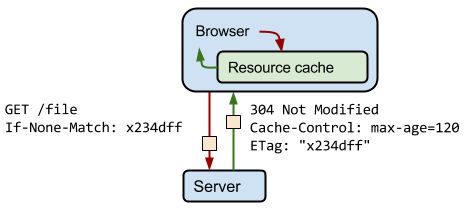
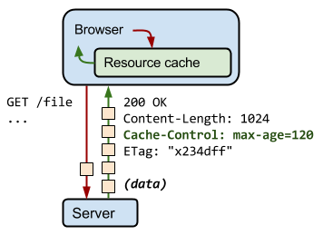
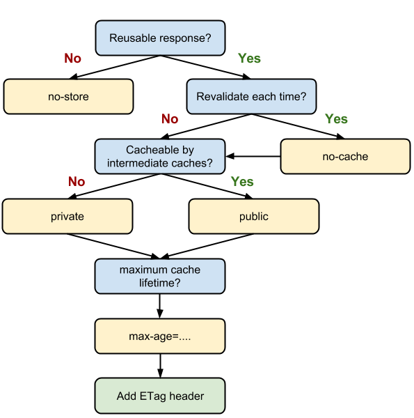

project_path: /web/fundamentals/_project.yaml
book_path: /web/fundamentals/_book.yaml
description: Caching and reusing previously fetched resources is a critical aspect of optimizing for performance.

{# wf_updated_on: 2016-08-30 #}
{# wf_published_on: 2013-12-31 #}

# HTTP Caching {: .page-title }



Fetching something over the network is both slow and expensive. Large responses require many roundtrips between the client and server, which delays when they are available and when the browser can process them, and also incurs data costs for the visitor. As a result, the ability to cache and reuse previously fetched resources is a critical aspect of optimizing for performance.

The good news is that every browser ships with an implementation of an HTTP cache. All you need to do is ensure that each server response provides the correct HTTP header directives to instruct the browser on when and for how long the browser can cache the response.

Note: If you are using a WebView to fetch and display web content in your application, you might need to provide additional configuration flags to ensure that the HTTP cache is enabled, its size is set to a reasonable number to match your use case, and the cache is persisted. Check the platform documentation and confirm your settings.

When the server returns a response, it also emits a collection of HTTP headers, describing its content-type, length, caching directives, validation token, and more. For example, in the above exchange, the server returns a 1024-byte response, instructs the client to cache it for up to 120 seconds, and provides a validation token ("x234dff") that can be used after the response has expired to check if the resource has been modified.

## Validating cached responses with ETags

### TL;DR {: .hide-from-toc }
* The server uses the ETag HTTP header to communicate a validation token.
* The validation token enables efficient resource update checks: no data is transferred if the resource has not changed.

Assume that 120 seconds have passed since the initial fetch and the browser has initiated a new request for the same resource. First, the browser checks the local cache and finds the previous response. Unfortunately, the browser can't use the previous response because the response has now expired. At this point, the browser could dispatch a new request and fetch the new full response. However, that’s inefficient because if the resource hasn't changed, then there's no reason to download the same information that's already in cache!

That’s the problem that validation tokens, as specified in the ETag header, are designed to solve. The server generates and returns an arbitrary token, which is typically a hash or some other fingerprint of the contents of the file. The client doesn't need to know how the fingerprint is generated; it only needs to send it to the server on the next request. If the fingerprint is still the same, then the resource hasn't changed and you can skip the download.

In the preceding example, the client automatically provides the ETag token in the "If-None-Match" HTTP request header. The server checks the token against the current resource. If the token hasn't changed, the server returns a "304 Not Modified" response, which tells the browser that the response it has in cache hasn't changed and can be renewed for another 120 seconds. Note that you don't have to download the response again, which saves time and bandwidth.

As a web developer, how do you take advantage of efficient revalidation? The browser does all the work on our behalf. The browser automatically detects if a validation token has been previously specified, it appends the validation token to an outgoing request, and it updates the cache timestamps as necessary based on the received response from the server. **The only thing left to do is to ensure that the server is providing the necessary ETag tokens. Check your server documentation for the necessary configuration flags.**

Note: Tip: The HTML5 Boilerplate project contains <a href='https://github.com/h5bp/server-configs'>sample configuration files</a> for all the most popular servers with detailed comments for each configuration flag and setting. Find your favorite server in the list, look for the appropriate settings, and copy/confirm that your server is configured with the recommended settings.

## Cache-Control

### TL;DR {: .hide-from-toc }
* Each resource can define its caching policy via the Cache-Control HTTP header.
* Cache-Control directives control who can cache the response, under which conditions, and for how long.

From a performance optimization perspective, the best request is a request that doesn't need to communicate with the server: a local copy of the response allows you to eliminate all network latency and avoid data charges for the data transfer. To achieve this, the HTTP specification allows the server to return [Cache-Control directives](http://www.w3.org/Protocols/rfc2616/rfc2616-sec14.html#sec14.9) that control how, and for how long, the browser and other intermediate caches can cache the individual response.

Note: The Cache-Control header was defined as part of the HTTP/1.1 specification and supersedes previous headers (for example, Expires) used to define response caching policies. All modern browsers support Cache-Control, so that's all you need.

### "no-cache" and "no-store"

"no-cache" indicates that the returned response can't be used to satisfy a subsequent request to the same URL without first checking with the server if the response has changed. As a result, if a proper validation token (ETag) is present, no-cache incurs a roundtrip to validate the cached response, but can eliminate the download if the resource has not changed.

By contrast, "no-store" is much simpler. It simply disallows the browser and all intermediate caches from storing any version of the returned response&mdash;for example, one containing private personal or banking data. Every time the user requests this asset, a request is sent to the server and a full response is downloaded.

### "public" vs. "private"

If the response is marked as "public", then it can be cached, even if it has HTTP authentication associated with it, and even when the response status code isn't normally cacheable. Most of the time, "public" isn't necessary, because explicit caching information (like "max-age") indicates that the response is cacheable anyway.

By contrast, the browser can cache "private" responses. However, these responses are typically intended for a single user, so an intermediate cache is not allowed to cache them. For example, a user's browser can cache an HTML page with private user information, but a CDN can't cache the page.

### "max-age"

This directive specifies the maximum time in seconds that the fetched response is allowed to be reused from the time of the request. For example, "max-age=60" indicates that the response can be cached and reused for the next 60 seconds.

## Defining optimal Cache-Control policy

Follow the decision tree above to determine the optimal caching policy for a particular resource, or a set of resources, that your application uses. Ideally, you should aim to cache as many responses as possible on the client for the longest possible period, and provide validation tokens for each response to enable efficient revalidation.

<table class="responsive">
<thead>
  <tr>
    <th colspan="2">Cache-Control directives &amp; Explanation</th>
  </tr>
</thead>
<tr>
  <td data-th="cache-control">max-age=86400</td>
  <td data-th="explanation">Response can be cached by browser and any intermediary caches (that is, it's "public") for up to 1 day (60 seconds x 60 minutes x 24 hours).</td>
</tr>
<tr>
  <td data-th="cache-control">private, max-age=600</td>
  <td data-th="explanation">Response can be cached by the client’s browser only for up to 10 minutes (60 seconds x 10 minutes).</td>
</tr>
<tr>
  <td data-th="cache-control">no-store</td>
  <td data-th="explanation">Response is not allowed to be cached and must be fetched in full on every request.</td>
</tr>
</table>

According to HTTP Archive, among the top 300,000 sites (by Alexa rank), the browser can cache [nearly half of all the downloaded responses](http://httparchive.org/trends.php#maxage0), which is a huge savings for repeat pageviews and visits. Of course, that doesn’t mean that your particular application can cache 50% of the resources. Some sites can cache more than 90% of their resources, while other sites might have a lot of private or time-sensitive data that can’t be cached at all.

**Audit your pages to identify which resources can be cached and ensure that they return appropriate Cache-Control and ETag headers.**

## Invalidating and updating cached responses

### TL;DR {: .hide-from-toc }
* Locally cached responses are used until the resource "expires."
* Embedding a file content fingerprint in the URL enables you to force the client to update to a new version of the response.
* Each application needs to define its own cache hierarchy for optimal performance.

All HTTP requests that the browser makes are first routed to the browser cache to check whether there is a valid cached response that can be used to fulfill the request. If there's a match, the response is read from the cache, which eliminates both the network latency and the data costs that the transfer incurs. 

**However, what if you want to update or invalidate a cached response?** For example, suppose you've told your visitors to cache a CSS stylesheet for up to 24 hours (max-age=86400), but your designer has just committed an update that you'd like to make available to all users. How do you notify all the visitors who have what is now a "stale" cached copy of your CSS to update their caches? You can't, at least not without changing the URL of the resource.

After the browser caches the response, the cached version is used until it's no longer fresh, as determined by max-age or expires, or until it is evicted from cache for some other reason&mdash; for example, the user clearing their browser cache. As a result, different users might end up using different versions of the file when the page is constructed: users who just fetched the resource use the new version, while users who cached an earlier (but still valid) copy use an older version of its response.

**How do you get the best of both worlds: client-side caching and quick updates?** You change the URL of the resource and force the user to download the new response whenever its content changes. Typically, you do this by embedding a fingerprint of the file, or a version number, in its filename&mdash;for example, style.**x234dff**.css.

The ability to define per-resource caching policies allows you to define "cache hierarchies" that allow you to control not only how long each is cached for, but also how quickly visitors see new versions. To illustrate this, analyze the above example:

* The HTML is marked with "no-cache", which means that the browser always revalidates the document on each request and fetches the latest version if the contents change. Also, within the HTML markup, you embed fingerprints in the URLs for CSS and JavaScript assets: if the contents of those files change, then the HTML of the page changes as well and a new copy of the HTML response is downloaded.
* The CSS is allowed to be cached by browsers and intermediate caches (for example, a CDN), and is set to expire in 1 year. Note that you can use the "far future expires" of 1 year safely because you embed the file fingerprint in its filename: if the CSS is updated, the URL changes as well.
* The JavaScript is also set to expire in 1 year, but is marked as private, perhaps because it contains some private user data that the CDN shouldn’t cache.
* The image is cached without a version or unique fingerprint and is set to expire in 1 day.

The combination of ETag, Cache-Control, and unique URLs allows you to deliver the best of all worlds: long-lived expiration times, control over where the response can be cached, and on-demand updates.

## Caching checklist

There's no one best cache policy. Depending on your traffic patterns, type of data served, and application-specific requirements for data freshness, you must define and configure the appropriate per-resource settings, as well as the overall "caching hierarchy."

Some tips and techniques to keep in mind as you work on caching strategy:

* **Use consistent URLs:** if you serve the same content on different URLs, then that content will be fetched and stored multiple times. Tip: note that [URLs are case sensitive](http://www.w3.org/TR/WD-html40-970708/htmlweb.html).
* **Ensure that the server provides a validation token (ETag):** validation tokens eliminate the need to transfer the same bytes when a resource has not changed on the server.
* **Identify which resources can be cached by intermediaries:** those with responses that are identical for all users are great candidates to be cached by a CDN and other intermediaries.
* **Determine the optimal cache lifetime for each resource:** different resources may have different freshness requirements. Audit and determine the appropriate max-age for each one.
* **Determine the best cache hierarchy for your site:** the combination of resource URLs with content fingerprints and short or no-cache lifetimes for HTML documents allows you to control how quickly the client picks up updates.
* **Minimize churn:** some resources are updated more frequently than others. If there is a particular part of a resource (for example, a JavaScript function or a set of CSS styles) that is often updated, consider delivering that code as a separate file. Doing so allows the remainder of the content (for example, library code that doesn't change very often), to be fetched from cache and minimizes the amount of downloaded content whenever an update is fetched.

