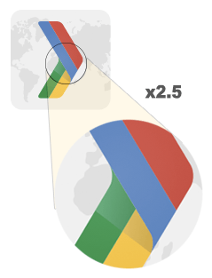
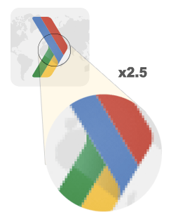
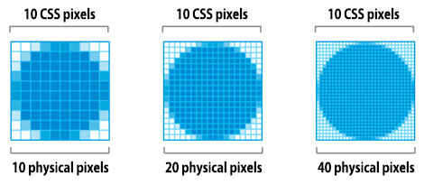
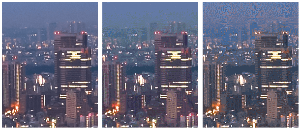
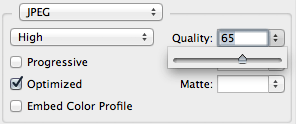
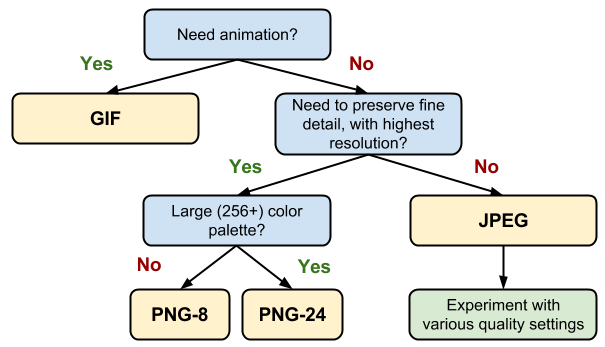
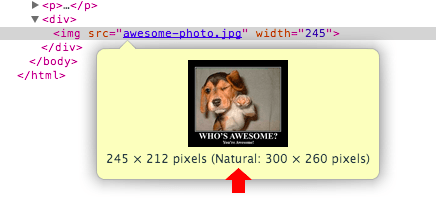

project_path: /web/fundamentals/_project.yaml
book_path: /web/fundamentals/_book.yaml

{# wf_updated_on: 2017-07-24 #}
{# wf_published_on: 2014-05-06 #}

# Image Optimization {: .page-title }



Images often account for most of the downloaded bytes on a web page and also often occupy a significant amount of visual space. As a result, optimizing images can often yield some of the largest byte savings and performance improvements for your website: the fewer bytes the browser has to download, the less competition there is for the client's bandwidth and the faster the browser can download and render useful content on the screen.

Image optimization is both an art and science: an art because there is no one definitive answer for how best to compress an individual image, and a science because there are many well developed techniques and algorithms that can significantly reduce the size of an image. Finding the optimal settings for your image requires careful analysis along many dimensions: format capabilities, content of encoded data, quality, pixel dimensions, and more.

## Eliminating and replacing images

### TL;DR {: .hide-from-toc }
- Eliminate unnecessary image resources
- Leverage CSS3 effects where possible
- Use web fonts instead of encoding text in images

The very first question you should ask yourself is whether an image is, in fact, required to achieve the effect you are after. Good design is simple and will also always yield the best performance. If you can eliminate an image resource, which often requires a large number of bytes relative to HTML, CSS, JavaScript and other assets on the page, then that is always the best optimization strategy. That said, a well-placed image can also communicate more  information than a thousand words, so it is up to you to find that balance.

Next, you should consider if there is an alternative technology that could deliver the desired results, but in a more efficient manner:

* **CSS effects** (gradients, shadows, etc.) and CSS animations can be used to produce resolution-independent assets that always look sharp at every resolution and zoom level, often at a fraction of the bytes required by an image file.
* **Web fonts** enable use of beautiful typefaces while preserving the ability to select, search, and resize text - a significant improvement in usability.

If you ever find yourself encoding text in an image asset, stop and reconsider. Great typography is critical to good design, branding, and readability, but text-in-images delivers a poor user experience: the text is not selectable, not searchable, not zoomable, not accessible, and not friendly for high-DPI devices. The use of web fonts requires its [own set of optimizations](https://www.igvita.com/2014/01/31/optimizing-web-font-rendering-performance/), but it addresses all of these concerns and is always a better choice for displaying text.

## Vector vs. Raster images

### TL;DR {: .hide-from-toc }
- Vector images are ideal for images that consist of geometric shapes
- Vector images are zoom and resolution-independent
- Raster images should be used for complex scenes with lots of irregular shapes and details

Once you've determined that an image is, in fact, the optimal format to achieve the desired effect, the next critical choice is to select the appropriate format:

  <figure>
    
    <figcaption>Zoomed-in vector image</figcaption>
  </figure>

  <figure>
    
    <figcaption>Zoomed-in raster image</figcaption>
  </figure>

* [Vector graphics](https://en.wikipedia.org/wiki/Vector_graphics) use lines, points, and polygons to represent an image.
* [Raster graphics](https://en.wikipedia.org/wiki/Raster_graphics) represent an image by encoding the individual values of each pixel within a rectangular grid.

Each format has its own set of pros and cons. Vector formats are ideally suited for images that consist of simple geometric shapes (for example, logos, text, icons, and so on), and deliver sharp results at every resolution and zoom setting, which makes them an ideal format for high-resolution screens and assets that need to be displayed at varying sizes.

However, vector formats fall short when the scene is complicated (for example, a photo): the amount of SVG markup to describe all the shapes can be prohibitively high and the output may still not look "photorealistic". When that's the case, that's when you should be using a raster image format such as GIF, PNG, JPEG, or one of the newer formats such as JPEG-XR and WebP.

Raster images do not have the same nice properties of being resolution or zoom independent - when you scale up a raster image you'll see jagged and blurry graphics. As a result, you may need to save multiple versions of a raster image at various resolutions to deliver the optimal experience to your users.

## Implications of high-resolution screens

### TL;DR {: .hide-from-toc }
- High resolution screens have multiple device pixels per CSS pixel
- High resolution images require significantly higher number of pixels and bytes
- Image optimization techniques are the same regardless of resolution

When we talk about image pixels, we need to distinguish between different kinds of pixels: CSS pixels and device pixels. A single CSS pixel may contain multiple device pixels - for example, a single CSS pixel may correspond directly to a single device pixel, or may be backed by multiple device pixels. What's the point? Well, the more device pixels there are, the finer the detail of the displayed content on the screen.

High DPI (HiDPI) screens produce beautiful results, but there is one obvious tradeoff: our image assets require more detail in order to take advantage of the higher device pixel counts. The good news is, vector images are ideally suited for this task, as they can be rendered at any resolution with sharp results - we might incur a higher processing cost to render the finer detail, but the underlying asset is the same and is resolution independent.

On the other hand, raster images pose a much larger challenge because they encode image data on a per-pixel basis. Hence, the larger the number of pixels, the larger the filesize of a raster image. As an example, let's consider the difference between a photo asset displayed at 100x100 (CSS) pixels:

<table>
<thead>
  <tr>
    <th>Screen resolution</th>
    <th>Total pixels</th>
    <th>Uncompressed filesize (4 bytes per pixel)</th>
  </tr>
</thead>
<tbody>
<tr>
  <td data-th="resolution">1x</td>
  <td data-th="total pixels">100 x 100 = 10,000</td>
  <td data-th="filesize">40,000 bytes</td>
</tr>
<tr>
  <td data-th="resolution">2x</td>
  <td data-th="total pixels">100 x 100 x 4 = 40,000</td>
  <td data-th="filesize">160,000 bytes</td>
</tr>
<tr>
  <td data-th="resolution">3x</td>
  <td data-th="total pixels">100 x 100 x 9 = 90,000</td>
  <td data-th="filesize">360,000 bytes</td>
</tr>
</tbody>
</table>

When we double the resolution the physical screen the total number of pixels increases by a factor of four: double the number of horizontal pixels, times double the number of vertical pixels. Hence, a "2x" screen not just doubles, but quadruples the number of required pixels!

So, what does this mean in practice? High resolution screens enable us to deliver beautiful images, which can be a great product feature. However, high resolution screens also require high-resolution images: prefer vector images whenever possible as they are resolution independent and always deliver sharp results, and if a raster image is required, deliver and optimize multiple variants of each imagewith the help of [`srcset` and `picture`](/web/fundamentals/design-and-ux/responsive/images#images-in-markup).

## Optimizing vector images

### TL;DR {: .hide-from-toc }
- SVG is an XML-based image format
- SVG files should be minified to reduce their size
- SVG files should be compressed with GZIP

All modern browsers support Scalable Vector Graphics (SVG), which is an XML-based image format for two-dimensional graphics: we can embed the SVG markup directly on the page, or as an external resource. In turn, an SVG file can be created by most vector-based drawing software, or by hand and directly in your favorite text editor.

    <?xml version="1.0" encoding="utf-8"?>
    <!-- Generator: Adobe Illustrator 17.1.0, SVG Export Plug-In . SVG Version: 6.00 Build 0)  -->
    <svg version="1.2" baseProfile="tiny" id="Layer_1" xmlns="http://www.w3.org/2000/svg" xmlns:xlink="http://www.w3.org/1999/xlink"
       x="0px" y="0px" viewBox="0 0 612 792" xml:space="preserve">
    <g id="XMLID_1_">
      <g>
        <circle fill="red" stroke="black" stroke-width="2" stroke-miterlimit="10" cx="50" cy="50" r="40"/>
      </g>
    </g>
    </svg>
    

The above example renders a simple circle shape with a black outline and red background and was exported from Adobe Illustrator. As you can tell, it contains a lot of metadata, such as layer information, comments, and XML namespaces that are often unnecessary to render the asset in the browser. As a result, it is always a good idea to minify your SVG files by running through a tool like [svgo](https://github.com/svg/svgo).

Case in point, svgo reduces the size of the above SVG file generated by Illustrator by 58%, taking it from 470 to 199 bytes. Further, because SVG is an XML-based format, we can also apply GZIP compression to reduce its transfer size - make sure your server is configured to compress SVG assets!

## Optimizing raster images

### TL;DR {: .hide-from-toc }
- A raster image is a grid of pixels
- Each pixel encodes color and transparency information
- Image compressors use a variety of techniques to reduce the number of required bits per pixel to reduce file size of the image

A raster image is simply a 2-dimensional grid of individual "pixels" - for example, a 100x100 pixel image is a sequence of 10,000 pixels. In turn, each pixel stores the "[RGBA](https://en.wikipedia.org/wiki/RGBA_color_space)" values: (R) red channel, (G) green channel, (B) blue channel, and (A) alpha (transparency) channel.

Internally, the browser allocates 256 values (shades) for each channel, which translates to 8 bits per channel (2 ^ 8 = 256), and 4 bytes per pixel (4 channels x 8 bits = 32 bits = 4 bytes). As a result, if we know the dimensions of the grid we can easily calculate the filesize:

* 100 x 100px image is composed of 10,000 pixels
* 10,000 pixels x 4 bytes = 40,000 bytes
* 40,000 bytes / 1024 = 39 KB

Note: As an aside, regardless of the image format used to transfer the data from the server to the client, when the image is decoded by the browser, each pixel always occupies 4 bytes of memory. This can be an important constraint for large images and devices which do not have a lot of available memory - for example, low-end mobile devices.

<table>
<thead>
  <tr>
    <th>Dimensions</th>
    <th>Pixels</th>
    <th>File size</th>
  </tr>
</thead>
<tbody>
<tr>
  <td data-th="dimensions">100 x 100</td>
  <td data-th="pixels">10,000</td>
  <td data-th="file size">39 KB</td>
</tr>
<tr>
  <td data-th="dimensions">200 x 200</td>
  <td data-th="pixels">40,000</td>
  <td data-th="file size">156 KB</td>
</tr>
<tr>
  <td data-th="dimensions">300 x 300</td>
  <td data-th="pixels">90,000</td>
  <td data-th="file size">351 KB</td>
</tr>
<tr>
  <td data-th="dimensions">500 x 500</td>
  <td data-th="pixels">250,000</td>
  <td data-th="file size">977 KB</td>
</tr>
<tr>
  <td data-th="dimensions">800 x 800</td>
  <td data-th="pixels">640,000</td>
  <td data-th="file size">2500 KB</td>
</tr>
</tbody>
</table>

39KB for a 100x100 pixel image may not seem like a big deal, but the filesize quickly explodes for larger images and makes image assets both slow and expensive to download. Thankfully, what we've described so far is the "uncompressed" image format. What could we do to reduce the image file size?

One simple strategy is to reduce the "bit-depth" of the image from 8 bits per channel to a smaller color palette: 8 bits per channel gives us 256 values per channel and 16,777,216 (2563) colors in total. What if we reduced the palette to 256 colors? Then we would only need 8 bits in total for the RGB channels and immediately save two bytes per pixel -- that's 50% compression savings over our original 4 bytes per pixel format!

Note: Left to right (PNG): 32-bit (16M colors), 7-bit (128 colors), 5-bit (32 colors). Complex scenes with gradual color transitions (gradients, sky, etc.) require larger color palettes to avoid visual artifacts such as the pixelated sky in the 5-bit asset. On the other hand, if the image only uses a few colors, then a large palette is simply wasting precious bits!

Next, once we've optimized the data stored in individual pixels we could get more clever and look at nearby pixels as well: turns out, many images, and especially photos, have many nearby pixels with similar colors - for example, the sky, repeating textures, and so on. Using this information to our advantage the compressor can apply "[delta encoding](https://en.wikipedia.org/wiki/Delta_encoding)" where instead of storing the individual values for each pixel, we can store the difference between nearby pixels: if the adjacent pixels are the same, then the delta is "zero" and we only need to store a single bit! But why stop there...

The human eye has different level of sensitivity to different colors: we can optimize our color encoding to account for this by reducing or increasing  the palette for those colors.
"Nearby" pixels form a two dimensional grid, which means that each pixel has multiple neighbors: we can use this fact to further improve delta encoding.
Instead of looking at just the immediate neighbors for each pixel, we can look at larger blocks of nearby pixels and encode different blocks with different settings. And so on...

As you can tell, image optimization gets complicated quickly (or fun, depending on your perspective), and is an active area of academic and commercial research. Images occupy a lot of bytes and there is a lot of value in developing better image compression techniques! If you're curious to learn more, head to the [Wikipedia page](https://en.wikipedia.org/wiki/Image_compression), or check out the [WebP compression techniques whitepaper](/speed/webp/docs/compression) for a hands-on example.

So, once again, this is all great, but also very academic: how does it help us optimize images on our pages? Well, we are definitely not in a position to invent new compression techniques, but it's important to understand the shape of the problem: RGBA pixels, bit-depth, and various optimization techniques. All of these concepts are critical to understand and keep in mind before we dive into the discussions of various raster image formats.

## Lossless vs lossy image compression

### TL;DR {: .hide-from-toc }
- Due to how our eyes work, images are great candidates for lossy compression
- Image optimization is a function of lossy and lossless compression
- Differences in image formats are due to the difference in how and which lossy and lossless algorithms are used to optimize the image
- There is no single best format or "quality setting" for all images: each combination of particular compressor and image contents produce a unique output

For certain types of data, such as source code for a page, or an executable file, it is critical that a compressor does not alter or lose any of the original information: a single missing or wrong bit of data could completely change the meaning of the contents of the file, or worse, break it entirely. For some other types of data, such as images, audio, and video, it may be perfectly acceptable to deliver an "approximate" representation of the original data.

In fact, due to how the eye works, we can often get away with discarding some information about each pixel in order to reduce the filesize of an image - for example, our eyes have different sensitivity to different colors, which means that we can use fewer bits to encode some colors. As a result, a typical image optimization pipeline consists of two high level steps:

1. Image is processed with a "[lossy](https://en.wikipedia.org/wiki/Lossy_compression)" filter that eliminates some pixel data
1. Image is processed with a "[lossless](https://en.wikipedia.org/wiki/Lossless_compression)" filter that compresses the pixel data

**The first step is optional, and the exact algorithm will depend on the particular image format, but it is important to understand that any image can undergo a lossy compression step to reduce its size.** In fact, the difference between various image formats, such as GIF, PNG, JPEG, and others, is in the combination of the specific algorithms they use (or omit) when applying the lossy and lossless steps.

So, what is the "optimal" configuration of lossy and lossless optimization? The answer depends on the image contents and your own criteria such as the tradeoff between filesize and artifacts introduced by lossy compression: in some cases you may want to skip lossy optimization to communicate intricate detail in its full fidelity, and in others you may be able to apply aggressive lossy optimization to reduce the filesize of the image asset.  This is where your own judgment and context need to come into play - there is no one universal setting.

As a hands-on example, when using a lossy format such as JPEG, the compressor will typically expose a customisable "quality" setting (for example, the quality slider provided by the "Save for Web" functionality in Adobe Photoshop), which is typically a number between 1 and 100 that controls the inner workings of the specific collection of lossy and lossless algorithms. For best results, experiment with various quality settings for your images, and don't be afraid to dial down the quality - the visual results are often very good and the filesize savings can be quite large.

Note: Note that quality levels for different image formats are not directly comparable due to differences in algorithms used to encode the image: quality 90 JPEG will produce a very different result than a quality 90 WebP. In fact, even quality levels for the same image format may produce visibly different output based on implementation of the compressor!

## Selecting the right image format

### TL;DR {: .hide-from-toc }
- Start by selecting the right universal format: GIF, PNG, JPEG
- Experiment and select the best settings for each format: quality, palette size, etc.
- Consider adding WebP and JPEG XR assets for modern clients

In addition to different lossy and lossless compression algorithms, different image formats support different features such as animation and transparency (alpha) channels. As a result, the choice of the "right format" for a particular image is a combination of desired visual results and functional requirements.

<table>
<thead>
  <tr>
    <th>Format</th>
    <th>Transparency</th>
    <th>Animation</th>
    <th>Browser</th>
  </tr>
</thead>
<tbody>
<tr>
  <td data-th="format"><a href="http://en.wikipedia.org/wiki/Graphics_Interchange_Format">GIF</a></td>
  <td data-th="transparency">Yes</td>
  <td data-th="animation">Yes</td>
  <td data-th="browser">All</td>
</tr>
<tr>
  <td data-th="format"><a href="http://en.wikipedia.org/wiki/Portable_Network_Graphics">PNG</a></td>
  <td data-th="transparency">Yes</td>
  <td data-th="animation">No</td>
  <td data-th="browser">All</td>
</tr>
<tr>
  <td data-th="format"><a href="http://en.wikipedia.org/wiki/JPEG">JPEG</a></td>
  <td data-th="transparency">No</td>
  <td data-th="animation">No</td>
  <td data-th="browser">All</td>
</tr>
<tr>
  <td data-th="format"><a href="http://en.wikipedia.org/wiki/JPEG_XR">JPEG XR</a></td>
  <td data-th="transparency">Yes</td>
  <td data-th="animation">Yes</td>
  <td data-th="browser">IE</td>
</tr>
<tr>
  <td data-th="format"><a href="http://en.wikipedia.org/wiki/WebP">WebP</a></td>
  <td data-th="transparency">Yes</td>
  <td data-th="animation">Yes</td>
  <td data-th="browser">Chrome, Opera, Android</td>
</tr>
</tbody>
</table>

There are three universally supported image formats: GIF, PNG, and JPEG. In addition to these formats, some browsers also support newer formats such as WebP and JPEG XR, which offer better overall compression and more features. So, which format should you use?

1. **Do you need animation? If so, GIF is the only universal choice.**
    * GIF limits the color palette to at most 256 colors, which makes it a poor choice for most images. Further, PNG-8 delivers better compression for images with a small palette. As a result, GIF is the right answer only when animation is required.
1. **Do you need to preserve fine detail with highest resolution? Use PNG.**
    * PNG does not apply any lossy compression algorithms beyond the choice of the size of the color palette. As a result, it will produce the highest quality image, but at a cost of significantly higher filesize than other formats. Use judiciously.
    * If the image asset contains imagery composed of geometric shapes, consider converting it to a vector (SVG) format!
    * If the image asset contains text, stop and reconsider. Text in images is not selectable, searchable, or "zoomable". If you need to convey a custom look (for branding or other reasons), use a web font instead.
1. **Are you optimizing a photo, screenshot, or a similar image asset? Use JPEG.**
    * JPEG uses a combination of lossy and lossless optimization to reduce filesize of the image asset. Try several JPEG quality levels to find the best quality vs. filesize tradeoff for your asset.

Finally, once you've determined the optimal image format and its settings for each of your assets, consider adding an additional variant encoded in WebP and JPEG XR. Both of of these formats are new, and unfortunately are not (yet) universally supported by all browsers, but they can nonetheless provide significant savings for newer clients - for example, on average, WebP delivers a [30% filesize decrease](/speed/webp/docs/webp_study) over a comparable JPEG image.

Since neither WebP and JPEG XR are universally supported, you will need to add additional logic to your application or servers to serve the appropriate resource:

* Some CDNs provide image optimization as a service, including JPEG XR and WebP delivery.
* Some open-source tools (for example, PageSpeed for Apache or Nginx) automate the optimization, conversion, and serving of appropriate assets.
* You can add additional application logic to detect the client, check which formats they support, and serve the best available image format.

Finally, note that if you are using a Webview to render content in your native application, then you have full control of the client and can use WebP exclusively! Facebook, Google+ and many others use WebP to deliver all of their images within their applications - the savings are definitely worth it. To learn more about WebP, checkout the [WebP: Deploying Faster, Smaller, and More Beautiful Images](https://www.youtube.com/watch?v=pS8udLMOOaE) presentation from Google I/O 2013.

## Tools and parameter tuning

There is no one perfect image format, tool, or a set of optimization parameters that apply to all images. For best results you will have to pick the format and its settings depending on the contents of the image, and its visual and other technical requirements.

<table>
<thead>
  <tr>
    <th>Tool</th>
    <th>Description</th>
  </tr>
</thead>
<tbody>
<tr>
  <td data-th="tool"><a href="http://www.lcdf.org/gifsicle/">gifsicle</a></td>
  <td data-th="description">create and optimize GIF images</td>
</tr>
<tr>
  <td data-th="tool"><a href="http://jpegclub.org/jpegtran/">jpegtran</a></td>
  <td data-th="description">optimize JPEG images</td>
</tr>
<tr>
  <td data-th="tool"><a href="http://optipng.sourceforge.net/">optipng</a></td>
  <td data-th="description">lossless PNG optimization</td>
</tr>
<tr>
  <td data-th="tool"><a href="http://pngquant.org/">pngquant</a></td>
  <td data-th="description">lossy PNG optimization</td>
</tr>
</tbody>
</table>

Don't be afraid to experiment with parameters of each compressor. Dial down the quality, see how it looks, then rinse, lather and repeat. Once you've found a good set of settings, you can apply them to other similar images on your site, but don't assume that all images must be compressed with the same settings.

## Delivering scaled image assets

### TL;DR {: .hide-from-toc }
- Delivering scaled assets is one of the simplest and most effective optimizations
- Pay close attention to large assets as they result in high overhead
- Reduce the number of unnecessary pixels by scaling your images to their display size

Image optimization boils down to two criteria: optimizing the number of bytes used to encode each image pixel, and optimizing the total number of pixels: the filesize of the image is simply the total number of pixels times the number of bytes used to encode each pixel. Nothing more, nothing less.

As a result, one of the simplest and most effective image optimization techniques is to ensure that we are not shipping any more pixels than needed to display the asset at its intended size in the browser. Sounds simple, right? Unfortunately, most pages fail this test for many of their image assets: typically, they ship larger assets and rely on the browser to rescale them - which also consumes extra CPU resources - and display them at a lower resolution.

Note: Hovering over the image element in Chrome DevTools reveals both the "natural" and "display" sizes of the image asset. In above example the 300x260 pixel image is downloaded but is then downscaled (245x212) on the client when it is displayed.

The overhead of shipping unnecessary pixels, only to have the browser rescale the image on our behalf, is a big missed opportunity to reduce and optimize the total number of bytes required to render the page. Further, note that resizing is not simply a function of the number of pixels by which the image is reduced by, but also of its natural size.

<table>
<thead>
  <tr>
    <th>Screen resolution</th>
    <th>Natural size</th>
    <th>Display size (CSS px)</th>
    <th>Unnecessary pixels</th>
  </tr>
</thead>
<tbody>
<tr>
  <td data-th="resolution">1x</td>
  <td data-th="natural">110 x 110</td>
  <td data-th="display">100 x 100</td>
  <td data-th="overhead">110 x 110 - 100 x 100 = 2100</td>
</tr>
<tr>
  <td data-th="resolution">1x</td>
  <td data-th="natural">410 x 410</td>
  <td data-th="display">400 x 400</td>
  <td data-th="overhead">410 x 410 - 400 x 400 = 8100</td>
</tr>
<tr>
  <td data-th="resolution">1x</td>
  <td data-th="natural">810 x 810</td>
  <td data-th="display">800 x 800</td>
  <td data-th="overhead">810 x 810 - 800 x 800 = 16100</td>
</tr>
<tr>
  <td data-th="resolution">2x</td>
  <td data-th="natural">220 x 220</td>
  <td data-th="display">100 x 100</td>
  <td data-th="overhead">210 x 210 - (2 x 100) x (2 x 100) = 8400</td>
</tr>
<tr>
  <td data-th="resolution">2x</td>
  <td data-th="natural">820 x 820</td>
  <td data-th="display">400 x 400</td>
  <td data-th="overhead">820 x 820 - (2 x 400) x (2 x 400) = 32400</td>
</tr>
<tr>
  <td data-th="resolution">2x</td>
  <td data-th="natural">1620 x 1620</td>
  <td data-th="display">800 x 800</td>
  <td data-th="overhead">1620 x 1620 - (2 x 800) x (2 x 800) = 64400</td>
</tr>
</tbody>
</table>

Note that in all of the cases above the display size is "only 10 CSS pixels smaller" than the required asset for each screen resolution. However, the number of extra pixels, and their associated overhead, rises rapidly as the display dimensions of the image increase! As a result, while you may not be able to guarantee that every single asset is delivered at the exact display size, **you should ensure that the number of unnecessary pixels is minimal, and that your large assets in particular are delivered as close as possible to their display size.**

## Image optimization checklist

Image optimization is both an art and a science: an art because there is no one definitive answer for how to best compress an individual image, and a science because there are well-developed techniques and algorithms that can help significantly reduce the size of an image.

Some tips and techniques to keep in mind as you work on optimizing your images:

* **Prefer vector formats:** vector images are resolution and scale independent, which makes them a perfect fit for the multi-device and high-resolution world.
* **Minify and compress SVG assets:** XML markup produced by most drawing applications often contains unnecessary metadata which can be removed; ensure that your servers are configured to apply GZIP compression for SVG assets.
* **Pick best raster image format:** determine your functional requirements and select the one that suits each particular asset.
* **Experiment with optimal quality settings for raster formats:** don't be afraid to dial down the "quality" settings, the results are often very good and byte savings are significant.
* **Remove unnecessary image metadata:** many raster images contain unnecessary metadata about the asset: geo information, camera information, and so on. Use appropriate tools to strip this data.
* **Serve scaled images:** resize images on the server and ensure that the "display" size is as close as possible to the "natural" size of the image. Pay close to attention to large images in particular, as they account for largest overhead when resized!
* **Automate, automate, automate:** invest into automated tools and infrastructure that will ensure that all of your image assets are always optimized.
