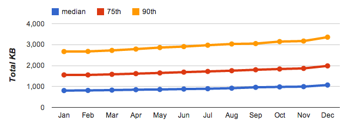

project_path: /web/fundamentals/_project.yaml
book_path: /web/fundamentals/_book.yaml
description: The amount of data downloaded by apps continues to increase over time. To deliver great performance you must optimize data delivery as much as possible.

{# wf_updated_on: 2015-10-05 #}
{# wf_published_on: 2014-03-31 #}

# Optimizing Content Efficiency {: .page-title }



Our web applications continue to grow in their scope, ambition, and functionality -- that's a good thing. However, the relentless march toward a richer web is driving another trend: the amount of data downloaded by each application continues to increase at a steady pace. To deliver great performance we need to optimize delivery of each and every byte!

What does a modern web application look like? [HTTP Archive](http://httparchive.org/){: .external } can help us answer this question. The project tracks how the web is built by periodically crawling the most popular sites (300,000+ from the Alexa Top 1M list) and recording and aggregating analytics on the number of resources, content types, and other metadata for each individual destination.

<table class="">
<colgroup><col span="1"><col span="1"><col span="1"><col span="1"></colgroup>
<thead>
  <tr>
    <th></th>
    <th>50th percentile</th>
    <th>75th percentile</th>
    <th>90th percentile</th>
  </tr>
</thead>
<tr>
  <td data-th="type">HTML</td>
  <td data-th="50%">13 KB</td>
  <td data-th="75%">26 KB</td>
  <td data-th="90%">54 KB</td>
</tr>
<tr>
  <td data-th="type">Images</td>
  <td data-th="50%">528 KB</td>
  <td data-th="75%">1213 KB</td>
  <td data-th="90%">2384 KB</td>
</tr>
<tr>
  <td data-th="type">JavaScript</td>
  <td data-th="50%">207 KB</td>
  <td data-th="75%">385 KB</td>
  <td data-th="90%">587 KB</td>
</tr>
<tr>
  <td data-th="type">CSS</td>
  <td data-th="50%">24 KB</td>
  <td data-th="75%">53 KB</td>
  <td data-th="90%">108 KB</td>
</tr>
<tr>
  <td data-th="type">Other</td>
  <td data-th="50%">282 KB</td>
  <td data-th="75%">308 KB</td>
  <td data-th="90%">353 KB</td>
</tr>
<tr>
  <td data-th="type"><strong>Total</strong></td>
  <td data-th="50%"><strong>1054 KB</strong></td>
  <td data-th="75%"><strong>1985 KB</strong></td>
  <td data-th="90%"><strong>3486 KB</strong></td>
</tr>
</table>

The above data captures the trend in growth of number of downloaded bytes for popular destinations on the web between January 2013 and January 2014. Of course, not every site grows at the same rate or requires the same amount of data, hence the reason why we are highlighting the different quantiles within the distribution: 50th (median), 75th, and 90th.

A median site at the beginning of 2014 is composed of 75 requests that add up to 1054 KB of total transferred bytes, and the total number of bytes (and requests) has grown at a steady pace throughout the previous year. This by itself should not be all that surprising, but it does carry important performance implications: yes, internet speeds are getting faster, but they are getting faster at different rates in different countries, and many users are still subject to data caps and expensive metered plans - especially on mobile.

Unlike their desktop counterparts, web applications do not require a separate installation process: enter the URL and we are up and running -- that’s a key feature of the web. However, to make this happen **we often have to fetch dozens, and sometime hundreds, of various resources, all of which can add up to megabytes of data and must come together in hundreds of milliseconds to facilitate the instant web experience we are aiming for.**

Achieving an instant web experience in light of these requirements is no small feat, which is why optimizing content efficiency is critical: eliminating unnecessary downloads, optimizing transfer encoding of each resource through various compression techniques, and leveraging caching whenever possible to eliminate redundant downloads.
