project_path: /web/fundamentals/_project.yaml
book_path: /web/fundamentals/_book.yaml
description: Keep your network transmission and parse/compile cost
for JavaScript low to ensure pages get interactive quickly.

{# wf_updated_on: 2017-11-30 #}
{# wf_published_on: 2017-11-30 #}

# JavaScript Start-up Optimization {: .page-title }



As we build sites more heavily reliant on JavaScript, we sometimes pay for what
we send down in ways that we can’t always easily see. In this article, we’ll
cover why a little **discipline** can help if you’d like your site to load and be
interactive quickly on mobile devices. Delivering less JavaScript can mean less
time in network transmission, less spent decompressing code and less time
parsing and compiling this JavaScript.

## Network

When most developers think about the cost of JavaScript, they think about it in
terms of the **download and execution cost**. Sending more bytes of JavaScript
over the wire takes longer the slower a user’s connection is.

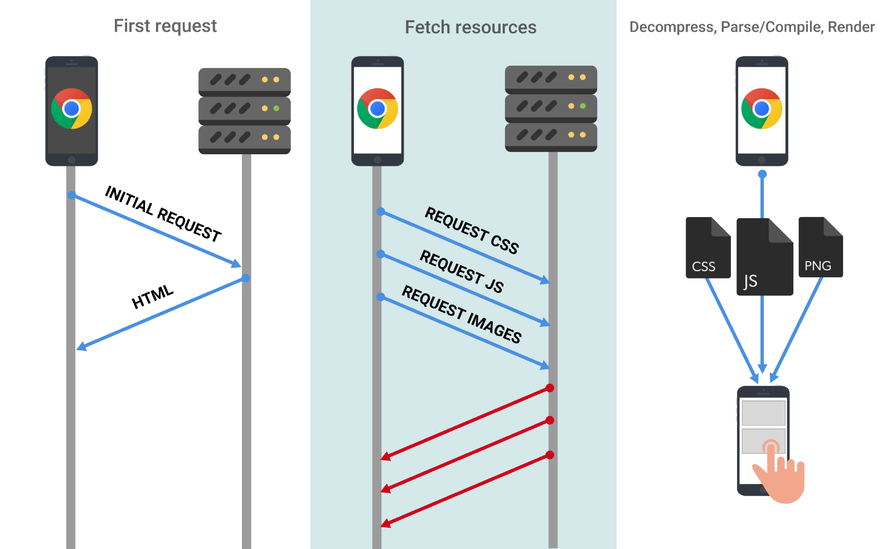

This can be a problem, even in first-world countries, as the **effective network
connection type** a user has might not actually be 3G, 4G or Wi-Fi. You can be on
coffee-shop Wi-Fi but connected to a cellular hotspot with 2G speeds.

You can **reduce** the network transfer cost of JavaScript through:

* **Only sending the code a user needs**. 
    * Use [code-splitting](/web/updates/2017/06/supercharged-codesplit) to break
      up your JavaScript into what is critical and what is not. Module bundlers
      like [webpack](https://webpack.js.org) support
      [code-splitting](https://webpack.js.org/guides/code-splitting/).
    * Lazily loading in code that is non-critical.
* **Minification** 
    * Use [UglifyJS](https://github.com/mishoo/UglifyJS) for
      [minifying](/web/fundamentals/performance/optimizing-content-efficiency/optimize-encoding-and-transfer#minification_preprocessing_context-specific_optimizations)
      ES5 code.
    * Use [babel-minify](https://github.com/babel/minify) or
      [uglify-es](https://www.npmjs.com/package/uglify-es) to minify ES2015+.
* **Compression**
    * At minimum, use
      [gzip](/web/fundamentals/performance/optimizing-content-efficiency/optimize-encoding-and-transfer#text_compression_with_gzip)
      to compress text-based resources.
    * Consider using
      [Brotli](https://www.smashingmagazine.com/2016/10/next-generation-server-compression-with-brotli/)
      ~[q11](https://twitter.com/paulcalvano/status/924660429846208514). Brotli
      outperforms gzip on compression ratio. It helped CertSimple save
      [17%](https://speakerdeck.com/addyosmani/the-browser-hackers-guide-to-instant-loading?slide=30)
      on the size of compressed JS bytes and LinkedIn save
      [4%](https://engineering.linkedin.com/blog/2017/05/boosting-site-speed-using-brotli-compression)
      on their load times.
* **Removing unused code**. 
    * Identify opportunities for code that can be removed or lazily loaded in
      with [DevTools code
      coverage](/web/updates/2017/04/devtools-release-notes#coverage).
    * Use
      [babel-preset-env](https://github.com/babel/babel/tree/master/packages/babel-preset-env)
      and browserlist to avoid transpiling features already in modern browsers.
      Advanced developers may find careful [analysis of their webpack
      bundles](https://github.com/webpack-contrib/webpack-bundle-analyzer) helps
      identify opportunities to trim unneeded dependencies.
    * For stripping code, see
      [tree-shaking](https://webpack.js.org/guides/tree-shaking/), [Closure
      Compiler](/closure/compiler/)’s advanced optimizations and library
      trimming plugins like
      [lodash-babel-plugin](https://github.com/lodash/babel-plugin-lodash) or
      webpack’s
      [ContextReplacementPlugin](https://iamakulov.com/notes/webpack-front-end-size-caching/#moment-js)
      for libraries like Moment.js. 
* **Caching code to minimize network trips.** 
    * Use [HTTP
      caching](/web/fundamentals/performance/optimizing-content-efficiency/http-caching)
      to ensure browsers cache responses effectively. Determine optimal
      lifetimes for scripts (max-age) and supply validation tokens (ETag) to avoid
      transferring unchanged bytes. 
    * Service Worker caching can make your app network resilient and give you
      eager access to features like [V8’s code
      cache](https://v8project.blogspot.com/2015/07/code-caching.html). 
    * Use long-term caching to avoid having to re-fetch resources that haven't
      changed. If using Webpack, see [filename
      hashing](https://webpack.js.org/guides/caching/).

## Parse/Compile

Once downloaded, one of JavaScript’s **heaviest** costs is the time for a JS
engine to **parse/compile** this code. In [Chrome
DevTools](web/tools/chrome-devtools/), parse and compile are part of the yellow
"Scripting" time in the Performance panel.

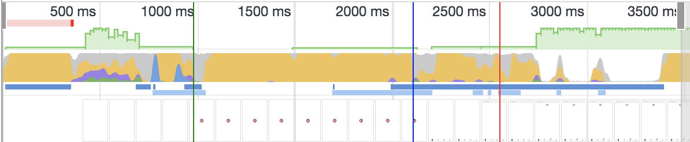

The Bottom-Up and Call Tree tabs show you exact Parse/compile timings:

<figure>  <figcaption> Chrome
DevTools Performance panel > Bottom-Up. With V8’s Runtime Call Stats enabled, we
can see time spent in phases like Parse and Compile </figcaption> </figure>

Note: Performance panel support for Runtime Call Stats is currently experimental. 
To enable, go to chrome://flags/#enable-devtools-experiments -> restart Chrome -> 
go to DevTools -> Settings -> Experiments -> hit shift 6 times -> check the option
called `Timeline: V8 Runtime Call Stats on Timeline` and close then re-open DevTools.

But, why does this matter?

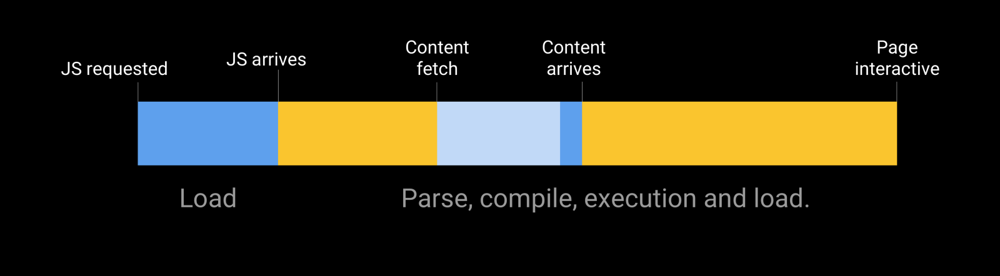

Spending a long time parsing/compiling code can heavily delay how soon a user
can interact with your site. The more JavaScript you send, the longer it will
take to parse and compile it before your site is interactive.

> Byte-for-byte, **JavaScript is more expensive for the browser to process than
> the equivalently sized image or Web Font **— Tom Dale

Compared to JavaScript, there are numerous costs involved in processing
equivalently sized images (they still have to be decoded!) but on average mobile
hardware, JS is more likely to negatively impact a page’s interactivity.

<figure> 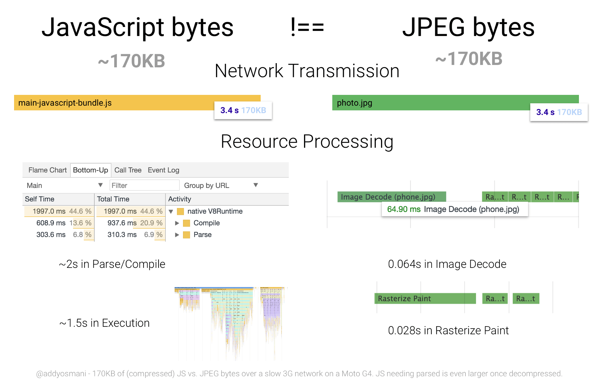 <figcaption>JavaScript
and image bytes have very different costs. Images usually don’t block the main
thread or prevent interfaces from getting interactive while being decoded and
rasterized. JS however can delay interactivity due to parse, compile and
execution costs.</figcaption> </figure>

When we talk about parse and compile being slow; context is important — we’re
talking about **average** mobile phones here. **Average users can have phones
with slow CPUs and GPUs, no L2/L3 cache and which may even be memory
constrained.**

> Network capabilities and device capabilities don’t always match up. A user
> with an amazing Fiber connection doesn’t necessarily have the best CPU to
> parse and evaluate JavaScript sent to their device. This is also true in
> reverse..a terrible network connection, but a blazing fast CPU. — Kristofer
> Baxter, LinkedIn

Below we can see the cost of parsing ~1MB of decompressed (simple) JavaScript on
low and high-end hardware. **There is a 2–5x difference in time to parse/compile
code between the fastest phones on the market and average phones**.

<figure> 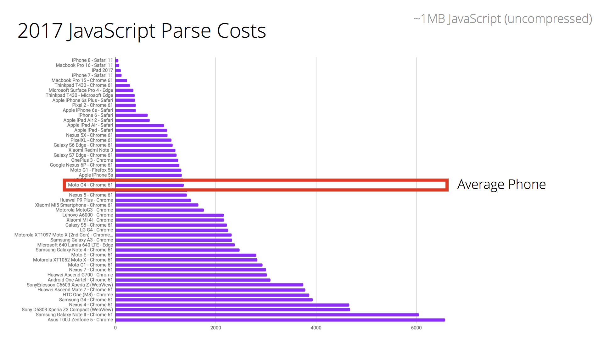 <figcaption>This graph
highlights parse times for a 1MB bundle of JavaScript (~250KB gzipped) across
desktop and mobile devices of differing classes. When looking at the cost of
parse, it’s the decompressed figures to consider e.g ~250KB gzipped JS
decompresses to ~1MB of code.</figcaption> </figure>

What about a real-world site, like CNN.com?

**On the high-end iPhone 8 it takes just ~4s to parse/compile CNN’s JS compared
to ~13s for an average phone (Moto G4)**. This can significantly impact how
quickly a user can fully interact with this site.

<figure> 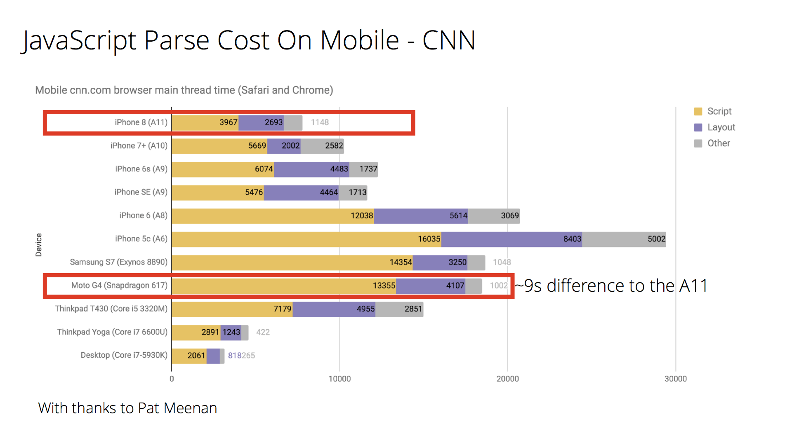 <figcaption>Above we
see parse times comparing the performance of Apple’s A11 Bionic chip to the
Snapdragon 617 in more average Android hardware.</figcaption> </figure>

This highlights the importance of testing on **average** hardware (like the Moto
G4) instead of just the phone that might be in your pocket. Context matters
however: **optimize for the device and network conditions your users have.**

<figure> 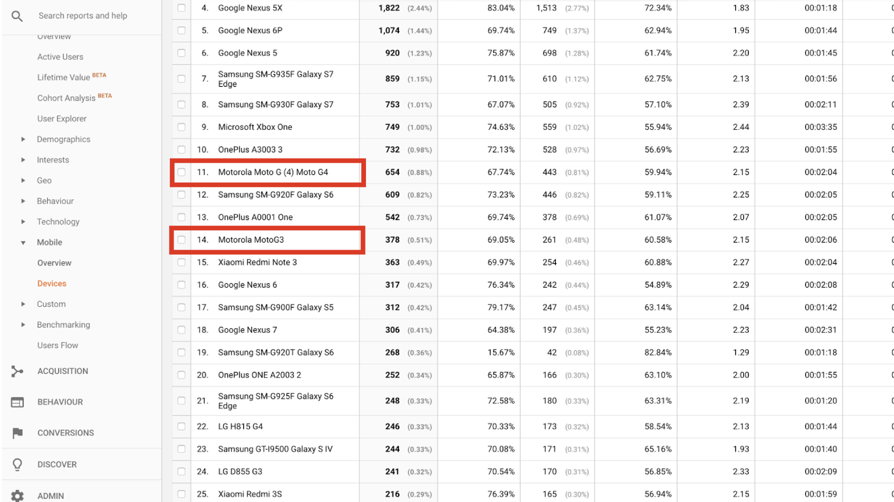 <figcaption>Google
Analytics can provide insight into the <a
href="https://crossbrowsertesting.com/blog/development/use-google-analytics-find-devices-customers-use/">mobile
device classes</a> your real users are accessing your site with. This can
provide opportunities to understand the real CPU/GPU constraints they’re
operating with.</figcaption> </figure>

**Are we really sending down too much JavaScript? Err, possibly :)**

Using HTTP Archive (top ~500K sites) to analyze the state of [JavaScript on
mobile](http://beta.httparchive.org/reports/state-of-javascript#bytesJs), we can
see that 50% of sites take over 14 seconds to get interactive. These sites spend
up to 4 seconds just parsing and compiling JS.

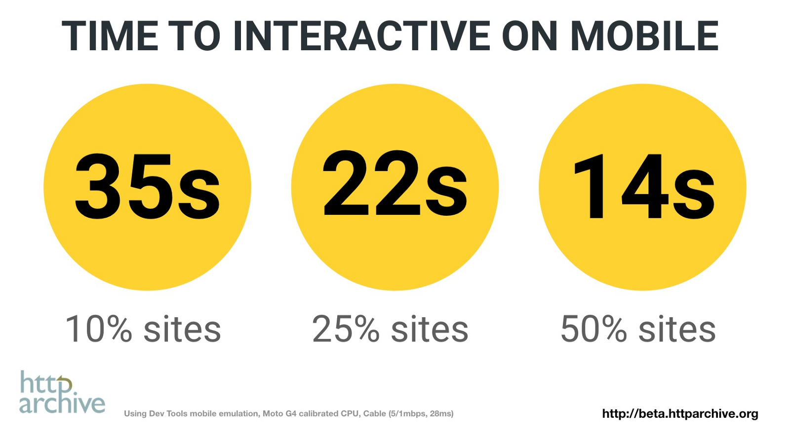

Factor in the time it takes to fetch and process JS and other resources and it’s
perhaps not surprising that users can be left waiting a while before feeling
pages are ready to use. We can definitely do better here.

**Removing non-critical JavaScript from your pages can reduce transmission
times, CPU-intensive parsing and compiling and potential memory overhead. This
also helps get your pages interactive quicker.**

## Execution time

It’s not just parse and compile that can have a cost. **JavaScript execution**
(running code once parsed/compiled) is one of the operations that has to happen
on the main thread. Long execution times can also push out how soon a user can
interact with your site.

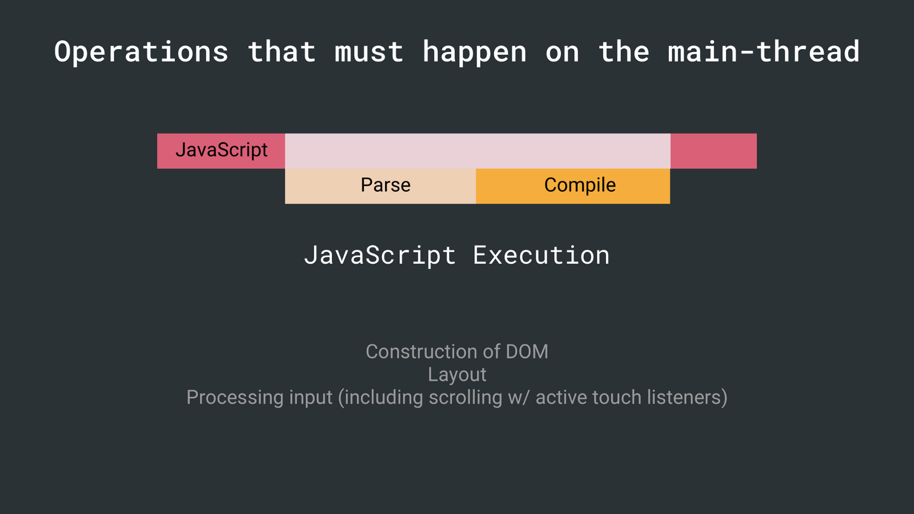

> If script executes for more than 50ms, time-to-interactive is delayed by the
> *entire* amount of time it takes to download, compile, and execute the JS —
> Alex Russell

To address this, JavaScript benefits from being in **small chunks** to avoid
locking up the main thread. Explore if you can reduce how much work is being
done during execution.

## Other costs

JavaScript can impact page performance in other ways:

* Memory. Pages can appear to jank or pause frequently due to GC (garbage
  collection). When a browser reclaims memory, JS execution is paused so a
  browser frequently collecting garbage can pause execution more frequently than
  we may like. Avoid [memory leaks](/web/tools/chrome-devtools/memory-problems/)
  and frequent gc pauses to keep pages jank free.
* During runtime, long-running JavaScript can block the main-thread causing
  pages that are unresponsive. Chunking up work into smaller pieces (using
  <code><a
  href="/web/fundamentals/performance/rendering/optimize-javascript-execution#use_requestanimationframe_for_visual_changes">requestAnimationFrame()</a></code>
  or <code><a
  href="web/updates/2015/08/using-requestidlecallback">requestIdleCallback()</a></code>
  for scheduling) can minimize responsiveness issues.

## Patterns for reducing JavaScript delivery cost

When you’re trying to keep parse/compile and network transmit times for JavaScript
slow, there are patterns that can help like route-based chunking or
[PRPL](/web/fundamentals/performance/prpl-pattern/).

### PRPL

PRPL (Push, Render, Pre-cache, Lazy-load) is a pattern that optimizes for
interactivity through aggressive code-splitting and caching:

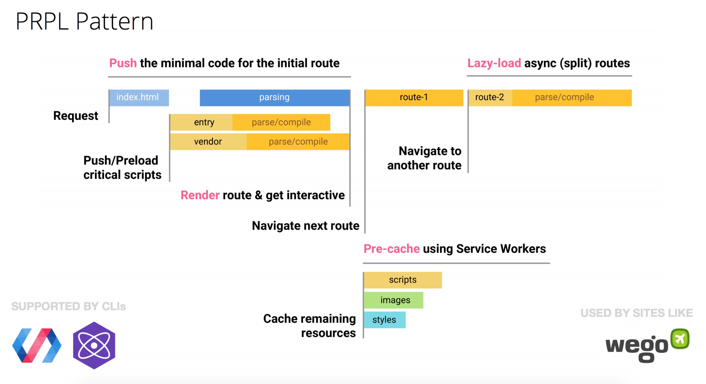

Let’s visualize the impact it can have.

We analyze the load-time of popular mobile sites and Progressive Web Apps using
V8’s Runtime Call Stats. As we can see, parse time (shown in orange) is a
significant portion of where many of these sites spend their time:

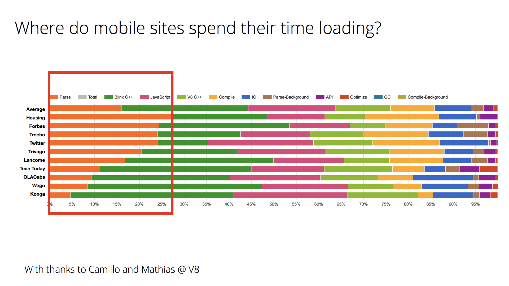

[Wego](https://wego.com), a site that uses PRPL, manages to maintain a low parse
time for their routes, getting interactive very quickly. Many of the other sites
above adopted code-splitting and performance budgets to try lowering their JS
costs.

### Progressive Bootstrapping

Many sites optimize content visibility as the expensive of interactivity. To get
a fast first paint when you do have large JavaScript bundles, developers
sometimes employ server-side rendering; then "upgrade" it to attach event
handlers when the JavaScript finally gets fetched.

Be careful — this has its own costs. You 1) generally send down a *larger* HTML
response which can push our interactivity, 2) can leave the user in an uncanny
valley where half the experience can’t actually be interactive until JavaScript
finishes processing.

Progressive Bootstrapping may be a better approach. Send down a minimally
functional page (composed of just the HTML/JS/CSS needed for the current route).
As more resources arrive, the app can lazy-load and unlock more features.

<figure>  <figcaption> <a
href="https://twitter.com/aerotwist/status/729712502943174657">Progressive
Bootstrapping</a> by Paul Lewis </figcaption> </figure>

Loading code proportionate to what’s in view is the holy grail. PRPL and
Progressive Bootstrapping are patterns that can help accomplish this.

## Conclusions

**Transmission size is critical for low end networks. Parse time is important
for CPU bound devices. Keeping these low matters.**

Teams have found success adopting strict performance budgets for keeping their
JavaScript transmission and parse/compile times low. See Alex Russell’s "[Can You
Afford It?: Real-world Web Performance
Budgets](https://infrequently.org/2017/10/can-you-afford-it-real-world-web-performance-budgets/)"
for guidance on budgets for mobile.

<figure> 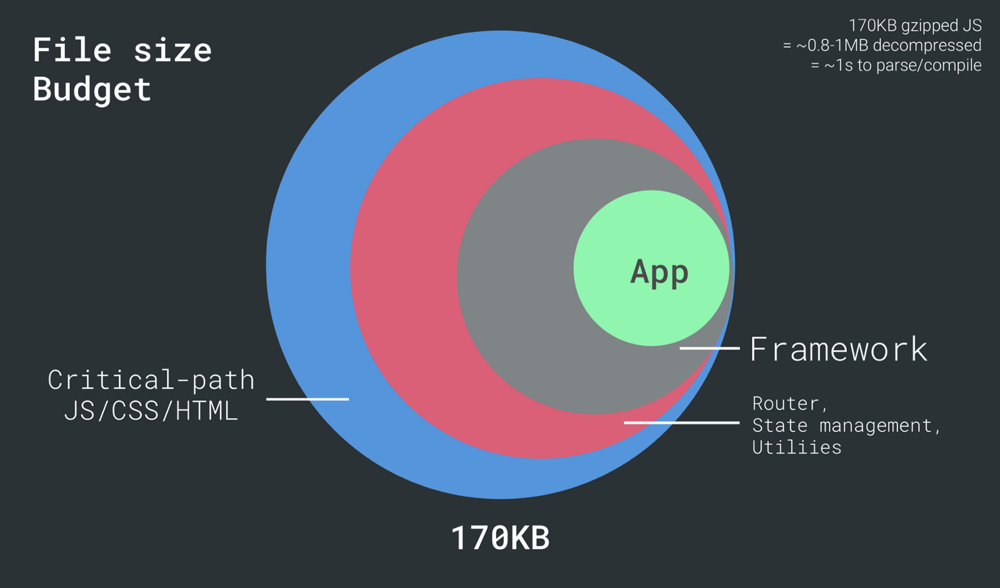 <figcaption>It’s
useful to consider how much JS "headroom" the architectural decisions we make
can leave us for app logic.</figcaption> </figure>

If you’re building a site that targets mobile devices, do your best to develop
on representative hardware, keep your JavaScript parse/compile times low and
adopt a Performance Budget for ensuring your team are able to keep an eye on
their JavaScript costs.

## Learn More

* [Chrome Dev Summit 2017 - Modern Loading Best
  Practices](https://www.youtube.com/watch?v=_srJ7eHS3IM)
* [JavaScript Start-up
  Performance](https://medium.com/reloading/javascript-start-up-performance-69200f43b201)
* [Solving the web performance
  crisis](https://nolanlawson.github.io/frontendday-2016/) — Nolan Lawson
* [Can you afford it? Real-world performance
  budgets](https://infrequently.org/2017/10/can-you-afford-it-real-world-web-performance-budgets/)
  — Alex Russell
* [Evaluating web frameworks and
  libraries](https://twitter.com/kristoferbaxter/status/908144931125858304) —
  Kristofer Baxter
* [Cloudflare’s Results of experimenting with
  Brotli](https://blog.cloudflare.com/results-experimenting-brotli/) for
  compression (note dynamic Brotli at a higher quality can delay initial page
  render so evaluate carefully. You probably want to statically compress
  instead.)
* [Performance
  Futures](https://medium.com/@samccone/performance-futures-bundling-281543d9a0d5)
  — Sam Saccone