project_path: /web/fundamentals/_project.yaml
book_path: /web/fundamentals/_book.yaml
description: Third-party scripts provide a wide range of useful functionality, making the web more dynamic. Learn how to optimize the loading of third-party scripts to reduce their impact on performance.

{# wf_updated_on: 2018-02-28 #}
{# wf_published_on: 2018-02-28 #}
{# wf_blink_components: Blink>JavaScript #}

# Loading Third-Party JavaScript {: .page-title }






You've optimized all of your code, but your site still loads too slowly. Who's the culprit?

Often, performance problems slowing pages down are due to third-party scripts: ads, analytics, trackers, social-media buttons, and so on. 

Third-party scripts provide a wide range of useful functionality, making the web more dynamic, interactive, and interconnected. These scripts may be crucial to your website's functionality or revenue stream. But third-party scripts also come with **many risks** that should be taken into consideration to **minimize their impact** while still providing value.** **

Why do you need to be [careful](https://css-tricks.com/potential-dangers-of-third-party-javascript/) about third-party scripts?

* They can be a **performance** concern
* They can be a **privacy** concern
* They might be a **security** concern
* They can be **unpredictable** and change without you knowing
* They can have **unintended consequences** 

Ideally, you’ll want to ensure third-party script is not impacting the [critical rendering path](https://developers.google.com/web/fundamentals/performance/critical-rendering-path/). In this guide, we’ll walk through how to find and fix issues related to loading third-party JavaScript. 

## What do we mean by third-party scripts?

Third-party JavaScript often refers to scripts that can be embedded into any site directly from a third-party vendor. These scripts can include ads, analytics, widgets and other scripts that make the web more dynamic and interactive. 

Examples of third-party scripts include:

* Social sharing buttons (e.g Twitter, Facebook, G+)

* Video player embeds (e.g YouTube, Vimeo)

* Advertising iframes

* Analytics & metrics scripts 

* A/B testing scripts for experiments

* Helper libraries (e.g date formatting, animation, functional libraries etc)


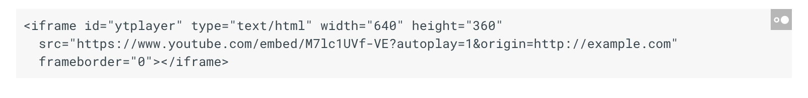

One example of this is the YouTube video player embed script that allows you to embed a video into your page.

Unfortunately, embedding third-party scripts means we often rely on them to be fast in order to avoid slowing our pages down. Third-party scripts are a predominant cause of performance slowdowns and are often caused by resources outside of your control. These issues can include:

* Firing too many network requests to multiple servers. The more requests a site has to make, the longer it can take to load.

* Sending [too much JavaScript](https://developers.google.com/web/fundamentals/performance/optimizing-content-efficiency/javascript-startup-optimization/) that keeps the main thread busy. Too much JavaScript can block DOM construction, delaying how quickly pages can render. CPU-intensive script parsing and execution can delay user interaction and cause battery drain.

* Sending large, [unoptimized image files](https://developers.google.com/web/tools/lighthouse/audits/unoptimized-images) or videos. This can consume data and cost users money.

* Third-party scripts loaded without care can be a [single-point of failure](http://blog.patrickmeenan.com/2011/10/testing-for-frontend-spof.html) (SPOF)

* Insufficient [HTTP caching](https://developers.google.com/web/fundamentals/performance/optimizing-content-efficiency/http-caching), forcing resources to be fetched from the network often

* Lack of sufficient [server compression](https://developers.google.com/web/fundamentals/performance/optimizing-content-efficiency/optimize-encoding-and-transfer) of resources

* Blocking content display until they complete processing. This can also be true for async A/B testing scripts.

* Use of legacy APIs (e.g [document.write()](https://developers.google.com/web/updates/2016/08/removing-document-write)) known to be [harmful](https://developers.google.com/web/tools/lighthouse/audits/document-write) to the user experience

* Excessive DOM elements or expensive CSS selectors.

* Including multiple third party embeds can lead to multiple frameworks and libraries being pulled in several times. This is wasteful and exacerbates the performance issues. 

* Third-party scripts often use embed techniques that can block [window.onload](https://developer.mozilla.org/en/docs/Web/API/GlobalEventHandlers/onload) if their servers respond slowly, even if the embed is using async or defer.

Context is important and the solution to costly third-parties can depend on your site and ability to configure how third-party code is being loaded. Thankfully a number of solutions and tools exist to find and fix issues with third party resources.

## How do you identify third-party script on a page?

Unless you’re aware which third-party scripts are loaded by your site and what their performance impact is, it’s impossible to know how to optimize them. Many free web speed test tools can highlight costly third-parties including [Chrome DevTools](https://developer.chrome.com/devtools), [PageSpeed Insights](https://developers.google.com/speed/pagespeed/insights/) and [WebPageTest](https://www.webpagetest.org/). These tools display rich diagnostic information that can tell you *how many* third party scripts are loaded by your site and which take the most time to execute. 

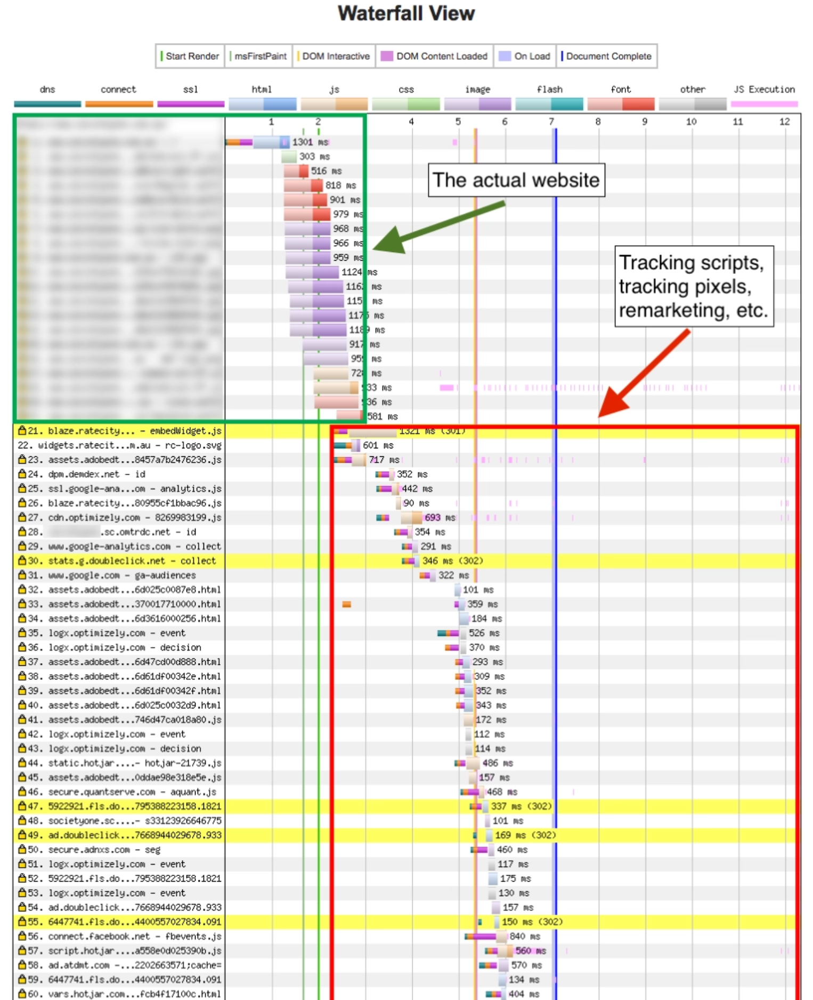

[WebPageTest](https://www.webpagetest.org/)’s waterfall view can highlight the impact of heavy third-party script use.

WebPageTest’s [domain breakdown](https://www.google.com/url?q=https://www.webpagetest.org/result/180222_J4_8fee6855d6f45719e4f37d8d89ecbc20/1/domains/&sa=D&ust=1519325015196000&usg=AFQjCNGrRivilJS9yqqpombsUMQZQJx2nw) can also be useful for visualizing how much content comes from third-party origins. It breaks this down by both total bytes and the number of requests:

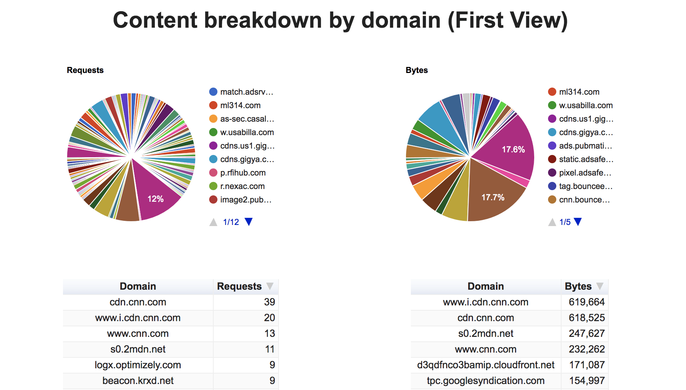

When you see a problematic script, figure out what the script does and ask yourself whether the script is really that necessary. Do an A/B test to balance the perceived value versus its impact on key user engagement or performance metrics.

### Chrome DevTools Third-party Script Badging 

[Chrome DevTools](https://developers.google.com/web/tools/chrome-devtools/) has support for highlighting third-parties (by their product name) in the [Network panel](https://developers.google.com/web/tools/chrome-devtools/network-performance/resource-loading). This allows you to get more insight into the third-parties making request on a page, logging to the console and executing expensive JavaScript on your page. 

To show third party badges, navigate to any panel in the Chrome DevTools and hit CMD + Shift + P to bring up the Command Menu. Next enter in "Show third party badges". This will enable the feature:

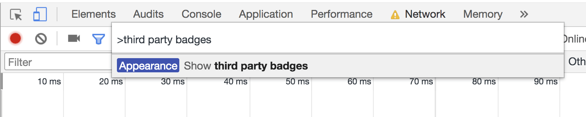

When you record a page load using the Network panel it will now include third party badges, like the "AOL Advertising" badges shown below in green. Hovering over a third-party badge in the Network panel will display more information about that script, helping you identify what it does. 

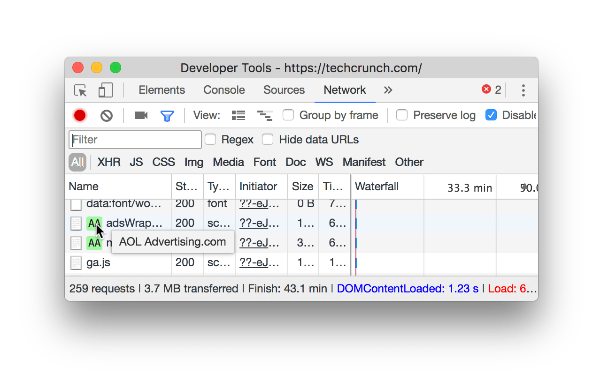

## How do I measure the impact of third-party script on my page? 

### Lighthouse Boot-up Time Audit

The [Lighthouse](https://developers.google.com/web/tools/lighthouse/) *JavaScript boot-up time* audit highlights scripts that have a costly script parse, compile or evaluation time. This can be useful for discovering CPU-intensive third party scripts.

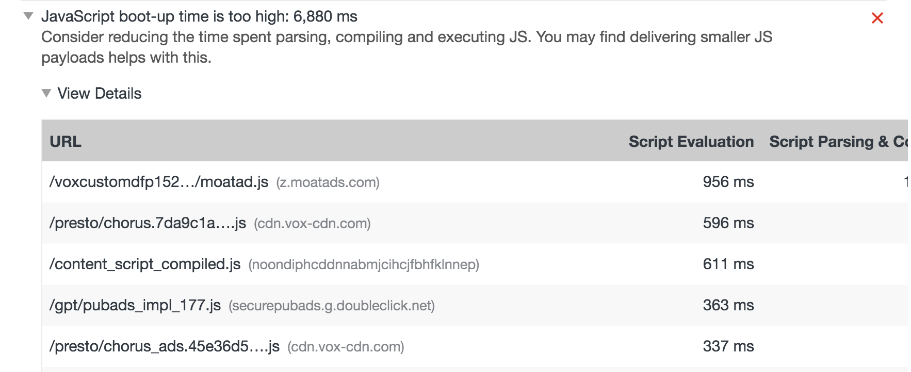

### Chrome DevTools Network Request Blocking

Chrome DevTools allows you to see how your page behaves when a particular script, stylesheet or other resource isn’t available. This is done with [network request blocking](https://developers.google.com/web/updates/2017/04/devtools-release-notes#block-requests), a feature that can help measure the impact of blocking (dropping) specific third-party resources from your page.

To enable request blocking, right click on any request in the Network panel and select "Block Request URL". A Request blocking tab will display in the DevTools drawer, letting you manage which requests have been blocked. 

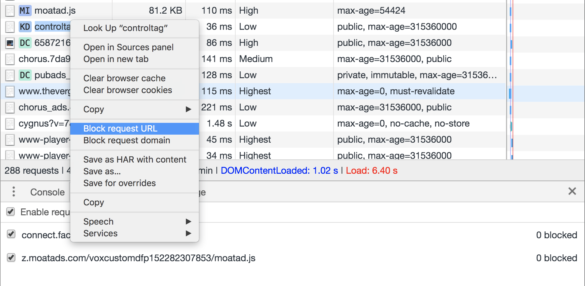

### Chrome DevTools Performance Panel

The [Performance panel](https://developers.google.com/web/tools/chrome-devtools/evaluate-performance/reference) in Chrome DevTools helps identify issues with your page’s web performance. Clicking the record button and loading your page presents you with a waterfall representing where your site is spending time. At the bottom of the Performance panel, you will see a drawer starting with "[Summary](https://developers.google.com/web/tools/chrome-devtools/evaluate-performance/reference#record-load)". Navigate to the “Bottom-up” tab. 

Here, you can use the "Group by product" option in the Bottom-Up tab to group third-parties by the time they spent. This helps identify which third party products were the most costly. The [Network panel](https://umaar.com/dev-tips/143-network-products/) also supports an option to highlight requests by product.

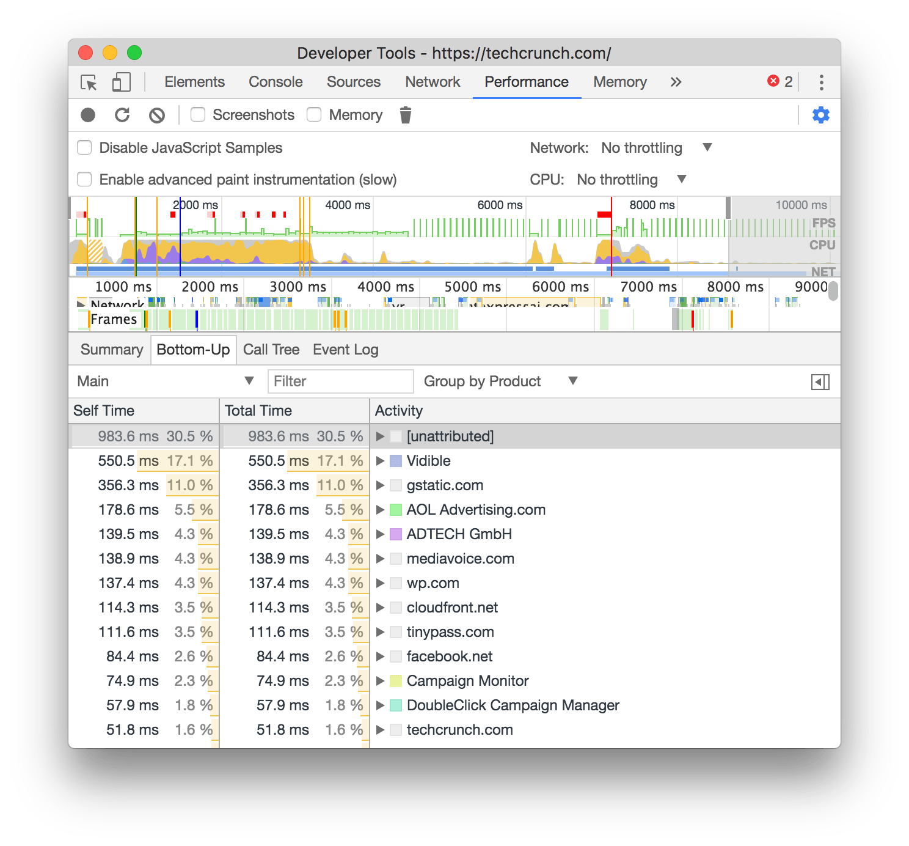

To learn more about how to analyze page load performance with the Chrome DevTools, see [Get started with analyzing runtime performance](https://developers.google.com/web/tools/chrome-devtools/evaluate-performance/).

A good **workflow** for measuring the impact of third-party scripts is:

* Measure how long it takes to load your page using the Network panel. 
    * To emulate real-world conditions, we recommend turning on [network throttling](https://developers.google.com/web/tools/chrome-devtools/network-performance/#emulate) and [CPU throttling](https://developers.google.com/web/updates/2017/07/devtools-release-notes#throttling). On faster connections and desktop hardware, the impact of expensive scripts may not be as representative as it would on a mobile phone.
* Block the URLs or domains responsible for third-party scripts you believe are an issue (see *Chrome DevTools Performance Panel* for identifying costly scripts).

* Reload the page and re-measure how long the page takes without loading these blocked third-party scripts. You should hopefully see an improvement. 

    * There may be value in doing 3 or more runs of measurement and looking at the median for more stable figures. As third-party content can occasionally pull in different resources per page load, this could give you a more realistic spread. [DevTools now supports multiple recordings](https://twitter.com/ChromeDevTools/status/963820146388221952) in the performance panel, making this a little easier.

### Measuring impact of Third-Party tags with WebPageTest

[WebPageTest](https://www.webpagetest.org/) supports blocking individual requests from loading (which can be useful for blocking content like ads and third-party embeds) to measure their impact. 

Under "Advanced Settings" is a Block tab. This can be used to specify a list of domains to block, simulating what it would be like if they didn't load at all. 

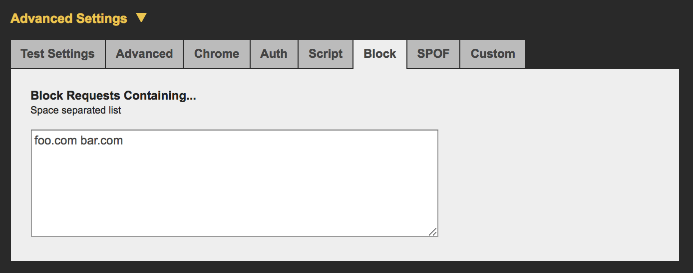

A workflow for using this feature is to:

* Test a page as normal

* Repeat the test with certain third-parties blocked

* Compare the two results (paying attention to the filmstrip). Results can be compared by selecting them from your [Test History](https://www.webpagetest.org/testlog/1/) and clicking ‘Compare’.

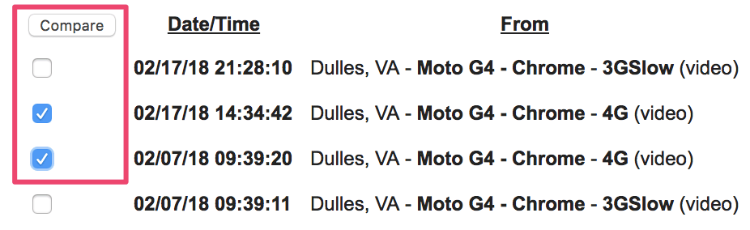

Below we can see the difference between filmstrips both with and without third-party resources blocked. It can be useful to try this out for individual third-party origins to determine which ones have the biggest impact on your page-load performance: 


The impact of blocking third-party resources on a page using WPT’s "block requests" feature from “[Using WebPageTest To Measure The Impact Of Third-Party Tags](https://andydavies.me/blog/2018/02/19/using-webpagetest-to-measure-the-impact-of-3rd-party-tags/ )” by Andy Davies

Note: WebPageTest also supports two commands operating at the DNS level for blocking domains. [blockDomains](https://sites.google.com/a/webpagetest.org/docs/using-webpagetest/scripting#TOC-blockDomains) - which takes a list of domains to block and [blockDomainsExcept](https://sites.google.com/a/webpagetest.org/docs/using-webpagetest/scripting#TOC-blockDomainsExcept) - takes a list of domains and blocks anything not on the list.

WebPageTest also has a single-point of failure (SPOF) tab. This allows you to simulate a timeout or complete failure to load a resource. 

The difference between "SPOF" and "Block" is that SPOF slowly times out. This can make it useful for testing network resilience of third-party content to determine how well your pages hold up when services are under heavy load or temporarily unavailable.

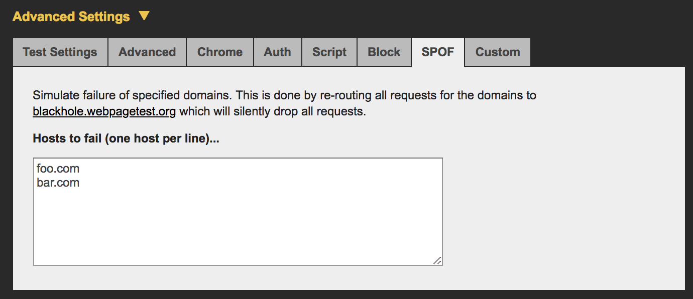

### Detecting expensive iframes using Long Tasks

When scripts in third-party iframes take a long time to run, they can block the main thread delaying other tasks from running. These long tasks can cause a negative user experience leading to sluggish event handlers or dropped frames.

To detect long tasks for [Real User Monitoring](https://en.wikipedia.org/wiki/Real_user_monitoring) (RUM), we can use the JavaScript [PerformanceObserver](https://developer.mozilla.org/en-US/docs/Web/API/PerformanceObserver) API and observe [longtask](https://developers.google.com/web/fundamentals/performance/user-centric-performance-metrics#long_tasks) entries. As these entries contain an attribution property, we can track down which frame context was responsible for the task. 

Below is an example that will long `longtask` entries to the console, including one for an "expensive" iframe:

```html
   <script>

       const observer = new PerformanceObserver((list) => {

           for (const entry of list.getEntries()) {

               // Attribution entry including "containerSrc":"https://example.com"

               console.log(JSON.stringify(entry.attribution));

           }

       });

       observer.observe({ entryTypes: ['longtask'] });

   </script>

   <!-- Imagine this is an iframe with expensive long tasks -->

   <iframe src="[https://example.com](https://example.com)"></iframe>
```

To learn more about monitoring Long Tasks, read Phil Walton’s [User-centric Performance Metrics](https://developers.google.com/web/fundamentals/performance/user-centric-performance-metrics#long_tasks).

## How do you load third-party script efficiently?

If a third-party script is slowing down your page load, you have several options to improve performance:

* Load the script using the async or defer attribute to avoid blocking document parsing.

* Consider self-hosting the script if the third-party server is slow.

* Consider removing the script if it doesn't add clear value to your site.

* Consider [Resource Hints](https://developers.google.com/web/fundamentals/performance/resource-prioritization#preconnect) like `<link rel=preconnect>` or `<link rel=dns-prefetch>` to perform a DNS lookup for domains hosting third-party scripts. 

### Use async or defer

JavaScript execution is parser blocking. This means when the browser encounters a script it must pause DOM construction, hand this over to the JavaScript engine and allow script execution before proceeding with DOM construction. 

The async and defer attributes change this behavior. 

* With async, the browser downloads the script asynchronously while it continues to parse the HTML document. When the script finishes downloading, parsing is blocked while the script executes. 

* With defer, the browser downloads the script asynchronously while it continues to parse the HTML document. The script doesn't run until the parsing is complete.

If that's too many words, here's a pretty picture:

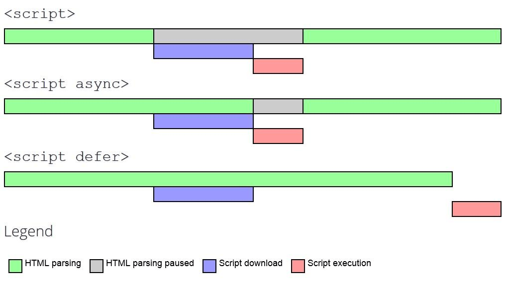

*Credit: Growing with the web*

In general, you should always use `async` or `defer` for third party scripts (unless the script does something necessary for the critical rendering path):

* Use `async` if it's important to have the script run earlier in the loading process. This might include some analytics scripts, for example.

* Use `defer` for less critical resources. A video player that's below-the-fold, for example.

Note: If performance is your primary concern, you could wait until your page has reached a key user moment (such as after the critical content has loaded) before adding async scripts. You should also take care not to `async` load libraries like jQuery just because they are coming from a third-party CDN.

Note: In Blink-based browsers, `async` and `defer` currently [lower the priority of the network request](https://docs.google.com/document/d/1bCDuq9H1ih9iNjgzyAL0gpwNFiEP4TZS-YLRp_RuMlc/edit#) for resources so it can cause it to load significantly later than it would as a blocking script. This is useful to know in particular for analytics scripts.

Should you ever load third-party scripts without `async` or `defer`? You could make a case for this if the script is a crucial part of your site functionality. For example, if you're loading your main UI library or framework from a CDN, it will be badged as "third-party script" in DevTools, but should be treated as an essential part of your site, not an add-on.

Note that not all scripts work if loaded asynchronously. Check the docs for any third-party scripts you're using. If you're using a script that can't be loaded asynchronously, you might want to consider an alternative, or eliminating the script if possible. Some third parties may *highly recommend* to load their scripts sync (to get ahead of other scripts), even if they would work fine async so do due diligence when evaluating strategies for loading third-party scripts.

Note: `async` is not a silver bullet. If a marketing team wants to load a large number of tracking scripts on a page, this number will still introduce bottlenecks that can impact how soon users can engage with a page on load.

### Use Resource Hints to reduce connection setup time

Establishing connections to third-party origins can take a significant amount of time - particularly on slow networks. Many steps can add up to delays including DNS lookups, redirects, and potentially several round trips to each third-party server to handle the request.

You can use [Resource Hints](https://developers.google.com/web/fundamentals/performance/resource-prioritization#preconnect) like [<link rel=dns-prefetch>](https://developers.google.com/web/fundamentals/performance/resource-prioritization#preconnect) to perform a DNS lookup for domains hosting third-party scripts. When the request for them is finally made, time can be saved as the DNS lookup has already been carried out. 

```
<link rel="dns-prefetch" href="http://example.com">
```

If the third-party domain you are referencing uses HTTPS, you may also consider [<link rel=preconnect>](https://developers.google.com/web/fundamentals/performance/resource-prioritization#preconnect) as this will both perform the DNS lookup *and* resolve TCP round-trips and handle TLS negotiations. These other steps can be very slow as they involve looking at SSL certificates for verification, so consider Resource Hints seriously if you find third-party setup time to be an issue.

```
<link rel="preconnect" href="https://cdn.example.com">
```

### "Sandbox" scripts with an iframe

There are cases where third-party scripts can be loaded directly into an iframe. By restricting such scripts to iframes, they won’t block execution of the main page. This is the same approach that [AMP](https://www.ampproject.org/learn/about-how/) takes to keeping JavaScript out of the [critical path](https://developers.google.com/web/fundamentals/performance/critical-rendering-path/). Note that this approach will still block the `onload` event so try not to attach critical functionality to `onload`.

Note: Chrome is also exploring support for [Feature Policy](https://www.chromestatus.com/feature/5694225681219584) - a set of policies allowing a developer to selectively disable access to certain browser features. This can prevent third-party content introducing unwanted behaviors to a site.

### Self-host third-party scripts

Self-hosting third-party scripts may be an option if you would like more control over a script’s loading story. For example, if you wanted to reduce DNS or round-trip times, improve HTTP caching headers or take advantage of advanced techniques like HTTP/2 server push. Self-hosting may be a viable consideration if a script is considered critical.

Self-hosting can come with a number of big caveats: 

* Scripts can go out of date. This can be a large issue as it prevents you from getting important security fixes without manually updating.

* Scripts that are self-hosted won’t get automatic updates due to an API change. One example: a publisher with 90% of their revenue from ads discovers that ads didn’t serve for half a day due to an API change that their self-hosted script didn’t account for, leading to loss in income. 

An alternative to self-hosting scripts would be using [Service Workers](https://developers.google.com/web/fundamentals/primers/service-workers/) to cache them. This can give you greater control over how often they are re-fetched from the network. This could also be used to create a loading strategy where requests for non-essential third parties are throttled until the page reaches a key user moment.

### A/B Test smaller samples of users

[A/B testing](https://www.optimizely.com/optimization-glossary/ab-testing/) (or split-testing) is a technique for experimenting with two versions of a page to determine which one performs best. This is done by enabling both variants (A and B) for different samples of your website traffic. The page that provides a better conversion rate wins.

A/B testing is a very useful tool for analyzing user experience and behavior. 

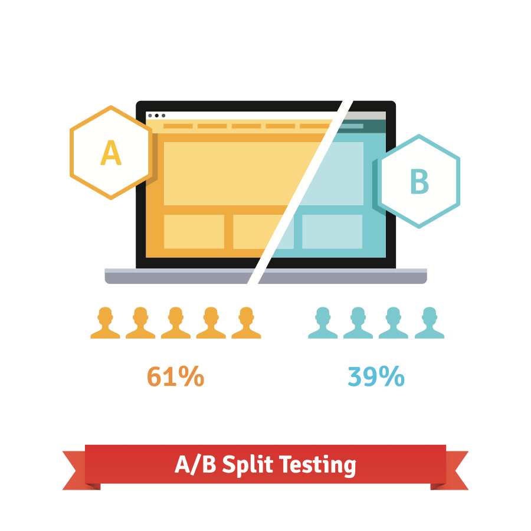

However, by design, A/B testing delays rendering to figure out which experiment needs to be active. JavaScript is often used to check if any of your users belong to an A/B test experiment and then enable the correct variant. This pattern can lead to 100% of your users being sent down large, costly script even if they don’t belong to the sample receiving the experiment.

A good alternative in this case is to send A/B testing scripts for only a subset of your user base (e.g 10% vs 100%), ideally attempting to decide whether they belong in a test sample on the server-side. This improves the loading experience for the majority of users while still making split-testing possible.

### Lazy-load Third Party Resources

Embedded third-party resources (such as ads or videos) can be a big contributor to slow page speed when constructed poorly. Lazy-loading can be used to only load embedded resources when necessary. For example, serving an ad in the footer only when a user scrolls down the page. Another pattern is lazy-loading content after the main page content loads but before a user might otherwise interact with the page. 


Note: [LazySizes](https://github.com/aFarkas/lazysizes) is a popular JavaScript library for lazy-loading images and[ iframes](http://afarkas.github.io/lazysizes/#examples). It supports YouTube embeds and[ widgets](https://github.com/aFarkas/lazysizes/tree/gh-pages/plugins/unveilhooks). Care does need to be taken when lazy-loading any resources as this technique is often powered by JavaScript and can be subject to issues on flaky network connections.

DoubleClick have guidance on how to lazy-load ads in their [official documentation](https://support.google.com/dfp_premium/answer/4578089#lazyloading). If used properly, lazy loading can increase the overall viewability percentage of an ad. For example, MediaVine switched to[ lazy-loading ads](https://www.mediavine.com/lazy-loading-ads-mediavine-ads-load-200-faster/) and saw a 200% improvement in page load speed. 

#### Efficient lazy-loading with Intersection Observer 

Historically, solutions for detecting if an element is visible in the viewport (in order to lazy-load its content) have been error-prone, often causing the browser to become sluggish. Solutions have often listened for [scroll](https://developer.mozilla.org/en-US/docs/Web/Events/scroll) or [resize](https://developer.mozilla.org/en-US/docs/Web/Events/resize) events, then used DOM APIs like [getBoundingClientRect()](https://developer.mozilla.org/en-US/docs/Web/API/Element/getBoundingClientRect) to calculate where elements are relative to the viewport. This works, but is not efficient. 

[IntersectionObserver](https://developers.google.com/web/updates/2016/04/intersectionobserver) is a browser API that allows us to efficiently detect when an observed element enters or exits the browser's viewport. Learn more about how to use it for [lazy-loading resources](http://deanhume.com/home/blogpost/lazy-loading-images-using-intersection-observer/10163). LazySizes also has[ optional support](https://github.com/aFarkas/lazysizes/blob/097a9878817dd17be3366633e555f3929a7eaaf1/src/lazysizes-intersection.js) for IntersectionObserver.

### Analytics can be complicated

Analytics scripts should never slow down your page load experience, but if you defer the load too long you can miss valuable analytics data. Fortunately, there are some well-known patterns for initializing analytics lazily while retaining early page-load data. 

Phil Walton's blog post, [The Google Analytics Setup I Use on Every Site I Build](https://philipwalton.com/articles/the-google-analytics-setup-i-use-on-every-site-i-build/) covers one such pattern for Google Analytics.

## What patterns should I avoid with third-party script?

### Avoid document.write()

Third-party scripts sometimes use [document.write()](https://developer.mozilla.org/en-US/docs/Web/API/Document/write) to inject and load scripts. This is particularly true of older services that haven’t been updated in some time. Thankfully, many third-parties offer an option to asynchronously load themselves, which allows third-party scripts to load without blocking the display of the rest of the content on the page. 

The fix for document.write() is to simply not inject scripts using it. As of Chrome 53, Chrome DevTools will log warnings to the console for problematic use of document.write():

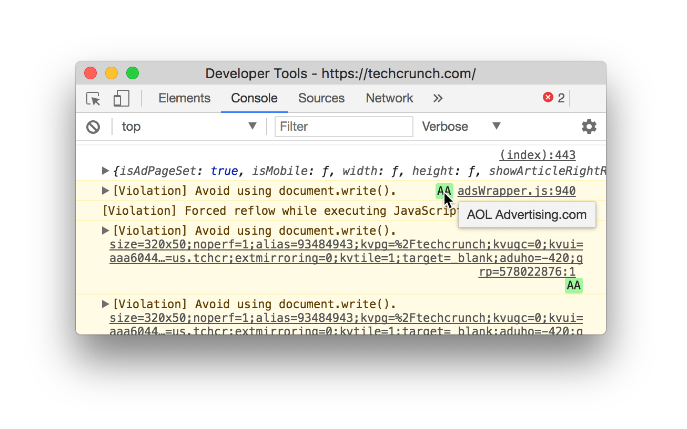

To discover the use of document.write() at scale, you can check for [HTTP headers](https://developer.mozilla.org/en-US/docs/Web/HTTP/Headers) sent to your browser when this intervention for Chrome happens. [Lighthouse](https://developers.google.com/web/tools/lighthouse/) can also highlight any third-party scripts [still using document.write()](https://developers.google.com/web/tools/lighthouse/audits/document-write) in the Lighthouse report:

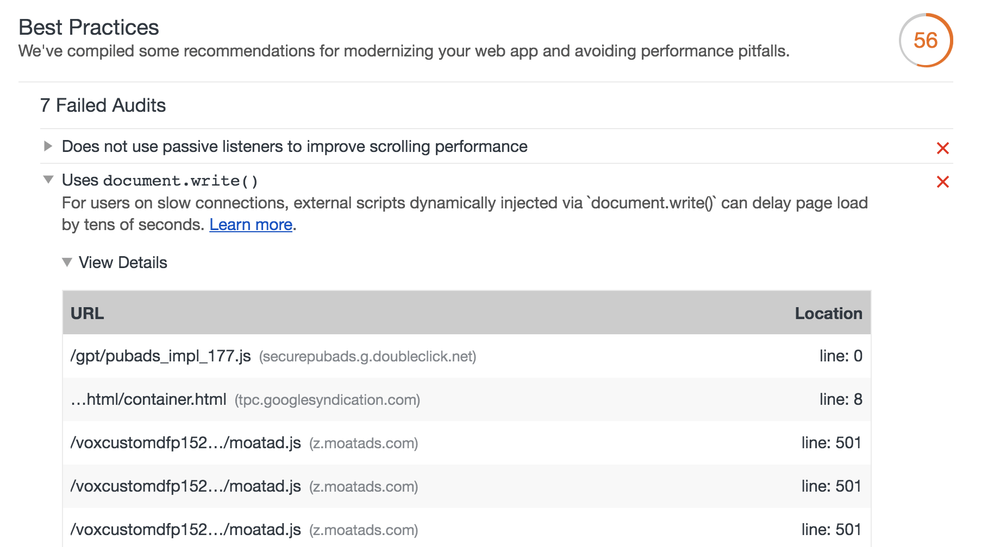

### Use Tag Managers but use them wisely

Note: Exercise caution when using GTM. Although it can minimize the overhead of third-party tags, it also makes it trivial for anyone with credentials to add costly tags.

A "tag" is a snippet of code that allows digital marketing teams to collect data, set cookies or integrate third-party content like social media widgets into a site. These tags have a cost to your page's loading performance - additional network requests, heavy JavaScript dependencies, images and resources the tag itself may pull in. 

Managing these tags can become a real mess over time as marketing teams wish to add more ways to understand users and engineering tries to minimize the impact tags can have on user experience. To keep experiences fast, we recommend using a Tag manager. Tag managers:

* allow many pieces of third-party embed code to be managed from a single place (usually a user-interface)

* attempt to minimize how much third-party tags need to be deployed to sites.

Note: Even though individual tags can be asynchronously loaded, they still need to be read and executed individually. This could mean requesting more data while the page is still loading. Tag managers address this by reducing the number of calls a browser needs to make for them down to one.

[Google Tag Manager](https://www.google.com/analytics/tag-manager/) (GTM) is one such popular tag manager:

"Google Tag Manager is an asynchronous tag, meaning that when it executes, it does not block other elements from rendering on the page. It also causes the other tags that are deployed via Google Tag Manager to be deployed asynchronously, meaning that a slow loading tag won’t block other tracking tags."

Tag managers may improve page load performance by reducing how many calls to external resources are needed - as long as you** are not** pulling in a large number of tags. They also allow tags a way to collect values in a single unique place. For GTM, this is the [Data Layer](https://developers.google.com/tag-manager/devguide). If multiple third parties wish to trigger conversion-tracking data, they can do this by pulling from the Data Layer.

**Risks when using Tag managers**

When using a tag manager, great care needs to be taken to avoid slowing down how quickly pages load. This is because:

* Anyone with credentials and access can easily add not just more tags, but *any* JavaScript they want. Although tag managers can load tags asynchronously, this can still lead to an excess of costly HTTP requests being made and executed. This can be minimized by only allowing one user to publish versions.

* Anyone can configure too many tag manager [auto-event listeners](https://support.google.com/analytics/answer/6164470?hl=en). Every auto-event listener needs to be executed & the more code and network requests there are, the longer it can take for a page to fully load. With our performance guidance encouraging that you [respond to events within 50ms](https://developers.google.com/web/fundamentals/performance/rail), every tag manager event listener added eats away at that goal.

### Avoid scripts that pollute the global scope

Third-party scripts injected into the unknown can sometimes load a number of their own JavaScript dependencies. This can pollute the global scope and cause accidental breakage in pages. 

There is also no guarantee that code loaded from a third-party will remain the same as what you saw during testing. New features can be pushed out by third parties at any time, potentially breaking your page. Self-testing, [sub-resource integrity](https://developer.mozilla.org/en-US/docs/Web/Security/Subresource_Integrity) and securely transmitting third-party code (to reduce the risk of in-transit modifications) can help here.

Be sure to conduct careful audits of the third-party scripts you load to ensure they’re being good actors.

# Mitigation strategies

Adding third-party scripts to a page implies a level of trust in the origin. There are some strategies you can take to minimize their impact on performance and security:

* **[HTTPS](https://developers.google.com/web/fundamentals/security/encrypt-in-transit/why-https)** is a must. Sites working over HTTPS shouldn’t have third-parties working over HTTP. An HTTPS page that includes content fetched using HTTP is called a mixed content page and will run into [Mixed Content](https://developer.mozilla.org/en-US/docs/Web/Security/Mixed_content) warnings.

* Consider the **[sandbox attribute](https://developer.mozilla.org/en/docs/Web/HTML/Element/iframe)** on iframes. From a security perspective, this allows you to restrict the actions available from the iframe. Restrictions include `allow-scripts`controlling whether the context can run scripts.

* Consider **[Content Security Policy](https://developer.mozilla.org/en-US/docs/Web/HTTP/CSP)** (CSP). Through a HTTP header in your server’s response, you can define behaviors that are trusted in the page. CSP can be used to detect and mitigate against the effects of certain attacks, such as [Cross Site Scripting](https://en.wikipedia.org/wiki/Cross-site_scripting) (XSS).

CSP is particularly powerful as it includes directives such as [script-src](https://developer.mozilla.org/en-US/docs/Web/HTTP/Headers/Content-Security-Policy/script-src) that specifies what are valid, allowed sources for JavaScript. Below is an example of how this can be used in practice:

```

// Given this CSP header

Content-Security-Policy: script-src https://example.com/

// The following third-party script will not be loaded or executed

<script src="https://not-example.com/js/library.js"></script>

```

# Conclusion

With sites relying on more third-party scripts than ever, it’s paramount not to ignore third-party script performance. Good things you can do:

* Become familiar with some of the most effective third-party script optimization methods like only loading tags that support the async loading pattern. 

* Understand how to identify and fix issues with third-party script loading. This can help you take back control of your page load performance. 

Third-party script optimization should be followed by on-going real-time performance monitoring of your scripts and communication with your third-party providers. The web is evolving at a rapid pace and a script’s locally observed performance gives no guarantees that it will perform as well in the future or in the wild. 

## Further reading

[Performance and Resilience: Stress-Testing Third Parties](https://csswizardry.com/2017/07/performance-and-resilience-stress-testing-third-parties/)

[Adding interactivity with JavaScript](https://developers.google.com/web/fundamentals/performance/critical-rendering-path/adding-interactivity-with-javascript)

[Potential dangers with Third-party Scripts](https://css-tricks.com/potential-dangers-of-third-party-javascript/)

[How 3rd Party Scripts can be performant citizens on the web](https://www.twnsnd.com/posts/performant_third_party_scripts.html)

[The JavaScript Supply Chain Paradox: SRI, CSP and Trust in Third Party Libraries](https://www.troyhunt.com/the-javascript-supply-chain-paradox-sri-csp-and-trust-in-third-party-libraries/)

*With thanks to Kenji Baheux, Jeremy Wagner, Philip Walton, Jeff Posnick and Cheney Tsai for their reviews.*

