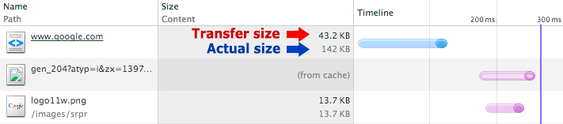

project_path: /web/fundamentals/_project.yaml
book_path: /web/fundamentals/_book.yaml
description: Next to eliminating unnecessary resource downloads, the best thing we can do to improve page-load speed is to minimize the overall download size by optimizing and compressing the remaining resources.

{# wf_updated_on: 2016-08-26 #}
{# wf_published_on: 2014-03-31 #}

# Optimizing Encoding and Transfer Size of Text-Based Assets {: .page-title }



Next to eliminating unnecessary resource downloads, the best thing you can do to
improve page-load speed is to minimize the overall download size by optimizing and
compressing the remaining resources.

## Data compression 101

After you’ve eliminated any unnecessary resources, the next step is to compress
the remaining resources that the browser has to download. Depending on the resource
type&mdash;text, images, fonts, and so on&mdash;there are many different techniques
to choose from: generic tools that can be enabled on the server, pre-processing
optimizations for specific content types, and resource-specific optimizations that
require input from the developer.

Delivering the best performance requires a combination of all of these techniques.

### TL;DR {: .hide-from-toc }

* Compression is the process of encoding information using fewer bits.
* Eliminating unnecessary data always yields the best results.
* There are many different compression techniques and algorithms.
* You will need a variety of techniques to achieve the best compression.

The process of reducing the size of data is *data compression*. Many people have
contributed algorithms, techniques, and optimizations to improve compression ratios,
speed, and memory requirements of various compressors. A full discussion of data
compression is beyond the scope of this topic. However, it's important to understand,
at a high level, how compression works and the techniques you can use to reduce
the size of various assets that your pages require.

To illustrate the core principles of these techniques, consider the process of
optimizing a simple text message format that was invented just for this example:

    # Below is a secret message, which consists of a set of headers in
    # key-value format followed by a newline and the encrypted message.
    format: secret-cipher
    date: 08/25/16
    AAAZZBBBBEEEMMM EEETTTAAA

1. Messages may contain arbitrary annotations, which are indicated by the "#" prefix.
 Annotations do not affect the meaning or any other behavior of the message.
2. Messages may contain *headers*, which are key-value pairs (separated by ":")
 that appear at the beginning at the message.
3. Messages carry text payloads.

What can you do to reduce the size of the above message, which is currently
200 characters?

1. The comment is interesting, but it doesn’t actually affect the meaning of the message.
 Eliminate it when transmitting the message.
2. There are good techniques to encode headers in an efficient manner. For example,
 if you know that all messages have "format" and "date," you could convert those
 to short integer IDs and just send those. However, that might not be true, so just
 leave it alone for now.
3. The payload is text only, and while we don’t know what the contents of it really are
 (apparently, it’s using a "secret-message"), just looking at the text shows that
 there's a lot of redundancy in it. Perhaps instead of sending repeated letters,
 you can just count the number of repeated letters and encode them more efficiently.
 For example, "AAA" becomes "3A", which represents a sequence of three A’s.

Combining these techniques produces the following result:

    format: secret-cipher
    date: 08/25/16
    3A2Z4B3E3M 3E3T3A

The new message is 56 characters long, which means that you've compressed the original
message by an impressive 72%.

This is all great, but how does this help us optimize our web pages? We’re not going
to try to invent our compression algorithms, but, as you will see, we can use the
exact same techniques and thought processes when optimizing various resources on
our pages: preprocessing, context-specific optimizations, and different algorithms
for different content.

## Minification: preprocessing & context-specific optimizations

### TL;DR {: .hide-from-toc }

- Content-specific optimizations can significantly reduce the size of delivered resources.
- Content-specific optimizations are best applied as part of your build/release cycle.

The best way to compress redundant or unnecessary data is to eliminate it altogether.
We can’t just delete arbitrary data, but in some contexts where we have content-specific
knowledge of the data format and its properties, it's often possible to significantly
reduce the size of the payload without affecting its actual meaning.

<pre class="prettyprint">

</pre>

[Try it](https://googlesamples.github.io/web-fundamentals/fundamentals/performance/optimizing-content-efficiency/minify.html){: target="_blank" .external }

Consider the simple HTML page above and the three different content types that it
contains: HTML markup, CSS styles, and JavaScript. Each of these content types has
different rules for what constitutes valid content, different rules for indicating
comments, and so on. How can we reduce the size of this page?

* Code comments are a developer’s best friend, but the browser doesn't need to see them!
 Simply stripping the CSS (`/* … */`), HTML (`<!-- … -->`), and JavaScript (`// …`)
 comments can significantly reduce the total size of the page.
* A "smart" CSS compressor could notice that we’re using an inefficient way of
 defining rules for ".awesome-container" and collapse the two declarations into one
 without affecting any other styles, saving more bytes.
* Whitespace (spaces and tabs) is a developer convenience in HTML, CSS, and JavaScript.
 An additional compressor could strip out all the tabs and spaces.

<pre class="prettyprint">

</pre>

[Try it](https://googlesamples.github.io/web-fundamentals/fundamentals/performance/optimizing-content-efficiency/minified.html){: target="_blank" .external }

After applying the above steps, the page goes from 406 to 150 characters,
a 63% compression savings. Granted, it’s not very readable, but it also doesn’t
have to be: you can keep the original page as your "development version" and then
apply the steps above whenever you're ready to release the page on your website.

Taking a step back, the above example illustrates an important point: a general-purpose
compressor&mdash;say, one designed to compress arbitrary text&mdash;could probably
do a pretty good job of compressing the page above, but it would never know to
strip the comments, collapse the CSS rules, or dozens of other content-specific
optimizations. This is why preprocessing/minification/context-aware optimization
can be such a powerful tool.

Note: Case in point, the uncompressed development version of the jQuery library
is now approaching ~300KB. The same library, but minified (removed comments, etc.)
is about 3x smaller: ~100KB.

Similarly, the techniques described above can be extended beyond just text-based assets.
Images, video, and other content types all contain their own forms of metadata
and various payloads. For example, whenever you take a picture with a camera,
the photo also typically embeds a lot of extra information: camera settings,
location, and so on. Depending on your application, this data might be critical
(for example, a photo-sharing site) or completely useless, and you should consider
whether it is worth removing. In practice, this metadata can add up to tens of
kilobytes for every image.

In short, as a first step in optimizing the efficiency of your assets, build
an inventory of the different content types and consider what kinds of content-specific
optimizations you can apply to reduce their size. Then, after you’ve figured out
what they are, automate these optimizations by adding them to your build and
release processes to ensure that the optimizations are applied.

## Text compression with GZIP

### TL;DR {: .hide-from-toc }

- GZIP performs best on text-based assets: CSS, JavaScript, HTML.
- All modern browsers support GZIP compression and will automatically request it.
- Your server must be configured to enable GZIP compression.
- Some CDNs require special care to ensure that GZIP is enabled.

[GZIP](https://en.wikipedia.org/wiki/Gzip) is a generic compressor that can be applied
to any stream of bytes. Under the hood, it remembers some of the previously seen content
and attempts to find and replace duplicate data fragments in an efficient way.
(If you're curious, here's a
[great low-level explanation of GZIP](https://www.youtube.com/watch?v=whGwm0Lky2s&feature=youtu.be&t=14m11s).)
However, in practice, GZIP performs best on text-based content, often achieving
compression rates of as high as 70-90% for larger files, whereas running GZIP
on assets that are already compressed via alternative algorithms (for example,
most image formats) yields little to no improvement.

All modern browsers support and automatically negotiate GZIP compression for all
HTTP requests. You must ensure that the server is properly configured to serve the
compressed resource when the client requests it.

<table>
<thead>
  <tr>
    <th>Library</th>
    <th>Size</th>
    <th>Compressed size</th>
    <th>Compression ratio</th>
  </tr>
</thead>
<tbody>
<tr>
  <td data-th="library">jquery-1.11.0.js</td>
  <td data-th="size">276 KB</td>
  <td data-th="compressed">82 KB</td>
  <td data-th="savings">70%</td>
</tr>
<tr>
  <td data-th="library">jquery-1.11.0.min.js</td>
  <td data-th="size">94 KB</td>
  <td data-th="compressed">33 KB</td>
  <td data-th="savings">65%</td>
</tr>
<tr>
  <td data-th="library">angular-1.2.15.js</td>
  <td data-th="size">729 KB</td>
  <td data-th="compressed">182 KB</td>
  <td data-th="savings">75%</td>
</tr>
<tr>
  <td data-th="library">angular-1.2.15.min.js</td>
  <td data-th="size">101 KB</td>
  <td data-th="compressed">37 KB</td>
  <td data-th="savings">63%</td>
</tr>
<tr>
  <td data-th="library">bootstrap-3.1.1.css</td>
  <td data-th="size">118 KB</td>
  <td data-th="compressed">18 KB</td>
  <td data-th="savings">85%</td>
</tr>
<tr>
  <td data-th="library">bootstrap-3.1.1.min.css</td>
  <td data-th="size">98 KB</td>
  <td data-th="compressed">17 KB</td>
  <td data-th="savings">83%</td>
</tr>
<tr>
  <td data-th="library">foundation-5.css</td>
  <td data-th="size">186 KB</td>
  <td data-th="compressed">22 KB</td>
  <td data-th="savings">88%</td>
</tr>
<tr>
  <td data-th="library">foundation-5.min.css</td>
  <td data-th="size">146 KB</td>
  <td data-th="compressed">18 KB</td>
  <td data-th="savings">88%</td>
</tr>
</tbody>
</table>

The above table shows the savings that GZIP compression produces for a few of the
most popular JavaScript libraries and CSS frameworks. The savings range from 60 to 88%,
and the combination of minified files (identified by “.min” in their filenames),
plus GZIP, offers even more savings.

1. **Apply content-specific optimizations first: CSS, JS, and HTML minifiers.**
2. **Apply GZIP to compress the minified output.**

Enabling GZIP is one of the simplest and highest-payoff optimizations to implement,
and yet, many people don't implement it. Most web servers compress content on your behalf,
and you just need to verify that the server is correctly configured to compress
all the content types that benefit from GZIP compression.

The HTML5 Boilerplate project contains
[sample configuration files](https://github.com/h5bp/server-configs)
for all the most popular servers with detailed comments for each configuration flag
and setting. To determine the best configuration for your server, do the following:

* Find your favorite server in the list.
* Look for the GZIP section.
* Confirm that your server is configured with the recommended settings.

A quick and simple way to see GZIP in action is to open Chrome DevTools and
inspect the “Size / Content” column in the Network panel: “Size” indicates the
transfer size of the asset, and “Content” the uncompressed size of the asset.
For the HTML asset in the preceding example, GZIP saved 98.8 KB during the transfer.

Note: Sometimes, GZIP increases the size of the asset. Typically, this happens when
the asset is very small and the overhead of the GZIP dictionary is higher than the
compression savings, or when the resource is already well compressed. To avoid
this problem, some servers allow you to specify a minimum filesize threshold.

Finally, while most servers automatically compress the assets for you when serving them
to the user, some CDNs require extra care and manual effort to ensure that the
GZIP asset is served. Audit your site and ensure that your assets are, in fact,
[being compressed](http://www.whatsmyip.org/http-compression-test/).
