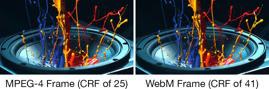
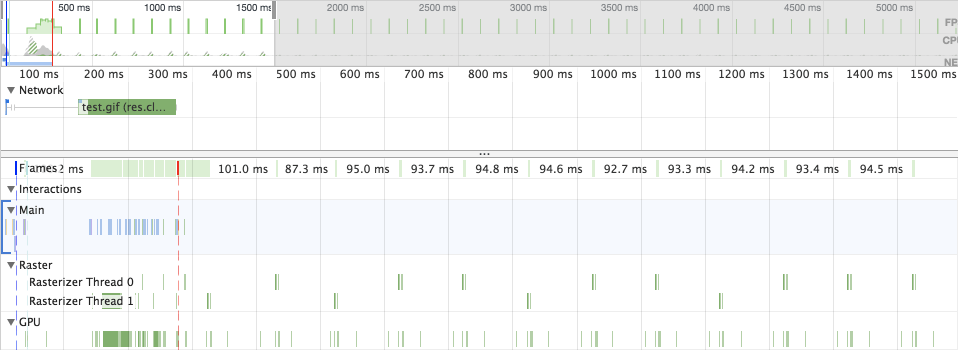

project_path: /web/fundamentals/_project.yaml
book_path: /web/fundamentals/_book.yaml
description: Everyone loves animated GIFs. The only problem is that they can be massive, often weighing in at several megabytes. In this guide, you'll learn how to curb the bloat caused by animated GIFs by replacing them with MPEG-4 and WebM video sources!

{# wf_updated_on: 2018-07-04 #}
{# wf_published_on: 2018-04-19 #}
{# wf_tags: html5,video,gif,images #}
{# wf_blink_components: Blink>Image,Blink>HTML #}

# Replace Animated GIFs with Video {: .page-title }



Have you ever seen an animated GIF on a service like Imgur or Gfycat and
inspected it in DevTools, only to find out that GIF was really a video? There's
a good reason for that. Animated GIFs can be downright _huge_. It's not uncommon
for GIFs to tip the scales at several megabytes, depending on quality, frame
rate, and length. If you're trying to improve loading performance for your site
and help users reduce data usage, animated GIF just isn't compatible with that
goal.

<figure>
  
  <figcaption><strong>Figure 1</strong>. Chrome DevTools showing a 13.7 MB GIF.
That's bigger than even most websites!</figcaption>
</figure>

Thankfully, this is one of those areas of loading performance where you can do
relatively little work to realize huge gains without sacrificing content
quality. In this article, you're going to learn how to do what the GIF hosting
sites do to keep their bandwidth bills from going through the roof, and convert
those giant GIFs into lean and fast video files! You'll then learn how to
properly embed these videos in web pages so they behave just like GIFs. Finally,
we'll talk a little bit about decoding performance for both GIF and video.
Before you know it, you'll be well on your way to shaving megabytes off your
GIF-heavy web pages in no time at all!

## Converting animated GIFs to video

There are a number of ways you can convert GIFs to video, but
[`ffmpeg`](https://www.ffmpeg.org/) is the tool we'll use in this guide. You may
already have `ffmpeg` installed. To check, open a terminal and run the `ffmpeg`
command. If it's installed, you'll see some diagnostic information. If you
receive a "command not found" or similar error, you'll need to install it. How
you install `ffmpeg` [depends on the
platform](https://trac.ffmpeg.org/wiki/CompilationGuide):

1. For macOS, [you can install via
Homebrew](https://trac.ffmpeg.org/wiki/CompilationGuide/macOS#ffmpegthroughHomebrew)
or [compile it
yourself](https://trac.ffmpeg.org/wiki/CompilationGuide/macOS#CompilingFFmpegyourself).
2. For Windows, [use Chocolatey](https://chocolatey.org/packages/ffmpeg).
3. For Linux, check if your preferred distro's package manager (e.g., apt-get or
yum) has a package available.

Note: Because one of the formats we'll be converting to is
[WebM](https://www.webmproject.org/), you'll need to make sure that whatever
`ffmpeg` build you install is compiled with
[libvpx](https://www.webmproject.org/code/).

Once `ffmpeg` is installed, pick a GIF, and you'll be ready to roll. For the
purposes of this guide, I picked [this
GIF](https://gif.ski/jazz-chromecast-ultra.gif), which is just shy of 14 MB. To
start off, let's try our hand at converting a GIF to MPEG-4!

### Converting GIF to MPEG-4

Whenever you embed videos on a page, you'll always want to have an MPEG-4
version [as MPEG-4 enjoys the broadest support](https://caniuse.com/#feat=mpeg4)
of all video formats across browsers. To get started, open a terminal window, go
to the directory containing your test GIF, and try this command:

```shell
ffmpeg -i input.gif output.mp4
```

This is the most straightforward syntax for converting a GIF to MPEG-4. The `-i`
flag specifies the input, and we specify an output file thereafter. This command
takes our test GIF of 14,024 KB and reduces it to a reasonably high quality
MPEG-4 video weighing in **867 KB**. That's a reduction of **93.8%**. Not bad,
but maybe you're curious to see if we can go a little further. If so, keep
reading!

It turns out ffmpeg is _super_ configurable, and we can use this to our
advantage to fine-tune the video output further by employing an encoding mode
called [Constant Rate Factor](https://trac.ffmpeg.org/wiki/Encode/H.264#crf) (or
CRF). CRF is great when video quality is a high priority.

```shell
ffmpeg -i input.gif -b:v 0 -crf 25 output.mp4
```

This command is largely similar to the one before it, but with two key
differences: The `-b:v` flag _normally_ would [limit the output
bitrate](https://trac.ffmpeg.org/wiki/Limiting%20the%20output%20bitrate), but
when we want to use CRF mode, it must be set to `0`. The `-crf` flag accepts a
value between `0` and `51`. Lower values yield higher quality (but larger)
videos, whereas higher values do the opposite.

Using our test GIF, this command outputs an MPEG-4 video **687 KB** in size.
That's an improvement of roughly **20%**! If you want even smaller file sizes,
you _could_ specify a higher CRF value. Just be aware that higher values will
yield lower quality videos, so _always_ check the encoder's output to ensure
you're cool with the results!

In any event, both these commands yield a _massive_ reduction in file size over
GIF, which in turn will substantially improve initial page load time and reduce
data usage. While the visual quality of the video _is_ somewhat lower than
source GIF, the reduction in file size is a reasonable trade-off to make:

<figure>
  
  <figcaption><strong>Figure 2</strong>. Visual comparison of an animated GIF
frame against an MPEG-4 frame from a video encoded with a CRF of
25.</figcaption>
</figure>

While the figure above is no substitute for a comprehensive visual comparison,
the MPEG-4 is certainly sufficient as an animated GIF replacement. It also pays
to remember that your users likely won't have a reference to the GIF source like
you will. Always adhere to your project's standards for media quality, but be
willing to make trade-offs for performance where appropriate.

While MPEG-4 is broadly compatible and certainly suitable as an animated GIF
replacement, we can go just a _bit_ further by generating an additional WebM
source. Read on to learn more!

### Converting GIF to WebM

[While MPEG-4 has been in around in some form since at least
1999](https://en.wikipedia.org/wiki/MPEG-4#MPEG-4_Parts) and continues to see
development, WebM is a relative newcomer [having been initially released in
2010](https://github.com/webmproject/libvpx/releases/tag/v0.9.0). While [browser
support for WebM](https://caniuse.com/#feat=webm) isn't as wide as MPEG-4, it's
still very good. Because [the `<video>`
element](https://developer.mozilla.org/en-US/docs/Web/HTML/Element/video) allows
you to specify [multiple `<source>`
elements](https://developer.mozilla.org/en-US/docs/Web/HTML/Element/video#Multiple_sources_example),
you can state a preference for a WebM source that many browsers can use while
falling back to an MPEG-4 source that all other browsers can understand.

Try converting your test GIF to WebM with `ffmpeg` with this command:

```shell
ffmpeg -i input.gif -c vp9 -b:v 0 -crf 41 output.webm
```

You'll notice this method is _mostly_ similar to the previous GIF to MPEG-4
conversion command using CRF mode, but there are two key differences:

1. The codec we specify in the `-c` flag is `vp9`, which is the successor to the
VP8 codec used by the WebM format. If this fails for you, replace `vp9` with
`vp8`.
2. Because CRF values don't yield equivalent results across formats, we need to
adjust it so our WebM output is visually similar to the MPEG-4 output. A `-crf`
value of `41` is used in this example to achieve reasonably comparable quality
to the MPEG-4 version while still outputting a smaller file.

In this example, the WebM version was roughly **66 KB smaller** than the MPEG-4
at **611 KB**. Its visual quality is reasonably similar to the MPEG-4 version,
too.

<figure>
  
  <figcaption><strong>Figure 3</strong>. Visual comparison of an MPEG-4 frame
encoded with a CRF value of 25 versus a WebM frame encoded with a CRF value of
41.</figcaption>
</figure>

Due to how the VP8 and VP9 codecs encode video, compression artifacts in WebM
may affect the quality of the result in ways different than in MPEG-4. As
always, inspect the encoder output and experiment with flags (time permitting)
to find the best result for your application.

Note: If you like tinkering, consider trying out [two-pass
encoding](https://trac.ffmpeg.org/wiki/Encode/VP9#twopass) to see if the results
are more to your liking!

Now that we know how to convert GIFs to both MPEG-4 and WebM, let's learn how to
replace those animated GIF `` elements with `<video>`!

## Replacing animated GIF `` elements with `<video>`

Unfortunately, using a video as an animated GIF replacement is not _quite_ as
straightforward as dropping an image URL into an `` element. Using
`<video>` is a bit more complex, but not onerously so. We'll walk through how to
do this step by step and explain everything, but if you just want to see the
code, check out [this CodePen demo](https://codepen.io/malchata/pen/MVYmWZ).

### Getting the behaviors right

Animated GIFs have three key traits:

1. They play automatically.
2. They loop continuously (usually, but it is possible to prevent looping).
3. They're silent.

The only true advantage of using animated GIF over video is convenience. We
don't have to be explicit in defining these traits when we embed GIFs. They just
behave the way we expect them to. When we want to use video in place of GIFs,
however, we have to explicitly tell the `<video>` element to autoplay, loop
continuously, and be silent. Let's start by writing a `<video>` element like so:

```html
<video autoplay loop muted playsinline></video>
```

The attributes in this example are pretty self-explanatory. A `<video>` element
using these attributes will play automatically, loop endlessly, play no audio,
and play inline (i.e., not fullscreen). In other words, all the hallmark
behaviors we expect of animated GIFs.

Note: If faithful emulation of animated GIF behavior isn't crucial to your
application, you _could_ take a more conservative approach by allowing users to
initiate playback instead of autoplaying. If you go this route, remove the
`autoplay` attribute, and consider specifying a placeholder image via the
[`poster`
attribute](https://developer.mozilla.org/en-US/docs/Web/HTML/Element/video#attr-poster).
Additionally, use the [`controls`
attribute](https://developer.mozilla.org/en-US/docs/Web/HTML/Element/video#attr-controls)
to allow the user to control playback, and add the [`preload`
attribute](https://developer.mozilla.org/en-US/docs/Web/HTML/Element/video#attr-preload)
to control how the browser preloads video content.

There's more to this than simply emulating GIF behavior, though. Some of these
attributes are required for autoplay to even work. For example, [the `muted`
attribute _must_ be present](/web/updates/2016/07/autoplay) for videos to
autoplay, even if they don't contain an audio track. [On iOS, the `playsinline`
attribute is required for autoplay to
work](https://webkit.org/blog/6784/new-video-policies-for-ios/) as well.

### Specify your `<source>`s

All that's left to do is specify your video sources. The `<video>` element
requires one or more `<source>` child elements pointing to different video files
the browser can choose from, depending on format support:

```html
<video autoplay loop muted playsinline>
  <source src="oneDoesNotSimply.webm" type="video/webm">
  <source src="oneDoesNotSimply.mp4" type="video/mp4">
</video>
```

Note: Browsers don't speculate about which `<source>` is optimal, so the order
of `<source>`s matters. For example, if you specify an MPEG-4 video first and
the browser supports WebM, browsers will skip the WebM `<source>` and use the
MPEG-4 instead. If you prefer a WebM `<source>` be used first, _specify it
first!_

Now that we know how to convert GIFs to video and how to use those videos as GIF
replacements, let's see how each of these solutions performs in the browser.

## Performance of video versus animated GIF

Though smaller resources are preferable, file size isn't everything. We also
need to be cognizant of how a media resource performs _after_ it has been
downloaded, because media assets must be decoded before playback.

GIFs (and other animated image formats) are suboptimal because an image decode
is incurred for every frame in the image, which can contribute to jank. This
makes sense, because each frame in a GIF is simply another image. Let's see how
this looks in the Performance panel in Chrome's developer tools for a page where
the only content is an `` element pointing to an animated GIF:

<figure>
  
  <figcaption><strong>Figure 4</strong>. The Performance panel in Chrome's
developer tools showing browser activity as an animated GIF plays.</figcaption>
</figure>

As you can see in the above figure, image decodes occurs on the rasterizer
threads as each new frame of the GIF is decoded. Now let's look at a comparison
table of total CPU time for GIF versus MPEG-4 and WebM videos:

Format | CPU time
--- | ---
GIF | 2,668 ms
MPEG-4 | 1,994 ms
WebM | 2,330 ms

These figures were gathered in Chrome's tracing utility (record your own Chrome
traces at `chrome://tracing`) over a period of ~6.5 seconds for each format. As
you can see, GIF takes the most CPU time, and less CPU time occurs for both
videos, particularly MPEG-4. This is good stuff! It means that videos generally
use less CPU time than animated GIF, which is a welcome performance enhancement
beyond simply reducing file size.

It should be mentioned, however, that some CPUs and GPUs offer
hardware-accelerated encoding/decoding of video (e.g., [Quick Sync
Video](https://en.wikipedia.org/wiki/Intel_Quick_Sync_Video) on Intel CPUs).
Many processors can handle encoding and decoding for MPEG-4, but WebM codecs
such as VP8 and VP9 have only recently started to benefit from
hardware-accelerated encoding/decoding on newer CPUs. A Kaby Lake Intel
processor was used in these tests, meaning that video decoding was hardware
assisted.

## Potential pitfalls

You've heard enough about the advantages of using video instead of animated GIF,
but I would be remiss in my responsibility if I didn't also point out some of
the potential pitfalls. Here's a couple for your consideration.

### Embedding video is not as convenient as embedding a GIF

Nothing is more convenient than slapping a GIF in an `` element and moving
on with your life. It's a simple one liner that _just works_, and that's huge for
the developer experience.

However, _your_ experience as a developer isn't the only one that matters. Users
matter, too. On the bright side, [using video in the ``
element](https://cloudinary.com/blog/evolution_of_img_gif_without_the_gif) _is_
possible in Safari, so an easier solution for using videos as GIF replacements
may be on the way. It's just not an approach you can currently depend on in
_all_ browsers.

### Encoding your own videos can take time

As developers, we want to save time. When it comes to something as subjective as
the notion of media quality, however, it can be difficult to come up with an
automated process that provides the best results for all scenarios.

The safest thing to do is to analyze the encoder output for each video, and
ensure the results are up to snuff. This may only be a reasonable solution for
projects with few video resources. For larger projects with many videos,
however, you may want to go with a conservative encoding strategy that
emphasizes quality over file size. The good news is that this strategy will
_still_ yield great results, substantially improve loading performance, and
reduce data usage for _all_ users over relying on animated GIFs.

Additionally, converting all your GIFs to video takes time. Time you might not
have. In this case, you might consider a cloud-based media hosting service such
as [Cloudinary](https://cloudinary.com/), which does the work for you. Check out
[this resource from Cloudinary's
blog](https://cloudinary.com/blog/reduce_size_of_animated_gifs_automatically_convert_to_webm_and_mp4),
which explains how their service can transcode GIF to video for you.

### Data saver mode

On Chrome for Android, autoplaying video can be disallowed when [Data
Saver](https://support.google.com/chrome/answer/2392284) is enabled, even if you
follow this guide's instructions to the letter. If you're a web developer, and
you're struggling to figure out why videos aren't autoplaying on your Android
device, disable Data Saver to see if that fixes the issue for you.

To cover edge cases such as these, you should consider setting the `poster`
attribute so the `<video>` element's space is populated with some meaningful
content in the event Data Saver is on (or really any possible scenario where
autoplay could be disallowed). Another possible approach could be to set the
`controls` attribute conditionally based on the presence of the [`Save-Data`
header](/web/fundamentals/performance/optimizing-content-efficiency/save-data/),
which is a header Data Saver sends when it's active.

## Conclusion

When you use video in lieu of animated GIF, you're doing your users a big favor
by reducing the amount of data you send to them, as well as potentially reducing
system resource usage. Ditching animated GIFs is worth serious consideration,
especially if they feature prominently in your content. In a time where
performance is more important than ever, yet many performance improvement
strategies require a significant investment of time, transitioning your GIFs to
video is a proportionally small effort when compared to the massive improvement
it can have on loading performance.

## Further Reading

We aren't the first to advocate for using videos instead of GIFs, and we won't
be the last. For case studies or other perspectives on this topic, check out the
following articles:

- [Imgur Revamps GIFs for Faster Speeds and Higher Quality with
GIFV](https://lifehacker.com/imgur-revamps-gifs-for-faster-speeds-and-higher-quality-1644494212)
- [Introducing GIFV](https://blog.imgur.com/2014/10/09/introducing-gifv/)
- [GIF Revolution](https://telegram.org/blog/gif-revolution)
- [Those GIFs on Twitter Aren't Actually
GIFs](https://mashable.com/2014/06/20/twitter-gifs-mp4/#Mtz26DX1BZqG)

_Special thanks to [François
Beaufort](/web/resources/contributors/beaufortfrancois), [Patrick
Hulce](/web/resources/contributors/patrickhulce), Dean Hume, [Paul
Irish](/web/resources/contributors/paulirish), [Addy
Osmani](/web/resources/contributors/addyosmani), and [Jeff
Posnick](/web/resources/contributors/jeffposnick) for their valuable feedback,
which significantly improved the quality of this article._
