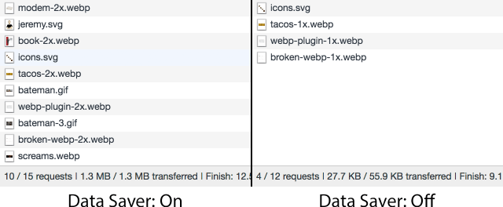

project_path: /web/_project.yaml
book_path: /web/updates/_book.yaml
description: The Save-Data client hint request header available in Chrome, Opera, and Yandex browsers enables developers to deliver fast and light applications to users who have opted-in to 'data saving' mode in the browser.

{# wf_updated_on: 2018-04-03 #}
{# wf_published_on: 2016-02-18 #}
{# wf_tags: savedata,clienthints,chrome49 #}
{# wf_blink_components: Blink>Fonts,Blink>CSS,Blink>JavaScript #}
{# wf_featured_image: /web/updates/images/2016/02/save-data/data-saver-chrome.png #}

# Delivering Fast and Light Applications with Save-Data {: .page-title }





**The [`Save-Data` client hint request
header](https://httpwg.github.io/http-extensions/client-hints.html#the-save-data-hint)
available in Chrome, Opera, and Yandex browsers lets developers deliver lighter,
faster applications to users who opt-in to data saving mode in their browser.**

## The need for lightweight pages


Everyone agrees that faster and lighter web pages provide a more satisfying user
experience, allow better content comprehension and retention, and deliver
increased conversions and revenue. [Google
research](https://support.google.com/webmasters/answer/6211428) has shown that
"...optimized pages load four times faster than the original page and use 80%
fewer bytes. Because these pages load so much faster, we also saw a 50% increase
in traffic to these pages."

And, although the number of 2G connections is [finally on the
decline](http://www.gsmamobileeconomy.com/GSMA_Global_Mobile_Economy_Report_2015.pdf),
2G was [still the dominant network
technology](http://www.gsmamobileeconomy.com/GSMA_Global_Mobile_Economy_Report_2015.pdf)
in 2015. The penetration and availability of 3G and 4G networks is growing
rapidly, but the associated ownership costs and network constraints are still a
significant factor for hundreds of millions of users.

These are strong arguments for page optimization.

There are alternative methods for improving site speed without direct developer
involvement, such as proxy browsers and transcoding services. Although such
services are quite popular, they come with substantial drawbacks &mdash; simple
(and sometimes unacceptable) image and text compression, inability to process
secure (HTTPS) pages, only optimizing pages visited via a search result, and
more. The very popularity of these services is itself an indicator that web
developers are not properly addressing the high user demand for fast and light
applications and pages. But reaching that goal is a complex and sometimes
difficult path.

## The `Save-Data` request header

One fairly straightforward technique is to let the browser help, using the
`Save-Data` request header. By identifying this header, a web page can customize
and deliver an optimized user experience to cost- and performance-constrained
users.

Supported browsers (below) allow the user to enable a *data saving- mode that
gives the browser permission to apply a set of optimizations to reduce the
amount of data required to render the page. When this feature is exposed, or
advertised, the browser may request lower resolution images, defer loading of
some resources, or route requests through a service that applies other
content-specific optimizations such as image and text resource compression.

## Browser support

- **Chrome 49+*- advertises `Save-Data` [when the user
enables](https://support.google.com/chrome/answer/2392284) the "Data Saver"
option on mobile, or the "Data Saver" extension on desktop browsers.
- **Opera 35+*- advertises `Save-Data` when the user enables "[Opera
Turbo](http://www.opera.com/computer/features/fast-browser)" mode on desktop,
or the "[Data savings](http://www.opera.com/help/mobile/android#turbo)" option
on Android browsers.
- **Yandex 16.2+*- advertises `Save-Data` when [Turbo
mode](https://yandex.com/support/newbrowser/search-and-browse/turbo.xml) is
enabled on desktop or [mobile
browsers](https://yandex.com/support/browser-mobile-android-phone/navigation/turbo-mode.xml).

## Detecting the `Save-Data` setting

To determine when to deliver the "light" experience to your users, your
application can check for the `Save-Data` client hint request header. This
request header indicates the client's preference for reduced data usage due to
high transfer costs, slow connection speeds, or other reasons.

When the user enables the data saving mode in their browser, the browser appends
the `Save-Data` request header to all outgoing requests (both HTTP and HTTPS).
As of this writing, the browser only advertises one **on*- token in the header
(`Save-Data: on`), but this may be extended in the future to indicate other user
preferences.

Additionally, it's possible to detect if `Save-Data` is turned on in JavaScript:

```javascript
if ("connection" in navigator) {
    if (navigator.connection.saveData === true) {
        // Implement data saving operations here.
    }
}
```

Checking for the presence of the `connection` object within the `navigator`
object is vital, as it represents the Network Information API, which is only
implemented in Chrome, Chrome for Android, and Samsung Internet browsers. From
there, you only need to check if `navigator.connection.saveData` is equal to
`true`, and you can implement any data saving operations in that condition.

<figure>
  
  <figcaption>Enabling the Data Saver extension in Chrome desktop.</figcaption>
</figure>

If your application [uses a service
worker](/web/fundamentals/getting-started/push-notifications/step-03), it can
inspect the request headers and apply relevant logic to optimize the experience.
Alternatively, the server can look for the advertised preferences in the
`Save-Data` request header and return an alternate response &mdash; different
markup, smaller images and video, and so on.

> _Tip: If you use [PageSpeed for Apache or Nginx](/speed/pagespeed/module/) to
optimize your pages, see [this
discussion](https://github.com/pagespeed/mod_pagespeed/issues/1258) to learn how
to enable `Save-Data` savings for your users._

## Implementation tips and best practices

1. When using `Save-Data`, provide some UI devices that support it and allow users
   to easily toggle between experiences. For example:
    - Notify users that `Save-Data` is supported and encourage them to use it.
    - Allow users to identify and choose the mode with appropriate prompts and
      intuitive on/off buttons or checkboxes.
    - When data saving mode is selected, announce and provide an easy and obvious
      way to disable it and revert back to the full experience if desired.
2. Remember that lightweight applications are not lesser applications. They don't
   omit important functionality or data, they're just more cognizant of the
   involved costs and the user experience. For example:
    - A photo gallery application may deliver lower resolution previews, or use a less
      code-heavy carousel mechanism.
    - A search application may return fewer results at a time, limit the number of
      media-heavy results, or reduce the number of dependencies required to render
      the page.
    - A news-oriented site may surface fewer stories, omit less popular categories,
      or provide smaller media previews.
3. Provide server logic to check for the `Save-Data` request header and consider
   providing an alternate, lighter page response when it is enabled &mdash; e.g.,
   reduce the number of required resources and dependencies, apply more aggressive
   resource compression, etc.
    - If you're serving an alternate response based on the `Save-Data` header,
      remember to add it to the Vary list &mdash; `Vary: Save-Data` &mdash; to tell
      upstream caches that they should cache and serve this version only if the
      `Save-Data` request header is present. For more details, see the best practices
      for
      [interaction with caches](https://httpwg.github.io/http-extensions/client-hints.html#interaction-with-caches).
4. If you use a service worker, your application can detect when the data saving
   option is enabled by checking for the presence of the `Save-Data` request
   header, or by checking the value of the `navigator.connection.saveData`
   property. If enabled, consider whether you can rewrite the request to fetch
   fewer bytes, or use an already fetched response.
5. Consider augmenting `Save-Data` with other signals, such as information about
   the user's connection type and technology (see [NetInfo
   API](http://w3c.github.io/netinfo/#examples-of-usage)). For example, you might
   want to serve the lightweight experience to any user on a 2G connection even if
   `Save-Data` is not enabled. Conversely, just because the user is on a "fast" 4G
   connection doesn't mean they aren't interested in saving data &mdash; for
   example, when roaming. Additionally, you could augment the presence of
   `Save-Data` with the `Device-Memory` client hint to further adapt to users on
   devices with limited memory. User device memory is also advertised in the
   `navigator.deviceMemory` client hint.

## Recipes

What you can achieve via `Save-Data` is limited only to what you can come up
with. To give you an idea of what's possible, let's run through a couple of
examples of what's possible with `Save-Data`. You may come up with other use
cases of your own as you read this, so feel free to experiment and see what's
possible!

### Checking for `Save-Data` in server side code

While the `Save-Data` state is something you _can_ detect in JavaScript via the
`navigator.connection.saveData` property, detecting it on the server side is
preferable in some cases. JavaScript _can_ fail to execute in some cases. Plus,
server side detection is the only way to modify markup _before_ it's sent to the
client, which is involved in some of `Save-Data`s most beneficial use cases.

The specific syntax for detecting the `Save-Data` header in server side code
depends on the language used, but the basic idea should be the same for any
application back end. In PHP, for example, request headers are stored in the
[`$_SERVER` superglobal
array](http://php.net/manual/en/reserved.variables.server.php) at indexes
starting with `HTTP_`. This means you can detect the `Save-Data` header by
checking the existence and value of the `$_SERVER["HTTP_SAVE_DATA"]` variable
like so:

```php
$saveData = false;

if (isset($_SERVER["HTTP_SAVE_DATA"]) && strtolower($_SERVER["HTTP_SAVE_DATA"]) === "on") {
  $saveData = true;
}
```

If you place this check before any markup is sent to the client, the `$saveData`
variable will contain the `Save-Data` state, and will be available anywhere for
use on the page. With this mechanism illustrated, let's look a few examples of
how we can use it to limit how much data we send to the user.

### Serve low resolution images for high resolution screens

A common use case for images on the web involves serving images in sets of two:
One image for "standard" screens (1x), and another image that's twice as large
(2x) for high resolution screens (e.g., [Retina
Display](https://en.wikipedia.org/wiki/Retina_Display)). This class of high
resolution screens is not necessarily limited to high end devices, and is
becoming increasingly common. In cases where a lighter application experience is
preferred, it might be prudent to send lower resolution (1x) images to these
screens, rather than larger (2x) variants. To achieve this when the `Save-Data`
header is present, we simply modify the markup we send to the client:

```php
if ($saveData === true) {
  ?><?php
}
else {
  ?><?php
}
```

This use case is a perfect example of how little effort it takes to accommodate
someone who is specifically asking you to send them less data. If you don't like
modifying markup on the back end, you could also achieve the same result by
using a URL rewrite module such as [Apache's
`mod_rewrite`](http://httpd.apache.org/docs/current/mod/mod_rewrite.html). There
are  [examples of how to achieve
this](https://css-tricks.com/help-users-save-data/#article-header-id-0) with
relatively little configuration.

You could also extend this concept to CSS `background-image` properties by
simply adding a class to the `<html>` element:

```php
<html class="<?php if ($saveData === true): ?>save-data<?php endif; ?>">
```

From here, you can target the `save-data` class on the `<html>` element in your
CSS to change how images are delivered. You could send low resolution background
images to high resolution screens as shown in the above HTML example, or omit
certain resources altogether.

### Omit non-essential imagery

Some image content on the web is simply non-essential. While such imagery can
make for nice asides to content, they may not be desirable by those trying to
squeeze all they can out of metered data plans. In what is perhaps the simplest
use case of `Save-Data`, we can use the PHP detection code from earlier and omit
non-essential image markup altogether:

```php
<p>This paragraph is essential content. The image below may be humorous, but it's not critical to the content.</p>
<?php
if ($saveData === false) {
  ?><?php
}
```

This technique can certainly have a pronounced effect, as you can see in the
figure below:

<figure>
  
  <figcaption>A comparison of non-critical imagery being loaded when Save-Data is
absent, versus that same imagery being omitted when Save-Data is
present.</figcaption>
</figure>

Of course, omitting images isn't the only possibility. You can also act on
`Save-Data` to forego sending other non-critical resources, such as certain
typefaces.

### Omit non-essential web fonts

While web fonts don't usually make up nearly as much of a given page's total
payload as images often do, they're still quite popular. [They don't consume an
insignificant amount of
data](https://httparchive.org/reports/page-weight#bytesFont), either.
Furthermore, the way browsers fetch and render fonts is more complicated than
you might think, with concepts such as
[FOIT](https://www.zachleat.com/web/webfont-glossary/#foit),
[FOUT](https://www.zachleat.com/web/webfont-glossary/#fout), and browser
heuristics making rendering a nuanced operation.

It might stand to reason then that you might want to leave out non-essential web
fonts for users who want leaner user experiences. `Save-Data` makes this a
reasonably painless thing to do.

For example, let's say you've included [Fira
Sans](https://fonts.google.com/specimen/Fira+Sans) from [Google
Fonts](https://fonts.google.com) on your site. Fira Sans is an excellent body
copy font, but maybe it isn't so crucial to users trying to save data. By adding
a class of `save-data` to the `<html>` element when the `Save-Data` header is
present, we can write styles that invoke the non-essential typeface at first,
but then opts out of it when the `Save-Data` header is present:

```css
p,
li {
  font-family: "Fira Sans", "Arial", sans-serif;
}

.save-data p,
.save-data li {
  font-family: "Arial", sans-serif;
}
```

Using this approach, you can leave the `<link>` snippet from Google Fonts in
place, because the browser speculatively loads CSS resources (including web
fonts) by first applying styles to the DOM, and then checking if any HTML
elements invoke any of the resources in the style sheet. If someone happens by
with `Save-Data` on, Fira Sans will never load because the styled DOM never
invokes it. Arial will kick in, instead. It's not as nice as as Fira Sans, but
it may be preferable to those users trying to stretch their data plans.

### Opting out of server pushes

[HTTP/2 server push](https://tools.ietf.org/html/rfc7540#section-8.2) is often
the most touted feature of HTTP/2. [While it can boost
performance](https://www.smashingmagazine.com/2017/04/guide-http2-server-push/#measuring-server-push-performance),
it can potentially be problematic due to [caching
"gotchas"](https://jakearchibald.com/2017/h2-push-tougher-than-i-thought/).

If you're comfortable using server push and understand its current, quirky way
of interacting with the browser cache, then great. But you may want to consider
disabling it altogether if the `Save-Data` header is present.

Many HTTP/2 implementations kick off a server push for a resource when a `Link`
response header invoking [`rel=preload`](https://www.w3.org/TR/preload/) is set.
This leads to some confusion as to whether `rel=preload` and server push are one
and the same, but they're two distinct things. `rel=preload` is a resource hint,
and server push is part of HTTP/2. It just so happens the `Link` header in a
number of HTTP/2 implementations kicks off a server push.

The specification for `rel=preload` [addresses this potential pain
point](https://www.w3.org/TR/preload/#server-push-http-2) by offering a `nopush`
keyword to be used in `Link` HTTP response headers. Using the back end
detection logic outlined earlier, you could append `nopush` if `Save-Data` is
present:

```php
$preload = "</css/styles.css>; rel=preload; as=style";

if($saveData === true) {
  $preload .= "; nopush";
}

header("Link: " . $preload);
```

[There are other ways to achieve
this](https://www.ctrl.blog/entry/http2-save-data-push), some more more nuanced
than others, but the idea is the same: HTTP/2 server push is turned off when
`Save-Data` is present.

As you can see, there's a lot that can be accomplished with `Save-Data`. These
are just a couple simple use cases to get you going, so feel free to experiment
and see what novel use cases you can come up with!

## Summary

The `Save-Data` header does not have much nuance; it is either on or off, and
the application bears the burden of providing appropriate experiences based on
its setting, regardless of the reason.

For example, some users might not allow data saving mode if they suspect there
will be a loss of app content or function, even in a poor connectivity
situation. Conversely, some users might enable it as a matter of course to keep
pages as small and simple as possible, even in a good connectivity situation.
It's best for your app to assume that the user wants the full and unlimited
experience until you have a clear indication otherwise via an explicit user
action.

As site owners and web developers, let's take on the responsibility of managing
our content to improve the user experience for data- and cost-constrained users.

For more detail on `Save-Data` and excellent practical examples, see [Help Your
Users `Save Data`](https://css-tricks.com/help-users-save-data/).


