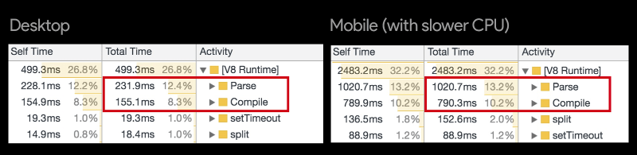
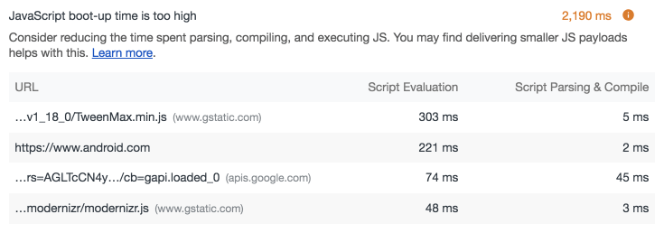
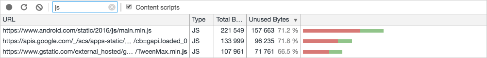
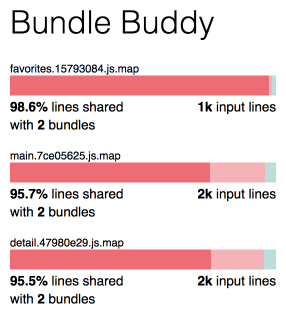
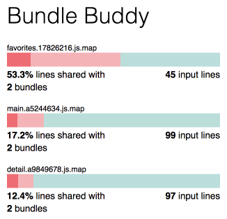
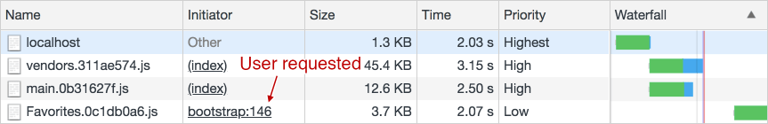
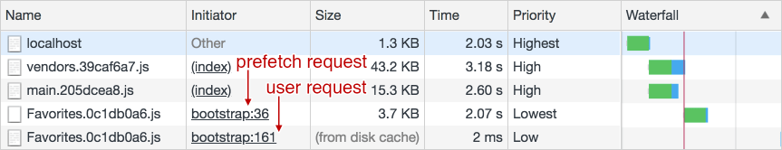
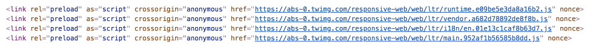
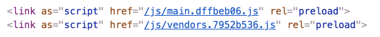

project_path: /web/fundamentals/_project.yaml
book_path: /web/fundamentals/_book.yaml
description: Modern sites often contain a lot of JavaScript. These scripts are often sent down in large, monolithic bundles which can take a long time to download and process. Code-splitting encourages breaking up these scripts so you only send what a user needs when they need it.

{# wf_updated_on: 2018-09-16 #}
{# wf_published_on: 2018-08-06 #}
{# wf_blink_components: Blink>JavaScript #}

# Reduce JavaScript Payloads with Code Splitting {: .page-title }




**TL;DR:**

- Modern sites often combine all of their JavaScript into a single, large bundle.
When JavaScript is served this way, loading performance suffers. Large amounts
of JavaScript can also tie up the main thread, delaying interactivity. This is
_especially_ true of devices with less memory and processing power.
- An alternative to large bundles is code-splitting, which is where JavaScript is
split into smaller chunks. This enables sending the minimal code required to
provide value upfront, improving page-load times. The rest can be loaded on
demand.
- Do you need code-splitting? Check Lighthouse's [JavaScript Bootup Time is Too
High audit](/web/tools/lighthouse/audits/bootup) and [the code coverage
panel](/web/updates/2017/04/devtools-release-notes#coverage) in DevTools to
measure the impact of your app's scripts on performance and how many scripts are
unused.
- Code-splitting can be done in the following ways:
    - **Vendor splitting** separates vendor code (e.g., React, lodash, _etc._)
away from your app's code. This allows you to keep application and vendor code
separate. This isolates the negative performance impacts of cache invalidation
for returning users when either your vendor or app code changes. This should be
done in _every_ app.
    - **Entry point splitting** separates code by entry point(s) in your app,
which are the scripts where tools like webpack and Parcel start when they build
a dependency tree of your app. This is best for pages or apps where client side
routing is not used, or a blended app where some parts use server side routing
and others are part of a single page application.
    - **Dynamic splitting** separates code where dynamic `import()` statements
are used. This type of splitting is often best for single page applications.
- Choose tools that split code for you ([Preact
CLI](https://github.com/developit/preact-cli/), [PWA Starter
Kit](https://github.com/Polymer/pwa-starter-kit/), _etc._) where possible.
[React](https://reactjs.org/docs/code-splitting.html),
[Vue](https://vuejsdevelopers.com/2017/07/03/vue-js-code-splitting-webpack/),
and [Angular](https://angular.io/guide/lazy-loading-ngmodules) support manual
code-splitting.

Maybe you've heard this before, but [there's a _lot_ of JavaScript on web pages
now](https://httparchive.org/reports/state-of-javascript#bytesJs), and on median
mobile hardware, [that can be a Bad
Thing&trade;](https://speedcurve.com/blog/your-javascript-hurts/). Yet, setting
arbitrary limits on what's too much JavaScript is not the best approach. Every
application is different. What's not much JavaScript in one app is far too much
in another. Users and their devices vary!

That's why it's important to consider _how_ you serve JavaScript. Do you bundle
all of your scripts into one big file and serve it on all pages? If so, you'll
want to reconsider this approach, and consider code splitting!

## Too much too soon

Many apps place all their scripts into one file and deliver a large bundle at
initial load. This file contains not just support for the initial route, but
support for _every_ interaction in _every_ route &mdash; regardless of whether
those routes are ever visited!

This all-or-nothing approach can be inefficient. Every second spent loading,
parsing, and executing bytes of unused code prolongs your app's [time to
interactivity (TTI)](/web/tools/lighthouse/audits/time-to-interactive), which
means users are forced to wait unnecessarily before they can use it. This
problem is felt more by users on mobile devices where slower processors or
network connections can impose further delays. The figure below shows how much
longer parsing and compiling can take on a mobile device versus a desktop or
laptop with a more powerful processor:

<figure>
  
  <figcaption><b>Figure 1</b>. JavaScript startup times on different devices.
Source: <a
href="https://medium.com/reloading/javascript-start-up-performance-69200f43b201"
rel="noopener">JavaScript Startup Performance</a> by <a
href="https://twitter.com/addyosmani" rel="noopener">Addy
Osmani</a>.</figcaption>
</figure>

We know that faster apps are _better_ apps. People enjoy using them more, and
[there are numerous case studies for how they improve various business
metrics](https://wpostats.com/). Compared to the all-or-nothing approach, code
splitting emphasizes bundling the minimum of code that can be delivered and
parsed as needed for the current route, rather than all at once.

## Do I need to code split?

"Do I even need to split code in my app?" is a valid question, and as is the
case with many web development questions. If your app has many routes rich with
functionality and makes heavy use of frameworks and libraries, the answer is
almost certainly "yes". However, only you can answer that question for yourself,
as you'll need to rely on your own understanding of your app's architecture and
the scripts it loads, as well as a mixture of tools such as
[Lighthouse](/web/tools/lighthouse/), DevTools, real devices, and
[WebPagetest](https://www.webpagetest.org/).

For newbies, Lighthouse audits require the least amount of effort. In Chrome,
you can open Lighthouse in DevTools via the Audits panel, and audit your site.
There's one audit you'll want to pay attention to with regard to JavaScript
performance problems, and that's the [JavaScript Bootup Time is Too
High](/web/tools/lighthouse/audits/bootup) audit. This audit flags JavaScript
that significantly delays your app's Time to Interactive (TTI):

<figure>
  
  <figcaption><b>Figure 2</b>. The JavaScript Bootup Time is Too High audit in
Lighthouse illustrating which scripts are responsible for excessive processing
activity.</figcaption>
</figure>

Fortunately, you can use the information gleaned from this audit in concert with
the code coverage tool found in the drawer in DevTools (which you can open with
the <kbd>esc</kbd> key when DevTools is focused) to find out what scripts
contain unused code for the current route.

<figure>
  
  <figcaption><b>Figure 3</b>. The code coverage panel in DevTools showing how
much JavaScript is used on the current page.</figcaption>
</figure>

Note: Even if you use code splitting in your app, you still may find some unused
code being loaded on pages. [Tree
shaking](/web/fundamentals/performance/optimizing-javascript/tree-shaking/)
could be part of the solution to eliminating that unused code!

While Lighthouse is great for assessing performance, you should remember that it
does so _synthetically._ The capabilities and processing power of devices run
along a massive gradient, ranging from blazingly fast all the way to
excruciatingly slow, with many users on devices somewhere in between. It's
crucial that you test on _real devices_, specifically those that are _not_ the
on the bleeding edge. Just because your site doesn't struggle to load on an
iPhone X doesn't mean that someone's older (but still serviceable) Galaxy S5
will perform similarly. If you're unable to procure a real device for testing,
you can always fall back on [WebPagetest](https://www.webpagetest.org/), which
allows you to assess performance across a variety of platforms.

## Set a budget and stick to it

If you treat performance as a one-off task, your performance improvements _will_
eventually go by the wayside, as the addition of new features and tech debt will
erase the gains you've made. Performance budgets help you to to cement gains,
and prevent the addition of new features from killing your app's performance.

Performance budgets enable shared enthusiasm for keeping a site’s user
experience within the constraints needed to keep it fast. They usher in a
culture of accountability that enable business stakeholders to weigh the impact
to user-centric metrics of each change to a site.

Embracing performance budgets encourage teams to think seriously about the
consequences of any decisions they make from early on in the design phases right
through to the end of a milestone.

Performance Budgets are aided by having internal processes for operationalizing
a performance culture within a business. Organizational performance budgets
ensure that a budget is owned by everyone rather than just being defined by one
group (e.g engineering). Ensuring fast page loads are one of the most common
performance budgets teams set.

When budgets have been set and the entire organization is aware early on what
the budget parameters are, you're able to say performance isn't just an
engineering issue, but a critical piece of the whole package as a site is
constructed. It provides a guideline for design and engineering when considering
performance and should be checked with each decision that could impact
performance.

When teams are crafting their performance budgets, they need to review their
research and be aware of the metrics that matter most to their users. If you're
trying to get interactive quickly on a low-mid end device, you can't ship 5MB of
JavaScript.

Walking back from Alex Russell's performance budgeting goals outlined in ["Can
You Afford
It?"](https://infrequently.org/2017/10/can-you-afford-it-real-world-web-performance-budgets/),
this may be:

- Time-To-Interactive < 5s on 3G over an emulated (or real) [Moto
G4](https://en.wikipedia.org/wiki/Moto_G4)
- JavaScript budget of < 200 KB if targeting mobile. If you're just starting out,
align with a budget that's less than [the HTTP Archive
medians](https://httparchive.org/reports/state-of-javascript#bytesJs) for
desktop.
- Budgets for other resources can be drawn from a total page weight target. If a
page cannot be larger than 600 KB, your budget for images, JS, CSS, etc will
need to fit in. It's important we remind developers more resources can be lazy
loaded as needed, but the initial costs should be clearly budgeted.

A range of options are available for sites looking for inspiration on how to set
budgets: you can check your competitor's sites or consult industry medians
derived from case studies in your vertical.

## Getting hands on with code splitting

Simply _talking_ about code splitting without having concrete examples to point
to may only leave readers with more questions. To improve clarity, this guide
will show you the different ways you can split code by way of [an example
app](https://github.com/malchata/code-splitting-example), which you can use as a
reference.

Note: Some of the techniques in the example app (such as hash-based versioning
of output filenames and using
[html-webpack-plugin](https://github.com/jantimon/html-webpack-plugin)) are
covered in [this
guide](/web/fundamentals/performance/webpack/use-long-term-caching).

<figure>
  
  <figcaption><b>Figure 4</b>. The example app, which is a searchable database of
guitar effect pedals.</figcaption>
</figure>

The app has three routes:

1. The search page, (also the default route) where users can search for [guitar
effect pedals](https://en.wikipedia.org/wiki/Effects_unit#Stompboxes).
2. The pedal detail page, which is shown when the user clicks on a pedal in the
search results. Users can also add a pedal to their favorites list from here.
3. The favorite pedals page, which lists the user's favorite pedals.

Most examples will show you how to split code along these routes using
[webpack](https://webpack.js.org/), but the dynamic code splitting section will
also show you how to split code using [Parcel](https://parceljs.org/) as well.
Let's start by showing how you can split your app JavaScript by entry point in
webpack.

### Spitting code by multiple entry points

If you're not familiar with the term, an [_entry
point_](https://webpack.js.org/concepts/entry-points/) is a file where webpack
starts to analyze your app's dependencies. To use the tree analogy, it's the
trunk of your app where assets, routes, and functionality branch from. Some apps
have a single entry point but others may have [multiple entry
points](https://webpack.js.org/concepts/entry-points/#multi-page-application).

**When this approach makes sense:** You're developing an app that's not a single
page application (SPA). Or perhaps even a blended application where some pages
don't use client side routing, but other pages might. In cases like these, it
makes sense to split code across multiple entry points.

**What to look out for:** If your entry points share vendor libraries or modules,
duplicate code can occur across your scripts. We'll address this in a bit.

There are three entry points in the example app that correspond to each of the
routes described earlier, which are _index.js_, _detail.js_, and _favorites.js_.
These scripts contain [Preact](https://preactjs.com/) components which render
pages for those routes.

Note: If you want to look at the example app's codebase with entry point-based
code splitting fully implemented, check out the app repo's
[webpack-entry-point-splitting
branch](https://github.com/malchata/code-splitting-example/tree/webpack-entry-point-splitting)!

#### Configuring webpack to split code across multiple entry points

In webpack, we can split code by entry points by specifying them in the [`entry`
config](https://webpack.js.org/configuration/entry-context/#entry) like so:

```javascript
module.exports = {
  // ...
  entry: {
    main: path.join(__dirname, "src", "index.js"),
    detail: path.join(__dirname, "src", "detail.js"),
    favorites: path.join(__dirname, "src", "favorites.js")
  },
  // ...
};
```

Conveniently, when there are multiple entry points, webpack treats them all as
separate dependency trees, meaning that code is automatically split into named
chunks like so:

```
                   Asset       Size  Chunks             Chunk Names
js/favorites.15793084.js   37.1 KiB       0  [emitted]  favorites
   js/detail.47980e29.js   44.8 KiB       1  [emitted]  detail
     js/main.7ce05625.js   49.4 KiB       2  [emitted]  main
              index.html  955 bytes          [emitted]
             detail.html  957 bytes          [emitted]
          favorites.html  960 bytes          [emitted]
```

As you may guess, chunk names come from the object keys in the entry config,
which makes identifying which chunk contains code for which page a snap. The app
also uses html-webpack-plugin to generate HTML files that include the
corresponding chunks for each page.

#### Removing duplicate code

Though we've created nicely split chunks for each page, there's still a problem:
There's a lot of duplicate code in each chunk. This is because webpack treats
each entry point as its own dependency tree without assessing what code is
shared between them. If [we turn on source maps in
webpack](https://webpack.js.org/configuration/devtool/) and analyze our code
with a tool like [Bundle Buddy](https://github.com/samccone/bundle-buddy) or
[webpack-bundle-analyzer](https://github.com/webpack-contrib/webpack-bundle-analyzer),
we can see how much duplicate code is in each chunk.

<figure>
  
  <figcaption><b>Figure 5</b>. Bundle Buddy showing how many lines of code are
shared between bundles.</figcaption>
</figure>

Here, the duplicate code comes from vendor scripts. To remedy this, we'll tell
webpack to create a separate chunk for those scripts. To do this, we'll use the
[`optimization.splitChunks` configuration
object](https://webpack.js.org/plugins/split-chunks-plugin/#optimization-splitchunks):

```javascript
module.exports = {
  // ...
  optimization: {
    splitChunks: {
      cacheGroups: {
        // Split vendor code to its own chunk(s)
        vendors: {
          test: /[\\/]node_modules[\\/]/i,
          chunks: "all"
        }
      }
    },
    // The runtime should be in its own chunk
    runtimeChunk: {
        name: "runtime"
    }
   },
  // ...
};
```

This configuration says "I want to output separate chunks for vendor scripts"
(those loaded from the _node_modules_ folder). This works because all vendor
scripts are installed by npm to _node_modules_, which we check for with [the
`test`
option](https://webpack.js.org/plugins/split-chunks-plugin/#splitchunks-cachegroups-test).
[The `runtimeChunk`
option](https://webpack.js.org/configuration/optimization/#optimization-runtimechunk)
is also specified to move [webpack's
runtime](https://webpack.js.org/concepts/manifest/#runtime) into its own chunk
to avoid duplication of it in our app code. When we add these options to the
config and rebuild the app, the output shows that our app's vendor scripts have
been moved to a separate file:

```
                                       Asset      Size  Chunks             Chunk Names
js/vendors~detail~favorites~main.29eb30bb.js  30.1 KiB       0  [emitted]  vendors~detail~favorites~main
                         js/main.06d0afde.js  16.5 KiB       2  [emitted]  main
                       js/detail.1acdbb27.js  13.4 KiB       3  [emitted]  detail
                    js/favorites.230214a7.js  5.52 KiB       4  [emitted]  favorites vendors~detail~favorites~main
                      js/runtime.2642dc2d.js  1.46 KiB       1  [emitted]  runtime
                                  index.html   1.1 KiB          [emitted]
                                 detail.html   1.1 KiB          [emitted]
                              favorites.html   1.1 KiB          [emitted]
```

Because the vendor scripts, the runtime, and shared code are now split to
dedicated chunks, we've reduced the size of the entry point scripts, as well.
Thanks to our efforts, Bundle Buddy gives us a better result:

<figure>
  
  <figcaption><b>Figure 6</b>. Bundle Buddy showing reduced input
lines and shared code between bundles.</figcaption>
</figure>

Before we split the vendor code, a few thousand lines of code were shared
between bundles. Now it's significantly less than that. While separating vendor
code into separate chunks _can_ incur additional HTTP request(s), that may only
be an issue if your app is still on HTTP/1. Additionally, serving your scripts
like this is _way_ better for caching. If you have one giant bundle, but either
your app or vendor code changes, the entire bundle would need to be downloaded
again.

Note: [Don't forget to set an optimal caching
policy](/web/fundamentals/performance/optimizing-content-efficiency/http-caching)
for your returning users!

If you _really_ want to go for the gold, though, you can eliminate most or all
shared code between bundles and employ a type of splitting called "commons
splitting". In the example app, this can be achieved by creating another entry
under `cacheGroups` like so:

```javascript
module.exports = {
  // ...
  optimization: {
    splitChunks: {
      cacheGroups: {
        // Split vendor code to its own chunk(s)
        vendors: {
          test: /[\\/]node_modules[\\/]/i,
          chunks: "all"
        },
        // Split code common to all chunks to its own chunk
        commons: {
          name: "commons",    // The name of the chunk containing all common code
          chunks: "initial",  // TODO: Document
          minChunks: 2        // This is the number of modules
        }
      }
    },
    // The runtime should be in its own chunk
    runtimeChunk: {
      name: "runtime"
    }
  },
  // ...
};
```

When we employ commons splitting, code common amongst chunks will be split to a
new chunk named `commons`, which is reflected in the output:

```
                   Asset      Size  Chunks             Chunk Names
  js/commons.e039cc73.js    40 KiB       0  [emitted]  commons
     js/main.5b71b65c.js  7.82 KiB       2  [emitted]  main
   js/detail.b3ac6f73.js  5.17 KiB       3  [emitted]  detail
js/favorites.8da9eb04.js  2.18 KiB       4  [emitted]  favorites
  js/runtime.2642dc2d.js  1.46 KiB       1  [emitted]  runtime
              index.html  1.08 KiB          [emitted]
             detail.html  1.08 KiB          [emitted]
          favorites.html  1.08 KiB          [emitted]
```

When we re-run Bundle Buddy, we should receive a notice that our bundles no
longer have duplicate code across chunks.

While removing all duplicate code is a worthwhile goal, it's important to also
be pragmatic. Seek to dedupe as much code as possible, but understand that doing
so with this configuration may enlarge initial bundles by pulling in code that
may not be used on the current page. Which can be mitigated by lazy loading
scripts, which we'll cover next!

### Splitting code dynamically

Splitting code by multiple entry points as demonstrated above is logical and
intuitive, but it may not be practical for your app. Another method is to lazy
load scripts with the [dynamic `import()`
statement](/web/updates/2017/11/dynamic-import):

```javascript
import("./myFancyModule.js").then(module => {
  module.default(); // Call a module's default export
  module.andAnotherThing(); // Call a module's named export
});
```

Since `import()` returns [a
Promise](https://developer.mozilla.org/en-US/docs/Web/JavaScript/Reference/Global_Objects/Promise),
you can also use
[`async`](https://developer.mozilla.org/en-US/docs/Web/JavaScript/Reference/Statements/async_function)/[`await`](https://developer.mozilla.org/en-US/docs/Web/JavaScript/Reference/Operators/await):

```javascript
let module = await import("./myFancyModule.js");
module.default(); // Access a module's default export
module.andAnotherThing(); // Access a module's named export
```

Whichever method you prefer, both Parcel and webpack can detect `import()`s and
split code imported by them accordingly.

**When this approach makes sense:** You're developing a single page application
with many discrete pieces of functionality that not all users may, well, _use_.
Lazy loading this functionality can reduce JS parse/compile activity as well as
bytes sent over the network.

**What to look out for:** Dynamically importing a script kicks off a network
request, which means user actions could be delayed as a result. There _are_ ways
to mitigate this, though, which we'll cover soon.

Let's start by covering how dynamic code splitting works in Parcel.

#### Dynamic code splitting with Parcel

The most intuitive tool to use for dynamic code splitting is
[Parcel](https://parceljs.org/). Without any configuration, Parcel builds a
dependency tree accounting for both static and dynamic modules, and outputs
scripts with names that nicely align with your inputs.

Note: If you're interested in seeing how the example app does dynamic code
splitting with Parcel, check out the [parcel-dynamic-splitting
branch](https://github.com/malchata/code-splitting-example/tree/parcel-dynamic-splitting).

In this version of the example app, client side routing is provided by
[preact-router](https://github.com/developit/preact-router) and
[preact-async-route](https://github.com/prateekbh/preact-async-route). Without
dynamically imported modules, all components needed by all routes would need to
be imported (and thus downloaded by the client) up front:

```javascript
import Router from "preact-router";
import { h, render, Component } from "preact";
import Search from "./components/Search/Search";
import PedalDetail from "./components/PedalDetail/PedalDetail";
import Favorites from "./components/Favorites/Favorites";

render(<Router>
  <Search path="/" default/>
  <PedalDetail path="/pedal/:id"/>
  <Favorites path="/favorites"/>
</Router>, document.getElementById("app"));
```

Here, we're loading every component for every route whether or not the user ever
visits them. When we architect apps this way, we're missing out on a potential
opportunity to improve loading performance by lazy loading JavaScript. In the
case of this example app, we can defer the components needed for the
`/pedal/:id` and `/favorites` routes by using dynamic `import()` and
preact-async-route like so:

```javascript
import Router from "preact-router";
import AsyncRoute from "preact-async-route";
import { h, render, Component } from "preact";
import Search from "./components/Search/Search";

render(<Router>
  <Search path="/" default/>
  <AsyncRoute path="/pedal/:id" getComponent={() => import("./components/PedalDetail/PedalDetail").then(module => module.default)}/>
  <AsyncRoute path="/favorites" getComponent={() => import("./components/Favorites/Favorites").then(module => module.default)}/>
</Router>, document.getElementById("app"));
```

You'll notice a few things that are different from the previous example:

1. We're statically importing only the `Search` component. This is because the
default route uses this component, so it's reasonable to load it up front.
2. preact-async-route handles asynchronous routing via the `AsyncRoute` component.
3. The `PedalDetail` and `Favorites` components are lazy loaded when the user
navigates to the routes using them by the `AsyncRoute` component via `import()`
statements.

When we build the app, Parcel outputs the following:

```
dist/src.e54c18ce.js             65.56 KB    2.87s
dist/PedalDetail.7f417dfd.js      7.66 KB    1.52s
dist/Favorites.02c87dad.js        3.06 KB    1.17s
dist/index.html                     964 B    882ms
```

With zero configuration, Parcel automatically splits dynamically imported
scripts into lazy-loadable chunks that can be loaded on demand.

Warning: This example doesn't employ vendor splitting!

When we land on the default route, only the scripts needed are loaded to support
it. When the user navigates to either the pedal detail or favorites routes, the
scripts for those routes will be loaded on demand.

##### Dynamic code splitting with webpack

Like Parcel, webpack can split dynamic imports to separate files. It does so
with little guidance, in fact. It's just that when webpack encounters `import()`
calls, it doesn't name the output files like Parcel does:

```
                      Asset       Size  Chunks             Chunk Names
        js/main.2c418923.js   10.2 KiB       0  [emitted]  main
           js/2.6b340cb3.js   3.32 KiB       2  [emitted]
           js/3.a52088da.js  349 bytes       3  [emitted]
           js/4.232e6590.js  521 bytes       4  [emitted]
js/vendors~main.526c9b0c.js   42.9 KiB       5  [emitted]  vendors~main
     js/runtime.8b59d0ff.js   2.26 KiB       6  [emitted]  runtime
           js/1.175d2b19.js   6.11 KiB       1  [emitted]
                 index.html   1.08 KiB          [emitted]
```

Here, you can see that webpack assigns IDs to `import()`s rather than names.
This doesn't matter so much for your app's users, but it can problematic for
development reasons. To get around this, we'll need to use a special kind of
comment known as an _inline directive_ to tell webpack what the output file
names should be:

```javascript
render(<Router>
  <Search path="/" default/>
  <AsyncRoute path="/pedal/:id" getComponent={() => import(/* webpackChunkName: "PedalDetail" */ "./components/PedalDetail/PedalDetail").then(module => module.default)}/>
  <AsyncRoute path="/favorites" getComponent={() => import(/* webpackChunkName: "Favorites" */ "./components/Favorites/Favorites").then(module => module.default)}/>
</Router>, document.getElementById("app"));
```

In the above snippet, an inline directive called `webpackChunkName` tells
webpack what the name of a chunk should be. When used within `import()` calls,
webpack gives proper names to chunks like so:

```
                        Asset       Size  Chunks             Chunk Names
          js/main.b72863fc.js   10.2 KiB       0  [emitted]  main
     js/Favorites.0ce4835e.js   3.33 KiB       2  [emitted]  Favorites
    js/simpleSort.ef5256f9.js  358 bytes       3  [emitted]  simpleSort
js/toggleFavorite.fc4ea97d.js  534 bytes       4  [emitted]  toggleFavorite
  js/vendors~main.526c9b0c.js   42.9 KiB       5  [emitted]  vendors~main
       js/runtime.a735e0fe.js   2.32 KiB       6  [emitted]  runtime
   js/PedalDetail.ba7a0692.js   6.12 KiB       1  [emitted]  PedalDetail
                   index.html   1.08 KiB          [emitted]
```

This syntax is a bit unwieldy in my opinion, but it works. If you want to how
the example app does dynamic code splitting with webpack, check out the app
repo's [webpack-dynamic-splitting
branch](https://github.com/malchata/code-splitting-example/tree/webpack-dynamic-splitting).

## Loading performance considerations

A potential pain point with code splitting is it increases the amount of
requests for scripts which, even in HTTP/2 environments, presents challenges.
Let's cover some ways you can improve loading performance in apps where code
splitting is used.

### There's that "budget" word again

At the start of this guide, we talked at a high level about performance budgets,
which can be difficult to enforce if the practice isn't followed in your
organization. If you use webpack in your project, you can configure your app to
throw an error for builds emitting assets that are too large by way of [the
`performance` configuration
object](https://webpack.js.org/configuration/performance/). With this config
object, we can effectively enforce budgets for asset sizes like so:

```javascript
module.exports = {
  // ...
  performance: {
    hints: "error",
    maxAssetSize: 102400
  }
};
```

This configuration effectively tells Webpack "if any asset larger than 100 KB is
emitted during build, throw an error". This is certainly a draconian
configuration (and is one you probably can't put into an existing app without
running into some trouble), but if you're serious about sticking to a budget,
the `performance` object can help you do just that. Be sure to check out other
options available in this object, such as
[`maxEntrypointSize`](https://webpack.js.org/configuration/performance/#performance-maxentrypointsize).

### Precache scripts with a service worker

One of the Ps of [the PRPL pattern](/web/fundamentals/performance/prpl-pattern/)
stands for _precache_, which involves precaching remaining routes and
functionality with a service worker when it initializes. Precaching is great for
performance in the following ways:

1. It doesn't impact loading performance of the app's initial load, because service
worker registration and subsequent precaching occurs later on in the page
loading process.
2. Precaching remaining routes and functionality with a service worker ensures
they're available immediately when they're requested later.

Of course, adding a service worker to an app with code generated by modern
tooling can be challenging, owing to a number of reasons (such as output
filenames with hashes in them). Thankfully, [Workbox](/web/tools/workbox/) has a
webpack plugin that can generate a service worker for your app with little
effort. At a minimum, you can install
[workbox-webpack-plugin](https://www.npmjs.com/package/workbox-webpack-plugin)
and bring it into your webpack config like so:

```javascript
const { GenerateSW } = require("workbox-webpack-plugin");
```

From there, you can add an instance of `GenerateSW` to the `plugins` config:

```javascript
module.exports = {
  // ...
  plugins: [
    // ... other plugins omitted
    new GenerateSW()
  ]
  // ...
};
```

With this configuration, Workbox generates a service worker that precaches _all_
JavaScript in your app. This is probably fine for small apps, but for large ones
you'll may want to limit what's precached. This can be done via the plugin's
`chunks` option to whitelist chunks:

```javascript
module.exports = {
  // ...
  plugins: [
    new GenerateSW({
      chunks: ["main", "Favorites", "PedalDetail", "vendors"]
    })
  ]
  // ...
};
```

Using the whitelist approach, we can ensure the service worker precaches only
the scripts we want. To see how Workbox is used in the example app, check out
the repo's
[webpack-dynamic-splitting-precache](https://github.com/malchata/code-splitting-example/tree/webpack-dynamic-splitting-precache)
branch!

### Prefetching and preloading scripts

Precaching scripts with a service worker is one way to improve loading
performance for your app, but they should be treated as a progressive
enhancement. In the absence of (or even in addition to) them, you may want to
consider prefetching or preloading chunks.

Both `rel=prefetch` and `rel=preload` are resource hints that fetch a specified
resource before the browser otherwise would, which can improve loading
performance by masking latency. Though they're both very similar at first
glance, they behave quite differently:

1. [`rel=prefetch`](https://www.w3.org/TR/resource-hints/#prefetch) is a _low
priority_ fetch for non-critical resources to be used later. Requests kicked off
by `rel=prefetch` occur when the browser is idle.
2. [`rel=preload`](https://www.w3.org/TR/preload/) is a _high priority_ fetch for
critical resources used by the current route. Requests for resources kicked off
by `rel=preload` may occur sooner than when the browser would otherwise discover
them. Preloading is _super_ nuanced, though, so you'll want to check out [this
guide](/web/fundamentals/performance/resource-prioritization#preload) (and
potentially [the spec](https://www.w3.org/TR/preload/)) for guidance.

If you want an in-depth explainer on these resource hints, [read this
article](https://medium.com/reloading/preload-prefetch-and-priorities-in-chrome-776165961bbf).
For the sake of this guide, though, I'll limit guidance in this area as it
applies to webpack.

#### Prefetching

It may be reasonable to prefetch scripts for routes or functionality you're
reasonably certain users will visit or use, but have not yet done so. A good use
case for prefetching in this guide's example app occurs where we mount the app's
`Router` component in the _index.js_ entry point:

```javascript
render(<Router>
  <Search path="/" default/>
  <AsyncRoute path="/pedal/:id" getComponent={() => import(/* webpackChunkName: "PedalDetail" */ "./components/PedalDetail/PedalDetail").then(module => module.default)}/>
  <AsyncRoute path="/favorites" getComponent={() => import(/* webpackPrefetch: true, webpackChunkName: "Favorites" */ "./components/Favorites/Favorites").then(module => module.default)}/>
</Router>, document.getElementById("app"));
```

Here, we've added the `webpackPrefetch` inline directive (in addition to
`webpackChunkName`) to the `AsyncRoute` for the favorites page. If no
prefetching was done for the scripts on this route, a user requesting them could
experience latency like this:

<figure>
  
  <figcaption><b>Figure 7</b>. A request for scripts for the favorites route on a
throttled (Slow 3G) connection.</figcaption>
</figure>

On a slow connection, the user may have to wait for a few seconds before the
scripts for the favorites route finally arrives. Using `webpackPrefetch`,
though, we can make this less painful and idly prefetch that JavaScript when the
user first lands on the app:

<figure>
  
  <figcaption><b>Figure 8</b>. A request for scripts for the favorites route is
prefetched after the initial route loads. When the user explicitly requests it,
the browser immediately pulls it from its cache.</figcaption>
</figure>

Prefetches are generally low risk, as they don't significantly contend for
bandwidth since the resource is fetched during idle time with low priority. That
said, the potential to waste bandwidth is there, so you'll want to make sure
whatever you're prefetching has a reasonable chance of being used.

Note: If you want to see how this all works, check out the
[webpack-dynamic-splitting-prefetch
branch](https://github.com/malchata/code-splitting-example/tree/webpack-dynamic-splitting-prefetch)
of the code!

#### Preloading

Preloading is similar to, but ultimately different than prefetching. The
`webpackPreload` inline directive can invoke a preload much the same way
`webpackPrefetch` does for a prefetch. In my admittedly anecdotal experience,
however, using `webpackPreload` to preload dynamic imports is roughly as
beneficial as simply bundling all functionality for a given route into one large
chunk.

Preloading, in my opinion, makes the most sense for scripts critical to
rendering the initial route. Twitter does this to speed up loading of the
[Twitter Lite](https://mobile.twitter.com/home) app:

<figure>
  
  <figcaption><b>Figure 9</b>. Twitter Lite DOM snapshot in DevTools revealing
several preloaded JavaScript resources.</figcaption>
</figure>

Unfortunately, `webpackPreload` only works with dynamic `import()` calls, so in
order to preload chunks critical to the initial route in the example app, we
need to rely on another method involving a plugin called
[preload-webpack-plugin](https://github.com/GoogleChromeLabs/preload-webpack-plugin).
Once this plugin is installed, we bring it into the webpack config like so:

```javascript
const PreloadWebpackPlugin = require("preload-webpack-plugin");
```

Then we configure the plugin to preload the `main` and `vendors` chunks by
adding an instance of the plugin to the `plugins` array:

```javascript
plugins: [
  // Other plugins omitted...
  new PreloadWebpackPlugin({
    rel: "preload",
    include: ["main", "vendors"]
  })
]
```

This configuration will place preload hints via `<link>` elements in the
`<head>` for both the `vendors` and `main` chunks.

<figure>
  
  <figcaption><b>Figure 10</b>. Preload hints added to the
<code>&lt;head&gt;</code> of the document for the <code>main</code> and
<code>vendors</code> chunks as seen in DevTools.</figcaption>
</figure>

While this doesn't confer much of a performance boost in the example app, it
_can_ boost loading performance in apps where there are many chunks of
JavaScript and other resources that would otherwise contend for bandwidth. To
see preloading in action in the example app, check out the
[webpack-dynamic-splitting-preload
branch](https://github.com/malchata/code-splitting-example/tree/webpack-dynamic-splitting-preload).

Note: preload-webpack-plugin _must_ be used with html-webpack-plugin! When
adding it to your `plugins` array, be sure to place it _after_ the last instance
of html-webpack-plugin.

## Conclusion and resources

There's no doubt that code splitting is tough. What's more, _how_ you'll split
code in your specific app will take time for you to figure out. If you want to
know more, or just want different takes on the subject, check out this list of
resources:

- [Official webpack code splitting
docs.](https://webpack.js.org/guides/code-splitting/)
- [Official Parcel.js code splitting
docs.](https://parceljs.org/code_splitting.html)
- [Official React code splitting
docs.](https://reactjs.org/docs/code-splitting.html)
- [Official Vue code splitting
docs.](https://vuejsdevelopers.com/2017/07/03/vue-js-code-splitting-webpack/)
- [Official Angular code splitting
docs.](https://angular.io/guide/lazy-loading-ngmodules)
- [Dynamic import() guidance here on Web
Fundamentals.](/web/updates/2017/11/dynamic-import)

Rest assured, though, that code splitting will improve performance for your app,
which will reap rewards as users will find your app more engaging and easier to
use. Good luck!

_Special thanks to Patrick Meenan, Jason Miller, [Jeff
Posnick](/web/resources/contributors/jeffposnick), Sam Saccone, [Philip
Walton](/web/resources/contributors/philipwalton), for their valuable feedback,
which significantly improved the quality of this article._
