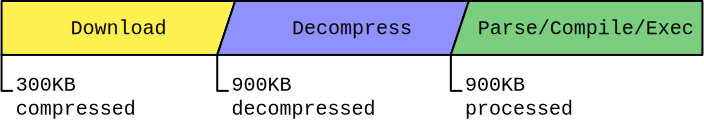
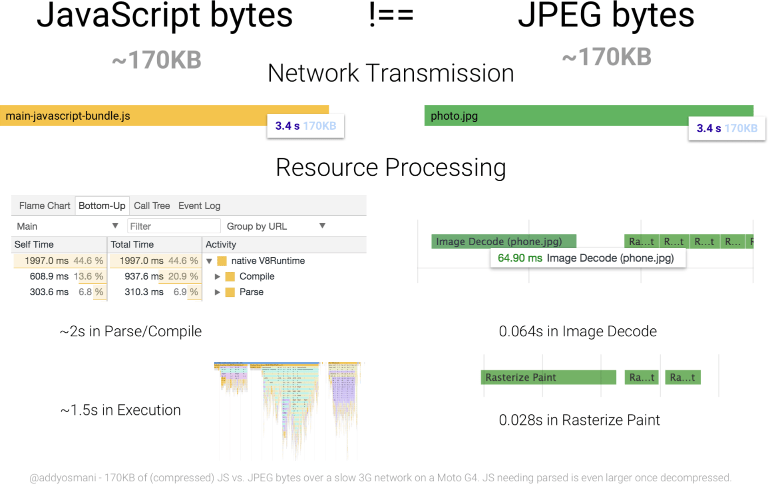
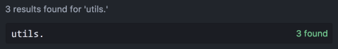

project_path: /web/fundamentals/_project.yaml
book_path: /web/fundamentals/_book.yaml
description: Knowing where to begin optimizing your application's JavaScript can be daunting. If you're taking advantage of modern tooling such as webpack, however, tree shaking might be a good place to start!

{# wf_updated_on: 2018-06-12 #}
{# wf_published_on: 2018-06-14 #}
{# wf_blink_components: Blink>JavaScript #}

# Reduce JavaScript Payloads with Tree Shaking {: .page-title }



Today's web applications can get pretty big, especially the JavaScript part of
them. [As of
mid-2018](https://httparchive.org/reports/state-of-javascript#bytesJs), HTTP
Archive puts the median transfer size of JavaScript on mobile devices at
approximately 350 KB. And this is just transfer size! JavaScript is often
compressed when sent over the network, meaning that the _actual_ amount of
JavaScript is quite a bit more after the browser decompresses it. That's
important to point out, because as far as resource _processing_ is concerned,
compression is irrelevant. 900 KB of decompressed JavaScript is still 900 KB to
the parser and compiler, even though it may be ~300 KB when compressed.

<figure>
  
  <figcaption><b>Figure 1</b>. The process of downloading and running JavaScript.
Note that even though the transfer size of the script is 300 KB compressed, it
is still 900 KB worth of JavaScript that must be parsed, compiled, and
executed.</figcaption>
</figure>

JavaScript is an expensive resource to process. Unlike images which only incur
relatively trivial decode time once downloaded, JavaScript must be parsed,
compiled, and then finally executed. Byte for byte, this makes JavaScript more
expensive than other types of resources.

<figure>
  
  <figcaption><b>Figure 2</b>. The processing cost of parsing/compiling 170 KB of
JavaScript vs decode time of an equivalently sized JPEG. (<a
href="https://medium.com/dev-channel/the-cost-of-javascript-84009f51e99e"
rel="noopener">source</a>).</figcaption>
</figure>

[While improvements are continually being
made](https://v8project.blogspot.com/2018/03/background-compilation.html) to
[improve the efficiency of JavaScript
engines](https://blog.mozilla.org/javascript/2017/12/12/javascript-startup-bytecode-cache/),
improving JavaScript performance is, as always, a task fit for developers. After
all, who better to improve application architecture than the architects
themselves?

To that end, there are techniques to improve JavaScript performance. [Code
splitting](https://webpack.js.org/guides/code-splitting/), is one such technique
that improves performance by partitioning application JavaScript into chunks,
and serving those chunks to only the routes of an application that need them.
This technique works, but it doesn't address a common problem of
JavaScript-heavy applications, which is the inclusion of code that's never used.
To solve this problem, we rely on tree shaking.

## What is tree shaking?

[Tree shaking](https://en.wikipedia.org/wiki/Tree_shaking) is a form of dead
code elimination. [The term was popularized by
Rollup](https://github.com/rollup/rollup#tree-shaking), but the concept of dead
code elimination has existed for some time. The concept has also found purchase
in [webpack](https://webpack.js.org/guides/tree-shaking/), which is demonstrated
in this article by way of a sample app.

The term "tree shaking" comes from the mental model of your application and its
dependencies as a tree-like structure. Each node in the tree represents a
dependency that provides distinct functionality for your app. In modern apps,
these dependencies are brought in via [static `import`
statements](https://developer.mozilla.org/en-US/docs/Web/JavaScript/Reference/Statements/import)
like so:

```javascript
// Import all the array utilities!
import arrayUtils from "array-utils";
```

Note: If you're not sure what ES6 modules are, I highly recommend [this
excellent explainer over at Pony
Foo](https://ponyfoo.com/articles/es6-modules-in-depth). This guide assumes you
have working knowledge of how ES6 modules work, so if you don't know anything
about them, give that article a read!

When your app is young (a sapling, if you will), you may have relatively few
dependencies. You're also using most (if not all) the dependencies you add. As
your app ages, however, more dependencies can get added. To compound matters,
older dependencies fall out of use, but may not get pruned from your codebase.
The end result is that an app ends up shipping with a lot of [unused
JavaScript](/web/updates/2018/05/lighthouse#unused_javascript). Tree shaking
addresses this by taking advantage of how we use static `import` statements to
pull in specific parts of ES6 modules:

```javascript
// Import only some of the utilities!
import { unique, implode, explode } from "array-utils";
```

The difference between this `import` example and the previous one is that rather
than importing _everything_ from the `"array-utils"` module (which could be a
lot of stuff!), this example imports only specific parts of it. In dev builds,
this doesn't really change anything, as the entire module gets imported
regardless. In production builds, however, we can configure webpack to "shake"
off
[`export`s](https://developer.mozilla.org/en-US/docs/web/javascript/reference/statements/export)
from ES6 modules that weren't explicitly imported, making those production
builds smaller. In this guide, you're going to learn how to do just that!

## Finding opportunities to shake a tree

For illustrative purposes, I created [a sample one-page
app](https://github.com/malchata/webpack-tree-shaking-example) that uses webpack
to demonstrate how tree shaking works. You can clone it and follow along if you
like, but we'll cover every step of the way together in this guide, so cloning
isn't necessary (unless hands-on learning is your thing).

The sample app is a super simple searchable database of guitar effect pedals.
You enter a query and a list of effect pedals pops up.

<figure>
  
  <figcaption><b>Figure 3</b>. A screenshot of the sample app.</figcaption>
</figure>

Predictably, the behavior that drives this app is separated into vendor (i.e.,
[Preact](https://preactjs.com/) and [Emotion](https://emotion.sh/)) and
app-specific code bundles (or "chunks", as webpack calls them):

<figure>
  
  <figcaption><b>Figure 4</b>. The app's two JavaScript bundles. These are are
uncompressed sizes.</figcaption>
</figure>

The JavaScript bundles shown in the figure above are production builds, meaning
they're optimized through [uglification](http://lisperator.net/uglifyjs/). 21.1
KB for an app-specific bundle isn't bad (like _at all_). But! It should be noted
that no tree shaking is occurring whatsoever. Let's look at the app code and see
what we can do to fix that.

Note: If you don't care for long-winded explanations and just want to dive into
code, you can go ahead and check out [the `tree-shake`
branch](https://github.com/malchata/webpack-tree-shaking-example/tree/tree-shake)
in the app's GitHub repo. You can also [diff this branch
`master`](https://github.com/malchata/webpack-tree-shaking-example/compare/tree-shake)
to see exactly what was changed to make tree shaking work!

In any application, finding opportunities for tree shaking are going to involve
looking for static `import` statements. [Near the top of the main component
file](https://github.com/malchata/webpack-tree-shaking-example/blob/master/src/components/FilterablePedalList/FilterablePedalList.js#L4),
you'll see a line like this:

```javascript
import * as utils from "../../utils/utils";
```

Maybe you've seen something like this before. The number of ways ES6 module
exports can be imported are numerous, but ones like this should get your
attention. This specific line is saying "Hey, `import` _everything_ from the
`utils` module, and put it in a namespace called `utils`." The big question to
ask here is, "just how much _stuff_ is in that module?"

Well, if you look at [the `utils` module source
code](https://github.com/malchata/webpack-tree-shaking-example/blob/master/src/utils/utils.js),
you'll find there's a _lot_. Like around 1,300 lines of code.

Okay, don't worry. Maybe all that stuff is being used, right? _Do_ we need all
that stuff? Let's double check by searching [the main component
file](https://github.com/malchata/webpack-tree-shaking-example/blob/master/src/components/FilterablePedalList/FilterablePedalList.js)
we imported the `utils` module into and see how many instances of that namespace
come up. Surely, we must be using all that of that stuff for _something_.

<figure>
  
  <figcaption><b>Figure 5</b>. The utils namespace we've imported tons of modules
from is only invoked three times within the main component file.</figcaption>
</figure>

Well, _that's_ no good. We're only using the `utils` namespace in three spots in
our application code. But for what functions? If we take a look at the main
component file again, it appears to be only one function, which is
`utils.simpleSort`, which is used to sort the search results list by a number of
criteria when sorting dropdowns are changed:

```javascript
if (this.state.sortBy === "model") {
  // Simple sort gets used here...
  json = utils.simpleSort(json, "model", this.state.sortOrder);
} else if (this.state.sortBy === "type") {
  // ..and here...
  json = utils.simpleSort(json, "type", this.state.sortOrder);
} else {
  // ..and here.
  json = utils.simpleSort(json, "manufacturer", this.state.sortOrder);
}
```

So, that's just great. Out of a 1,300 line file with a bunch of exports, I'm
only using one of them. Turns out I'm pretty bad at webperfs.

Note: This project is purposefully kept simple, so it's pretty easy in this case
to find out where the bloat is coming from. In large projects with many modules,
however, it's tough to find out how much of a bundle is made up of which
imports. Tools such as [Webpack Bundle
Analyzer](https://www.npmjs.com/package/webpack-bundle-analyzer) and
[source-map-explorer](https://www.npmjs.com/package/source-map-explorer) can
help, but assistive tooling is still being developed to fill this need.

Of course, now would be the time to admit this example is a _bit_ manufactured
for this article's benefit. While that's absolutely the case here, it doesn't
change the fact that this synthetic sort of scenario resembles actual
optimization opportunities you may encounter in your own very real apps. So now
that you've identified an opportunity for tree shaking to be useful, how do we
actually _do_ it?

## Keeping Babel from transpiling ES6 modules to CommonJS modules

[Babel](https://babeljs.io/) is an indispensable tool most apps need.
Unfortunately, it can also make straightforward tasks like tree shaking a bit
more difficult, precisely _because_ of what it does for us. If you're using
[`babel-preset-env`](https://babeljs.io/docs/plugins/preset-env/), one thing it
automatically does for you is transpile your nice ES6 modules into more widely
compatible CommonJS modules (i.e., modules you `require` instead of `import`).
This is great and all until we want to start tree shaking.

The problem is that tree shaking is much more difficult to do for CommonJS
modules, and webpack won't know what to prune from the bundle if you decide to
use them. The solution is simple: We configure `babel-preset-env` to leave ES6
modules alone. Wherever you configure Babel (be it in `.babelrc` or
`package.json`) this means adding a little something extra:

```json
{
  "presets": [
    ["env", {
      "modules": false
    }]
  ]
}
```

Simply specifying `"modules": false` in your `babel-preset-env` config gets
Babel to behave how we want, which allows webpack to analyze your dependency
tree and shake off those unused dependencies. Furthermore, this process doesn't
cause compatibility issues, as webpack ends up converting your code into a
format that's widely compatible, anyway.

## Keeping side effects in mind

Another aspect to consider when shaking dependencies from your app is whether
your project's modules have side effects. An example of a side effect is when a
function modifies something outside of its own scope, which is a _side effect_
of its execution:

```javascript
let fruits = ["apple", "orange", "pear"];

console.log(fruits); // (3) ["apple", "orange", "pear"]

const addFruit = function(fruit) {
  fruits.push(fruit);
};

addFruit("kiwi");

console.log(fruits); // (4) ["apple", "orange", "pear", "kiwi"]
```

In this very basic example, `addFruit` produces a side effect when it modifies
the `fruits` array, which is beyond the `addFruit` function's scope.

Side effects also apply to ES6 modules, and that matters in the context of tree
shaking. Modules that take predictable inputs and spit out equally predictable
outputs without modifying anything outside of their own scope are dependencies
we can safely shake if we're not using them. They're self-contained, _modular_
pieces of code. Hence, "modules".

Where webpack is concerned, we can hint that a package and its dependencies are
free of side effects by specifying `"sideEffects": false` in a project's
`package.json` file:

```json
{
  "name": "webpack-tree-shaking-example",
  "version": "1.0.0",
  "sideEffects": false
}
```

Alternatively, you can tell webpack which specific files are not side
effect-free:

```json
{
  "name": "webpack-tree-shaking-example",
  "version": "1.0.0",
  "sideEffects": [
    "./src/utils/utils.js"
  ]
}
```

In the latter example, any file that isn't specified will be assumed to be free
of side effects. If you don't want to add this to your `package.json` file, [you
can also specify this flag in your webpack config via
`module.rules`](https://github.com/webpack/webpack/issues/6065#issuecomment-351060570)

## Importing only what we need

So we told Babel to leave our ES6 modules be, but now we need to make a slight
adjustment to our `import` syntax to bring in only the functions we need from
the `utils` module. In this guide's example, all we need is `simpleSort`:

```javascript
import { simpleSort } from "../../utils/utils";
```

Using this syntax, we're saying "hey, get me only the `simpleSort` export from
the `utils` module." Because we're bringing in only `simpleSort` and not the
entire `utils` module into the global scope, we need to change every instance of
`utils.simpleSort` to `simpleSort`:

```javascript
if (this.state.sortBy === "model") {
  json = simpleSort(json, "model", this.state.sortOrder);
} else if (this.state.sortBy === "type") {
  json = simpleSort(json, "type", this.state.sortOrder);
} else {
  json = simpleSort(json, "manufacturer", this.state.sortOrder);
}
```

Now that we've done what we need for tree shaking to work, let's step back for a
second. This is the webpack output _before_ shaking the dependency tree:

```shell
                 Asset      Size  Chunks             Chunk Names
js/vendors.16262743.js  37.1 KiB       0  [emitted]  vendors
   js/main.797ebb8b.js  20.8 KiB       1  [emitted]  main
```

This is the output _after_ tree shaking has been put into place:

```shell
                 Asset      Size  Chunks             Chunk Names
js/vendors.45ce9b64.js  36.9 KiB       0  [emitted]  vendors
   js/main.559652be.js  8.46 KiB       1  [emitted]  main
```

While both bundles shrank, it's really the `main` bundle that benefits the most.
By shaking off the unused parts of the `utils` module, we've managed to chop
about 60% of the code off this bundle. This not only lowers the amount of time
the script takes to the download, but processing time as well.

## When things aren't so straightforward

In most cases, tree shaking will work in recent versions of webpack if you make
these minor changes, but there are always exceptions that can leave you
scratching your head. For instance, [Lodash](https://lodash.com/) is a bit of a
strange case in that tree shaking as it's described in this guide doesn't work.
Because of how Lodash is architected, you have to a) install the
[`lodash-es`](https://www.npmjs.com/package/lodash-es) package in lieu of
regular old [`lodash`](https://www.npmjs.com/package/lodash) and b) use a
slightly different syntax (referred to as "cherry-picking") to shake off the
other dependencies:

```javascript
// This still pulls in all of lodash even if everything is configured right.
import { sortBy } from "lodash";

// This will only pull in the sortBy routine.
import sortBy from "lodash-es/sortBy";
```

If you prefer your `import` syntax to be consistent, you _could_ just use the
standard `lodash` package, and install
[`babel-plugin-lodash`](http://babel-plugin-lodash/). Once you add the plugin to
your Babel config, you can use the typical `import` syntax you would otherwise
use to shake unused exports.

If you run into a stubborn library that won't respond to tree shaking, look to
see if it exports its methods using the ES6 syntax. If it's exporting stuff in
CommonJS format (e.g., `module.exports`), that code won't be tree shakeable by
webpack. Some plugins provide tree shaking functionality for CommonJS modules
(e.g.,
[`webpack-common-shake`](https://github.com/indutny/webpack-common-shake)), but
this may only go so far as [there some CommonJS patterns you just can't
shake](https://github.com/indutny/webpack-common-shake#limitations). If you want
to reliably shake unused dependencies from your applications, ES6 modules are
what you should use going forward.

## Go shake some trees!

Whatever mileage you get out of tree shaking depends on your app and its
specific dependencies and architecture. Try it! If you know for a fact you
haven't set up your module bundler to perform this optimization, there's no harm
trying and seeing what the benefit is to your application. Any unused code you
can prune from your bundles is a worthwhile optimization.

You may realize a lot of gains from tree shaking, or not very much at all. But
by configuring your build system to take advantage of this optimization in
production builds and selectively importing only what your application needs,
you'll be proactively keeping your applications as thin as possible. That's good
for performance, and by extension, your users.

_Special thanks to Kristofer Baxter, Jason Miller, [Addy
Osmani](/web/resources/contributors/addyosmani), [Jeff
Posnick](/web/resources/contributors/jeffposnick), Sam Saccone, and [Philip
Walton](/web/resources/contributors/philipwalton) for their valuable feedback,
which significantly improved the quality of this article._
