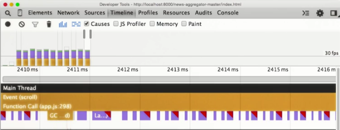

project_path: /web/_project.yaml
book_path: /web/_book.yaml
description: Fix juddering in list scrolling

  During scrolling in the main screen of the <a href="http://udacity.github.io/news-aggregator">live site</a>, you'll notice that the story list judders. Also, you'll see that the individual story point indicators (the circled numbers) not only change values, but also change color. This exercise is about identifying these problems and deciding how to approach them.

Let's see what's really happening when we scroll the main screen, using the 
Timeline. In DevTools, start a recording, scroll down the list a bit, and 
then stop the recording.

In the recording's results, notice that the frames are way over the 
30fps line, not even close to hitting 60fps. In fact, the frames are so slow 
that the 60fps line isn't even shown on the graph.

<figure>
  
</figure>

Zoom in on a frame and see that after the scroll event is a
function call, followed by many separate layout events.
Each separate layout event includes a red warning triangle.
This is a sure sign that a
<i>forced synchronous layout</i> is occurring.

<figure>
  
</figure>

# WARNING: This page has an include that should be a callout (i.e. a highlight.liquid, but it has no text - please fix this)

# WARNING: This page has a highlight.liquid include that wants to show a list but it's not supported on devsite. Please change this to text and fix the issue

<pre><code class="language-javascript" data-lang="javascript">var newWidth = container.offsetWidth;
divs.forEach(function(elem, index, arr) {
    elem.style.width = newWidth;
})</code></pre>

There are many CSS properties that cause layout to happen;
see a list of properties and their pipeline effects at
[CSS Triggers](http://csstriggers.com/).

Look at the details of a layout event, and you can see that the forced 
synchronous layout warning is being produced by the 
`colorizeAndScaleStories` function in `app.js`.

Let's examine that function.

<pre><code class="language-javascript" data-lang="javascript">function colorizeAndScaleStories() {
  var storyElements = document.querySelectorAll(&#39;.story&#39;);
  // It does seem awfully broad to change all the
  // colors every time!
  for (var s = 0; s &lt; storyElements.length; s++) {
    var story = storyElements[s];
    var score = story.querySelector(&#39;.story__score&#39;);
    var title = story.querySelector(&#39;.story__title&#39;);
    // Base the scale on the y position of the score.
    var height = main.offsetHeight;
    var mainPosition = main.getBoundingClientRect();
    var scoreLocation = score.getBoundingClientRect().top -
        document.body.getBoundingClientRect().top;
    var scale = Math.min(1, 1 - (0.05 * ((scoreLocation - 170) / height)));
    var opacity = Math.min(1, 1 - (0.5 * ((scoreLocation - 170) / height)));
    score.style.width = (scale * 40) + &#39;px&#39;;
    score.style.height = (scale * 40) + &#39;px&#39;;
    score.style.lineHeight = (scale * 40) + &#39;px&#39;;
    // Now figure out how wide it is and use that to saturate it.
    scoreLocation = score.getBoundingClientRect();
    var saturation = (100 * ((scoreLocation.width - 38) / 2));
    score.style.backgroundColor = &#39;hsl(42, &#39; + saturation + &#39;%, 50%)&#39;;
    title.style.opacity = opacity;
  }
}</code></pre>

Notice that `height`, `width`, and `line-height` are accessed, all of which 
which cause layout to run. Opacity is also set and -- while an opacity change 
doesn't trigger layout -- this line of code applies a new style, which 
triggers recalculate and, again, layout. These two techniques used in the 
function's main loop are causing the forced synchronous layout problem.

Next, consider the visual effect on the story point indicators, which doesn't 
add any informational value. We could achieve the effect with CSS properties 
instead of JavaScript, but we might be better off dropping the effect 
completely. The takeaway: sometimes the best code fix is code removal.

Let's remove the calls to the `colorizeAndScaleStories` function 
(at lines 89 and 305 in app.js), as well as the entire function itself 
(lines 255-286, shown above), so the story points will now look the same 
all the time.

Run the app again and take a Timeline recording of some scrolling activity, 
and then zoom in on a scroll event. This time, you'll see that there is only 
one style recalculation after the scroll, and that the frames are all well 
under the 60fps line, which is now shown on the graph.

<figure>
  
</figure>

The extra layouts and their forced synchronous layout warnings are gone, and 
frame rate is excellent. One jank problem solved!

