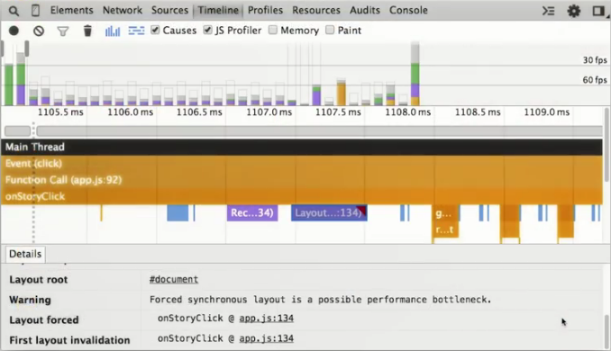

project_path: /web/_project.yaml
book_path: /web/_book.yaml
description: Fix forced synchronous layout.

  So far, you have certainly improved not only the overall performance of the 
  app, but you've addressed some specific performance issues, such as list 
  scrolling. Running the improved app, however, you can see there is still 
  some jank in the other major user interaction, story slide-in/out.

Let's examine this process. In the Timeline, turn on the JavaScript profiler, 
and take a Timeline recording while you click a story's headline to slide it 
in and then click the story's `X` button to slide it out. As you saw in 
[Exercise 3](step-03), the `onStoryClick` function is (still) causing a 
forced synchronous layout.

<figure>
  
</figure>

In that exercise, we put the `animate` function calls into a 
`requestAnimationFrame` which certainly helped but didn't eliminate the 
problem entirely.

Recall from our earlier discussion (and from your research at 
[CSS Triggers](http://csstriggers.com/)) that using specific properties 
cause specific parts of the rendering pipeline to occur. Let's take another 
look at `animate`.

<pre><code class="language-javascript" data-lang="javascript">function animate () {
  // Find out where it currently is.
  var storyDetailsPosition = storyDetails.getBoundingClientRect();
  // Set the left value if we don&#39;t have one already.
  if (left === null)
        left = storyDetailsPosition.left;
  // Now figure out where it needs to go.
  left += (0 - storyDetailsPosition.left) * 0.1;
  // Set up the next bit of the animation if there is more to do.
  if (Math.abs(left) &gt; 0.5)
        requestAnimationFrame(animate);
  else
        left = 0;
  // And update the styles. Wait, is this a read-write cycle?
  // I hope I don&#39;t trigger a forced synchronous layout!
  storyDetails.style.left = left + &#39;px&#39;;
}</code></pre>

Near the end of the function, the `left` property is set; this causes the 
browser to run layout. Shortly thereafter, the `style` property is set; this 
causes the browser to run recalculate styles. As you know, if this happens 
more than once in a frame, it will cause a forced synchronous layout -- and 
it's happening multiple times in this function.

The `animate` function is contained inside the `showStory` function and its 
sister function, `hideStory`, both of which update the same properties and 
cause a forced synchronous layout problem.

As we learned earlier in this codelab, sometimes the best code fix is 
code removal. Yes, the `showStory` and `hideStory` functions do their 
jobs, but they are just too complex for what should be a simple effect. 
So let's leave them for a moment and see if we can get the job done with 
CSS instead. Consider this CSS code.

<pre><code class="language-css" data-lang="css">.story-details {
  display: -webkit-flex;
  display: -ms-flexbox;
  display: flex;
  position: fixed;
  top: 0;
  left: 100%;
  width: 100%;
  height: 100%;
  background: white;
  z-index: 2;
  box-shadow: 0px 2px 7px 0px rgba(0, 0, 0, 0.10);
  overflow: hidden;
  transition: transform 0.3s;
  will-change: transform;
}

.story-details.visible {
  transform: translateX(-100vw);
}

.story-details.hidden {
  transform: translateX(0);
}</code></pre>

The first thing to notice in the `.story-details` class is that we set the 
`left` property to 100%; regardless of the screen width, this pushes the 
entire story element to the right, completely off the visible page, effectively 
hiding it.

Next, in the `.story-details.visible` and `.story-details.hidden` classes, 
we set up a `transform` in each one to force the X (horizontal) position to 
`-100vw` (*viewport width*) and 0, respectively. Upon application, these 
classes will relocate the story content into view or back to its original 
off-screen position.

Then, to make sure that the story's appearance actually looks like an 
animation and doesn't just abruptly snap in and out, we set up a `transition` 
on the `transform` to allow it 0.3s (33ms) to take place. This ensures a 
smooth slide-in/out visual effect.

Finally, we use the `will-change` property to notify the browser about the 
likely `transform` changes.

# WARNING: This page has an include that should be a callout (i.e. a highlight.liquid, but it has no text - please fix this)

# WARNING: This page has a highlight.liquid include that wants to show a list but it's not supported on devsite. Please change this to text and fix the issue

Returning to the `showStory` and `hideStory` functions, we can now greatly 
simplify them to just add or remove the new `visible` and `hidden classes, 
accomplishing the desired visual change without complex scripting.

<pre><code class="language-javascript" data-lang="javascript">function showStory(id) {
  if (!storyDetails)
    return;
  storyDetails.classList.add(&#39;visible&#39;);
  storyDetails.classList.remove(&#39;hidden&#39;);
}

function hideStory(id) {
  storyDetails.classList.add(&#39;hidden&#39;);
  storyDetails.classList.remove(&#39;visible&#39;);
}</code></pre>

All of this should have significant positive benefits on our app's story 
slide-in/out performance, but of course the only way to know for sure is to 
test it. Take another Timeline recording of sliding a story in and out, and 
have a look.

<figure>
  
</figure>

The app should perform much better; all the frames are now well below the 
60fps line, and the forced synchronous layout warnings are gone. Best of all, 
we no longer need to use JavaScript to perform the slide-in/out animation.

Our basic performance improvement work is done.

