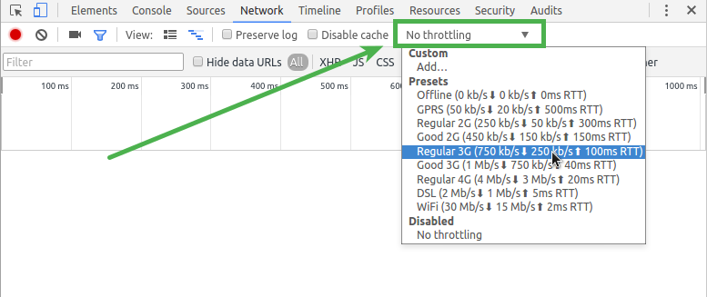
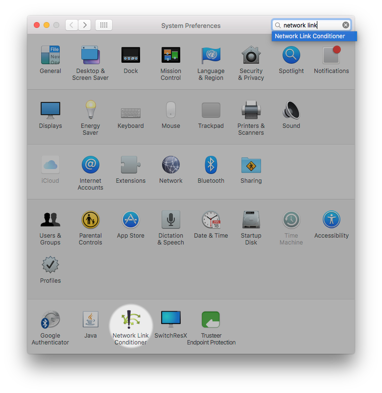
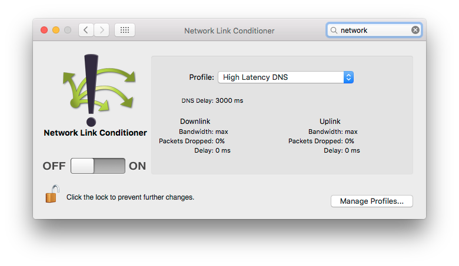
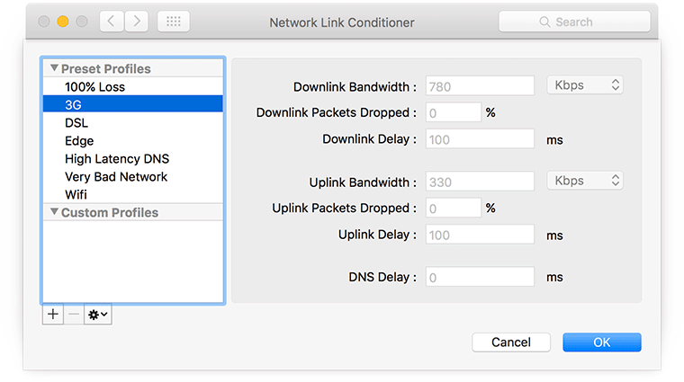
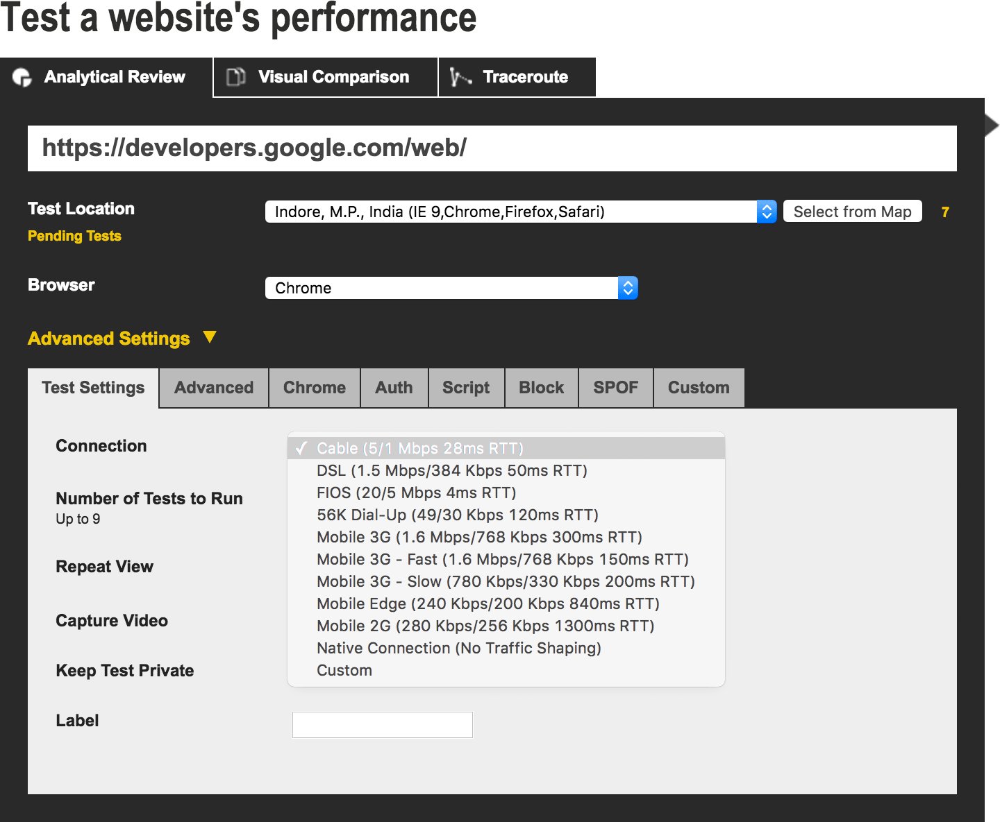
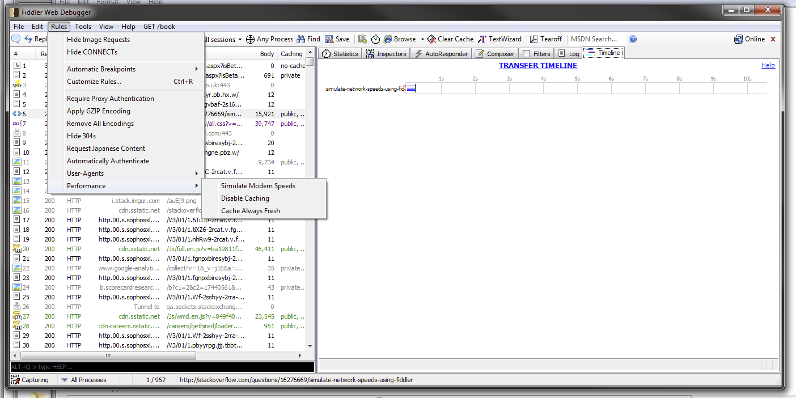
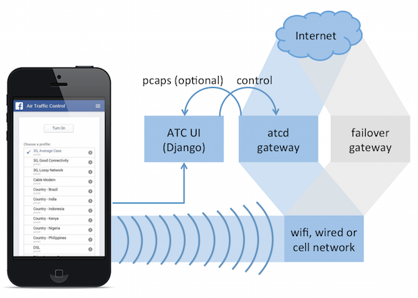
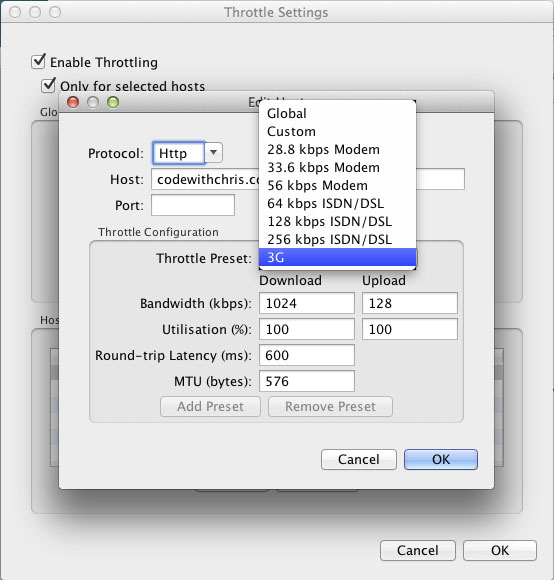
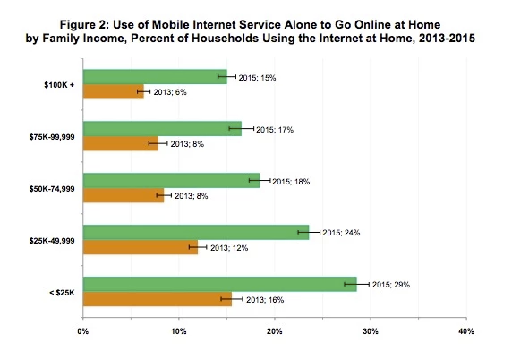

project_path: /web/fundamentals/_project.yaml
book_path: /web/fundamentals/_book.yaml
description: It's important to understand what using your app or site feels like when connectivity is poor or unreliable, and build accordingly. A range of tools can help you.

{# wf_updated_on: 2017-07-24 #}
{# wf_published_on: 2016-05-09 #}

# Understanding Low Bandwidth and High Latency {: .page-title }



It's important to understand what using your app or site feels like when connectivity is poor or unreliable, and build accordingly. A range of tools can help you.

## Test with low bandwidth and high latency {: #testing }

An <a href="http://adwords.blogspot.co.uk/2015/05/building-for-next-moment.html">increasing proportion</a> of people experience the web on mobile devices. Even at home, <a href="https://www.washingtonpost.com/news/the-switch/wp/2016/04/18/new-data-americans-are-abandoning-wired-home-internet/">many people are abandoning fixed broadband for mobile</a>.

In this context, it's important to understand what using your app or site feels like when connectivity is poor or unreliable. A range of software tools can help you [emulate and simulate](https://stackoverflow.com/questions/1584617/simulator-or-emulator-what-is-the-difference) low bandwidth and high [latency](https://www.igvita.com/2012/07/19/latency-the-new-web-performance-bottleneck/).

### Emulate network throttling

When building or updating a site, you must ensure adequate performance in a variety of connectivity conditions. Several tools can help.

#### Browser tools

[Chrome DevTools](/web/tools/chrome-devtools) lets you test your site with a
variety of upload/download speeds and [round-trip times][rtt], using presets
or custom settings from the Network panel. See [Get Started with Analyze
Network Performance](/web/tools/chrome-devtools/network-performance) to
learn the basics.

[rtt]: https://www.igvita.com/2012/07/19/latency-the-new-web-performance-bottleneck/

#### System tools

Network Link Conditioner is a preference panel available on Mac if you install [Hardware IO Tools](https://developer.apple.com/downloads/?q=Hardware%20IO%20Tools) for Xcode:

#### Device emulation

[Android Emulator](http://developer.android.com/tools/devices/emulator.html#netspeed) allows you to simulate various network conditions while running apps (including web browsers and hybrid web apps) on Android:

For iPhone, Network Link Conditioner can be used to simulate impaired network conditions (see above).

### Test from different locations and networks

Connectivity performance depends on server location as well as network type.

[WebPagetest](https://webpagetest.org) is an online service that enables a set of performance tests to be run for your site using a variety of networks and host locations. For example, you can try out your site from a server in India on a 2G network, or over cable from a city in the US.

Select a location and, from advanced settings, select a connection type. You can even automate testing using [scripts](https://sites.google.com/a/webpagetest.org/docs/using-webpagetest/scripting) (for example, to log in to a site) or using their [RESTful APIs](https://sites.google.com/a/webpagetest.org/docs/advanced-features/webpagetest-restful-apis). This helps you to include connectivity testing into build processes or performance logging.

[Fiddler](http://www.telerik.com/fiddler) supports Global proxying via [GeoEdge](http://www.geoedge.com/faq), and its custom rules can be used to simulate modem speeds:

### Test on an impaired network

Software and hardware proxies enable you to emulate problematic mobile network conditions, such as bandwidth throttling, packet delay, and random packet loss. A shared proxy or impaired network can enable a team of developers to incorporate real-world network testing in their workflow.

Facebook's [Augmented Traffic Control](http://facebook.github.io/augmented-traffic-control/) (ATC) is a BSD-licensed set of applications that can be used to shape traffic and emulate impaired network conditions:

> Facebook even instituted [2G Tuesdays](https://code.facebook.com/posts/1556407321275493/building-for-emerging-markets-the-story-behind-2g-tuesdays/) to help understand how people on 2G use their product. On Tuesdays, employees get a pop-up that gives them the option to simulate a 2G connection.

The [Charles](https://www.charlesproxy.com/){: .external } HTTP/HTTPS proxy can be used to [adjust bandwidth and latency](http://www.charlesproxy.com/documentation/proxying/throttling/). Charles is commercial software, but a free trial is available.

More information about Charles is available from [codewithchris.com](http://codewithchris.com/tutorial-using-charles-proxy-with-your-ios-development-and-http-debugging/).

## Handle unreliable connectivity and "lie-fi" {: #lie-fi }

### What is lie-fi?

The term <a href="http://www.urbandictionary.com/define.php?term=lie-fi">lie-fi</a> dates back to at least 2008 (when phones looked like <a href="https://www.mobilegazette.com/2008-phones-wallchart.htm" title="Images of phones from 2008">this</a>), and refers to connectivity that isn't what it seems. Your browser behaves as if it has connectivity when, for whatever reason, it doesn't.

Misinterpreted connectivity can result in a poor experience as the browser (or JavaScript) persists in trying to retrieve resources rather than giving up and choosing a sensible fallback. Lie-fi can actually be worse than offline; at least if a device is definitely offline, your JavaScript can take appropriate evasive action.

Lie-fi is likely to become a bigger problem as more people move to mobile and away from fixed broadband. Recent [US Census data](https://www.ntia.doc.gov/blog/2016/evolving-technologies-change-nature-internet-use) shows a [move away from fixed broadband](https://www.washingtonpost.com/news/the-switch/wp/2016/04/18/new-data-americans-are-abandoning-wired-home-internet/). The following chart shows the use of mobile internet at home in 2015 compared with 2013:

### Use timeouts to handle intermittent connectivity

In the past, [hacky methods using XHR](http://stackoverflow.com/questions/189430/detect-that-the-internet-connection-is-offline) have been used to test for intermittent connectivity, but service worker enables more reliable methods to set network timeouts. Jeff Posnick explains how to achieve this using [sw-toolbox](https://github.com/GoogleChrome/sw-toolbox) timeouts in his talk [Instant Loading with Service Workers](https://youtu.be/jCKZDTtUA2A?t=19m58s):

    toolbox.router.get(
      '/path/to/image',
      toolbox.networkFirst,
      {networkTimeoutSeconds: 3}
    );
    

A [timeout option](https://github.com/whatwg/fetch/issues/20) is also planned for the [Fetch API](https://developer.mozilla.org/en-US/docs/Web/API/GlobalFetch/fetch), and the [Streams API](https://www.w3.org/TR/streams-api/) should help by optimizing content delivery and avoiding monolithic requests. Jake Archibald gives more details about tackling lie-fi in [Supercharging page load](https://youtu.be/d5_6yHixpsQ?t=6m42s).
