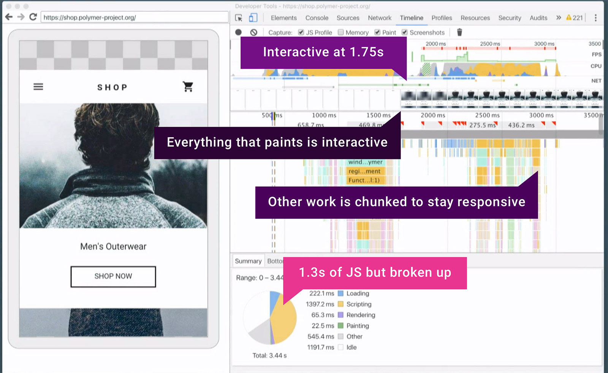

project_path: /web/fundamentals/_project.yaml
book_path: /web/fundamentals/_book.yaml

{# wf_updated_on: 2016-09-28 #}
{# wf_published_on: 2016-09-28 #}
{# wf_blink_components: Blink>Network,Blink>Loader #}

# The PRPL Pattern {: .page-title }



Dogfood: PRPL is a new pattern we feel has great potential. At this stage,
we welcome experimentation with it while we iterate on the ideas in the
pattern and collect more data on where it offers the greatest benefits.

The mobile web is too slow. Over the years the web has evolved from a
document-centric platform to a first-class application platform. Thanks to
advancements in the platform itself (such as
[Service Workers](/web/fundamentals/getting-started/primers/service-workers)) and in the tools
and techniques we use to build apps, users can do virtually anything on the web
they can do in a native app.

At the same time, the bulk of our computing has moved from powerful desktop
machines with fast, reliable network connections to relatively underpowered
mobile devices with connections that are often slow, flaky or both. This is
especially true in parts of the world where the next billion users are coming
online.

Unfortunately, the patterns we devised for building and deploying powerful,
feature-rich web apps in the desktop era generally yield apps that take far too
long to load on mobile devices – so long that many users simply give up.

This presents an opportunity to craft new patterns that take advantage of modern
web platform features to granularly deliver mobile web experiences more quickly.
PRPL is one such pattern.

## The PRPL pattern

PRPL is a pattern for structuring and serving Progressive Web Apps (PWAs), with
an emphasis on the performance of app delivery and launch. It stands for:

*  **Push** critical resources for the initial URL route.
*  **Render** initial route.
*  **Pre-cache** remaining routes.
*  **Lazy-load** and create remaining routes on demand.

Beyond targeting the fundamental goals and standards of PWAs, PRPL strives to
optimize for:

* Minimum time-to-interactive
    * Especially on first use (regardless of entry point)
    * Especially on real-world mobile devices
* Maximum caching efficiency, especially over time as updates are released
* Simplicity of development and deployment

PRPL is inspired by a suite of modern web platform features, but it’s possible
to apply the pattern without hitting every letter in the acronym or using every
feature.

In fact, PRPL is more about a mindset and a long-term vision for improving the
performance of the mobile web than it is about specific technologies or
techniques. The ideas behind PRPL are not new, but the approach was framed and
named by the Polymer team and unveiled at [Google I/O
2016](https://www.youtube.com/watch?v=J4i0xJnQUzU).

Polymer's [Shop](https://shop.polymer-project.org) e-commerce demo is a
first-class example of an application using PRPL to granularly serve resources.
It achieves interactivity for each route incredibly quickly on real-world mobile
devices:

For most real-world projects, it’s frankly too early to realize the PRPL vision
in its purest, most complete form – but it’s definitely not too early to adopt
the mindset, or to start chasing the vision from various angles. There are many
practical steps that app developers, tool developers and browser vendors can
take in pursuit of PRPL today.

## App structure

PRPL can work well if you have a single-page app (SPA) with the following
structure:

-   The main _entrypoint_ of the application which is served from every valid
    route. This file should be very small, since it will be served from
    different URLs and therefore be cached multiple times. All resource URLs
    in the entrypoint need to be absolute, since it may be served from
    non-top-level URLs.

-   The _shell_ or app-shell, which includes the top-level app logic, router,
    and so on.

-   Lazily loaded _fragments_ of the app. A fragment can represent the code for
    a particular view, or other code that can be loaded lazily (for example,
    parts of the main app not required for first paint, like menus that aren't
    displayed until a user interacts with the app). The shell is responsible for
    dynamically importing the fragments as needed.

The server and service worker together work to precache the resources for the
inactive routes.

When the user switches routes, the app lazy-loads any required resources that
haven't been cached yet, and creates the required views. Repeat visits to routes
should be immediately interactive. Service Worker helps a lot here.

The diagram below shows the components of a simple app that might be structured
using [Web Components](http://webcomponents.org/):

Note: although HTML Imports are Polymer's preferred bundling strategy, you can
use code-splitting and route-based chunking to achieve a similar setup with
modern JavaScript module bundlers.

In this diagram, the solid lines represent _static dependencies_: external
resources identified in the files using `<link>` and `<script>` tags. Dotted
lines represent _dynamic_ or _demand-loaded dependencies_: files loaded as
needed by the shell.

The build process builds a graph of all of these dependencies, and the server
uses this information to serve the files efficiently. It also builds a set of
vulcanized bundles, for browsers that don't support HTTP/2.

### App entrypoint

The entrypoint must import and instantiate the shell, as well as conditionally
load any required polyfills.

The main considerations for the entrypoint are:

-   Has minimal static dependencies, in other words, not much beyond the app-shell itself.
-   Conditionally loads required polyfills.
-   Uses absolute paths for all dependencies.

### App shell

The shell is responsible for routing and usually includes the main navigation UI
for the app.

The app should lazy-load fragments as they're required. For example, when the
user changes to a new route, it imports the fragment(s) associated with that
route. This may initiate a new request to the server, or simply load the
resource from the cache.

The shell (including its static dependencies) should contain everything needed
for first paint.

## Build output

Although it isn't a hard requirement for using PRPL, your build process could
produce two builds:

-   An unbundled build designed for server/browser combinations that support
    HTTP/2 to deliver the resources the browser needs for a fast first paint
    while optimizing caching. The delivery of these resources can be triggered
    efficiently using [`<link rel="preload">`][Resource hints] or [HTTP/2 Push].

-   A bundled build designed to minimize the number of round-trips required to
    get the application running on server/browser combinations that don't support
    server push.

Your server logic should deliver the appropriate build for each browser.

### Bundled build

For browsers that don't handle HTTP/2, the build process could produce a set
of different bundles: one bundle for the shell, and one bundle for each
fragment. The diagram below shows how a simple app would be bundled, again using
Web Components:

Any dependency shared by two or more fragments is bundled with the shell and
its static dependencies.

Each fragment and its _unshared_ static dependencies are bundled into a single
bundle. The server should return the appropriate version of the fragment
(bundled or unbundled), depending on the browser. This means that the shell code
can lazy-load `detail-view.html` _without having to know whether it is bundled
or unbundled_. It relies on the server and browser to load the dependencies in
the most efficient way.

## Background: HTTP/2 and HTTP/2 server push

[HTTP/2] allows _multiplexed_ downloads over a single
connection, so that multiple small files can be downloaded more efficiently.

[HTTP/2 server push][HTTP/2 Push] allows the server
to preemptively send resources to the browser.

For an example of how HTTP/2 server push speeds up downloads, consider how the
browser retrieves an HTML file with a linked stylesheet.

In HTTP/1:

*   The browser requests the HTML file.
*   The server returns the HTML file and the browser starts parsing it.
*   The browser encounters the `<link rel="stylesheet">` tag, and starts a new
    request for the stylesheet.
*   The browser receives the stylesheet.

With HTTP/2 push:

*   The browser requests the HTML file.
*   The server returns the HTML file, and pushes the stylesheet at the same
    time.
*   The browser starts parsing the HTML. By the time it encounters the `<link
    rel="stylesheet">`, the stylesheet is already in the cache.

In the simplest case, HTTP/2 server push eliminates a single HTTP
request-response.

With HTTP/1, developers bundle resources to reduce the number of HTTP
requests required to render a page. However, bundling can reduce the efficiency
of the browser's cache. if resources for each page are combined into a single
bundle, each page gets its own bundle, and the browser can't identify shared
resources.

The combination of HTTP/2 and HTTP/2 server push provides the _benefits_ of
bundling (reduced latency) without actual bundling. Keeping resources separate
means they can be cached efficiently and be shared between pages.

HTTP/2 Push needs to be utilized with care, as it forces data to the browser,
even if the file is already in the browser’s local cache or bandwidth is
already saturated. If done wrong, performance can suffer.
[`<link rel="preload">`][Resource hints] might be a good alternative to allow
the browser to make smart decisions about the prioritization of these requests.

## Conclusion

Loading the code for routes more granularly and allowing browsers to schedule
work better has the potential to greatly aid reaching interactivity in
our applications sooner. We need **better architectures that enable
interactivity quickly** and the PRPL pattern is an interesting example of how
to accomplish this goal on real mobile devices.

It’s all about headroom and giving yourself enough once you’re done loading your
abstractions. If tapping on a link is delayed by seconds of script that prevents
input events from dispatching, that’s a strong indication there is work to be
done on performance. This is a common problem with applications built using
larger JavaScript libraries today, where UI is rendered that looks like it
should work but does not.

PRPL can help deliver the minimal functional code needed to make the route your
users land on interactive, addressing this challenge.

[HTTP/2]: /web/fundamentals/performance/http2/
[Resource hints]: https://developers.google.com/web/updates/2016/03/link-rel-preload
[HTTP/2 Push]: /web/fundamentals/performance/http2/#server-push
