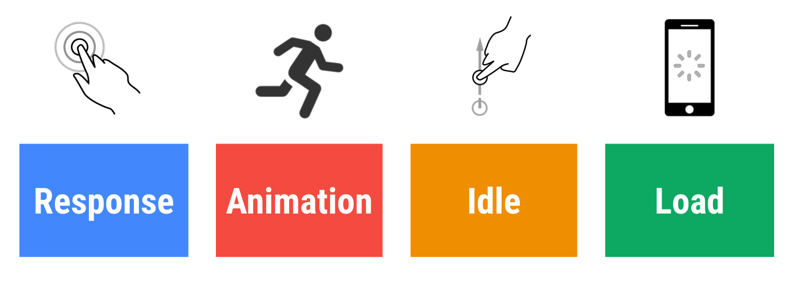

project_path: /web/fundamentals/_project.yaml
book_path: /web/fundamentals/_book.yaml
description: RAIL is a user-centric performance model. Every web app has these four distinct aspects to its life cycle, and performance fits into them in very different ways: Response, Animation, Idle, Load.

{# wf_updated_on: 2017-04-24 #}
{# wf_published_on: 2015-06-07 #}

# Measure Performance with the RAIL Model {: .page-title }



RAIL is a user-centric performance model. Every web app has these four distinct aspects to its life cycle, and performance fits into them in different ways:

### TL;DR {: .hide-from-toc }

- Focus on the user; the end goal isn't to make your site perform fast on any specific device, it's to ultimately make users happy.
- Respond to users immediately; acknowledge user input in under 100ms.
- When animating or scrolling, produce a frame in under 10ms.
- Maximize main thread idle time.
- Keep users engaged; deliver interactive content in under 1000ms.

## Focus on the user

Make users the focal point of your performance effort.
The majority of time users spend in your site isn't waiting for it to load,
but waiting for it to respond while using it.
Understand how users perceive performance delays:

<table class="responsive">
  <thead>
      <th colspan="2">Delay &amp; User Reaction</th>
  </thead>
  <tbody>
    <tr>
      <td data-th="Delay">0 - 16ms</td>
      <td data-th="User Reaction">People are exceptionally good at tracking
      motion, and they dislike it when animations aren't smooth. Users
      perceive animations as smooth so long as 60 new frames are rendered
      every second. That's 16ms per frame, including the time it takes for
      the browser to paint the new frame to the screen, leaving an app
      about 10ms to produce a frame.</td>
    </tr>
    <tr>
      <td data-th="Delay">0 - 100ms</td>
      <td data-th="User Reaction">Respond to a user action within this time window and users feel like the result is immediate. Any longer, and the connection between action and reaction is broken.</td>
    </tr>
    <tr>
      <td data-th="Delay">100 - 300ms</td>
      <td data-th="User Reaction">Users experience a slight perceptible delay.</td>
    </tr>
    <tr>
      <td data-th="Delay">300 - 1000 ms</td>
      <td data-th="User Reaction">Within this window, things feel part of a natural and continuous progression of tasks. For most users on the web, loading pages or changing views represents a task.</td>
    </tr>
    <tr>
      <td data-th="Delay">1000+ms</td>
      <td data-th="User Reaction">Beyond 1 second, the user loses focus on the task they are performing.</td>
    </tr>
    <tr>
      <td data-th="Delay">10,000+ms</td>
      <td data-th="User Reaction">The user is frustrated and is likely to abandon the task; they may or may not come back later.</td>
    </tr>
  </tbody>
</table>

## Response: respond in under 100ms {: #response }

You have 100ms to respond to user input before they notice a lag.
This applies to most inputs, such as clicking buttons, toggling form
controls, or starting animations. This does not apply to touch drags or
scrolls.

If you don't respond, the connection between action and reaction is broken. Users will notice.

While it may seem obvious to respond to user's actions immediately,
that's not always the right call.
Use this 100ms window to do other expensive work, but be careful not to block the user.
If possible, do work in the background.

For actions that take longer than 500ms to complete, always provide feedback.

## Animation: produce a frame in 10ms {: #animation }

Animations aren't just fancy UI effects. For example, scrolling and touch
drags are types of animations.

Users notice when the animation frame rate varies.
Your goal is to produce 60 frames per second, and every frame has to go through all of these steps:

From a purely mathematical point of view, every frame has a budget of about 
16ms (1000ms / 60 frames per second = 16.66ms per frame). However, because
browsers need some time to paint the new frame to the screen, **your code
should finish executing in under 10ms**. 

In high pressure points like animations, the key is to do nothing where you
can, and the absolute minimum where you can't. Whenever possible, make use of
the 100ms response to pre-calculate expensive work so that you maximize your
chances of hitting 60fps.

For more information, see
[Rendering Performance](/web/fundamentals/performance/rendering/).

## Idle: maximize idle time {: #idle }

Use idle time to complete deferred work. For example, keep pre-load data to a minimum so that your app loads fast, and use idle time to load remaining data.

Deferred work should be grouped into blocks of about 50ms. Should a user begin interacting, then the highest priority is to respond to that. 

To allow for <100ms response,
the app must yield control back to main thread every <50ms,
such that it can execute its pixel pipeline, react to user input, and so on.

Working in 50ms blocks allows the task to finish while still ensuring instant response.

## Load: deliver content under 1000ms {: #load }

Load your site in under 1 second. If you don't, user attention wanders,
and their perception of dealing with the task is broken.

Focus on
[optimizing the critical rendering path](/web/fundamentals/performance/critical-rendering-path/)
to unblock rendering.

You don't have to load everything in under 1 second to produce the perception of a complete load. Enable progressive rendering and do some work in the background. Defer non-essential loads to periods of idle time (see this [Website Performance Optimization Udacity course](https://www.udacity.com/course/website-performance-optimization--ud884) for more information).

## Summary of key RAIL metrics

To evaluate your site against RAIL metrics, use the Chrome DevTools [Timeline tool](/web/tools/chrome-devtools/profile/evaluate-performance/timeline-tool) to record user actions. Then check the recording times in the Timeline against these key RAIL metrics:

<table>
  <thead>
      <th>RAIL Step</th>
      <th>Key Metric</th>
      <th>User Actions</th>
  </thead>
  <tbody>
    <tr>
      <td data-th="RAIL Step"><strong>Response</strong></td>
      <td data-th="Key Metric">Input latency (from tap to paint) < 100ms.</td>
      <td data-th="User Test">User taps a button (for example, opening navigation).</td>
    </tr>
    <tr>
      <td data-th="RAIL Step"><strong>Animation</strong></td>
      <td data-th="Key Metric">Each frame's work (from JS to paint) completes < 16ms.</td>
      <td data-th="User Test">User scrolls the page, drags a finger (to open
        a menu, for example), or sees an animation. When dragging, the app's
        response is bound to the finger position, such as pulling to refresh,
        or swiping a carousel. This metric applies only to the continuous
        phase of drags, not the start.
      </td>
    </tr>
    <tr>
      <td data-th="RAIL Step"><strong>Idle</strong></td>
      <td data-th="Key Metric">Main thread JS work chunked no larger than 50ms.</td>
      <td data-th="User Test">User isn't interacting with the page, but main thread should be available enough to handle the next user input.</td>
    </tr>
    <tr>
      <td data-th="RAIL Step"><strong>Load</strong></td>
      <td data-th="Key Metric">Page considered ready to use in 1000ms.</td>
      <td data-th="User Test">User loads the page and sees the critical path content.</td>
    </tr>
  </tbody>
</table> 

