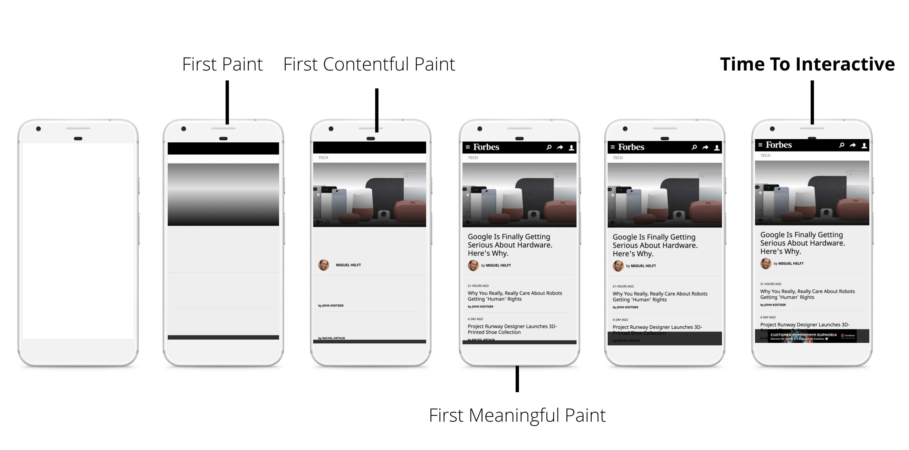
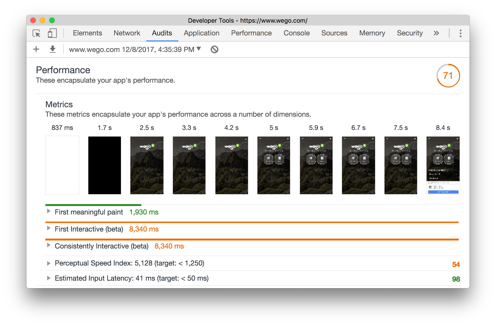
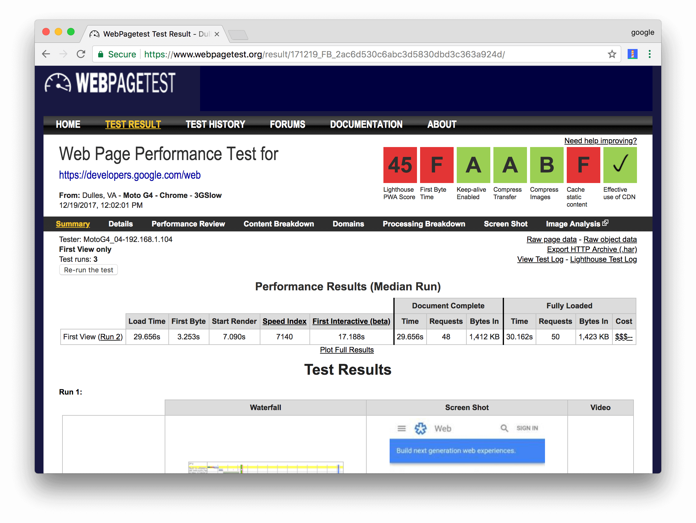

project_path: /web/fundamentals/_project.yaml
book_path: /web/fundamentals/_book.yaml
description: RAIL is a user-centric performance model. Every web app has these four distinct aspects to its life cycle, and performance fits into them in different ways: Response, Animation, Idle, Load.

{# wf_updated_on: 2018-01-08 #}
{# wf_published_on: 2015-06-07 #}
{# wf_blink_components: Blink>PerformanceAPIs,Blink>JavaScript>Runtime,Blink>Input #}

# Measure Performance with the RAIL Model {: .page-title }





**RAIL** is a **user-centric** performance model that breaks down the user's
experience into key actions. RAIL's [**goals** and **guidelines**](#goals-and-guidelines) aim to
help developers and designers ensure a good user experience for each of these actions. By
laying out a structure for thinking about performance, RAIL enables designers and developers to
reliably target the work that has the highest impact on user experience.

Every web app has four distinct aspects to its life cycle, and performance fits into them in
different ways:

<figure>
  
  <figcaption>
    <b>Figure 1</b>. The 4 parts of the RAIL performance model
  </figcaption>
</figure>

## Goals and guidelines {: #goals-and-guidelines }

In the context of RAIL, the terms **goals** and **guidelines** have specific meanings:

* **Goals**. Key performance metrics related to user experience. Since human perception is
  relatively constant, these goals are unlikely to change any time soon.
* **Guidelines**. Recommendations that help you achieve goals. These may be specific to current
  hardware and network connection conditions, and therefore may change over time.

## Focus on the user {: #ux }

Make users the focal point of your performance effort. The table below describes key metrics of
how users perceive performance delays:

<table class="responsive">
  <thead>
      <th colspan="2">User Perception Of Performance Delays</th>
  </thead>
  <tbody>
    <tr>
      <td data-th="Delay">0 to 16ms</td>
      <td data-th="User Reaction">Users are exceptionally good at tracking motion, and they
      dislike it when animations aren't smooth. They perceive animations as smooth so long as
      60 new frames are rendered every second. That's 16ms per frame, including the time it
      takes for the browser to paint the new frame to the screen, leaving an app about 10ms to
      produce a frame.</td>
    </tr>
    <tr>
      <td data-th="Delay">0 to 100ms</td>
      <td data-th="User Reaction">Respond to user actions within this time window and users
      feel like the result is immediate. Any longer, and the connection between action and
      reaction is broken.</td>
    </tr>
    <tr>
      <td data-th="Delay">100 to 300ms</td>
      <td data-th="User Reaction">Users experience a slight perceptible delay.</td>
    </tr>
    <tr>
      <td data-th="Delay">300 to 1000ms</td>
      <td data-th="User Reaction">Within this window, things feel part of a natural and
      continuous progression of tasks. For most users on the web, loading pages or changing
      views represents a task.</td>
    </tr>
    <tr>
      <td data-th="Delay">1000ms or more</td>
      <td data-th="User Reaction">Beyond 1000 milliseconds (1 second), users lose focus on
      the task they are performing.</td>
    </tr>
    <tr>
      <td data-th="Delay">10000ms or more</td>
      <td data-th="User Reaction">Beyond 10000 milliseconds (10 seconds), users are frustrated
      and are likely to abandon tasks. They may or may not come back later.</td>
    </tr>
  </tbody>
</table>

Users perceive performance delays differently, depending on network conditions and hardware.
For example, loading an experience in 1000ms is plausible on a powerful desktop machine over a
fast Wi-Fi connection, so users have grown accustomed to a 1000ms loading experience. But for
mobile devices over slow 3G connections, loading in 5000ms is a more realistic goal, so mobile
users are generally more patient.

## Response: respond in under 50ms {: #response }

**Goal**: Complete a transition initiated by user input within 100ms. Users spend the majority
of their time waiting for sites to respond to their input, not waiting for the sites to load.

**Guidelines**:

* Respond to user input within 50ms, or else the connection between action and
  reaction is broken. This applies to most inputs, such as clicking buttons, toggling form
  controls, or starting animations. This does not apply to touch drags or scrolls.
* Though it may sound counterintuitive, it's not always the right call to respond to user
  input immediately. You can use this 100ms window to do other expensive work. But be
  careful not to block the user. If possible, do work in the background.
* For actions that take longer than 50ms to complete, always provide feedback.

## Animation: produce a frame in 10ms {: #animation }

**Goals**: 

* Produce each frame in an animation in 10ms or less. Technically, the maximum budget for
  each frame is 16ms (1000ms / 60 frames per second ≈ 16ms), but browsers need about 6ms to
  render each frame, hence the guideline of 10ms per frame.
* Aim for visual smoothness. Users notice when frame rates vary.

**Guidelines**:

* In high pressure points like animations, the key is to do nothing where you
  can, and the absolute minimum where you can't. Whenever possible, make use of
  the 100ms response to pre-calculate expensive work so that you maximize your
  chances of hitting 60fps.
* See <a href="/web/fundamentals/performance/rendering/">Rendering Performance</a>
  for various animation optimization strategies.
* Recognize all the types of animations. Animations aren't just fancy UI effects. Each of these
  interactions are considered animations:
    * Visual animations, such as entrances and exits, 
      <a href="https://www.webopedia.com/TERM/T/tweening.html">tweens</a>, and loading indicators.
    * Scrolling. This includes flinging, which is when the user starts scrolling, then lets go,
      and the page continues scrolling.
    * Dragging. Animations often follow user interactions, such as panning a map or pinching to
      zoom.

## Idle: maximize idle time {: #idle }

**Goal**: Maximize idle time to increase the odds that the page responds to user input within
50ms.

**Guidelines**: 

* Use idle time to complete deferred work. For example, for the initial page load, load as little
  data as possible, then use idle time to load the rest.
* Perform work during idle time in 50ms or less. Any longer, and you risk interfering with the
  app's ability to respond to user input within 50ms.
* If a user interacts with a page during idle time work, the user interaction should always
  take the highest priority and interrupt the idle time work.

## Load: deliver content and become interactive in under 5 seconds {: #load }

When pages load slowly, user attention wanders, and users perceive the task as broken. Sites
that load quickly have longer average sessions, lower bounce rates, and higher ad viewability.
See [The Need For Mobile Speed: How Mobile Latency Impacts Publisher Revenue][NEED4SPEED].

[NEED4SPEED]: https://www.doubleclickbygoogle.com/articles/mobile-speed-matters/

**Goals**: 

* Optimize for fast loading performance relative to the device and network capabilities that
  your users use to access your site. Currently, a good target for first loads is to load the
  page and be [interactive][tti] in 5 seconds or less on mid-range mobile devices with slow
  3G connections. See [Can You Afford It? Real-World Web Performance Budgets][Budgets]. But be
  aware that these targets may change over time.
* For subsequent loads, a good target is to load the page in under 2 seconds. But this target
  may also change over time.

<figure>
  
  <figcaption>
    <b>Figure 2</b>. Each loading metric represents a different phase of the user's perception of
    the loading experience
  </figcaption>
</figure>

[tti]: /web/tools/lighthouse/audits/time-to-interactive

**Guidelines**:

* Test your load performance on the mobile devices and network connections that are common
  among your users. If your business has information on what devices and network connections your
  users are on, then you can use that combination and set your own loading performance targets. 
  Otherwise, [The Mobile Economy 2017][ME17] suggests that a good global baseline is a
  mid-range Android phone, such as a Moto G4, and a slow 3G network, defined as 400ms RTT and
  400kbps transfer speed. This combination is available on [WebPageTest][WPT].
* Keep in mind that although your typical mobile user's device might claim that it's on a 2G, 3G,
  or 4G connection, in reality the *effective connection speed* is often significantly slower,
  due to packet loss and network variance.
* Focus on optimizing the [Critical Rendering Path][CRP] to unblock rendering.
* You don't have to load everything in under 5 seconds to produce the perception of a complete
  load. Enable progressive rendering and do some work in the background. Defer non-essential
  loads to periods of idle time. See [Website Performance Optimization][Udacity].
* Recognize the factors that affect page load performance:
    * Network speed and latency
    * Hardware (slower CPUs, for example)
    * Cache eviction
    * Differences in L2/L3 caching
    * Parsing JavaScript

[ME17]: https://www.gsma.com/mobileeconomy/
[WPT]: https://www.webpagetest.org/easy
[CRP]: /web/fundamentals/performance/critical-rendering-path/
[Udacity]: https://www.udacity.com/course/website-performance-optimization--ud884
[Budgets]: https://infrequently.org/2017/10/can-you-afford-it-real-world-web-performance-budgets/

## Tools for measuring RAIL {: #tools }

There are a few tools to help you automate your RAIL measurements. Which one you use depends
on what type of information you need, and what type of workflow you prefer:

* [**Chrome DevTools**](#devtools). The developer tools built into Google Chrome. Provides
  in-depth analysis on everything that happens while your page loads or runs.
* [**Lighthouse**](#lighthouse). Available in Chrome DevTools, as a Chrome Extension, as a
  Node.js module, and within WebPageTest.
  You give it a URL, it simulates a mid-range device with a slow 3G connection, runs a
  series of audits on the page, and then gives you a report on load performance, as well
  as suggestions on how to improve. Also provides audits to improve
  accessibility, make the page easier to maintain, qualify as a Progressive Web App, and more.
* [**WebPageTest**](#webpagetest). Available at
  [webpagetest.org/easy](https://webpagetest.org/easy). You give
  it a URL, it loads the page on a real Moto G4 device with a slow 3G connection, and then gives
  you a detailed report on the page's load performance. You can also configure it to include a
  Lighthouse audit.

The sections below give you more information on how to use each tool to measure RAIL.

### Chrome DevTools {: #devtools }

The **Performance** panel is the main place to analyze your RAIL metrics. See [Get Started With
Analyzing Runtime Performance][cdt-runtime] to get familiar with the **Performance** panel UI.
The workflow and UI for analyzing load performance is mostly the same, the only difference is how
you start and stop the recording. See [Record load performance][cdt-load].

[cdt-runtime]: /web/tools/chrome-devtools/evaluate-performance/
[cdt-load]: /web/tools/chrome-devtools/evaluate-performance/reference#record-load

The following DevTools features are especially relevant:

* [Throttle your CPU][CPU] to simulate a less-powerful device.
* [Throttle the network][Net] to simulate slower connections.
* [View main thread activity][main] to view every event that occurred on the main thread while
  you were recording.
* [View main thread activities in a table][table] to sort activities based on which ones took
  up the most time.
* [Analyze frames per second (FPS)][FPS] to measure whether your animations truly run smoothly.
* [Monitor CPU usage, JS heap size, DOM nodes, layouts per second, and more][PM] in real-time
  with the **Performance Monitor**.
* [Vizualize network requests][NW] that occurred while you were recording with the
  **Network** section.
* [Capture screenshots while recording][screenshots] to play back exactly how the page looked
  while the page loaded, or an animation fired, and so on.
* [View interactions][interactions] to quickly identify what happened on a page after a user
  interacted with it.
* [Find scroll performance issues in real-time][scroll-issues] by highlighting the page whenever
  a potentially problematic listener fires.
* [View paint events in real-time][paint-issues] to identify costly paint events that may be
  harming the performance of your animations.

[CPU]: /web/tools/chrome-devtools/evaluate-performance/reference#cpu-throttle
[Net]: /web/tools/chrome-devtools/evaluate-performance/reference#network-throttle
[main]: /web/tools/chrome-devtools/evaluate-performance/reference#main
[table]: /web/tools/chrome-devtools/evaluate-performance/reference#activities
[FPS]: /web/tools/chrome-devtools/evaluate-performance/reference#fps
[PM]: /web/updates/2017/11/devtools-release-notes#perf-monitor
[NW]: /web/tools/chrome-devtools/evaluate-performance/reference#network
[screenshots]: /web/tools/chrome-devtools/evaluate-performance/reference#screenshots
[interactions]: /web/tools/chrome-devtools/evaluate-performance/reference#interactions
[scroll-issues]: /web/tools/chrome-devtools/evaluate-performance/reference#scrolling-performance-issues
[paint-issues]: /web/tools/chrome-devtools/evaluate-performance/reference#paint-flashing

### Lighthouse {: #lighthouse }

See [Get started](/web/tools/lighthouse/#get-started) to learn how to set up and run Lighthouse.

<figure>
  
  <figcaption>
    <b>Figure 3</b>. An example Lighthouse report
  </figcaption>
</figure>

The following audits are especially relevant:

* **Response**
    * [Estimated Input Latency][EIL]. Estimates how long your app will take to respond to user
      input, based on main thread idle time.
    * [Uses Passive Event Listeners To Improve Scrolling][PEL].
* **Load**
    * [Registers A Service Worker][SW]. A service worker can cache common resources on a user's
      device, reducing time spent fetching resources over the network.
    * [Page Load Is Fast Enough On 3G][3G].
    * [First Meaningful Paint][FMP]. Measures when the page appears meaningfully complete.
    * [First Interactive][FI]. Measures when a user can first interact with some page elements.
    * [Consistently Interactive][CI]. Measures when a user can consistently interact with all
      page elements.
    * [Perceptual Speed Index][PSI].
    * [Reduce Render-Blocking Resources][RB].
    * [Offscreen Images][OI]. Defer the loading of offscreen images until they're needed.
    * [Properly Size Images][PSImages]. Don't serve images that are significantly larger than
      the size that's rendered in the mobile viewport.
    * [Critical Request Chains][CRC]. Vizualize your [Critical Rendering Path][CRP].
    * [Uses HTTP/2][HTTP2].
    * [Optimize Images][OptI].
    * [Enable Text Compression][ETC].
    * [Avoid Enormous Network Payloads][AENP].
    * [Uses An Excessive DOM Size][DOM]. Reduce network bytes by only shipping DOM nodes that are
      needed for rendering the page.

[EIL]: /web/tools/lighthouse/audits/estimated-input-latency
[PEL]: /web/tools/lighthouse/audits/passive-event-listeners
[SW]: /web/tools/lighthouse/audits/registered-service-worker
[3G]: /web/tools/lighthouse/audits/fast-3g
[FMP]: /web/tools/lighthouse/audits/first-meaningful-paint
[FI]: /web/tools/lighthouse/audits/first-interactive
[CI]: /web/tools/lighthouse/audits/consistently-interactive
[PSI]: /web/tools/lighthouse/audits/speed-index
[RB]: /web/tools/lighthouse/audits/blocking-resources
[OI]: /web/tools/lighthouse/audits/offscreen-images
[PSImages]: /web/tools/lighthouse/audits/oversized-images
[CRC]: /web/tools/lighthouse/audits/critical-request-chains
[HTTP2]: /web/tools/lighthouse/audits/http2
[OptI]: /web/tools/lighthouse/audits/optimize-images
[ETC]: /web/tools/lighthouse/audits/text-compression
[AENP]: /web/tools/lighthouse/audits/network-payloads
[DOM]: /web/tools/lighthouse/audits/dom-size

### WebPageTest {: #webpagetest }

Enter a URL at [webpagetest.org/easy](https://webpagetest.org/easy) to get a report on how that
page loads on a real mid-range Android device with a slow 3G connection.

<figure>
  
  <figcaption>
    <b>Figure 4</b>. An example WebPageTest report
  </figcaption>
</figure>

## Summary {: #summary }

RAIL is a lens for looking at a website's user experience as a journey composed of distinct
interactions. Understand how users perceive your site in order to set performance goals with the
greatest impact on user experience.

* **Focus on the user**.
* **Respond to user input in under 100ms**.
* **Produce a frame in under 10ms when animating or scrolling**.
* **Maximize main thread idle time**.
* **Load interactive content in under 5000ms**.
