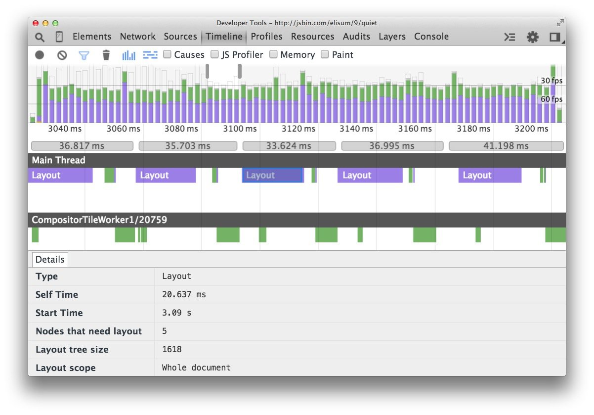
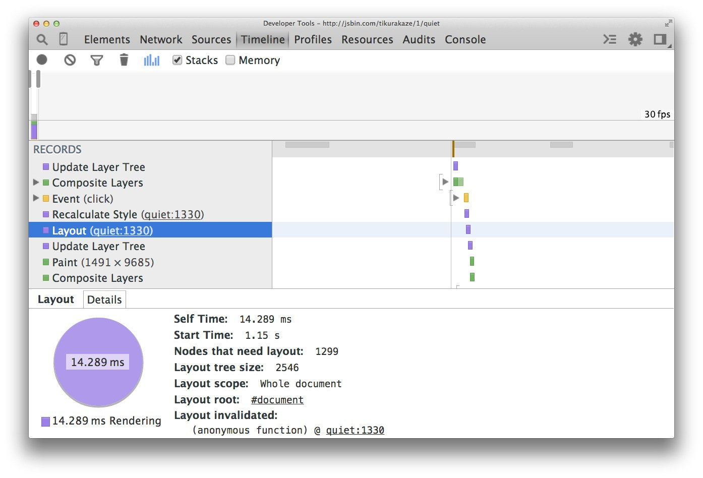
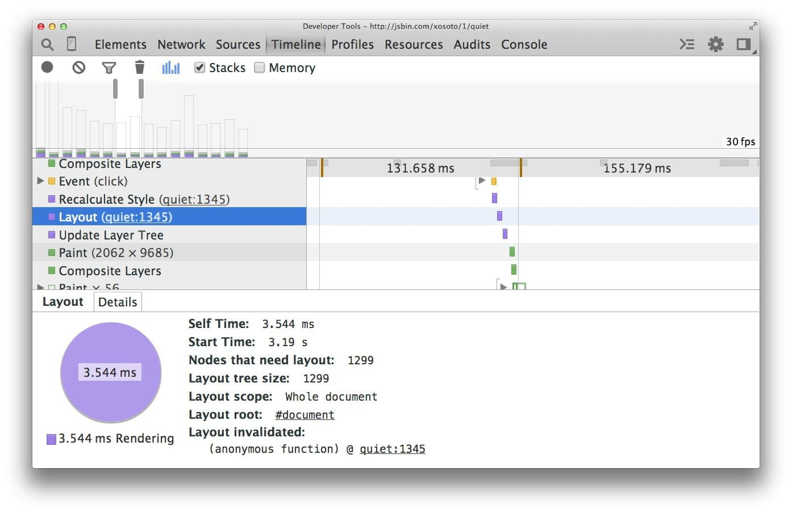

project_path: /web/fundamentals/_project.yaml
book_path: /web/fundamentals/_book.yaml
description: Layout is where the browser figures out the geometric information for elements: their size and location in the page. Each element will have explicit or implicit sizing information based on the CSS that was used, the contents of the element, or a parent element. The process is called Layout in Chrome.

# Avoid Large, Complex Layouts and Layout Thrashing {: .page-title }

{# wf_updated_on: 2015-03-20 #}
{# wf_published_on: 2015-03-20 #}



Layout is where the browser figures out the geometric information for 
elements: their size and location in the page. Each element will have 
explicit or implicit sizing information based on the CSS that was used, the 
contents of the element, or a parent element. The process is called Layout 
in Chrome, Opera, Safari, and Internet Explorer. In Firefox it’s called 
Reflow, but effectively the process is the same.

Similarly to style calculations, the immediate concerns for layout cost are:

1. The number of elements that require layout.
2. The complexity of those layouts.

### TL;DR {: .hide-from-toc }

* Layout is normally scoped to the whole document.
* The number of DOM elements will affect performance; you should avoid triggering layout wherever possible.
* Assess layout model performance; new Flexbox is typically faster than older Flexbox or float-based layout models.
* Avoid forced synchronous layouts and layout thrashing; read style values then make style changes.

## Avoid layout wherever possible

When you change styles the browser checks to see if any of the changes require layout to be calculated, and for that render tree to be updated. Changes to “geometric properties”, such as widths, heights, left, or top all require layout.

    .box {
      width: 20px;
      height: 20px;
    }

    /**
     * Changing width and height
     * triggers layout.
     */
    .box--expanded {
      width: 200px;
      height: 350px;
    }

**Layout is almost always scoped to the entire document.** If you have a lot of elements, it’s going to take a long time to figure out the locations and dimensions of them all.

If it’s not possible to avoid layout then the key is to once again use Chrome DevTools to see how long it’s taking, and determine if layout is the cause of a bottleneck. Firstly, open DevTools, go to the Timeline tab, hit record and interact with your site. When you stop recording you’ll see a breakdown of how your site performed:

When digging into the frame in the above example, we see that over 20ms is spent inside layout, which, when we have 16ms to get a frame on screen in an animation, is far too high. You can also see that DevTools will tell you the tree size (1,618 elements in this case), and how many nodes were in need of layout.

Note: Want a definitive list of which CSS properties trigger layout, paint, or composite? Check out [CSS Triggers](https://csstriggers.com).

## Use flexbox over older layout models

The web has a range of layout models, some being more widely supported than others. The oldest CSS layout model  allows us to position elements on screen relatively, absolutely, and by floating elements.

The screenshot below shows the layout cost when using floats on 1,300 boxes. It is, admittedly, a contrived example, because most applications will use a variety of means to position elements.

If we update the sample to use Flexbox, a more recent addition to the web platform, we get a different picture:

Now we spend far less time (3.5ms vs 14ms in this case) in layout for the _same number of elements_ and the same visual appearance. It’s important to remember that for some contexts you may not be able to choose Flexbox, since it’s [less widely supported than floats](http://caniuse.com/#search=flexbox), but where you can you should at least investigate the layout model’s impact on your performance, and go with the one that minimizes the cost of performing it.

In any case, whether you choose Flexbox or not, you should still **try and avoid triggering layout altogether** during high pressure points of your application!

## Avoid forced synchronous layouts

Shipping a frame to screen has this order:

First the JavaScript runs, _then_ style calculations, _then_ layout. It is, however, possible to force a browser to perform layout earlier with JavaScript. It is called a **forced synchronous layout**.

The first thing to keep in mind is that as the JavaScript runs all the old layout values from the previous frame are known and available for you to query. So if, for example, you want to write out the height of an element (let’s call it “box”) at the start of the frame you may write some code like this:

    // Schedule our function to run at the start of the frame.
    requestAnimationFrame(logBoxHeight);

    function logBoxHeight() {
      // Gets the height of the box in pixels and logs it out.
      console.log(box.offsetHeight);
    }

Things get problematic if you’ve changed the styles of the box _before_ you ask for its height:

    function logBoxHeight() {

      box.classList.add('super-big');

      // Gets the height of the box in pixels
      // and logs it out.
      console.log(box.offsetHeight);
    }

Now, in order to answer the height question, the browser must _first_ apply the style change (because of adding the `super-big` class), and _then_ run layout. Only then will it be able to return the correct height. This is unnecessary and potentially expensive work.

Because of this you should always batch your style reads and do them first (where the browser can use the previous frame’s layout values) and then do any writes:

Done correctly the above function would be:

    function logBoxHeight() {
      // Gets the height of the box in pixels
      // and logs it out.
      console.log(box.offsetHeight);

      box.classList.add('super-big');
    }

For the most part you shouldn’t need to apply styles and then query values; using the last frame’s values should be sufficient. Running the style calculations and layout synchronously and earlier than the browser would like are potential bottlenecks, and not something you will typically want to do.

## Avoid layout thrashing
There’s a way to make forced synchronous layouts even worse: _do lots of them in quick succession_. Take a look at this code:

    function resizeAllParagraphsToMatchBlockWidth() {

      // Puts the browser into a read-write-read-write cycle.
      for (var i = 0; i < paragraphs.length; i++) {
        paragraphs[i].style.width = box.offsetWidth + 'px';
      }
    }

This code loops over a group of paragraphs and sets each paragraph’s width to match the width of an element called “box”. It looks harmless enough, but the problem is that each iteration of the loop reads a style value (`box.offsetWidth`) and then immediately uses it to update the width of a paragraph (`paragraphs[i].style.width`). On the next iteration of the loop, the browser has to account for the fact that styles have changed since `offsetWidth` was last requested (in the previous iteration), and so it must apply the style changes, and run layout. This will happen on _every single iteration!_.

The fix for this sample is to once again _read_ then _write_ values:

    // Read.
    var width = box.offsetWidth;

    function resizeAllParagraphsToMatchBlockWidth() {
      for (var i = 0; i < paragraphs.length; i++) {
        // Now write.
        paragraphs[i].style.width = width + 'px';
      }
    }

If you want to guarantee safety you should check out [FastDOM](https://github.com/wilsonpage/fastdom), which automatically batches your reads and writes for you, and should prevent you from triggering forced synchronous layouts or layout thrashing accidentally.
