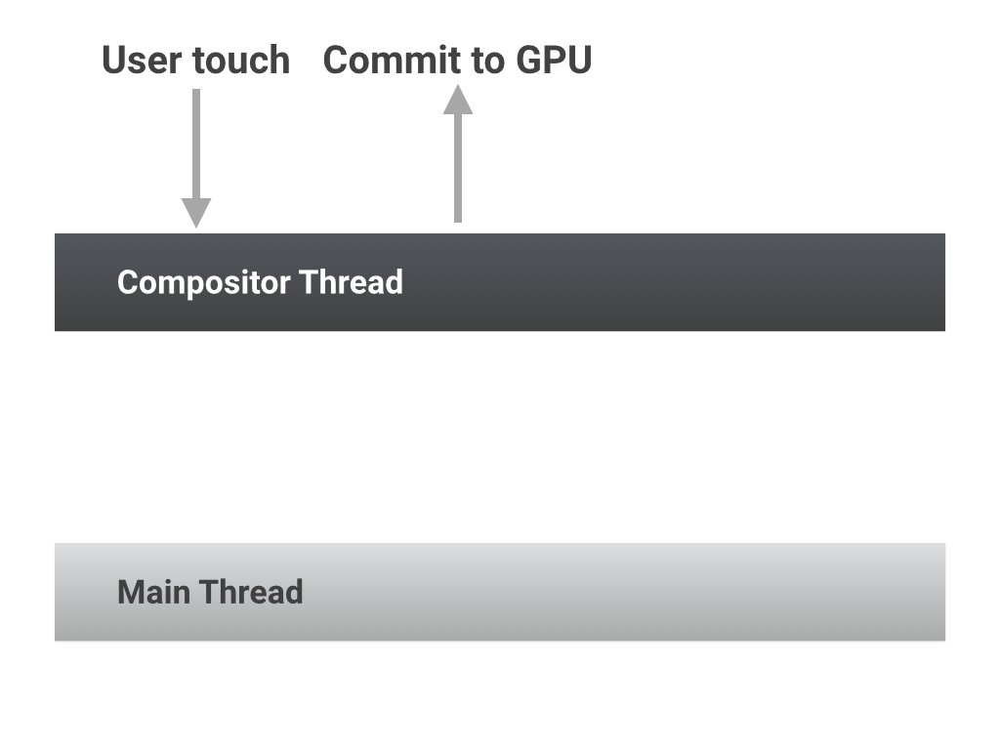
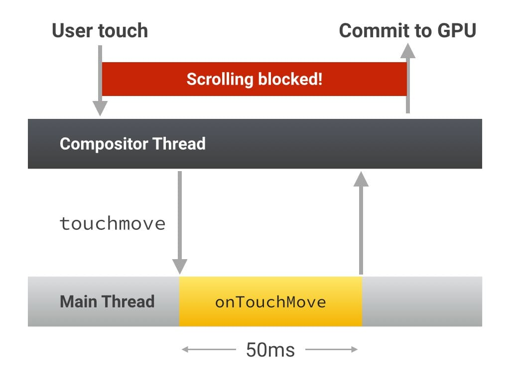
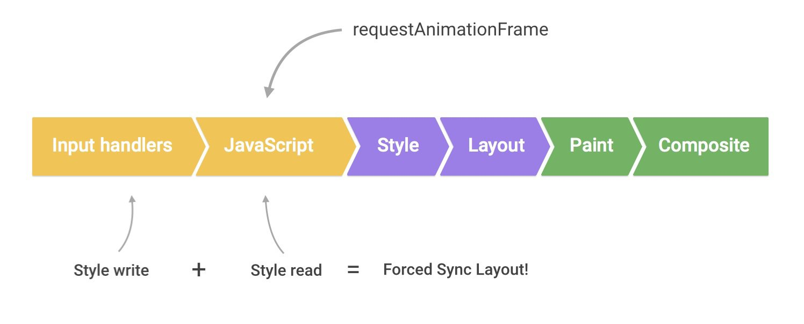

project_path: /web/fundamentals/_project.yaml
book_path: /web/fundamentals/_book.yaml
description: Input handlers are a potential cause of performance problems in your apps, as they can block frames from completing, and can cause additional and unnecessary layout work.

{# wf_updated_on: 2015-10-06 #}
{# wf_published_on: 2015-03-20 #}

# Debounce Your Input Handlers {: .page-title }



Input handlers are a potential cause of performance problems in your apps, as
they can block frames from completing, and can cause additional and unnecessary
layout work.

### TL;DR {: .hide-from-toc }

* Avoid long-running input handlers; they can block scrolling.
* Do not make style changes in input handlers.
* Debounce your handlers; store event values and deal with style changes in the next requestAnimationFrame callback.

## Avoid long-running input handlers

In the fastest possible case, when a user interacts with the page, the page’s compositor thread can take the user’s touch input and simply move the content around. This requires no work by the main thread, where JavaScript, layout, styles, or paint are done.

If, however, you attach an input handler, like `touchstart`, `touchmove`, or `touchend`, the compositor thread must wait for this handler to finish executing because you may choose to call `preventDefault()` and stop the touch scroll from taking place. Even if you don’t call `preventDefault()` the compositor must wait, and as such the user’s scroll is blocked, which can result in stuttering and missed frames.

In short, you should make sure that any input handlers you run should execute quickly and allow the compositor to do its job.

## Avoid style changes in input handlers

Input handlers, like those for scroll and touch, are scheduled to run just before any `requestAnimationFrame` callbacks.

If you make a visual change inside one of those handlers, then at the start of the `requestAnimationFrame`, there will be style changes pending. If you _then_ read visual properties at the start of the requestAnimationFrame callback, as the advice in “[Avoid large, complex layouts and layout thrashing](avoid-large-complex-layouts-and-layout-thrashing)” suggests, you will trigger a forced synchronous layout!

## Debounce your scroll handlers

The solution to both of the problems above is the same: you should always debounce visual changes to the next `requestAnimationFrame` callback:

    function onScroll (evt) {

      // Store the scroll value for laterz.
      lastScrollY = window.scrollY;

      // Prevent multiple rAF callbacks.
      if (scheduledAnimationFrame)
        return;

      scheduledAnimationFrame = true;
      requestAnimationFrame(readAndUpdatePage);
    }

    window.addEventListener('scroll', onScroll);

Doing this also has the added benefit of keeping your input handlers light, which is awesome because now you’re not blocking things like scrolling or touch on computationally expensive code!
