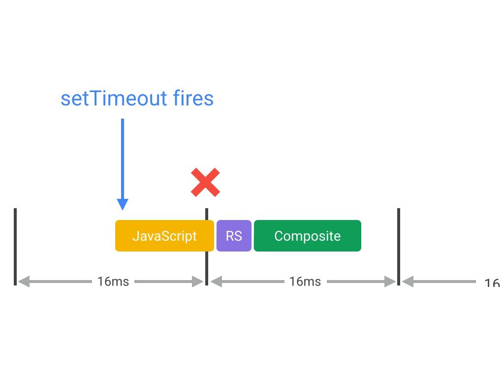
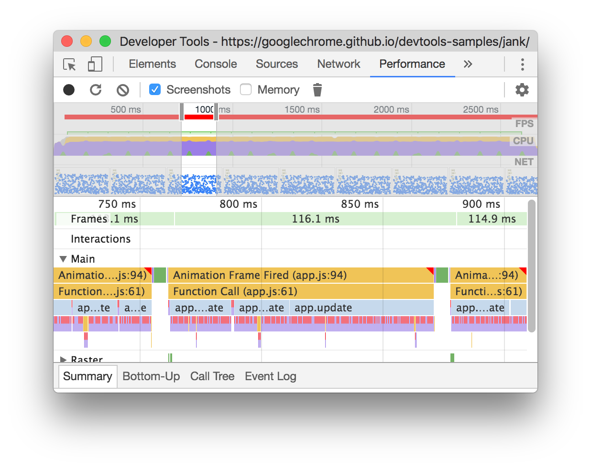

project_path: /web/fundamentals/_project.yaml
book_path: /web/fundamentals/_book.yaml
description: JavaScript often triggers visual changes. Sometimes that's directly through style manipulations, and sometimes it's calculations that result in visual changes, like searching or sorting data. Badly-timed or long-running JavaScript is a common cause of performance issues. You should look to minimize its impact where you can.

{# wf_updated_on: 2017-07-25 #}
{# wf_published_on: 2015-03-20 #}
{# wf_blink_components: Blink>JavaScript #}

# Optimize JavaScript Execution {: .page-title }



JavaScript often triggers visual changes. Sometimes that's directly
through style manipulations, and sometimes it's calculations that
result in visual changes, like searching or sorting data. Badly-timed
or long-running JavaScript is a common cause of performance issues.
You should look to minimize its impact where you can.

JavaScript performance profiling can be something of an art, because the JavaScript you write is 
nothing like the code that is actually executed. Modern browsers use JIT compilers and all manner 
of optimizations and tricks to try and give you the fastest possible execution, and this 
substantially changes the dynamics of the code.

Note: If you really want to see JIT in action you should check out 
<a href='http://mrale.ph/irhydra/2/'>IRHydra2 by Vyacheslav Egorov</a>. 
It shows the intermediate state of JavaScript code when Chrome’s JavaScript engine, V8, is 
optimizing it.

With all that said, however, there are some things you can definitely do to help your apps execute 
JavaScript well.

### TL;DR {: .hide-from-toc }

* Avoid setTimeout or setInterval for visual updates; always use requestAnimationFrame instead.
* Move long-running JavaScript off the main thread to Web Workers.
* Use micro-tasks to make DOM changes over several frames.
* Use Chrome DevTools’ Timeline and JavaScript Profiler to assess the impact of JavaScript.

## Use `requestAnimationFrame` for visual changes

When visual changes are happening on screen you want to do your work at the right time for the 
browser, which is right at the start of the frame. The only way to guarantee that your JavaScript 
will run at the start of a frame is to use `requestAnimationFrame`.

    /**
     * If run as a requestAnimationFrame callback, this
     * will be run at the start of the frame.
     */
    function updateScreen(time) {
      // Make visual updates here.
    }

    requestAnimationFrame(updateScreen);

Frameworks or samples may use `setTimeout` or `setInterval` to do visual changes like animations, 
but the problem with this is that the callback will run at _some point_ in the frame, possibly right
 at the end, and that can often have the effect of causing us to miss a frame, resulting in jank.

In fact, jQuery used to use `setTimeout` for its `animate` behavior. It was changed to use 
`requestAnimationFrame` in version 3.
If you are using older version of jQuery, you can 
[patch it to use `requestAnimationFrame`](https://github.com/gnarf/jquery-requestAnimationFrame), 
which is strongly advised.

## Reduce complexity or use Web Workers

JavaScript runs on the browser’s main thread, right alongside style calculations, layout, and, in 
many cases, paint. If your JavaScript runs for a long time, it will block these other tasks, 
potentially causing frames to be missed.

You should be tactical about when JavaScript runs, and for how long. For example, if you’re in an 
animation like scrolling, you should ideally be looking to keep your JavaScript to something in the 
region of **3-4ms**. Any longer than that and you risk taking up too much time. If you’re in an idle
 period, you can afford to be more relaxed about the time taken.

In many cases you can move pure computational work to 
[Web Workers](https://developer.mozilla.org/en-US/docs/Web/API/Web_Workers_API/basic_usage), 
if, for example, it doesn’t require DOM access. Data manipulation or traversal, 
like sorting or searching, are often good fits for this model, as are loading and model generation.

    var dataSortWorker = new Worker("sort-worker.js");
    dataSortWorker.postMesssage(dataToSort);

    // The main thread is now free to continue working on other things...

    dataSortWorker.addEventListener('message', function(evt) {
       var sortedData = evt.data;
       // Update data on screen...
    });

Not all work can fit this model: Web Workers do not have DOM access. Where your work must be on the 
main thread, consider a batching approach, where you segment the larger task into micro-tasks, each 
taking no longer than a few milliseconds, and run inside of `requestAnimationFrame` handlers across 
each frame.

    var taskList = breakBigTaskIntoMicroTasks(monsterTaskList);
    requestAnimationFrame(processTaskList);

    function processTaskList(taskStartTime) {
      var taskFinishTime;

      do {
        // Assume the next task is pushed onto a stack.
        var nextTask = taskList.pop();

        // Process nextTask.
        processTask(nextTask);

        // Go again if there’s enough time to do the next task.
        taskFinishTime = window.performance.now();
      } while (taskFinishTime - taskStartTime < 3);

      if (taskList.length > 0)
        requestAnimationFrame(processTaskList);

    }

There are UX and UI consequences to this approach, and you will need to ensure that the user knows 
that a task is being processed, either by [using a progress or activity indicator](https://www.google.com/design/spec/components/progress-activity.html). 
In any case this approach will keep your app's main thread free, helping it to stay responsive to 
user interactions.

## Know your JavaScript’s “frame tax”

When assessing a framework, library, or your own code, it’s important to assess
how much it costs to run the JavaScript code on a frame-by-frame basis. This is
especially important when doing performance-critical animation work like
transitioning or scrolling.

The Performance panel of Chrome DevTools is the best way to measure your
JavaScript's cost. Typically you get low-level records like this:

The **Main** section provides a flame chart of JavaScript calls so you
can analyze exactly which functions were called and how long each took.

Armed with this information you can assess the performance impact of the
JavaScript on your application, and begin to find and fix any hotspots where
functions are taking too long to execute. As mentioned earlier you should seek
to either remove long-running JavaScript, or, if that’s not possible, move it
to a Web Worker freeing up the main thread to continue on with other tasks.

See [Get Started With Analyzing Runtime Performance][GS] to learn how to use
the Performance panel.

[GS]: /web/tools/chrome-devtools/evaluate-performance/

## Avoid micro-optimizing your JavaScript

It may be cool to know that the browser can execute one version of a thing 100 times faster than 
another thing, like that requesting and element’s `offsetTop` is faster than computing 
`getBoundingClientRect()`, but it’s almost always true that you’ll only be calling functions like 
these a small number of times per frame, so it’s normally wasted effort to focus on this aspect of 
JavaScript’s performance. You'll typically only save fractions of milliseconds.

If you’re making a game, or a computationally expensive application, then you’re likely an exception
 to this guidance, as you’ll be typically fitting a lot of computation into a single frame, and in 
that case everything helps.

In short, you should be very wary of micro-optimizations because they won’t typically map to the 
kind of application you’re building.
