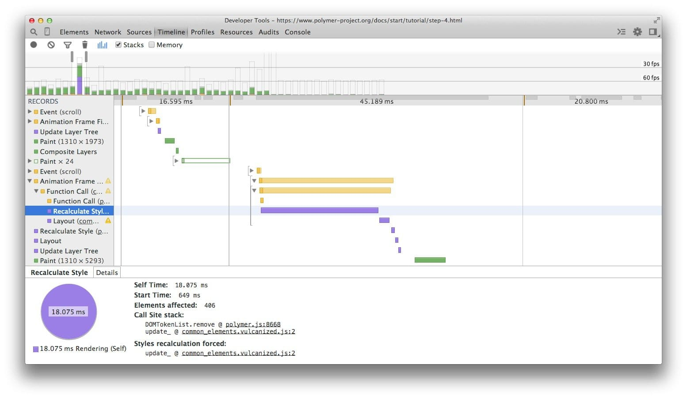
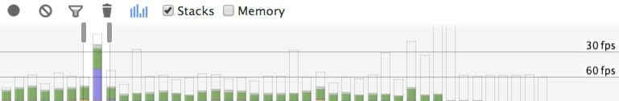
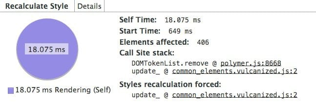

project_path: /web/fundamentals/_project.yaml
book_path: /web/fundamentals/_book.yaml
description: JavaScript is often the trigger for visual changes. Sometimes that's directly through style manipulations, and sometimes it's calculations that will result in visual changes, like searching or sorting some data. Badly-timed or long-running JavaScript can be a common cause of performance issues, and you should look to minimize its impact where you can.

{# wf_updated_on: 2015-03-20 #}
{# wf_published_on: 2015-03-20 #}

# Reduce the Scope and Complexity of Style Calculations {: .page-title }



Changing the DOM, through adding and removing elements, changing attributes, 
classes, or through animation, will all cause the browser to recalculate 
element styles and, in many cases, layout (or reflow) the page, or parts of 
it. This process is called <em>computed style calculation</em>.

The first part of computing styles is to create a set of matching selectors, which is essentially the browser figuring out which classes, pseudo-selectors and IDs apply to any given element.

The second part of the process involves taking all the style rules from the matching selectors and figuring out what final styles the element has. In Blink (Chrome and Opera's rendering engine) these processes are, today at least, roughly equivalent in cost:

> Roughly 50% of the time used to calculate the computed style for an element is used to match selectors, and the other half of the time is used for constructing the RenderStyle (computed style representation) from the matched rules.
> Rune Lillesveen, Opera / [Style Invalidation in Blink](https://docs.google.com/document/d/1vEW86DaeVs4uQzNFI5R-_xS9TcS1Cs_EUsHRSgCHGu8/view)

### TL;DR {: .hide-from-toc }

* Reduce the complexity of your selectors; use a class-centric methodology like BEM.
* Reduce the number of elements on which style calculation must be calculated.

## Reduce the complexity of your selectors

In the simplest case you reference an element in your CSS with just a class:

    .title {
      /* styles */
    }

But, as any project grows, it will likely result in more complex CSS, such that you may end up with selectors that look like this:

    .box:nth-last-child(-n+1) .title {
      /* styles */
    }

In order to know that the styles need to apply the browser has to effectively ask “is this an element with a class of title which has a parent who happens to be the minus nth child plus 1 element with a class of box?” Figuring this out _can_ take a lot of time, depending on the selector used and the browser in question. The intended behavior of the selector could instead be changed to a class:

    .final-box-title {
      /* styles */
    }

You can take issue with the name of the class, but the job just got a lot simpler for the browser. In the previous version, in order to know, for example, that the element is the last of its type, the browser must first know everything about all the other elements and whether the are any elements that come after it that would be the nth-last-child, which is potentially a lot more expensive than simply matching up the selector to the element because its class matches.

## Reduce the number of elements being styled
Another performance consideration, which is typically _the more important factor for many style updates_, is the sheer volume of work that needs to be carried out when an element changes.

In general terms, the worst case cost of calculating the computed style of elements is the number of elements multiplied by the selector count, because each element needs to be at least checked once against every style to see if it matches.

Note: It used to be the case that if you changed a class on -- say -- the body element, that all the children in the page would need to have their computed styles recalculated. Thankfully that is no longer the case; some browsers instead maintain a small collection of rules unique to each element that, if changed, cause the element’s styles to be recalculated. That means that an element may or may not need to be recalculated depending on where it is in the tree, and what specifically got changed.

Style calculations can often be targeted to a few elements directly rather than invalidating the page as a whole. In modern browsers this tends to be much less of an issue, because the browser doesn’t necessarily need to check all the elements potentially affected by a change. Older browsers, on the other hand, aren’t necessarily as optimized for such tasks. Where you can you should **reduce the number of invalidated elements**.

Note: If you’re into Web Components it’s worth noting that style calculations here are a little different, since by default styles do not cross the Shadow DOM boundary, and are scoped to individual components rather than the tree as a whole. Overall, however, the same concept still applies: smaller trees with simpler rules are more efficiently processed than large trees or complex rules.

## Measure your Style Recalculation Cost

The easiest and best way to measure the cost of style recalculations is to use Chrome DevTools’ Timeline mode. To begin, open DevTools, go to the Timeline tab, hit record and interact with your site. When you stop recording you’ll see something like the image below.

The strip at the top indicates frames per second, and if you see bars going above the lower line, the 60fps line, then you have long running frames.

If you have a long running frame during some interaction like scrolling, or some other interaction, then it bears further scrutiny.

If you have a large purple block, as in the case the above, click the record to get more details.

In this grab there is a long-running Recalculate Style event that is taking just over 18ms, and it happens to be taking place during a scroll, causing a noticeable judder in the experience.

If you click the event itself you are given a call stack, which pinpoints the place in your JavaScript that is responsible for triggering the style change. In addition to that, you also get the number of elements that have been affected by the change (in this case just over 400 elements), and how long it took to perform the style calculations. You can use this information to start trying to find a fix in your code.

## Use Block, Element, Modifier

Approaches to coding like [BEM (Block, Element, Modifier)](https://bem.info/){: .external } actually bake in the selector matching performance benefits above, because it recommends that everything has a single class, and, where you need hierarchy, that gets baked into the name of the class as well:

    .list { }
    .list__list-item { }

If you need some modifier, like in the above where we want to do something special for the last child, you can add that like so:

    .list__list-item--last-child {}

If you’re looking for a good way to organize your CSS, BEM is a really good starting point, both from a structure point-of-view, but also because of the simplifications of style lookup.

If you don’t like BEM, there are other ways to approach your CSS, but the performance considerations should be assessed alongside the ergonomics of the approach.

## Resources

* [Style invalidation in Blink](https://docs.google.com/document/d/1vEW86DaeVs4uQzNFI5R-_xS9TcS1Cs_EUsHRSgCHGu8/edit)
* [BEM (Block, Element, Modifier)](https://bem.info/){: .external }
