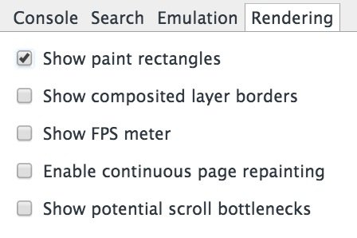
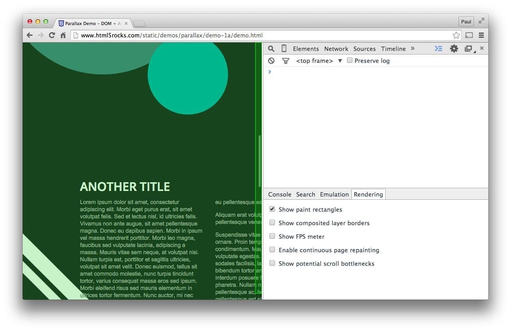
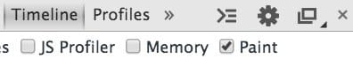
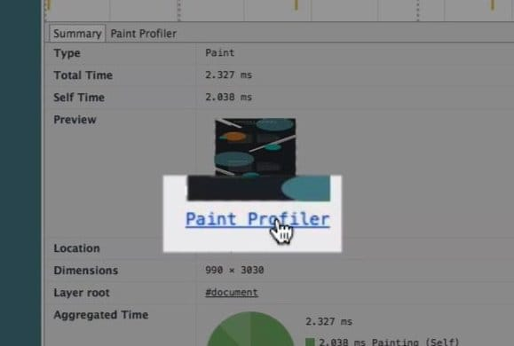
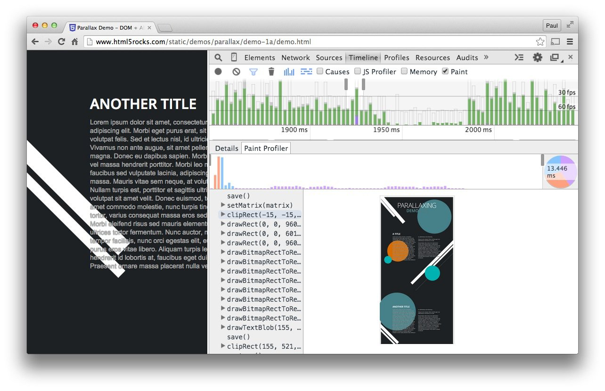
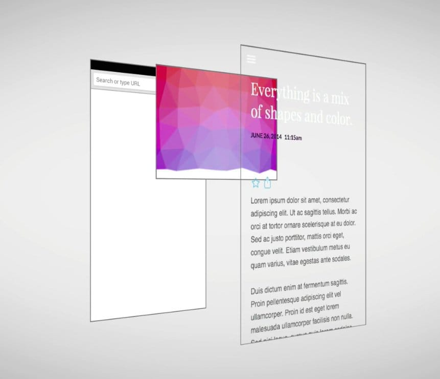
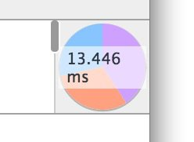

project_path: /web/fundamentals/_project.yaml
book_path: /web/fundamentals/_book.yaml
description: Paint is the process of filling in pixels that eventually get composited to the users' screens. It is often the longest-running of all tasks in the pipeline, and one to avoid if at all possible.

{# wf_updated_on: 2015-03-20 #}
{# wf_published_on: 2015-03-20 #}

# Simplify Paint Complexity and Reduce Paint Areas {: .page-title }



Paint is the process of filling in pixels that eventually get composited to 
the users' screens. It is often the longest-running of all tasks in the 
pipeline, and one to avoid if at all possible.

### TL;DR {: .hide-from-toc } 

* Changing any property apart from transforms or opacity always triggers paint.
* Paint is often the most expensive part of the pixel pipeline; avoid it where you can.
* Reduce paint areas through layer promotion and orchestration of animations.
* Use the Chrome DevTools paint profiler to assess paint complexity and cost; reduce where you can.

## Triggering Layout And Paint

If you trigger layout, you will _always trigger paint_, since changing the geometry of any element means its pixels need fixing!

You can also trigger paint if you change non-geometric properties, like backgrounds, text color, or shadows. In those cases layout won’t be needed and the pipeline will look like this:

## Use Chrome DevTools to quickly identify paint bottlenecks

  <figure>
    
  </figure>

You can use Chrome DevTools to quickly identify areas that are being painted. Go to DevTools and hit the escape key on your keyboard. Go to the rendering tab in the panel that appears and choose “Show paint rectangles”.

With this option switched on Chrome will flash the screen green whenever painting happens. If you’re seeing the whole screen flash green, or areas of the screen that you didn’t think should be painted, then you should dig in a little further.

  <figure>
    
  </figure>

There’s an option in the Chrome DevTools timeline which will give you more information: a paint profiler. To enable it, go to the Timeline and check the “Paint” box at the top. It’s important to _only have this switched on when trying to profile paint issues_, as it carries an overhead and will skew your performance profiling. It’s best used when you want more insight into what exactly is being painted.

  <figure>
    
  </figure>

From here you can now run a Timeline recording, and paint records will carry significantly more detail. By clicking on a paint record in a frame you will now get access to the Paint Profiler for that frame:

Clicking on the paint profiler brings up a view where you can see what got painted, how long it took, and the individual paint calls that were required:

This profiler lets you know both the area and the complexity (which is really the time it takes to paint), and both of these are areas you can look to fix if avoiding paint is not an option.

## Promote elements that move or fade

Painting is not always done into a single image in memory. In fact, it’s possible for the browser to paint into multiple images, or compositor layers, if necessary.

The benefit of this approach is that elements that are regularly repainted, or are moving on screen with transforms, can be handled without affecting other elements. This is the same as with art packages like Sketch, GIMP, or Photoshop, where individual layers can be handled and composited on top of each other to create the final image.

The best way to create a new layer is to use the `will-change` CSS property. This will work in Chrome, Opera and Firefox, and, with a value of `transform`, will create a new compositor layer:

    .moving-element {
      will-change: transform;
    }

For browsers that don’t support `will-change`, but benefit from layer creation, such as Safari and Mobile Safari, you need to (mis)use a 3D transform to force a new layer:

    .moving-element {
      transform: translateZ(0);
    }

Care must be taken not to create too many layers, however, as each layer requires both memory and management. There is more information on this in the [Stick to compositor-only properties and manage layer count](stick-to-compositor-only-properties-and-manage-layer-count) section.

If you have promoted an element to a new layer, use DevTools to confirm that doing so has given you a performance benefit. **Don't promote elements without profiling.**

## Reduce paint areas

Sometimes, however, despite promoting elements, paint work is still necessary. A large challenge of paint issues is that browsers union together two areas that need painting, and that can result in the entire screen being repainted. So, for example, if you have a fixed header at the top of the page, and something being painted at the bottom the screen, the entire screen may end up being repainted.

Note: On High DPI screens elements that are fixed position are automatically promoted to their own compositor layer. This is not the case on low DPI devices because the promotion changes text rendering from subpixel to grayscale, and layer promotion needs to be done manually.

Reducing paint areas is often a case of orchestrating your animations and transitions to not overlap as much, or finding ways to avoid animating certain parts of the page.

## Simplify paint complexity

  <figure>
    
  </figure>

When it comes to painting, some things are more expensive than others. For example, anything that involves a blur (like a shadow, for example) is going to take longer to paint than -- say -- drawing a red box. In terms of CSS, however, this isn’t always obvious: `background: red;` and `box-shadow: 0, 4px, 4px, rgba(0,0,0,0.5);` don’t necessarily look like they have vastly different performance characteristics, but they do.

The paint profiler above will allow you to determine if you need to look at other ways to achieve effects. Ask yourself if it’s possible to use a cheaper set of styles or alternative means to get to your end result.

Where you can you always want to avoid paint during animations in particular, as the **10ms** you have per frame is normally not long enough to get paint work done, especially on mobile devices.
