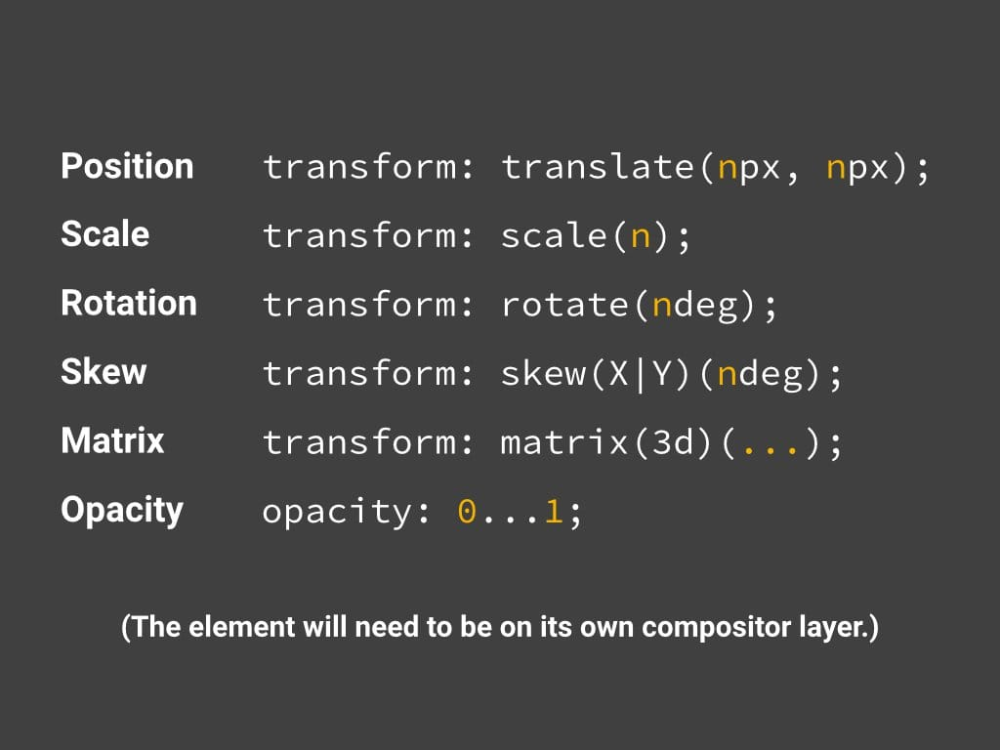
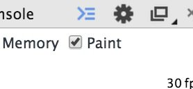
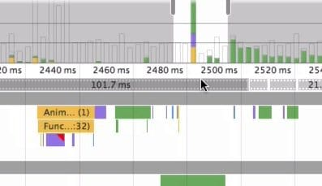
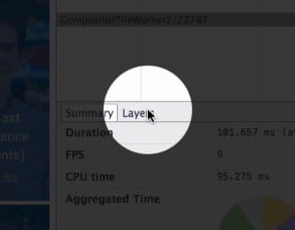
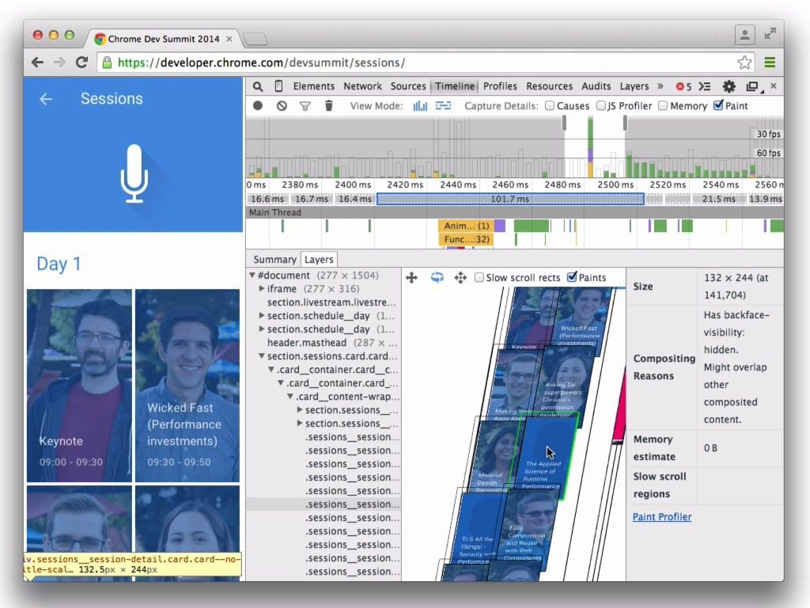

project_path: /web/fundamentals/_project.yaml
book_path: /web/fundamentals/_book.yaml
description: Compositing is where the painted parts of the page are put together for displaying on screen.

{# wf_updated_on: 2015-03-20 #}
{# wf_published_on: 2015-03-20 #}

# Stick to Compositor-Only Properties and Manage Layer Count {: .page-title }



Compositing is where the painted parts of the page are put together for 
displaying on screen.

There are two key factors in this area that affect page performance: the number of compositor layers that need to be managed, and the properties that you use for animations.

### TL;DR {: .hide-from-toc }

* Stick to transform and opacity changes for your animations.
* Promote moving elements with `will-change` or `translateZ`.
* Avoid overusing promotion rules; layers require memory and management.

## Use transform and opacity changes for animations

The best-performing version of the pixel pipeline avoids both layout and paint, and only requires compositing changes:

In order to achieve this you will need to stick to changing properties that can be handled by the compositor alone. Today there are only two properties for which that is true - `transform`s and `opacity`:

The caveat for the use of `transform`s and `opacity` is that the element on which you change these properties should be on _its own compositor layer_. In order to make a layer you must promote the element, which we will cover next.

Note: If you’re concerned that you may not be able to limit your animations to just those properties, take a look at the [FLIP principle](https://aerotwist.com/blog/flip-your-animations), which may help you remap animations to changes in transforms and opacity from more expensive properties.

## Promote elements that you plan to animate

As we mentioned in the “[Simplify paint complexity and reduce paint areas](simplify-paint-complexity-and-reduce-paint-areas)” section, you should promote elements that you plan to animate (within reason, don’t overdo it!) to their own layer:

    .moving-element {
      will-change: transform;
    }

Or, for older browsers, or those that don’t support will-change:

    .moving-element {
      transform: translateZ(0);
    }

This gives the browser the forewarning that changes are incoming and, depending on what you plan to change, the browser can potentially make provisions, such as creating compositor layers.

## Manage layers and avoid layer explosions

It’s perhaps tempting, then, knowing that layers often help performance, to promote all the elements on your page with something like the following:

    * {
      will-change: transform;
      transform: translateZ(0);
    }

Which is a roundabout way of saying that you’d like to promote every single element on the page. The problem here is that every layer you create requires memory and management, and that’s not free. In fact, on devices with limited memory the impact on performance can far outweigh any benefit of creating a layer. Every layer’s textures needs to be uploaded to the GPU, so there are further constraints in terms of bandwidth between CPU and GPU, and memory available for textures on the GPU.

Warning: Do not promote elements unnecessarily.

## Use Chrome DevTools to understand the layers in your app

  <figure>
    
  </figure>

To get an understanding of the layers in your application, and why an element has a layer you must enable the Paint profiler in Chrome DevTools’ Timeline:

With this switched on you should take a recording. When the recording has finished you will be able to click individual frames, which is found between the frames-per-second bars and the details:

Clicking on this will provide you with a new option in the details: a layer tab.

This option will bring up a new view that allows you to pan, scan and zoom in on all the layers during that frame, along with reasons that each layer was created.

Using this view you can track the number of layers you have. If you’re spending a lot time in compositing during performance-critical actions like scrolling or transitions (you should aim for around **4-5ms**), you can use the information here to see how many layers you have, why they were created, and from there manage layer counts in your app.
