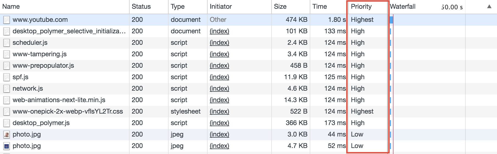
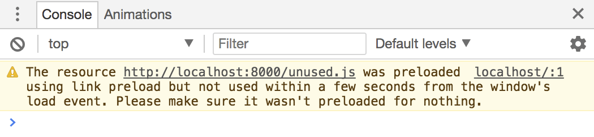
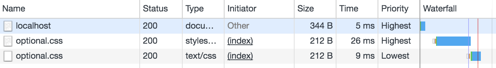

project_path: /web/fundamentals/_project.yaml
book_path: /web/fundamentals/_book.yaml

{# wf_updated_on: 2017-11-06 #}
{# wf_published_on: 2017-11-01 #}
{# wf_blink_components: Blink>Network,Blink>Loader #}

<!--
  Aspect ratio CSS, Copyright 2017 Google Inc
  Maintains aspect ratio in blocks that use the class, so that content doesn't
  move around as media loads.

  Adapted from https://github.com/sgomes/css-aspect-ratio
-->

# Resource Prioritization – Getting the Browser to Help You {: .page-title }



Not every byte that is sent down the wire to the browser has the same degree of
importance, and the browser knows this. Browsers have heuristics that attempt to
make a best-guess at the most important resources to load first — such
as CSS before scripts and images.

That said, as with any heuristic, it doesn’t always work out; the browser might
make the wrong decision, usually because it doesn’t have enough information at
that time. This article explains how to influence the priority of content
adequately in modern browsers by letting them know what you’ll be needing later.

## Default Priorities in the Browser

As mentioned before, the browser assigns different relative priorities to
different types of resources based on how critical they might be. So, for
example, a `<script>` tag in your page’s `<head>` would be loaded in Chrome at a
**High** priority (below CSS, at **Highest**), but that priority would change to
**Low** if it has the async attribute (meaning it can be loaded and run
asynchronously).

Priorities become important when investigating loading performance in your site.
Beyond the usual techniques of
[measuring](/web/fundamentals/performance/critical-rendering-path/measure-crp)
and
[analyzing the critical rendering path](/web/fundamentals/performance/critical-rendering-path/analyzing-crp),
it’s useful to know Chrome’s priority for each resource. You can find that in
the Network panel in Chrome Developer Tools. Here’s what it looks like:

<figure>
  

    
  

  <figcaption><b>Figure 1</b>: Priorities in Chrome Developer Tools. You may
  need to enable the Priority column by right-clicking on the column headers.
  </figcaption>
</figure>

These priorities give you an idea of how much relative importance the
browser attributes to each resource. And remember that subtle differences are
enough for the browser to assign a different priority; for example, an image
that is part of the initial render is prioritized higher than an image that
starts offscreen. If you’re curious about priorities,
[this article by Addy Osmani](https://medium.com/reloading/preload-prefetch-and-priorities-in-chrome-776165961bbf){: .external}
digs a lot deeper into the current state of priorities in Chrome.

So what can you do if you find any resources that are marked with a different
priority than the one you’d want?

This article dives into three different declarative solutions, which are all
relatively new `<link>` types. If your resources are crucial to the user
experience but are being loaded at too low a priority, you can try fixing that
in one of two ways: preload or preconnect. On the other hand, if you’d like
the browser to fetch some resources only when it’s done dealing with everything
else, try prefetch.

Let’s look at all three!

## Preload

`<link rel="preload">` informs the browser that a resource is needed as
part of the current navigation, and that it should start getting fetched as soon
as possible. Here’s how you use it:

    <link rel="preload" as="script" href="super-important.js">
    <link rel="preload" as="style" href="critical.css">

Most of this is probably what you’d expect, except perhaps for the “as”
attribute. This allows you to tell the browser the type of the resource you’re
loading, so that it can be handled correctly. The browser doesn't use
the preloaded resource unless the correct type is set. The resource is
loaded with the same priority as it would otherwise, but now the browser knows
about it ahead of time, allowing for the download to start earlier.

Note that `<link rel="preload">` is a compulsory instruction to the browser;
unlike the other resource hints we’ll be talking about, it’s something the
browser must do, rather than merely an optional hint. This makes it particularly
important to test carefully, to insure that you’re not accidentally causing
anything to fetch twice by using it, or fetching something that’s not needed.

Resources that are fetched using `<link rel="preload">`, but not used by the
current page within 3 seconds will trigger a warning in the Console in Chrome
Developer Tools, so be sure to keep an eye out for these!

<figure>
  

    
  

</figure>

### Use-case: Fonts

Fonts are a great example of late-discovered resources that must be fetched,
often sitting at the bottom of one of several CSS files loaded by a page.

In order to reduce the amount of time the user has to wait for the text content
of your site, as well as avoid jarring flashes between system fonts and your
preferred ones, you can use `<link rel="preload">` in your HTML to let the
browser know immediately that a font is needed.

    <link rel="preload" as="font" crossorigin="crossorigin" type="font/woff2" href="myfont.woff2">

Note that the use of `crossorigin` here is important; without this attribute,
the preloaded font is ignored by the browser, and a new fetch takes
place. This is because fonts are expected to be fetched anonymously by the
browser, and the preload request is only made anonymous by using the
`crossorigin` attribute.

Caution: If you’re using a CDN, such as Google Fonts, be sure that the font files
you’re preloading match the ones in the CSS, which can be tricky due to unicode
ranges, weights, and font variants. Fonts can also be regularly updated, and if
you’re preloading an old version while using the CSS for a newer one, you may
end up downloading two versions of the same font and wasting your users’
bandwidth. Consider using `<link rel="preconnect">` instead for easier
maintenance.

### Use-case: Critical Path CSS and JavaScript

When talking about page performance, one useful concept is the “critical path”.
The critical path refers to the resources that must be loaded before your
initial render. These resources, like CSS, are critical to getting the first
pixels on the user’s screen.

Previously, the recommendation was to inline this content into your HTML.
However, in a multi-page, server-side rendered scenario, this quickly grows into
a lot of wasted bytes. It also makes versioning harder, as any change in the
critical code invalidates any page that has it inlined.

`<link rel="preload">` allows you to keep the benefits of
individual file versioning and caching, while giving you mechanism to request
the resource as soon as possible.

    <link rel="preload" as="script" href="super-important.js">
    <link rel="preload" as="style" href="critical.css">

With preload, there is one downside: you’re still subject to an extra roundtrip.
This extra roundtrip comes from the fact that the browser first has to fetch the
HTML, and only then does it find out about the next resources.

One way around the extra roundtrip is to use
[HTTP/2](/web/fundamentals/performance/http2/#server_push)
push instead, where you preemptively attach the critical assets to the same
connection through which you’re sending the HTML. This guarantees that
there’s no downtime between the user’s browser retrieving the HTML and starting
the download of the critical assets. Be mindful when using HTTP/2 push, though,
as it’s a very forceful way of controlling the user’s bandwidth usage (“server
knows best”), and leaves the browser very little room for making its own
decisions, such as not retrieving a file that is already in its cache!

## Preconnect

`<link rel="preconnect">` informs the browser that your page intends to
establish a connection to another origin, and that you’d like the process to
start as soon as possible.

Establishing connections often involves significant time in slow networks,
particularly when it comes to secure connections, as it may involve DNS
lookups, redirects, and several round trips to the final server that handles
the user’s request. Taking care of all this ahead of time can make your
application feel much snappier to the user without negatively affecting the use
of bandwidth. Most of the time in establishing a connection is spent waiting,
rather than exchanging data.

Informing the browser of your intention is as simple as adding a link tag to
your page:

    <link rel="preconnect" href="https://example.com">

In this case, we’re letting the browser know that we intend to connect to
`example.com` and retrieve content from there.

Bear in mind that while `<link rel="preconnect">` is pretty cheap, it can still
take up valuable CPU time, particularly on secure connections. This is
especially bad if the connection isn’t used within 10 seconds, as the browser
closes it, wasting all of that early connection work.

In general, try to use `<link rel="preload">` wherever you can, as it’s a more
comprehensive performance tweak, but do keep `<link rel="preconnect">` in your
toolbelt for the edge cases. Let’s look at a couple of them.

Note: There’s actually another `<link>` type related to connections:
`<link rel="dns-prefetch">`. This handles the DNS lookup only, so it’s a small
subset of `<link rel="preconnect">`, but it’s got wider browser support, so it
may serve as a nice fallback.
You use it the exact same way:
`<link rel="dns-prefetch" href="https://example.com">`

### Use-case: Knowing *Where From*, but not *What* You're Fetching

Due to versioned dependencies, you sometimes end up in a situation where you
know you’ll be retrieving a resource from a given CDN, but not the exact path
for it. In other cases, one of several resources may be retrieved, depending
on media queries or runtime feature checks on the user’s browser.

In these situations, and if the resource you’ll be fetching is important, you
may want to save as much time as possible by pre-connecting to the server. The
browser won’t begin fetching the file before it needs it (that is, once the
request is made from your page somehow), but at least it can handle the
connection aspects ahead of time, saving the user from waiting for several
roundtrips.

### Use-case: Streaming Media

Another example where you may want to save some time in the connection phase,
but not necessarily start retrieving content right away, is when streaming media
from a different origin.

Depending on how your page handles the streamed content, you may want to wait
until your scripts have loaded and are ready to process the stream. Preconnect
helps you cut the waiting time to a single roundtrip once you’re ready to
start fetching.

## Prefetch

`<link rel="prefetch">` is somewhat different from `<link rel="preload">` and
`<link rel="preconnect">`, in that it doesn’t try to make something critical
happen faster; instead, it tries to make something non-critical happen earlier,
if there’s a chance.

It does this by informing the browser of a resource that is expected to be
needed as part of a future navigation or user interaction, for example,
something that *might* be needed later, if the user takes the action we’re
expecting. These resources are fetched at the **Lowest** priority in Chrome,
when the current page is done loading and there’s bandwidth available.

This means that `prefetch` is most suitable to preempt what the user might be
doing next, and prepare for it, such as retrieving the first product details
page in a list of results, or retrieving the next page in paginated content.

    <link rel="prefetch" href="page-2.html">

Bear in mind that prefetch doesn’t work recursively, though. In the example
above you’d only be retrieving the HTML; any resources that `page-2.html` needs
would not be downloaded ahead of time unless you explicitly prefetch them as
well.

### Prefetch Doesn't Work as an Override

It’s important to note that you can’t use `<link rel="prefetch">` as a way of
lowering the priority of an existing resource. In the following HTML, you might
think that declaring `optional.css` in a prefetch would lower its priority for
the subsequent `<link rel="stylesheet">`:

    <html>
      <head>
        <link rel="prefetch" href="optional.css">
        <link rel="stylesheet" href="optional.css">
      </head>
      <body>
        Hello!
      </body>
    </html>

However, this will actually cause your stylesheet to be fetched twice (albeit
with a potential cache hit on the second one), once at the default **Highest**
priority, and once at the **Lowest** priority, as prefetch kicks off a separate
fetch:

<figure>
  

    
  

</figure>

Double-fetching can be bad for users. In this case, not only would they have to
wait for the render-blocking CSS, but they would also potentially have
their bandwidth wasted by downloading the file twice. Remember their
bandwidth may be metered. Be sure to analyze your network requests
thoroughly, and watch out for any double-fetching!

## Other Techniques and Tools

`<link rel="preload">`, `<link rel="preconnect">`, and `<link rel="prefetch">`
(as well as the bonus `<link rel="dns-prefetch">`) offer a
great way of declaratively letting the browser know about resources and
connections ahead of time, and tweaking when things happen, according to when
they’re needed.

There’s a number of other tools and techniques you can use to tweak the priority
and timing at which your resources get loaded. Be sure to read up on
[HTTP/2 server push](/web/fundamentals/performance/http2/#server_push);
[using `IntersectionObserver` to lazily load images and other media](/web/updates/2016/04/intersectionobserver);
[avoiding render-blocking CSS](/web/fundamentals/performance/critical-rendering-path/render-blocking-css)
with media queries and libraries like
[loadCSS](https://github.com/filamentgroup/loadCSS){: .external};
and delaying JavaScript fetch, compile and execute with
[async](https://developer.mozilla.org/en-US/docs/Web/HTML/Element/script#attr-async){: .external}
and
[defer](https://developer.mozilla.org/en-US/docs/Web/HTML/Element/script#attr-defer){: .external}.
