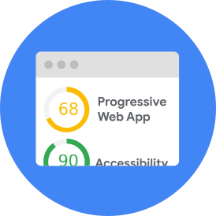

project_path: /web/fundamentals/_project.yaml
book_path: /web/fundamentals/_book.yaml

{# wf_updated_on: 2018-02-27 #}
{# wf_published_on: 2018-02-26 #}
{# wf_blink_components: N/A #}

# How To Think About Speed Tools {: .page-title }

Google has put out a lot of guidance around performance data and performance
tooling. The goal of this infographic is to consolidate this guidance for
developers and marketers to help them understand how to think about performance
and navigate all of Google's performance tool offerings

<a class="button download gc-analytics-event"
href="pdf/Infographic_HowToThinkAboutSpeedTools.pdf" data-category="webFu"
data-label="speed-scorecard" target="_blank">Download the PDF version</a>

## Common myths about performance

{: .attempt-left .myth }

### Myth 1 {: .myth }

**User experience can be captured with a single metric.** 
Good user experience is not captured by a single point in time. It's composed of
a series of key milestones in your users' journey. Understand the different
metrics and track the ones that are important to your users' experience.
{: .myth }

{: .attempt-left .myth }

### Myth 2 {: .myth }

**User experience can be captured with a single “representative user.”** 
Real-world performance is highly variable due to differences in users’ devices,
network performance, and other factors. Calibrate your lab and development
environment to test a variety of such different conditions. Use field data to
inform selection of test parameters for device type (i.e. mobile vs desktop),
network connections (i.e. 3G or 4G), and other key variables.
{: .myth }

{: .attempt-left .myth }

### Myth 3 {: .myth }

**My website loads fast for me, so it should load fast for my users.** 
The devices and networks that developers test load performance on are often much
faster than what your users actually experience. Use field data to understand
what form factors and networks your users are on and appropriately mirror those
conditions when you test performance.
{: .myth }

## Understanding lab vs. field data

### Lab data

{: .attempt-right }

When performance data is collected within a controlled environment with
predefined device and network settings. This offers reproducible results and
debugging capabilities to help identify, isolate, and fix performance issues.

#### Strengths {: .compare-better }

- Helpful for debugging performance issues
- End-to-end and deep visibility into the user experience
- Reproducible testing and debugging environment

#### Limitations {: .compare-worse }

- Might not capture real-world bottlenecks
- Cannot correlate against real-world page KPIs

Note: Tools like [Lighthouse](/web/tools/lighthouse/) and
[WebPageTest](https://www.webpagetest.org/) collect this.

### Field data

{: .attempt-right }

When you collect performance data from real page loads your users are
experiencing in the wild. Also called Real User Monitoring (or RUM).

#### Strengths {: .compare-better }

- Captures true real-world user experience
- Enables correlation to business key performance indicators

#### Limitations {: .compare-worse }

- Restricted set of metrics
- Limited debugging capabilities

Note: Tools like Speed Scorecard, [Chrome UX
Report](/web/tools/chrome-user-experience-report/), and the Page Speed Insights
speed score report this.

## What are the different performance tools?

  

    
    <h3>Lighthouse</h3>
    
Gives you personalized advice on how to improve your website across performance,
accessibility, PWA, SEO, and other best practices.

  

  

    
    <h3>WebPageTest</h3>
    
Allows you to compare performance of one or more pages in controlled lab
environment, and deep dive into performance stats and test performance on a real
device. You can also run Lighthouse on WebPageTest.

  

  

    
    <h3>PageSpeed Insights</h3>
    
Shows speed field data for your site, alongside suggestions for common
optimizations to improve it.

  

  

    
    <h3>TestMySite</h3>
    
Allows you to diagnose a webpage’s performance across devices, and provides a
list of fixes for improving the experience from Webpagetest and PageSpeed
Insights.

  

  

    
    <h3>Speed Scorecard</h3>
    
Allows you to compare your mobile site speed against your peers in over 10
countries. Mobile site speed is based on real-world data from the <a
href="https://developers.google.com/web/tools/chrome-user-experience-report/">Chrome
User Experience Report</a>.

  

  

    
    <h3>Impact Calculator</h3>
    
Allows you to estimate the potential revenue opportunity of improving your
mobile site speed, based on benchmark data from Google Analytics.

  

  

    
    <h3>Chrome Developer Tools</h3>
    
Allows you to profile the runtime of a page, identify, and debug performance bottlenecks.

  

## So you're a...

{: .attempt-left .role }

**Marketer or developer trying to build a business case for improving user
experience of your website. You speak dollars and cents and are looking for
monetary figures that can help you quantify the opportunity cost and expected
lift.**

- Use the **Speed Scorecard** to see how your mobile site speed compares against
your  peers in more than 10 countries. Scores are based on real world data from
Chrome User Experience Report.
- Use the **Impact Calculator** to estimate the potential revenue opportunity of
improving your mobile site speed. Impact is driven by benchmark data from Google
Analytics.
- Use **TestMySite** to test your page’s mobile loading time alongside industry
benchmarks and to learn how simple fixes can speed up your site and decrease
visitor loss.

{: .attempt-left .role }

**Developer trying to understand current performance of your site, as
experienced by real-world Chrome users, and looking for audit recommendations
against top industry trends and guidelines.**

**PageSpeed Insights** helps you understand the real-world performance of your
site, as experienced by Chrome users, and recommends optimization
opportunities.

{: .attempt-left .role }

**Developer trying to understand and audit a website against modern web
performance best practices.**

**Lighthouse** contains a comprehensive set of performance opportunities; it
provides you with a list of performance opportunities missing from your page,
and the time saved by implementing each optimization, which can help you
understand what you should do.

{: .attempt-left .role }

**Developer looking for technical guidance on how to debug/deep-dive into the
performance of your site.**

Chrome Developer Tools (CDT) contains a Performance Panel that allows you to
drill-down into performance issues with your site by profiling your site with
customized configurations, allowing you to track down performance bottlenecks.
You can use CDT on either production or development versions of a website.

WebPageTest contains an advanced suite of metrics and trace viewers. It enables
deep diving into the performance of your site on real mobile hardware with
network conditions.
