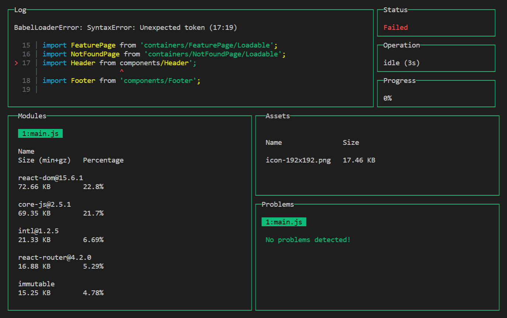
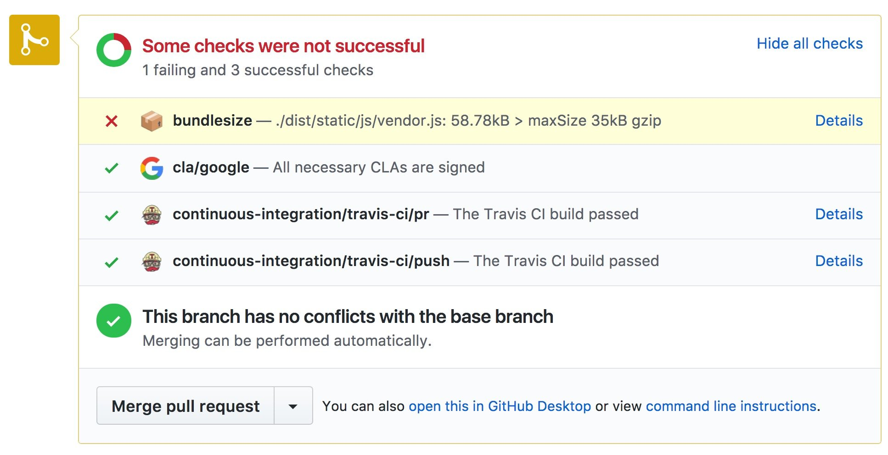
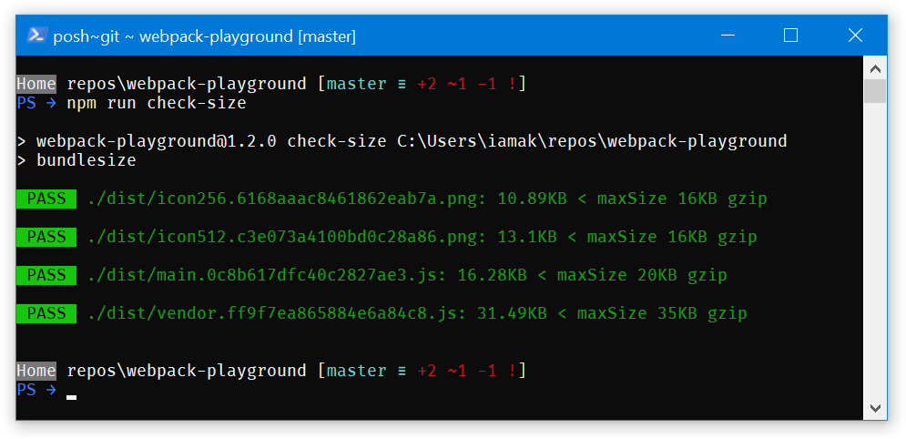
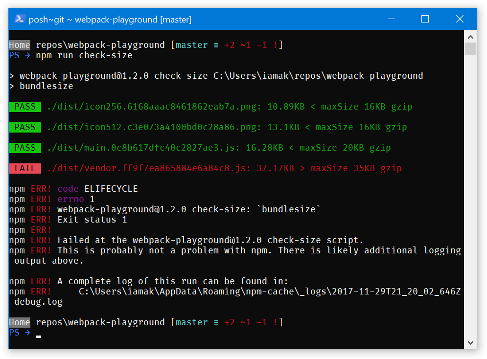
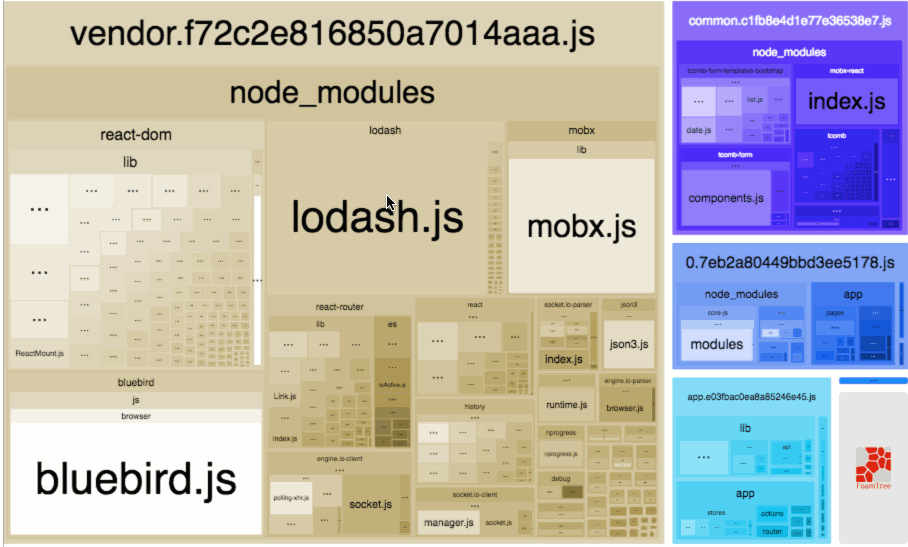

project_path: /web/fundamentals/_project.yaml
book_path: /web/fundamentals/_book.yaml
description: What tools to use to keep track of and analyze the webpack bundle

{# wf_updated_on: 2017-12-18 #}
{# wf_published_on: 2017-12-18 #}
{# wf_blink_components: N/A #}

# Monitor and analyze the app {: .page-title }



Even when you configure webpack to make the app as small as possible, it’s still important to keep
track of it and know what it includes. Otherwise, you can install a dependency that will make the
app twice as large – and won’t even notice it!

This section describes tools that help you to understand your bundle.

## Keep track of the bundle size

To monitor your app size, use
[webpack-dashboard](https://github.com/FormidableLabs/webpack-dashboard/) during development and
[bundlesize](https://github.com/siddharthkp/bundlesize) on CI.

### webpack-dashboard

[webpack-dashboard](https://github.com/FormidableLabs/webpack-dashboard/) enhances webpack output
with sizes of dependencies, progress and other details. Here’s how it looks:

<figure>
  
</figure>

This dashboard helps to track large dependencies – if you add one, you’ll immediately see it in
the _Modules_ section!

To enable it, install the `webpack-dashboard` package:

    npm install webpack-dashboard --save-dev

And add the plugin into the `plugins` section of the config:

    // webpack.config.js
    const DashboardPlugin = require('webpack-dashboard/plugin');

    module.exports = {
      plugins: [
        new DashboardPlugin(),
      ],
    };

or using `compiler.apply()` if you’re using an Express-based dev server:

    compiler.apply(new DashboardPlugin());

Feel free to play with the dashboard to find the probable places for improvement! For example,
scroll through the _Modules_ section to find what libraries are too large and could be replaced with
smaller alternatives.

### bundlesize

[bundlesize](https://github.com/siddharthkp/bundlesize) verifies that webpack assets don’t exceed
the specified sizes. Integrate it with a CI to get notified when the app becomes too large:

<figure>
  
</figure>

To configure it:

**Find out the maximum sizes**

<ol>
<li>Optimize the app to make it as small as possible. Run the production build.</li>

<li>Add the <code>bundlesize</code> section into <code>package.json</code> with the following
content:

<pre class="prettyprint">
// package.json
{
  "bundlesize": [
    {
      "path": "./dist/*"
    }
  ]
}
</pre></li>

<li>Execute <code>bundlesize</code> with <a
href="https://medium.com/@maybekatz/introducing-npx-an-npm-package-runner-55f7d4bd282b">npx</a>:

<pre class="prettyprint">
npx bundlesize
</pre>

This will print the gzipped size of each file:

<pre class="prettyprint">
PASS  ./dist/icon256.6168aaac8461862eab7a.png: 10.89KB
PASS  ./dist/icon512.c3e073a4100bd0c28a86.png: 13.1KB
PASS  ./dist/main.0c8b617dfc40c2827ae3.js: 16.28KB
PASS  ./dist/vendor.ff9f7ea865884e6a84c8.js: 31.49KB
</pre>

</li>

<li>Add 10-20% to each size, and you’ll get the maximum sizes. This 10-20% margin would let you
develop the app as usual while warning you when its size grows too much.</li>
</ol>

**Enable `bundlesize`**

<ol start="5">
<li>Install the <code>bundlesize</code> package as a development dependency:</li>

<pre class="prettyprint">
npm install bundlesize --save-dev
</pre>

</li>

<li>In the <code>bundlesize</code> section in the <code>package.json</code>, specify the concrete
maximum sizes. For some files (e.g., images), you might want to specify the maximum size per file
type, not per each file:

<pre class="prettyprint">
// package.json
{
  "bundlesize": [
    {
      "path": "./dist/*.png",
      "maxSize": "16 kB",
    },
    {
      "path": "./dist/main.*.js",
      "maxSize": "20 kB",
    },
    {
      "path": "./dist/vendor.*.js",
      "maxSize": "35 kB",
    }
  ]
}
</pre>

</li>

<li>
Add an npm script to run the check:

<pre class="prettyprint">
// package.json
{
  "scripts": {
    "check-size": "bundlesize"
  }
}
</li>

<li>Configure the CI to execute <code>npm run check-size</code> on each push. (And <a
href="https://github.com/siddharthkp/bundlesize#2-build-status">integrate <code>bundlesize</code>
with GitHub</a> if you’re developing the project on it.)
</li>
</ol>

That’s it! Now, if you run `npm run check-size` or push the code, you’ll see if the output files are
small enough:

<figure>
  
</figure>

Or, in case of failures:

<figure>
  
</figure>

### Further reading {: .hide-from-toc }

- Alex Russell [about the real-world loading time we should
target](https://infrequently.org/2017/10/can-you-afford-it-real-world-web-performance-budgets/)

## Analyze why the bundle is so large

You might want to dig deeper into the bundle to see what modules take space in it. Meet
[webpack-bundle-analyzer](https://github.com/webpack-contrib/webpack-bundle-analyzer):

<figure>
  
  <figcaption>(Image from <a
href="https://github.com/webpack-contrib/webpack-bundle-analyzer">github.com/webpack-contrib/webpack
-bundle-analyzer</a>)</figcaption>
</figure>

webpack-bundle-analyzer scans the bundle and builds a visualization of what’s inside it. Use this
visualization to find large or unnecessary dependencies.

To use the analyzer, install the `webpack-bundle-analyzer` package:

    npm install webpack-bundle-analyzer --save-dev

add a plugin to the webpack config:

    // webpack.config.js
    const BundleAnalyzerPlugin = require('webpack-bundle-analyzer').BundleAnalyzerPlugin;
    
    module.exports = {
      plugins: [
        new BundleAnalyzerPlugin(),
      ],
    };

and run the production build. The plugin will open the stats page in a browser.

Note: By default, the stats page shows the size of parsed files (i.e., of files as they appear in
the bundle). You’ll likely want to compare gzip sizes since that’s closer to what real users
experience. Use the sidebar on the left to switch the sizes.

Note: If you use the
[ModuleConcatenationPlugin](https://webpack.js.org/plugins/module-concatenation-plugin/), it might
merge a part of modules in the webpack-bundle-analyzer output, making the report less detailed. If
you use this plugin, disable it during the analysis.

Here’s what to look for in the report:

- **Large dependencies.** Why are they so large? Are there smaller alternatives (e.g., Preact
instead of React)? Do you use all the code it includes (e.g., Moment.js includes a lot of locales
that are often not used and could be dropped TODO: link to the repo with Moment.js optimizations)?

- **Duplicated dependencies.** Do you see the same library repeating in multiple files? (Use, e.g.,
the `CommonsChunkPlugin` to move it into a common file.) Or does the bundle have multiple versions
of the same library?

- **Similar dependencies.** Are there similar libraries that do approximately the same job? (E.g.
`moment` and `date-fns`, or `lodash` and `lodash-es`.) Try sticking with a single tool.

Also, check out Sean Larkin’s [great analysis of webpack
bundles](https://medium.com/webpack/webpack-bits-getting-the-most-out-of-the-commonschunkplugin-ab38
9e5f318).

## Summing up

- Use `webpack-dashboard` and `bundlesize` to stay tuned of how large your app is

- Dig into what builds up the size with `webpack-bundle-analyzer`
