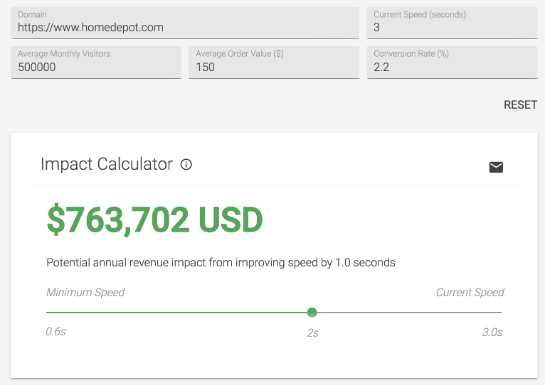
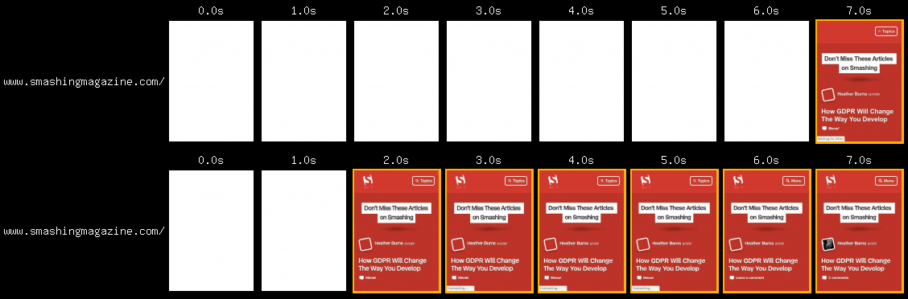
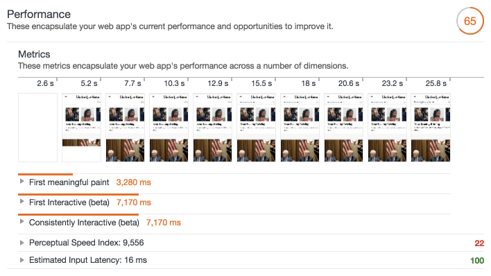

project_path: /web/fundamentals/_project.yaml
book_path: /web/fundamentals/_book.yaml
description: Thanks to mobile device and network proliferation, more people are using the web than ever before. As this user base grows, performance is more important than ever. In this article, find out why performance matters, and learn what you can do to make the web faster for everyone.

{# wf_updated_on: 2018-10-04 #}
{# wf_published_on: 2018-03-08 #}
{# wf_blink_components: N/A #}

# Why Performance Matters {: .page-title }



In our shared pursuit to push the web to do more, we're running into a
common problem: performance. Sites have more features than
ever before. So much so, that many sites now struggle to achieve a high level
of performance across a variety of network conditions and devices.

Performance issues vary. At best, they create small delays that are only briefly
annoying to your users. At worst, they make your site completely inaccessible,
unresponsive to user input, or both.

## Performance is about retaining users

We want users to interact meaningfully with what we build. If it's a
blog, we want people to read posts. If it's an online store, we want them to
buy stuff. If it's a social network, we want them
to interact with each other.

Performance plays a major role in the success of any online venture. Here are some
case studies that show how high-performing sites engage and retain users better than
low-performing ones:

- [Pinterest increased search engine traffic and sign-ups by 15%][pinterest] when
  they reduced perceived wait times by 40%.
- [COOK increased conversions by 7%, decreased bounce rates by 7%, and increased
  pages per session by 10%][COOK] when they reduced average page load time by 850
  milliseconds.

[pinterest]: https://medium.com/@Pinterest_Engineering/driving-user-growth-with-performance-improvements-cfc50dafadd7
[COOK]: https://www.nccgroup.trust/globalassets/resources/uk/case-studies/web-performance/cook-case-study.pdf

Here are a couple case studies where low performance had a negative impact on business
goals:

- [The BBC found they lost an additional 10% of users][BBC] for every additional second
  their site took to load.
- DoubleClick by Google found 53% of mobile site visits were abandoned if a page took
  longer than 3 seconds to load.

[BBC]: https://www.creativebloq.com/features/how-the-bbc-builds-websites-that-scale

In the same DoubleClick by Google study cited above, it
was found that sites loading within 5 seconds had 70% longer sessions, 35% lower
bounce rates, and 25% higher ad viewability than sites taking nearly four times
longer at 19 seconds. To get a rough idea of how your site's performance
compares with your competitors, [check out the Speed Scorecard
tool](https://www.thinkwithgoogle.com/feature/mobile/).

<figure>
  
  <figcaption><b>Figure 1</b>. Speed Scorecard comparing the performance of four
competing sites using Chrome UX Report data from 4G network users in the United
States.</figcaption>
</figure>

## Performance is about improving conversions

Retaining users is crucial to improving conversions. Slow sites
have a negative impact on revenue, and the opposite is also true. Here are some
examples of how performance has played a role in making businesses more (or
less) profitable:

- For Mobify, [every 100ms decrease in homepage load speed worked out to a **1.11%
increase** in session-based conversion, yielding an average annual revenue
increase of **nearly
$380,000**](http://resources.mobify.com/2016-Q2-mobile-insights-benchmark-report.html).
Additionally, a 100ms decrease in checkout page load speed amounted to a **1.55%
increase** in session-based conversion, which in turn yielded an average annual
revenue increase of **nearly $530,000**.
- DoubleClick found publishers whose sites loaded within five seconds earned up
to **twice as much ad revenue** than sites loading within 19 seconds.
- [When AutoAnything reduced page load time by half, they saw **a boost of 12-13%
in
sales**](https://www.digitalcommerce360.com/2010/08/19/web-accelerator-revs-conversion-and-sales-autoanything/).

If you run a business on the web, performance is crucial. If your site's user
experience is fast and responsive to user input, it can only serve you well. To
see how performance could potentially affect your revenue, check out the [Impact
Calculator](https://www.thinkwithgoogle.com/feature/mobile/) tool.

<figure>
  
  <figcaption><b>Figure 2</b>. The Impact Calculator estimates how much
revenue you stand to gain by improving site performance.</figcaption>
</figure>

## Performance is about the user experience

When you navigate to a URL, you do so from any number of potential starting
points. Depending on a number of
conditions, such as connection quality and the device you're using, your
experience could be quite different from another user's.

<figure>
  
  <figcaption><b>Figure 3</b>. A comparison of page load on a very slow connection
(top) versus a faster connection (bottom).</figcaption>
</figure>

As a site begins to load, there's a period of time where users wait for content
to appear. Until this happens, there's no user experience to speak of. This lack
of an experience is fleeting on fast connections. On slower connections,
however, users are forced to wait. Users may experience more problems as
page resources slowly trickle in.

Performance is a foundational aspect of
good user experiences. When sites ship a lot of code, browsers must use megabytes
of the user's data plan in order to download the code. Mobile devices have limited
CPU power and memory. They often get overwhelmed with what we might consider a
small amount of unoptimized code. This creates poor performance which leads
to unresponsiveness. Knowing what we know about human behavior, users will only
tolerate low performing applications for so long before abandoning them.
If you want to know more about
how to assess your site's performance and find opportunities for improvement,
check out [_How to Think About Speed Tools_](/web/fundamentals/performance/speed-tools/).

<figure>
  
  <figcaption><b>Figure 4</b>. Page performance overview as seen in <a
href="/web/tools/lighthouse/">Lighthouse</a>.</figcaption>
</figure>

## Performance is about people

Poorly performing sites and applications can also pose real costs for the
people who use them.

[As mobile users continue to make up a larger portion of internet users
worldwide](http://gs.statcounter.com/platform-market-share/desktop-mobile-tablet),
it's important to bear in mind that many of these users access the web through
mobile LTE, 4G, 3G and even 2G networks. As Ben Schwarz of Calibre points out
in [this study of real world
performance](https://building.calibreapp.com/beyond-the-bubble-real-world-performance-9c991dcd5342),
the cost of prepaid data plans is decreasing, which in turn is making access to
the internet more affordable in places where it once wasn't. Mobile
devices and internet access are no longer luxuries.
They are common tools necessary to navigate and function in an increasingly
interconnected world.

[Total page size has been steadily increasing since at least
2011](http://beta.httparchive.org/reports/state-of-the-web#bytesTotal), and the
trend appears to be continuing. As the typical page sends more data, users
must replenish their metered data plans more often, which costs them money.

In addition to saving your users money, fast and lightweight user experiences
can also prove crucial for users in crisis. Public resources such as hospitals,
clinics, and crisis centers have online resources that give users important
and specific information that they need during a crisis. [While design is
pivotal in presenting important information efficiently in stressful
moments](https://aneventapart.com/news/post/eric-meyer-designing-for-crisis),
the importance of delivering this information fast can't be understated.
It's part of our job.

## Where to go from here

While the lists below may seem daunting, understand
you don't need to do _all_ of these things to improve the performance of your
site. They are just starting points, so don't feel overwhelmed!
_Anything_ you can do to improve performance will be helpful to your users.

### Mind what resources you send

An effective method of building high performance applications is to [audit
_what_ resources you send to
users](/web/fundamentals/performance/optimizing-content-efficiency/eliminate-downloads).
While the [Network panel in Chrome DevTools](/web/tools/chrome-devtools/network-performance/)
does a fantastic job of summarizing all the resources used on a given page, it can be daunting to know
where to start if you haven't considered performance until now. Here are a few
suggestions:

- If you use Bootstrap or Foundation to build your UI, ask yourself if they're
necessary. Such abstractions add heaps of CSS the browser must download, parse,
and apply to a page, all before your site-specific CSS enters the
picture.
[Flexbox](https://developer.mozilla.org/en-US/docs/Web/CSS/CSS_Flexible_Box_Layout)
and [Grid](https://developer.mozilla.org/en-US/docs/Web/CSS/CSS_Grid_Layout) are
superb at creating both simple and complex layouts with relatively little code.
[Because CSS is a render blocking
resource](/web/fundamentals/performance/critical-rendering-path/render-blocking-css),
the overhead of a CSS framework can delay rendering significantly. You can
speed up your rendering by removing unnecessary overhead whenever possible.
- JavaScript libraries are convenient, but not always necessary. Take jQuery for
example: Element selection has been greatly simplified thanks to methods like
[`querySelector`](https://developer.mozilla.org/en-US/docs/Web/API/Document/querySelector)
and
[`querySelectorAll`](https://developer.mozilla.org/en-US/docs/Web/API/Document/querySelectorAll).
Event binding is easy with
[`addEventListener`](https://developer.mozilla.org/en-US/docs/Web/API/EventTarget/addEventListener).
[`classList`](https://developer.mozilla.org/en-US/docs/Web/API/Element/classList),
[`setAttribute`](https://developer.mozilla.org/en-US/docs/Web/API/Element/setAttribute),
and
[`getAttribute`](https://developer.mozilla.org/en-US/docs/Web/API/Element/getAttribute)
offer easy ways of working with classes and element attributes. If you must use
a library, research for leaner alternatives. For example,
[Zepto](http://zeptojs.com/) is a smaller jQuery alternative, and
[Preact](https://preactjs.com/) is a much smaller alternative to React.
- Not all websites need to be single page applications (SPAs), as they often make
extensive use of JavaScript. [JavaScript is the most expensive resource we serve
on the web byte for
byte](https://medium.com/dev-channel/the-cost-of-javascript-84009f51e99e), as it
must not only be downloaded, but parsed, compiled and executed as well. For
example, news and blog sites with optimized front end architecture can perform
well as traditional multipage experiences. Particularly if [HTTP
caching](/web/fundamentals/performance/optimizing-content-efficiency/http-caching)
is configured properly, and optionally, if a [service
worker](/web/fundamentals/primers/service-workers/) is used.

### Mind how you send resources

Efficient delivery is vital to building fast user experiences.

- [Migrate to HTTP/2](/web/fundamentals/performance/http2/). HTTP/2 addresses many
performance problems inherent in HTTP/1.1, such as concurrent request limits and
the lack of header compression.
- [Download resources earlier using resource
hints](/web/fundamentals/performance/resource-prioritization). `rel=preload` is
one such resource hint that allows early fetches of critical resources before
the browser would otherwise discover them. [This can have a pronounced positive
effect](https://medium.com/reloading/preload-prefetch-and-priorities-in-chrome-776165961bbf#0106)
on page rendering and lowering [Time to
Interactive](/web/tools/lighthouse/audits/time-to-interactive) when used
judiciously. [`rel=preconnect` is another resource hint that can mask the
latency of opening new connections for resources hosted on third party
domains](https://www.igvita.com/2015/08/17/eliminating-roundtrips-with-preconnect/).
- Modern sites ship [a _lot_ of
JavaScript](http://httparchive.org/trends.php#bytesJS&reqJS) [and
CSS](http://httparchive.org/trends.php#bytesCSS&reqCSS) on average. It was
common to bundle styles and scripts into large bundles in HTTP/1 environments.
This was done because a large amount of requests was detrimental to performance.
This is no longer the case now that HTTP/2 is on the scene, as multiple,
simultaneous requests are cheaper. [Consider using code splitting in
webpack](https://webpack.js.org/guides/code-splitting/) to limit the amount of
scripts downloaded to only what is needed by the current page or view. Separate
your CSS into smaller template or component-specific files, and only include
those resources where they're likely to be used.

### Mind how much data you send

Here are some suggestions for limiting _how much_ data you send:

- [Minify text
assets](/web/fundamentals/performance/optimizing-content-efficiency/optimize-encoding-and-transfer#minification_preprocessing_context-specific_optimizations).
Minification is the removal of unnecessary whitespace, comments and other
content in text-based resources. It significantly reduces the amount of data you
send to users without impacting functionality. [Use uglification in
JavaScript](https://www.npmjs.com/package/uglifyjs) to get more savings
through shortening variable and method names. Since SVG is a text-based image
format, [it can be optimized with SVGO](https://github.com/svg/svgo).
- [Configure your server to compress
resources](/web/fundamentals/performance/optimizing-content-efficiency/optimize-encoding-and-transfer).
Compression drastically reduces the amount of data you send to users,
_especially_ text assets. GZIP is a popular option, but [Brotli compression can go
further](https://www.smashingmagazine.com/2016/10/next-generation-server-compression-with-brotli/).
Understand, however, that compression is _not_ a catch-all for performance woes:
Some file formats which are implicitly compressed (e.g., JPEG, PNG, GIF, WOFF,
et cetera) don't respond to compression because they're already compressed.
- [Optimize
images](/web/fundamentals/performance/optimizing-content-efficiency/automating-image-optimization/)
to ensure your site sends as little image data as possible. [Since images make
up a large portion of the average per-page payload on the
web](http://httparchive.org/trends.php#bytesImg&reqImg), image optimization
represents a uniquely large opportunity to boost performance.
- If you have time, consider serving alternative image formats.
[WebP](/speed/webp/) enjoys reasonably [broad browser
support](https://caniuse.com/#feat=webp), and uses less data than JPEG and PNG
while keeping visual quality high. [JPEG XR is another
alternative format](https://jpeg.org/jpegxr/index.html) supported in IE and Edge
offering similar savings.
- [Deliver images
responsively](https://developer.mozilla.org/en-US/docs/Learn/HTML/Multimedia_and_embedding/Responsive_images).
The huge diversity of devices and their screens presents a tremendous
opportunity to improve performance by sending images that are the best fit for
the screens that view them. In the simplest use cases, you can add an [`srcset`
attribute](https://developer.mozilla.org/en-US/docs/Web/HTML/Element/img#attr-srcset)
to an `` element to specify an array of images the browser can choose from.
On the more complex side of things, you can use `<picture>` to help the browser
choose the most optimal format (e.g., WebP over JPEG or PNG), or serve
altogether different treatments of images for different screen sizes.
- [Use video instead of animated
GIFs](/web/fundamentals/performance/optimizing-content-efficiency/replace-animated-gifs-with-video/).
Animated GIFs are _massive_. Videos of similar quality are _far_ smaller,
often by 80% or so. If your site makes heavy use of animated GIFs, this is
probably the most impactful thing you can do to improve loading performance.
- [Client hints](http://httpwg.org/http-extensions/client-hints.html) can
tailor resource delivery based on current network conditions and device
characteristics. The `DPR`, `Width` and `Viewport-Width` headers can help you
[deliver the best images for a device using server-side code _and_ deliver less
markup](/web/updates/2015/09/automating-resource-selection-with-client-hints).
The `Save-Data` header can help you [deliver lighter application experiences for
users who are specifically asking you to do so](/web/updates/2016/02/save-data).
- The [`NetworkInformation`
API](https://developer.mozilla.org/en-US/docs/Web/API/NetworkInformation)
exposes information about the user's network connection. This information can be
used to modify application experiences for users on slower networks.

For a more holistic guide on improving performance, check out our writeup on
[the RAIL performance model](/web/fundamentals/performance/rail), which focuses
on improving both load time and application responsiveness. [Our PRPL pattern
guide is also an excellent
resource](/web/fundamentals/performance/prpl-pattern/) for improving the
performance of modern single page applications.

If you're excited to learn more about performance and how to make your site
faster, browse through our performance documentation for guides on a variety of
topics. We're constantly adding new guides and updating existing ones, so keep
coming back!

_Special thanks to [Addy Osmani](/web/resources/contributors/addyosmani), [Jeff
Posnick](/web/resources/contributors/jeffposnick), [Matt
Gaunt](/web/resources/contributors/mattgaunt), [Philip
Walton](/web/resources/contributors/philipwalton), [Vinamrata
Singal](/web/resources/contributors/vinamratasingal), [Daniel
An](https://www.thinkwithgoogle.com/marketing-resources/data-measurement/mobile-page-speed-new-industry-benchmarks/),
and [Pete LePage](/web/resources/contributors/petelepage) for their extensive
feedback in improving and launching this resource!_

## Feedback {: #feedback }


