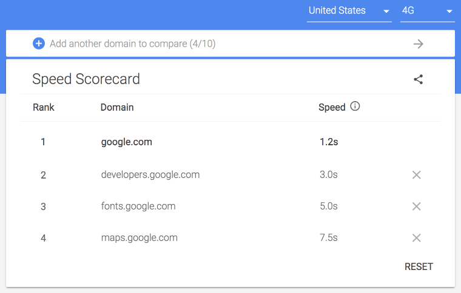

project_path: /web/fundamentals/_project.yaml
book_path: /web/fundamentals/_book.yaml
description: TBD

{# wf_updated_on: 2018-03-05 #}
{# wf_published_on: 2015-06-07 #}
{# wf_blink_components: Blink>PerformanceAPIs,Blink>JavaScript>Runtime,Blink>Input #}

# Why Performance Matters {: .page-title }



In our collective pursuit to push the web to do more, we're running into a
common problem: Performance. Sites and apps are richer in functionality, and
more powerful than ever, and as a consequence, they've become more demanding. So
much so, that we now struggle with achieving a high level of performance across
a variety of network conditions and devices.

Performance issues are highly variable. At best, slow sites and applications
incur trivial delays that impede users for only briefly annoying moments. At
worst, however, slow sites become completely inaccessible, unresponsive to
input, or both.

## Performance is about retaining users

We want users to interact meaningfully with what we build for the web, and
hopefully stick around for a while. If it's a blog or news site, we want people
to regularly read our content. If it's an online store, we want visitors to buy
our products. If it's a social networking web app, we want visitors to write
posts, upload photos, and interact with each other.

If performance is indeed a foundational aspect of the user experience, it should
be no surprise that it plays a significant role in the success of any online
venture. High performing sites will engage users, and retain them. Here are some
case studies of how high performance web sites have helped companies retain
users and boost engagement.

- [Pinterest rebuilt pages for performance, focusing on improving a custom metric
called User Perceived Wait Time, which measured the time between the start of a
navigation event and approximately when the DOM finished
loading](https://medium.com/@Pinterest_Engineering/driving-user-growth-with-performance-improvements-cfc50dafadd7).
A 40% reduction in this metric increased search engine traffic by 15%, as well
as a 15% increase in signups.
- [By cutting average page load time by 850 milliseconds, COOK Found they were
able to increase conversions by
7%.](https://www.nccgroup.trust/uk/about-us/resources/cook-real-user-monitoring-case-study/?style=Website+Performance&resources=Case+Studies)
As a side-effect, bounce rates fell by 7%, and pages per session increased by
10%.

If high performance is an asset, then poor performance is a liability
undermining your goals. Here are a couple case studies in which poorly
performing sites impeded users, and in turn, conferred a negative impact on
business goals:

- [The BBC found that they lose an additional 10% of users for every additional
second their site takes to
load](https://www.creativebloq.com/features/how-the-bbc-builds-websites-that-scale).
- [DoubleClick by Google found that 53% of mobile site visits are abandoned if a
page takes longer than 3 seconds to
load](https://www.doubleclickbygoogle.com/articles/mobile-speed-matters/).

Because we work in a highly competitive industry, we're continually focused on
the progress of our competitors. [In the same DoubleClick by Google study cited
above](https://www.doubleclickbygoogle.com/articles/mobile-speed-matters/), it
was found that sites loading within 5 seconds had 70% longer sessions, 35% lower
bounce rates, and 25% higher ad viewability than sites taking over three times
longer at 19 seconds. To get an idea of how your site performance compares with
the competition, [check out the Speed Scorecard
tool](https://www.thinkwithgoogle.com/feature/mobile/). Speed Scorecard uses
performance data from the Chrome User Experience Report, giving you a reasonably
accurate comparison of your site's performance against other sites.

<figure>
  
  <figcaption><b>Figure 1</b>. Speed Scorecard comparing the performance of four
competing sites using Chrome UX Report data from 3G network users in the United
States.</figcaption>
</figure>

## Performance is about the money

Retaining users is crucial to meeting your goals, and if you're an online
business, money is the goal. If your web presence is a significant source of
income for your business, then performance is _critical_. Slow sites have a
negative impact on revenue, and the opposite is also true. Here are some
examples of how performance has played a role in making businesses more (or
less) profitable:

- For Mobify, [Every 100ms decrease in homepage load speed **worked out to a 1.11%
increase in session-based conversion**. This amounted to **an average annual
revenue increase of nearly
$380,000**](http://resources.mobify.com/2016-Q2-mobile-insights-benchmark-report.html).
Every 100ms decrease in homepage load speed worked out to a 1.11% increase in
session-based conversion. This amounted to an average annual revenue increase of
nearly $380,000). Additionally, a 100ms decrease in checkout page load speed
proved even more effective, **amounting to a 1.55% increase in session-based
conversion**, which amounted to **an average annual revenue increase of nearly
$530,000**.
- Do you depend on ad revenue as a source of income? Then it might interest you to
know that DoubleClick found that [publishers whose sites loaded within five
seconds earned up to **twice as much ad revenue** than sites loading within 19
seconds](https://www.doubleclickbygoogle.com/articles/mobile-speed-matters/).
- [When AutoAnything reduced page load time by half, **they saw a boost of 12-13%
in
sales**](https://www.digitalcommerce360.com/2010/08/19/web-accelerator-revs-conversion-and-sales-autoanything/).

On this subject, there can be no doubt: If you run a business on the web, the
importance of site performance cannot be overstated. If your site's user
experience is fast and responsive to user input, you can only profit from it. If
you want to see how your site's revenue could be affected by performance, then
check out our [Impact Calculator
tool](https://www.thinkwithgoogle.com/feature/mobile/), which approximates what
you could stand to gain if you focus on speed!

<figure>
  
  <figcaption><b>Figure 2</b>. The impact calculator tool estimates how much
revenue you stand to gain by improving site performance.</figcaption>
</figure>

## Performance is about the user experience

When you navigate to a URL, you do so from any number of potential starting
points, potentially discarding one experience for another in the process.
Depending on any number of conditions (e.g., connection quality, server and
front end architecture, etc), what you experience may be very different.

<figure>
  
  <figcaption><b>Figure 3</b>. A comparison of page load on a very slow connection
(top) versus a faster connection (bottom).</figcaption>
</figure>

As a site loads, there's a period of time where the user must wait until content
begins rendering to the browser window. Until this happens, there is a user
experience void. This void may be so limited in its existence as to be
unnoticeable on high bandwidth and low latency connections. On slower
connections, however, it stretches on as the user waits for something to appear.
When rendering finally _does_ start in such a scenario, users may be plagued by
further problems as styles, scripts, images and other resources slowly trickle
in, each bringing their own specific performance problems to the table:
Slow-loading CSS prolongs rendering, huge JavaScript bundles delay users from
interacting with applications, and more.

Consequently, it could be argued that performance is foundational to a positive
user experience. When sites ship a lot of code, performance problems become
apparent as browsers chew through megabytes of it on slow networks. Devices with
limited processing power and memory can have trouble coping even with what we
might consider a modest amount of unoptimized code. As poor performance
persists, application responsiveness and availability diminishes. Knowing what
we know about human behavior, poorly performing applications will only be
tolerated for so long before users abandon them. This should give you pause. If
you have goals in mind for your site, check out our guide [_How to Think About
Speed Tools_](/web/fundamentals/performance/speed-tools/) to find out which
tools help you quantify performance, and which tools help you address
performance concerns.

<figure>
  
  <figcaption><b>Figure 4</b>. Page performance overview as seen in
Lighthouse.</figcaption>
</figure>

But before next steps can be explored, let's first look at some quick case
studies of how performance can help—or hinder—your site and the goals you have
in mind for it.

## Performance is about people

While meeting business goals is vital to the financial success and well being of
businesses, we tend to overlook potential challenges people face as they
navigate the web. Performance should not be seen solely as a means of advancing
business and financial goals, but also as ethically responsible behavior. Poorly
performing sites and applications can pose real consequences and costs for
people who use them.

[As mobile users continue to make up a significant portion of internet users
worldwide](http://gs.statcounter.com/platform-market-share/desktop-mobile-tablet),
it's important to keep in mind that many of these users access the web through
mobile LTE, 4G, 3G and even 2G networks. [As Ben Schwarz of Calibre points out
in this study of real world
performance](https://building.calibreapp.com/beyond-the-bubble-real-world-performance-9c991dcd5342),
the cost of prepaid data plans is decreasing. This trend is making access to the
internet more affordable in places where it once wasn't. Simply put, mobile
devices and internet access are no longer luxuries for well-to-do consumers with
high amounts of discretionary income. They're necessary to navigate and function
in an increasingly interconnected world.

[Total page size has been steadily increasing since at least
2011](http://beta.httparchive.org/reports/state-of-the-web#bytesTotal), and the
trend appears to be continuing. As the amount of data the typical page delivers
increases, these data plans become less economical. 500 MB of data at this point
in the web's existence won't go very far, and when plans run out they must be
replenished. Replenishment may be altogether unaffordable for some.

While fast and lightweight user experiences show economic consideration, they
can also prove crucial for users in crisis. Public resources such as hospitals,
clinics, and crisis centers have online resources which convey important and
specific information that a person needs in the midst of an emergency. [While
design is crucial in presenting important information efficiently in a
crisis](https://aneventapart.com/news/post/eric-meyer-designing-for-crisis), the
importance of delivering vital information expediently can't be understated.
It's part of our job.

### Where to go from here

Now that you know _why_ performance matters and what factors impact it, you
might be wondering "where next?" To help out, we'll cover three pragmatic
performance considerations, complete with some suggestions of what you can do to
address each. While these lists may seem daunting, understand that you don't
need to do _all_ of these things to substantially improve the performance of
your site. It's merely a list of potential starting points. Don't feel
overwhelmed! _Anything_ you can do to improve performance will be helpful to
your users.

### Mind what resources you send

An effective way of creating high performance applications is to [audit _what_
resources you send to
users](/web/fundamentals/performance/optimizing-content-efficiency/eliminate-downloads).
While the [network panel in Chrome's developer
tools](/web/tools/chrome-devtools/network-performance/) does a fantastic job of
summarizing the amount and size of all page resources, it can be daunting to
know where to start if you haven't considered performance until now. Consider
this list of opportunities when you architect or refactor applications for
performance:

- If you use Bootstrap or Foundation to build your UI, ask yourself if they're
necessary. Such abstractions adds heaps of CSS the browser must download, parse,
and apply to the document, all before before your site-specific CSS enters the
picture. Modern layout modes such as
[Flexbox](https://developer.mozilla.org/en-US/docs/Web/CSS/CSS_Flexible_Box_Layout)
and [Grid](https://developer.mozilla.org/en-US/docs/Web/CSS/CSS_Grid_Layout) are
superb at creating both simple and complex layouts with little code. [Because
CSS is a render blocking
resource](/web/fundamentals/performance/critical-rendering-path/render-blocking-css)
in typical use cases, the overhead of a CSS framework can introduce significant
rendering delays.
- JavaScript libraries are useful, but not always necessary. Take jQuery for
example: Element selection has been greatly simplified thanks to methods like
[`querySelector`](https://developer.mozilla.org/en-US/docs/Web/API/Document/querySelector)
and
[`querySelectorAll`](https://developer.mozilla.org/en-US/docs/Web/API/Document/querySelectorAll).
Event binding is easy with
[`addEventListener`](https://developer.mozilla.org/en-US/docs/Web/API/EventTarget/addEventListener).
[`classList`](https://developer.mozilla.org/en-US/docs/Web/API/Element/classList),
[`setAttribute`](https://developer.mozilla.org/en-US/docs/Web/API/Element/setAttribute),
and
[`getAttribute`](https://developer.mozilla.org/en-US/docs/Web/API/Element/getAttribute)
offer easy ways of working with classes and element attributes. If you must use
a library, research for leaner alternatives. For example,
[Zepto](http://zeptojs.com/) is a very small implementation of jQuery, and
[Preact](https://preactjs.com/) is a much smaller alternative to React.
- Not all web experiences need to be single page applications (SPAs), as they
often make extensive use of JavaScript. Many use cases may benefit best from
multipage experiences. [JavaScript is the most expensive resource we serve on
the web byte for
byte](https://medium.com/dev-channel/the-cost-of-javascript-84009f51e99e), as it
must not only be downloaded, but parsed, compiled and executed as well. News and
typical blog sites with optimized front end architecture can perform well as
traditional multipage experiences, particularly if [HTTP
caching](/web/fundamentals/performance/optimizing-content-efficiency/http-caching)
is configured properly, and optionally, if a [service
worker](/web/fundamentals/primers/service-workers/) is used.

### Mind how you send those resources

When you're at the point where you know _what_ resources you need to send for
your app to be as beautiful and functional as you want it to be, you need to
think about _how_ you send them. Like forethought and prevention, delivery is
vital to a user experience that's as fast as it can be on _every_ network
connection:

- [Migrate to HTTP/2](/web/fundamentals/performance/http2/). HTTP/2 addresses many
issues from HTTP/1.1, such as the lack of header compression and concurrent
request limits.
- [Reprioritize the delivery of critical resources with resource
hints](/web/fundamentals/performance/resource-prioritization). `rel=preload` is
one such resource hint that allows developers to initiate fetches of critical
page resources before the browser would otherwise naturally discover them.
[`rel=preload` can have a pronounced positive
effect](https://medium.com/reloading/preload-prefetch-and-priorities-in-chrome-776165961bbf#0106)
on page rendering and lowering [Time to
Interactive](/web/tools/lighthouse/audits/time-to-interactive) when used
judiciously.
- [Mask latency of cross-origin assets with
`rel=preconnect`](https://www.igvita.com/2015/08/17/eliminating-roundtrips-with-preconnect/).
Opening connections to new servers delays resource retrieval. This time can be
masked by opening connections to these domains before the browser knows it needs
to.
- On average, sites ship [a _lot_ of
JavaScript](http://httparchive.org/trends.php#bytesJS&reqJS) [and
CSS](http://httparchive.org/trends.php#bytesCSS&reqCSS). When HTTP/1.1 was
ubiquitous, it was common to bundle styles and scripts into huge bundles. This
was done because a large amount of requests was detrimental to performance. This
is no longer the case now that HTTP/2 is on the scene, as multiple, simultaneous
requests are cheaper. [Consider using code splitting in
webpack](https://webpack.js.org/guides/code-splitting/) to limit the amount of
scripts downloaded to only what is needed by the current page or view. Separate
your CSS into smaller template or component-specific bundles, and only include
those resources where relevant.

### Mind how much data you send

With some ideas of what resources are appropriate to send with your application,
and _how_ you should send them, let's cover a few suggestions for how you can
limit _how much_ data you send:

- [Minify text
assets](/web/fundamentals/performance/optimizing-content-efficiency/optimize-encoding-and-transfer#minification_preprocessing_context-specific_optimizations).
Minification is the removal of unnecessary whitespace, comments and other
content in HTML, CSS, SVG and JavaScript assets. It significantly reduces the
amount of data you send to users without impacting functionality. [Employ
uglification in JavaScript](https://www.npmjs.com/package/uglifyjs) to achieve
further savings through shortening variable and method names. Since SVG is a
text-based format, [it can be optimized with SVGO](https://github.com/svg/svgo).
- [Configure your server to compress
resources](/web/fundamentals/performance/optimizing-content-efficiency/optimize-encoding-and-transfer).
Compression drastically reduces the amount of data you send to users,
_especially_ where text assets are concerned. GZIP is a venerable format in this
space, but [Brotli compression can go
further](https://www.smashingmagazine.com/2016/10/next-generation-server-compression-with-brotli/).
Understand, however, that compression is _not_ a catch-all for performance woes:
Some file formats which are implicitly compressed (e.g., JPEG, PNG, GIF, WOFF,
et cetera) don't respond to compression because they're already compressed.
- Optimize images to aid users in downloading less data. Image optimization is an
incredibly broad and complex topic, but Addy Osmani's [_Essential Image
Optimization_](/web/fundamentals/performance/optimizing-content-efficiency/automating-image-optimization/)
makes sense of it all, outlining many opportunities for slimming down images.
[Since images make up a large portion of the average per-page payload on the
web](http://httparchive.org/trends.php#bytesImg&reqImg), image optimization
represents a uniquely large opportunity to boost performance.
- If you have time, consider serving alternative image formats.
[WebP](/speed/webp/) enjoys relatively [broad browser
support](https://caniuse.com/#feat=webp), and can undercut established formats
in file size while retaining reasonably good visual quality. [JPEG XR is another
alternative format](https://jpeg.org/jpegxr/index.html) supported in IE and Edge
that offers similar savings.
- [Use
`srcset`](https://developer.mozilla.org/en-US/docs/Web/HTML/Element/img#attr-srcset)
and/or
[`<picture>`](https://developer.mozilla.org/en-US/docs/Web/HTML/Element/picture)
to send images which are a reasonable fit for a given user's screen. In simple
use cases, you can simply add an `srcset` attribute to an `` tag to specify
an array of images the browser can choose from. In more complicated use cases,
you can use `<picture>` to help the browser choose the most optimal format
(e.g., WebP over JPEG or PNG), or serve altogether different treatments of
images for different screen sizes. In either case, [delivering images
responsively](https://developer.mozilla.org/en-US/docs/Learn/HTML/Multimedia_and_embedding/Responsive_images)
can significantly reduce data usage.
- [Client hints](http://httpwg.org/http-extensions/client-hints.html) can reveal
aspects of your user's device and connection to personalize delivery of
resources and tailor sites to be more performant in specific conditions. The
`DPR`, `Width` and `Viewport-Width` headers can help you [deliver the best
images for a device using server-side code _and_ deliver less
markup](/web/updates/2015/09/automating-resource-selection-with-client-hints).
The `Save-Data` header can help you [deliver lighter application experiences for
users who are specifically asking you to do so](/web/updates/2016/02/save-data).
You can also [use the Device Memory API to build applications that are device
memory-aware](/web/updates/2017/12/device-memory#using_the_client_hints_header).
- The [`NetworkInformation`
API](https://developer.mozilla.org/en-US/docs/Web/API/NetworkInformation) also
exposes connection information about the current connection that you can also
use (possibly in concert with client hints) to tailor the application experience
for users based on their current network conditions.

If you're excited to dive into the world of performance to learn more about
making your applications faster, browse through our performance documentation.
Keep coming back, because we're adding new content all the time!

_Special thanks to [Addy Osmani](/web/resources/contributors/addyosmani), [Jeff
Posnick](/web/resources/contributors/jeffposnick), [Matt
Gaunt](/web/resources/contributors/mattgaunt), [Philip
Walton](/web/resources/contributors/philipwalton), [Vinamrata
Singal](/web/resources/contributors/vinamratasingal), Daniel An, and [Pete
LePage](/web/resources/contributors/petelepage) for their extensive feedback in
improving and launching this resource!_
