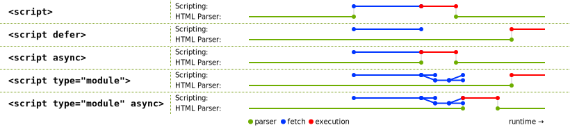
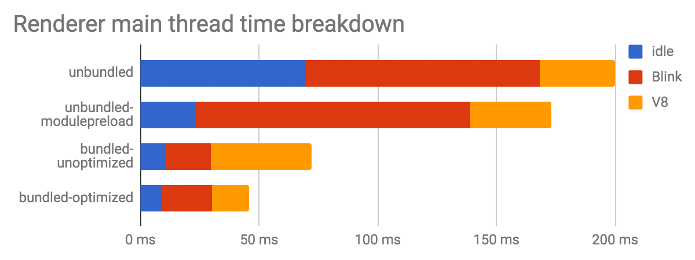

project_path: /web/fundamentals/_project.yaml
book_path: /web/fundamentals/_book.yaml

{# wf_updated_on: 2018-06-18 #}
{# wf_published_on: 2018-06-18 #}
{# wf_blink_components: N/A #}

# Using JavaScript modules on the web {: .page-title }




JavaScript modules are now [supported in all major browsers](https://caniuse.com/#feat=es6-module)!
This article explains how to use JS modules, how to deploy them responsibly, and how the Chrome
team is working to make modules even better in the future.

## What are JS modules? {: #intro }

JS modules (also known as “ES modules” or “ECMAScript modules”) are a major new feature, or rather
a collection of new features. You may have used a userland JavaScript module system in the past.
Maybe you used [CommonJS like in Node.js](https://nodejs.org/docs/latest-v10.x/api/modules.html),
or maybe [AMD](https://github.com/amdjs/amdjs-api/blob/master/AMD.md), or maybe something else.
All of these module systems have one thing in common: they allow you to import and export stuff.

JavaScript now has standardized syntax for exactly that. Within a module, you can use the `export`
keyword to export just about anything. You can export a `const`, a `function`, or any other
variable binding or declaration. Just prefix the variable statement or declaration with `export`
and you’re all set:

```js
// 📁 lib.mjs
export const repeat = (string) => `${string} ${string}`;
export function shout(string) {
  return `${string.toUpperCase()}!`;
}
```

You can then use the `import` keyword to import the module from another module. Here, we’re
importing the `repeat` and `shout` functionality from the `lib` module, and using it in our
`main` module:

```js
// 📁 main.mjs
import {repeat, shout} from './lib.mjs';
repeat('hello');
// → 'hello hello'
shout('Modules in action');
// → 'MODULES IN ACTION!'
```

You could also export a _default_ value from a module:

```js
// 📁 lib.mjs
export default function(string) {
  return `${string.toUpperCase()}!`;
}
```

Such `default` exports can be imported using any name:

```js
// 📁 main.mjs
import shout from './lib.mjs';
//     ^^^^^
```

Modules are a little different from classic scripts:

- Modules have [strict
    mode](https://developer.mozilla.org/en-US/docs/Web/JavaScript/Reference/Strict_mode) enabled by
    default.

- HTML-style comment syntax is not supported in modules, although it works in classic scripts.

        // Don’t use HTML-style comment syntax in JavaScript!
        const x = 42; <!-- TODO: Rename x to y.
        // Use a regular single-line comment instead:
        const x = 42; // TODO: Rename x to y.

- Modules have a lexical top-level scope. This means that for example, running
    `var foo = 42;` within a module does *not* create a global variable named `foo`, accessible
    through `window.foo` in a browser, although that would be the case in a classic script.

- The new static `import` and `export` syntax is only available within modules — it doesn’t work
    in classic scripts.

Because of these differences, **the same JavaScript code might behave differently when treated as
a module vs. a classic script**. As such, the JavaScript runtime needs to know which scripts are
modules.

## Using JS modules in the browser {: #browser }

On the web, you can tell browsers to treat a `<script>` element as a module by setting the `type`
attribute to `module`.

```html
<script type="module" src="main.mjs"></script>
<script nomodule src="fallback.js"></script>
```

Browsers that understand `type="module"` ignore scripts with a `nomodule` attribute. This means
you can serve a module-based payload to module-supporting browsers while providing a fallback to
other browsers. The ability to make this distinction is amazing, if only for performance! Think
about it: only modern browsers support modules. If a browser understands your module code, it also
supports [features that were around before modules](https://codepen.io/samthor/pen/MmvdOM), such as
arrow functions or `async`-`await`. You don’t have to transpile those features in your module
bundle anymore! You can [serve smaller and largely untranspiled module-based payloads to modern
browsers](https://philipwalton.com/articles/deploying-es2015-code-in-production-today/). Only
legacy browsers get the `nomodule` payload.

### Browser-specific differences between modules and classic scripts {: #module-vs-script }

As you now know, modules are different from classic scripts. On top of the platform-agnostic
differences we’ve outlined above, there are some differences that are specific to browsers.

For example, modules are evaluated only once, while classic scripts are evaluated however many
times you add them to the DOM.

```js
<script src="classic.js"></script>
<script src="classic.js"></script>
<!-- classic.js executes multiple times. -->

<script type="module" src="module.mjs"></script>
<script type="module" src="module.mjs"></script>
<script type="module">import './module.mjs';</script>
<!-- module.mjs executes only once. -->
```

Also, module scripts and their dependencies are fetched with CORS. This means that any
cross-origin module scripts must be served with the proper headers, such as
`Access-Control-Allow-Origin: *`. This is not true for classic scripts.

Another difference relates to the `async` attribute, which causes the script to download without
blocking the HTML parser (like `defer`) except it also executes the script as soon as possible,
with no guaranteed order, and without waiting for HTML parsing to finish. The `async` attribute
does not work for inline classic scripts, but it does work for inline `<script type="module">`.

### A note on file extensions {: #mjs }

You may have noticed we’re using the `.mjs` file extension for modules. On the Web, the file
extension doesn’t really matter, as long as the file is served with [the JavaScript MIME type
`text/javascript`](https://html.spec.whatwg.org/multipage/scripting.html#scriptingLanguages:javascript-mime-type).
The browser knows it’s a module because of the `type` attribute on the script element.

Still, we recommend using the `.mjs` extension for modules, for two reasons:

1. During development, it makes it crystal clear that the file is a module as opposed to a
    regular script. (It’s not always possible to tell just by looking at the code.) As mentioned
    before, modules are treated differently than regular scripts, so the difference is hugely
    important!
2. It’s consistent with Node.js, where [the experimental modules
    implementation](https://nodejs.org/api/esm.html) only supports files with the `.mjs` extension.

Note: To deploy `.mjs` on the web, your web server needs to be configured to serve files with this
extension using the appropriate `Content-Type: text/javascript` header, as mentioned above.
Additionally, you may want to configure your editor to treat `.mjs` files as `.js` files to get
syntax highlighting. Most modern editors already do this by default.

### Module specifiers {: #specifiers }

When `import`ing modules, the string that specifies the location of the module is called the
“module specifier” or the “import specifier”. In our earlier example, the module specifier is
`'./lib.mjs'`:

```js
import {shout} from './lib.mjs';
//                  ^^^^^^^^^^^
```

Some restrictions apply to module specifiers in browsers. So-called “bare” module specifiers are
currently not supported. This restriction is
[specified](https://html.spec.whatwg.org/multipage/webappapis.html#resolve-a-module-specifier)
so that in the future, browsers can allow custom module loaders to give special meaning to bare
module specifiers like the following:

```js
// Not supported (yet):
import {shout} from 'jquery';
import {shout} from 'lib.mjs';
import {shout} from 'modules/lib.mjs';
```

On the other hand, the following examples are all supported:

```js
// Supported:
import {shout} from './lib.mjs';
import {shout} from '../lib.mjs';
import {shout} from '/modules/lib.mjs';
import {shout} from 'https://simple.example/modules/lib.mjs';
```

For now, module specifiers must be full URLs, or relative URLs starting with `/`, `./`, or `../`.

### Modules are deferred by default {: #defer }

Classic `<script>`s block the HTML parser by default. You can work around it by adding [the
`defer` attribute](https://html.spec.whatwg.org/multipage/scripting.html#attr-script-defer), which
ensures that the script download happens in parallel with HTML parsing.



Module scripts are deferred by default. As such, there is no need to add `defer` to your
`<script type="module">` tags! Not only does the download for the main module happen in parallel
with HTML parsing, the same goes for all the dependency modules!

## Other module features {: #other-features }

### Dynamic `import()` {: #dynamic-import }

So far we’ve only used static `import`. With static `import`, your entire module graph needs to be
downloaded and executed before your main code can run. Sometimes, you don’t want to load a module
up-front, but rather on-demand, only when you need it — when the user clicks a link or a button,
for example. This improves the initial load-time performance. [Dynamic
`import()`](/web/updates/2017/11/dynamic-import) makes this possible!

```html
<script type="module">
  (async () => {
    const moduleSpecifier = './lib.mjs';
    const {repeat, shout} = await import(moduleSpecifier);
    repeat('hello');
    // → 'hello hello'
    shout('Dynamic import in action');
    // → 'DYNAMIC IMPORT IN ACTION!'
  })();
</script>
```

Unlike static `import`, dynamic `import()` can be used from within regular scripts. It’s an easy
way to incrementally start using modules in your existing code base. For more details, see [our
article on dynamic `import()`](/web/updates/2017/11/dynamic-import).

Note: [webpack has its own version of
`import()`](/web/fundamentals/performance/webpack/use-long-term-caching) that cleverly splits the
imported module into its own chunk, separate from the main bundle.

### `import.meta` {: #import-meta }

Another new module-related feature is `import.meta`, which gives you metadata about the current
module. The exact metadata you get is not specified as part of ECMAScript; it depends on the host
environment. In a browser, you might get different metadata than in Node.js, for example.

Here’s an example of `import.meta` on the web. By default, images are loaded relative to the
current URL in HTML documents. `import.meta.url` makes it possible to load an image relative to
the current module instead.

```js
function loadThumbnail(relativePath) {
  const url = new URL(relativePath, import.meta.url);
  const image = new Image();
  image.src = url;
  return image;
}

const thumbnail = loadThumbnail('../img/thumbnail.png');
container.append(thumbnail);
```

## Performance recommendations  {: #performance }

### Keep bundling {: #bundle }

With modules, it becomes possible to develop websites without using bundlers such as webpack,
Rollup, or Parcel. It’s fine to use native JS modules directly in the following scenarios:

- during local development
- in production for small web apps with less than 100 modules in total and with a relatively
    shallow dependency tree (i.e. a maximum depth less than 5)

However, as we learned during [our bottleneck analysis of Chrome’s loading pipeline when loading a
modularized library composed of ~300
modules](https://docs.google.com/document/d/1ovo4PurT_1K4WFwN2MYmmgbLcr7v6DRQN67ESVA-wq0/pub), the
loading performance of bundled applications is better than unbundled ones.

[](https://docs.google.com/document/d/1ovo4PurT_1K4WFwN2MYmmgbLcr7v6DRQN67ESVA-wq0/pub)

One reason for this is that the static `import`/`export` syntax is statically analyzable, and it
can thus help bundler tools optimize your code by eliminating unused exports. Static `import` and
`export` are more than just syntax; they are a critical tooling feature!

Success: **Our general recommendation is to continue using bundlers before deploying modules to
production.** In a way, bundling is a similar optimization to minifying your code: it results in a
performance benefit, because you end up shipping less code. Bundling has the same effect! Keep
bundling.

As always, [the DevTools Code Coverage
feature](/web/updates/2017/04/devtools-release-notes#coverage) can help you identify if you are
pushing unnecessary code to users. We also recommend the use of [code
splitting](/web/fundamentals/performance/webpack/use-long-term-caching#lazy-loading) to split
bundles and to defer loading of non-First-Meaningful-Paint critical scripts.

#### Trade-offs of bundling vs. shipping unbundled modules {: #bundle-tradeoffs }

As usual in web development, everything is a trade-off. Shipping unbundled modules might decrease
initial load performance (cold cache), but could actually improve load performance for subsequent
visits (warm cache) compared to shipping a single bundle without code splitting. For a 200 KB code
base, changing a single fine-grained module and having that be the only fetch from the server for
subsequent visits is way better than having to re-fetch the whole bundle.

If you’re more concerned with the experience of visitors with warm caches than first-visit
performance and have a site with less than a few hundred fine-grained modules, you could experiment
with shipping unbundled modules, measure the performance impact for both cold and warm loads, and
then make a data-driven decision!

Browser engineers are working hard on improving the performance of modules out-of-the-box. Over
time, we expect shipping unbundled modules to become feasible in more situations.

### Use fine-grained modules {: #finegrained-modules }

Get into the habit of writing your code using small, fine-grained modules. During development, it’s
generally better to have just a few exports per module than it is to manually combine lots of
exports into a single file.

Consider a module named `./util.mjs` that exports three functions named `drop`, `pluck`, and `zip`:

```js
export function drop() { /* … */ }
export function pluck() { /* … */ }
export function zip() { /* … */ }
```

If your code base only really needs the `pluck` functionality, you’d probably import it as follows:

```js
import { pluck } from './util.mjs';
```

In this case, (without a build-time bundling step) the browser still ends up having to download,
parse, and compile the entire `./util.mjs` module even though it only really needs that one export.
That’s wasteful!

If `pluck` doesn’t share any code with `drop` and `zip`, it’d be better to move it to its own
fine-grained module, e.g. `./pluck.mjs`.

```js
export function pluck() { /* … */ }
```

We can then import `pluck` without the overhead of dealing with `drop` and `zip`:

```js
import { pluck } from './pluck.mjs';
```

Note: You could use a `default` export instead of a named export here, depending on your personal
preference.

Not only does this keep your source code nice and simple, it also reduces the need for dead-code
elimination as performed by bundlers. If one of the modules in your source tree is unused, then it
never gets imported, and so the browser never downloads it. The modules that _do_ get used can be
individually [code-cached](https://v8project.blogspot.com/2018/04/improved-code-caching.html) by
the browser.

Using small, fine-grained modules helps prepare your code base for the future where [a native
bundling solution](#web-packaging) might be available.

### Preload modules {: #preload }

You can optimize the delivery of your modules further by using
[`<link rel="modulepreload">`](/web/updates/2017/12/modulepreload). This way, browsers can preload
and even preparse and precompile modules and their dependencies.

```html
<link rel="modulepreload" href="lib.mjs">
<link rel="modulepreload" href="main.mjs">
<script type="module" src="main.mjs"></script>
<script nomodule src="fallback.js"></script>
```

This is especially important for larger dependency trees. Without `rel="modulepreload"`, the
browser needs to perform multiple HTTP requests to figure out the full dependency tree. However, if
you declare the full list of dependent module scripts with `rel="modulepreload"`, the browser
doesn’t have to discover these dependencies progressively.

### Use HTTP/2 {: #http2 }

Using HTTP/2 where possible is always good performance advice, if only for [its multiplexing
support](/web/fundamentals/performance/http2/#request_and_response_multiplexing). With HTTP/2
multiplexing, multiple request and response messages can be in flight at the same time, which is
beneficial for loading module trees.

The Chrome team investigated if another HTTP/2 feature, specifically [HTTP/2 server
push](/web/fundamentals/performance/http2/#server_push), could be a practical solution for
deploying highly-modularized apps. Unfortunately, [HTTP/2 server push is tricky to get
right](https://jakearchibald.com/2017/h2-push-tougher-than-i-thought/), and web servers’ and
browsers’ implementations are not currently optimized towards highly-modularized web app use cases.
It’s hard to only push the resources that the user doesn’t already have cached, for example, and
solving that by communicating the entire cache state of an origin to the server is a privacy risk.

So by all means, go ahead and use HTTP/2! Just keep in mind that HTTP/2 server push is
(unfortunately) not a silver bullet.

## Web adoption of JS modules {: #adoption }

JS modules are slowly gaining adoption on the web. [Our usage
counters](https://www.chromestatus.com/metrics/feature/timeline/popularity/2062) show that 0.08% of
all page loads currently use `<script type="module">`. Note that this number excludes other entry
points such as dynamic `import()` or [worklets](https://drafts.css-houdini.org/worklets/).

## What’s next for JS modules? {: #next }

The Chrome team is working on improving the development-time experience with JS modules in various
ways. Let’s discuss some of them.

### Faster and deterministic module resolution algorithm {: #resolution }

We proposed a change to the module resolution algorithm that addressed a deficiency in speed and
determinism. The new algorithm is now live in both [the HTML
specification](https://github.com/whatwg/html/pull/2991) and [the ECMAScript
specification](https://github.com/tc39/ecma262/pull/1006), and is implemented in [Chrome
63](http://crbug.com/763597). Expect this improvement to land in more browsers soon!

The new algorithm is much more efficient and faster. The computational complexity of the old
algorithm was quadratic, i.e. O(n²), in the size of the dependency graph, and so was Chrome’s
implementation at the time. The new algorithm is linear, i.e. O(n).

Moreover, the new algorithm reports resolution errors in a deterministic way. Given a graph
containing multiple errors, different runs of the old algorithm could report different errors as
being responsible for the resolution failure. This made debugging unnecessarily difficult. The new
algorithm is guaranteed to report the same error every time.

### Worklets and web workers {: #worklets-workers }

Chrome now implements [worklets](https://drafts.css-houdini.org/worklets/), which allow web
developers to customize hard-coded logic in the “low-level parts” of web browsers. With worklets,
web developers can feed an JS module into the rendering pipeline or the audio processing pipeline
(and possibly more pipelines in the future!).

Chrome 65 supports [`PaintWorklet`](/web/updates/2018/01/paintapi) (a.k.a. the CSS Paint API) to
control how a DOM element is painted.

```js
const result = await css.paintWorklet.addModule('paint-worklet.mjs');
```

Chrome 66 supports [`AudioWorklet`](/web/updates/2017/12/audio-worklet), which allows you to
control audio processing with your own code. The same Chrome version started an [OriginTrial for
`AnimationWorklet`](https://groups.google.com/a/chromium.org/d/msg/blink-dev/AZ-PYPMS7EA/DEqbe2u5BQAJ),
which enables creating scroll-linked and other high-performance procedural animations.

Finally, [`LayoutWorklet`](https://drafts.css-houdini.org/css-layout-api/) (a.k.a. the CSS Layout
API) is now implemented in Chrome 67.

We’re [working](https://bugs.chromium.org/p/chromium/issues/detail?id=680046) on adding support for
using JS modules with dedicated web workers in Chrome. You can already try this feature with
`chrome://flags/#enable-experimental-web-platform-features` enabled.

```js
const worker = new Worker('worker.mjs', { type: 'module' });
```

JS module support for shared workers and service workers is coming soon:

```js
const worker = new SharedWorker('worker.mjs', { type: 'module' });
const registration = await navigator.serviceWorker.register('worker.mjs', { type: 'module' });
```

### Package name maps {: #package-name-maps }

In Node.js/npm, it’s common to import JS modules by their “package name”. For example:

```js
import moment from 'moment';
import { pluck } from 'lodash-es';
```

Currently, [per the HTML
spec](https://html.spec.whatwg.org/multipage/webappapis.html#resolve-a-module-specifier), such
“bare import specifiers” throw an exception. [Our package name maps
proposal](https://github.com/domenic/package-name-maps) allows such code to work on the web,
including in production apps. A package name map is a JSON resource that helps the browser convert
bare import specifiers into full URLs.

Package name maps are still in the proposal stage. Although we’ve thought a lot about how they
address various use cases, we’re still engaging with the community, and haven’t yet written up a
full specification. Feedback is welcome!

### Web packaging: native bundles {: #web-packaging }

The Chrome loading team is currently exploring [a native web packaging
format](https://github.com/WICG/webpackage) as a new way to distribute web apps. The core features
of web packaging are:

[Signed HTTP
Exchanges](https://wicg.github.io/webpackage/draft-yasskin-http-origin-signed-responses.html) that
allow a browser to trust that a single HTTP request/response pair was generated by the origin it
claims;
[Bundled HTTP
Exchanges](https://wicg.github.io/webpackage/draft-yasskin-dispatch-bundled-exchanges.html), that
is, a collection of exchanges, each of which could be signed or unsigned, with some metadata
describing how to interpret the bundle as a whole.

Combined, such a web packaging format would enable *multiple same-origin resources* to be *securely
embedded* in a *single* HTTP `GET` response.

Existing bundling tools such as webpack, Rollup, or Parcel currently emit a single JavaScript
bundle, in which the semantics of the original separate modules and assets are lost. With native
bundles, browsers could unbundle the resources back to their original form. In simplified terms,
you can imagine a Bundled HTTP Exchange as a bundle of resources that can be accessed in any order
via a table of contents (manifest), and where the contained resources can be efficiently stored and
labeled according to their relative importance, all while maintaining the notion of individual
files. Because of this, native bundles could improve the debugging experience. When viewing assets
in the DevTools, browsers could pinpoint the original module without the need for complex
source-maps.

The native bundle format’s transparency opens up various optimization opportunities. For example,
if a browser already has part of a native bundle cached locally, it could communicate that to the
web server and then only download the missing parts.

Chrome already supports a part of the proposal
([`SignedExchanges`](https://wicg.github.io/webpackage/draft-yasskin-http-origin-signed-responses.html)),
but the bundling format itself as well as its application to highly-modularized apps are still in
exploratory phase. Your feedback is highly welcome on the repository or via email to
<loading-dev@chromium.org>!

### Layered APIs {: #layered-apis }

Shipping new features and web APIs incurs an ongoing maintenance and runtime cost — every new
feature pollutes the browser namespace, increases startup costs, and represents a new surface to
introduce bugs throughout the codebase. [Layered APIs](https://github.com/drufball/layered-apis)
are an effort to implement and ship higher-level APIs with web browsers in a more scalable way. JS
modules are a key enabling technology for layered APIs:

- Since modules are explicitly imported, requiring layered APIs to be exposed via modules ensures
    that developers only pay for the layered APIs they use.
- Because module loading is configurable, layered APIs can have a built-in mechanism for
    automatically loading polyfills in browsers that don’t support layered APIs.

The details of how modules and layered APIs work together [are still being worked
out](https://github.com/drufball/layered-apis/issues), but the current proposal looks something
like this:

```html
<script
  type="module"
  src="std:virtual-scroller|https://example.com/virtual-scroller.mjs"
></script>
```

The `<script>` element loads the `virtual-scroller` API either from the browser’s built-in set of
layered APIs (`std:virtual-scroller`) or from a fallback URL pointing to a polyfill. This API can
do anything JS modules can do in web browsers. One example would be defining [a custom
`<virtual-scroller>` element](https://www.chromestatus.com/feature/5673195159945216), so that the
following HTML is progressively enhanced as desired:

```html
<virtual-scroller>
  <!-- Content goes here. -->
</virtual-scroller>
```

## Credits {: #credits }

Thanks to
Domenic Denicola,
Georg Neis,
Hiroki Nakagawa,
Hiroshige Hayashizaki,
Kouhei Ueno,
Kunihiko Sakamoto, and
Yang Guo
for making JS modules fast!

Also, kudos to
Eric Bidelman,
Jake Archibald,
Jason Miller
Jeffrey Posnick,
Philip Walton,
Rob Dodson,
Sam Dutton,
Sam Thorogood, and
Thomas Steiner
for reading a draft version of this guide and giving their feedback.
