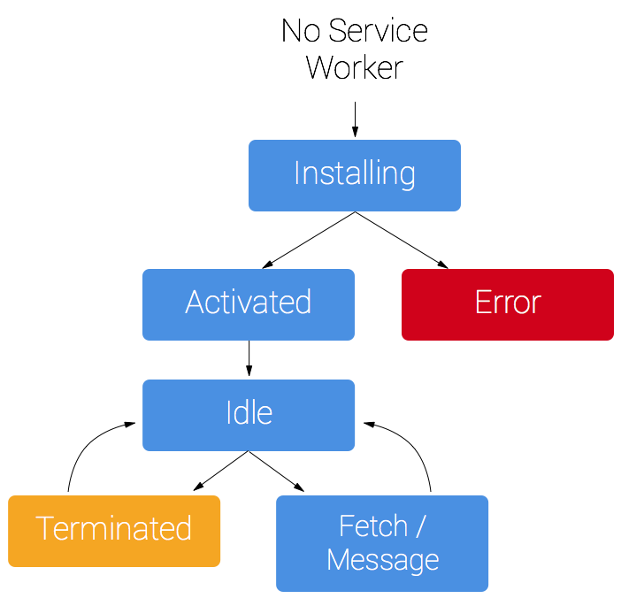
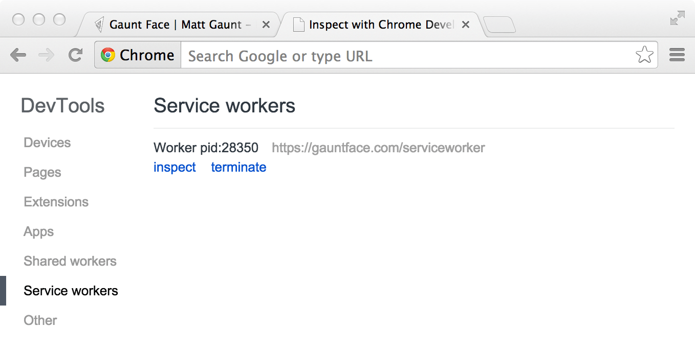

project_path: /web/fundamentals/_project.yaml
book_path: /web/fundamentals/_book.yaml
description: Rich offline experiences, periodic background syncs, push notifications&mdash;functionality that would normally require a native application&mdash;are coming to the web. Service workers provide the technical foundation that all these features rely on.

{# wf_published_on: 2014-12-01 #}
{# wf_updated_on: 2017-07-24 #}
{# wf_blink_components: Blink>ServiceWorker #}

# Service Workers: an Introduction {: .page-title }



Rich offline experiences, periodic background syncs, push
notifications&mdash;functionality that would normally require a native
application&mdash;are coming to the web. Service workers provide the technical
foundation that all these features rely on.

## What is a service worker

A service worker is a script that your browser runs in the background,
separate from a web page, opening the door to features that don't need a web
page or user interaction. Today, they already include features like
[push notifications](/web/updates/2015/03/push-notifications-on-the-open-web)
and [background sync](/web/updates/2015/12/background-sync). In the future,
service workers will support other things like periodic sync or geofencing.
The core feature discussed in this tutorial is the ability to intercept and
handle network requests, including programmatically managing a cache of
responses.

The reason this is such an exciting API is that it allows you to support offline
experiences, giving developers complete control over the
experience.

Before service worker, there was one other API that gave users an offline
experience on the web called
[AppCache](//www.html5rocks.com/en/tutorials/appcache/beginner/){: .external }.
There are a number of issues with the AppCache API that service workers
were designed to avoid.

Things to note about a service worker:

* It's a [JavaScript Worker](//www.html5rocks.com/en/tutorials/workers/basics/){: .external },
  so it can't access the DOM directly. Instead, a service worker can
  communicate with the pages it controls by responding to messages sent via
  the [postMessage](https://html.spec.whatwg.org/multipage/workers.html#dom-worker-postmessage)
  interface, and those pages can manipulate the DOM if needed.
* Service worker is a programmable network proxy, allowing you to control how
  network requests from your page are handled.
* It's terminated when not in use, and restarted when it's next needed,
  so you cannot rely on global state within a service worker's `onfetch` and
  `onmessage` handlers. If there is information that you need to persist and
  reuse across restarts, service workers do have access to the
  [IndexedDB API](https://developer.mozilla.org/en-US/docs/Web/API/IndexedDB_API).
* Service workers make extensive use of promises, so if you're new to promises,
  then you should stop reading this and check out
  [Promises, an introduction](/web/fundamentals/getting-started/primers/promises).

## The service worker life cycle

A service worker has a lifecycle that is completely separate from your web page.

To install a service worker for your site, you need to register it, which you do
in your page's JavaScript. Registering a service worker will cause the browser
to start the service worker install step in the background.

Typically during the install step, you'll want to cache some static assets. If
all the files are cached successfully, then the service worker becomes
installed. If any of the files fail to download and cache, then the install step
will fail and the service worker won't activate (i.e. won't be installed). If
that happens, don't worry, it'll try again next time. But that means if it does
install, you know you've got those static assets in the cache.

When installed, the activation step will follow and this is a great
opportunity for handling any management of old caches, which we'll cover during
the service worker update section.

After the activation step, the service worker will control all pages that fall
under its scope, though the page that registered the service worker for the
first time won't be controlled until it's loaded again. Once a service worker is
in control, it will be in one of two states: either the service worker will be
terminated to save memory, or it will handle fetch and message events that
occur when a network request or message is made from your page.

Below is an overly simplified version of the service worker lifecycle on its
first installation.

## Prerequisites

### Browser support

Browser options are growing. Service workers are supported by Chrome, Firefox and
Opera. Microsoft Edge is now
[showing public support](https://developer.microsoft.com/en-us/microsoft-edge/platform/status/serviceworker/).
Even Safari has dropped [hints of future development](https://trac.webkit.org/wiki/FiveYearPlanFall2015).
You can follow the progress of all the browsers at Jake Archibald's
[is Serviceworker ready](https://jakearchibald.github.io/isserviceworkerready/){: .external }
site.

### You need HTTPS

During development you'll be able to use service worker through `localhost`, but
to deploy it on a site you'll need to have HTTPS setup on your server.

Using service worker you can hijack connections, fabricate, and filter
responses. Powerful stuff. While you would use these powers for good, a
man-in-the-middle might not. To avoid this, you can only register service
workers on pages served over HTTPS, so we know the service worker the browser
receives hasn't been tampered with during its journey through the network.

[Github Pages](https://pages.github.com/){: .external } are served over HTTPS, so they're a
great place to host demos.

If you want to add HTTPS to your server then you'll need to get a TLS
certificate and set it up for your server. This varies depending on your setup,
so check your server's documentation and be sure to check out
[Mozilla's SSL config generator](https://mozilla.github.io/server-side-tls/ssl-config-generator/)
for best practices.

## Register A service worker

To install a service worker you need to kick start the process by
**registering** it in your page. This tells the browser where your
service worker JavaScript file lives.

    if ('serviceWorker' in navigator) {
      window.addEventListener('load', function() {
        navigator.serviceWorker.register('/sw.js').then(function(registration) {
          // Registration was successful
          console.log('ServiceWorker registration successful with scope: ', registration.scope);
        }, function(err) {
          // registration failed :(
          console.log('ServiceWorker registration failed: ', err);
        });
      });
    }

This code checks to see if the service worker API is available, and if it is,
the service worker at `/sw.js` is registered
[once the page is loaded](/web/fundamentals/instant-and-offline/service-worker/registration).

You can call `register()` every time a page loads without concern; the browser will
figure out if the service worker is already registered or not and handle it
accordingly.

One subtlety with the `register()` method is the location of the service worker
file. You'll notice in this case that the service worker file is at the root of
the domain. This means that the service worker's scope will be the entire
origin. In other words, this service worker will receive `fetch` events for
everything on this domain. If we register the service worker file at
`/example/sw.js`, then the service worker would only see `fetch` events for pages
whose URL starts with `/example/` (i.e. `/example/page1/`, `/example/page2/`).

Now you can check that a service worker is enabled by going to
`chrome://inspect/#service-workers` and looking for your site.

When service worker was first being implemented, you could also view your service
worker details through `chrome://serviceworker-internals`. This may still be
useful, if for nothing more than learning about the life cycle of service
workers, but don't be surprised if it gets replaced completely by
`chrome://inspect/#service-workers` at a later date.

You may find it useful to test your service worker in an Incognito window so
that you can close and reopen knowing that the previous service worker won't
affect the new window. Any registrations and caches created from within an
Incognito window will be cleared out once that window is closed.

## Install a service worker

After a controlled page kicks off the registration process, let's shift to the
point of view of the service worker script, which handles the `install` event.

For the most basic example, you need to define a callback for the install event
and decide which files you want to cache.

    self.addEventListener('install', function(event) {
      // Perform install steps
    });

Inside of our `install` callback, we need to take the following steps:

1. Open a cache.
2. Cache our files.
3. Confirm whether all the required assets are cached or not.

    var CACHE_NAME = 'my-site-cache-v1';
    var urlsToCache = [
      '/',
      '/styles/main.css',
      '/script/main.js'
    ];

    self.addEventListener('install', function(event) {
      // Perform install steps
      event.waitUntil(
        caches.open(CACHE_NAME)
          .then(function(cache) {
            console.log('Opened cache');
            return cache.addAll(urlsToCache);
          })
      );
    });

Here you can see we call `caches.open()` with our desired cache name, after which
we call `cache.addAll()` and pass in our array of files. This is a chain of
promises (`caches.open()` and `cache.addAll()`). The `event.waitUntil()` method
takes a promise and uses it to know how long installation takes, and whether it
succeeded or not.

If all the files are successfully cached, then the service worker will be
installed. If **any** of the files fail to download, then the install step will
fail. This allows you to rely on having all the assets that you defined, but
does mean you need to be careful with the list of files you decide to cache in
the install step. Defining a long list of files will increase the chance that
one file may fail to cache, leading to your service worker not getting
installed.

This is just one example, you can perform other tasks in the `install` event or
avoid setting an `install` event listener altogether.

## Cache and return requests

Now that you've installed a service worker, you probably want to
  return one of your cached responses, right?

After a service worker is installed and the user navigates to a different page
or refreshes, the service worker will begin to receive `fetch` events, an example
of which is below.

    self.addEventListener('fetch', function(event) {
      event.respondWith(
        caches.match(event.request)
          .then(function(response) {
            // Cache hit - return response
            if (response) {
              return response;
            }
            return fetch(event.request);
          }
        )
      );
    });

Here we've defined our `fetch` event and within `event.respondWith()`, we
pass in a promise from `caches.match()`. This method looks at the request and
finds any cached results from any of the caches your service worker created.

If we have a matching response, we return the cached value, otherwise we return
the result of a call to `fetch`, which will make a network request and return
the data if anything can be retrieved from the network. This is a simple example
and uses any cached assets we cached during the install step.

If we want to cache new requests cumulatively, we can do so by handling the
response of the fetch request and then adding it to the cache, like below.

    self.addEventListener('fetch', function(event) {
      event.respondWith(
        caches.match(event.request)
          .then(function(response) {
            // Cache hit - return response
            if (response) {
              return response;
            }

            // IMPORTANT: Clone the request. A request is a stream and
            // can only be consumed once. Since we are consuming this
            // once by cache and once by the browser for fetch, we need
            // to clone the response.
            var fetchRequest = event.request.clone();

            return fetch(fetchRequest).then(
              function(response) {
                // Check if we received a valid response
                if(!response || response.status !== 200 || response.type !== 'basic') {
                  return response;
                }

                // IMPORTANT: Clone the response. A response is a stream
                // and because we want the browser to consume the response
                // as well as the cache consuming the response, we need
                // to clone it so we have two streams.
                var responseToCache = response.clone();

                caches.open(CACHE_NAME)
                  .then(function(cache) {
                    cache.put(event.request, responseToCache);
                  });

                return response;
              }
            );
          })
        );
    });

What we are doing is this:

1. Add a callback to `.then()` on the `fetch` request.
2. Once we get a response, we perform the following checks:
    1. Ensure the response is valid.
    2. Check the status is `200` on the response.
    3. Make sure the response type is **basic**, which indicates that it's a
       request from our origin. This means that requests to third party assets
       aren't cached as well.
3. If we pass the checks, we [clone](https://fetch.spec.whatwg.org/#dom-response-clone)
   the response. The reason for this is that because the response is a
   [Stream](https://streams.spec.whatwg.org/){: .external }, the body can only be consumed
   once. Since we want to return the response for the browser to use, as well
   as pass it to the cache to use, we need to clone it so we can send one to
   the browser and one to the cache.

## Update a service worker {: #update-a-service-worker }

There will be a point in time where your service worker will
need updating. When that time comes, you'll need to follow these steps:

1. Update your service worker JavaScript file. When the user navigates to
   your site, the browser tries to redownload the script file that defined the
   service worker in the background. If there is even a byte's difference in
   the service worker file compared to what it currently has, it considers it
   _new_.
2. Your new service worker will be started and the `install` event will be fired.
3. At this point the old service worker is still controlling the current pages
   so the new service worker will enter a `waiting` state.
4. When the currently open pages of your site are closed, the old service
   worker will be killed and the new service worker will take control.
5. Once your new service worker takes control, its `activate` event will be
   fired.

One common task that will occur in the `activate` callback is cache management.
The reason you'll want to do this in the `activate` callback is because if you
were to wipe out any old caches in the install step, any old service worker,
which keeps control of all the current pages, will suddenly stop being able to
serve files from that cache.

Let's say we have one cache called `'my-site-cache-v1'`, and we find that we
want to split this out into one cache for pages and one cache for blog posts.
This means in the install step we'd create two caches, `'pages-cache-v1'` and
`'blog-posts-cache-v1'` and in the activate step we'd want to delete our older
`'my-site-cache-v1'`.

The following code would do this by looping through all of the caches in the
service worker and deleting any caches that aren't defined in the cache
whitelist.

    self.addEventListener('activate', function(event) {

      var cacheWhitelist = ['pages-cache-v1', 'blog-posts-cache-v1'];

      event.waitUntil(
        caches.keys().then(function(cacheNames) {
          return Promise.all(
            cacheNames.map(function(cacheName) {
              if (cacheWhitelist.indexOf(cacheName) === -1) {
                return caches.delete(cacheName);
              }
            })
          );
        })
      );
    });

## Rough edges and gotchas

This stuff is really new. Here's a collection of issues that
get in the way. Hopefully this section can be deleted soon, but for now
these are worth being mindful of.

### If installation fails, we're not so good at telling you about it

If a worker registers, but then doesn't appear in `chrome://inspect/#service-workers`
or `chrome://serviceworker-internals`, it's likely failed to
install due to an error being thrown, or a rejected promise being passed to
`event.waitUntil()`.

To work around this, go to `chrome://serviceworker-internals` and check "Open
DevTools window and pause JavaScript execution on service worker startup for
debugging", and put a debugger statement at the start of your install event.
This, along with
[Pause on uncaught exceptions](/web/tools/chrome-devtools/javascript/breakpoints),
should reveal the issue.

### The defaults of fetch()

#### No credentials by default

When you use `fetch`, by default, requests won't contain credentials such as
cookies. If you want credentials, instead call:

    fetch(url, {
      credentials: 'include'
    })

This behaviour is on purpose, and is arguably better than XHR's more complex
default of sending credentials if the URL is same-origin, but omitting them
otherwise. Fetch's behaviour is more like other CORS requests, such as ``, which never sends cookies unless you opt-in with ``.

#### Non-CORS fail by default

By default, fetching a resource from a third party URL will fail if it doesn't
support CORS. You can add a `no-CORS` option to the Request to overcome this,
although this will cause an 'opaque' response, which means you won't be able to
tell if the response was successful or not.

    cache.addAll(urlsToPrefetch.map(function(urlToPrefetch) {
      return new Request(urlToPrefetch, { mode: 'no-cors' });
    })).then(function() {
      console.log('All resources have been fetched and cached.');
    });

### Handling responsive images

The `srcset` attribute or the `<picture>` element will select the most
appropriate image asset at run time and make a network request.

For service worker, if you wanted to cache an image during the install step, you
have a few options:

1. Install all the images that the  `<picture>` element and the `srcset`
   attribute will request.
2. Install a single low-res version of the image.
3. Install a single high-res version of the image.

Realistically you should be picking option 2 or 3 since downloading all of the
images would be a waste of storage space.

Let's assume you go for the low res version at install time and you want to try
and retrieve higher res images from the network when the page is loaded, but if
the high res images fail, fallback to the low res version. This is fine and
dandy to do but there is one problem.

If we have the following two images:

| Screen Density | Width | Height |
| -------------- | ----- | ------ |
| 1x             | 400   | 400    |
| 2x             | 800   | 800    |

In a `srcset` image, we'd have some markup like this:

    

If we are on a 2x display, then the browser will opt to download `image-2x.png`,
if we are offline you could `.catch()` this request and return `image-src.png`
instead if it's cached, however the browser will expect an image that takes
into account the extra pixels on a 2x screen, so the image will appear as
200x200 CSS pixels instead of 400x400 CSS pixels. The only way around this is to
set a fixed height and width on the image.

    

For `<picture>` elements being used for art direction, this becomes considerably
more difficult and will depend heavily on how your images are created and used,
but you may be able to use a similar approach to srcset.

## Learn more

There is a list of documentation on service worker being maintained at
[https://jakearchibald.github.io/isserviceworkerready/resources](https://jakearchibald.github.io/isserviceworkerready/resources.html)
that you may find useful.

## Get help

If you get stuck then please post your questions on StackOverflow and use the
'[service-worker](http://stackoverflow.com/questions/tagged/service-worker)'
tag so that we can keep a track of issues and try and help as much as possible.
