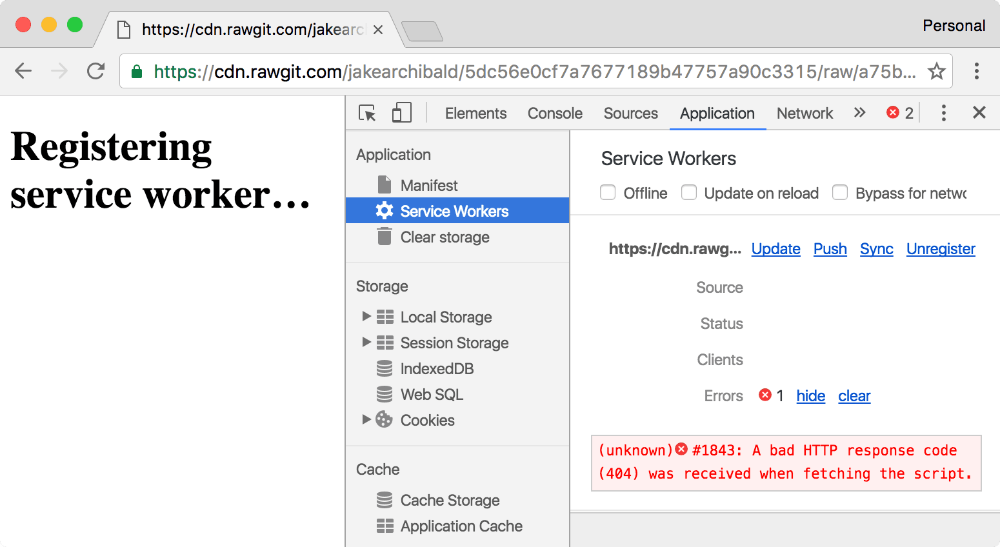
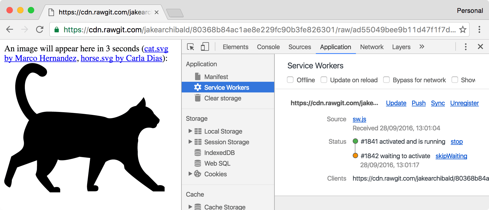
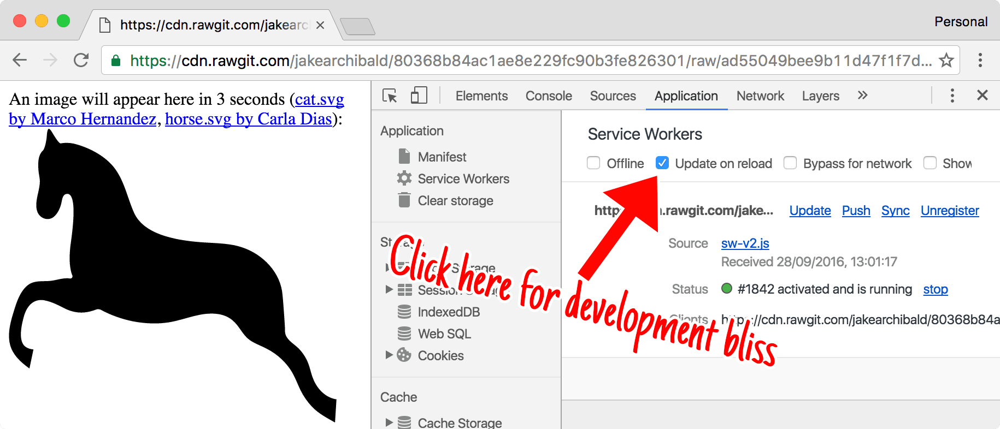
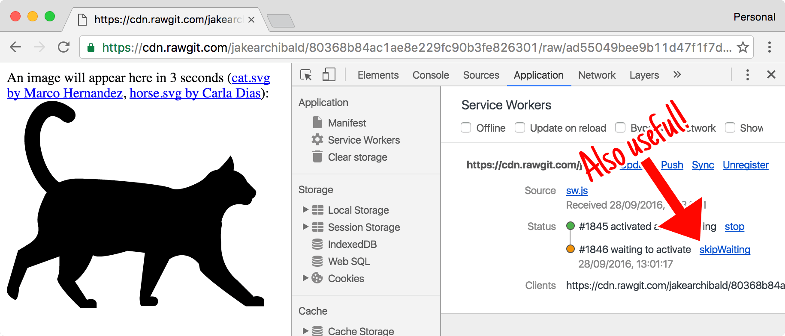

project_path: /web/fundamentals/_project.yaml
book_path: /web/fundamentals/_book.yaml
description: A deep-dive into the service worker lifecycle.

{# wf_updated_on: 2016-09-29 #}
{# wf_published_on: 2016-09-29 #}
{# wf_blink_components: Blink>ServiceWorker #}

# The Service Worker Lifecycle {: .page-title }



The lifecycle of the service worker is its most complicated part. If you don't
know what it's trying to do and what the benefits are, it can feel like it's
fighting you. But once you know how it works, you can deliver seemless,
unobtrusive updates to users, mixing the best of web and native patterns.

This is a deep dive, but the bullets at the start of each section cover most of
what you need to know.

## The intent

The intent of the lifecycle is to:

* Make offline-first possible.
* Allow a new service worker to get itself ready without disrupting the current
  one.
* Ensure an in-scope page is controlled by the same service worker (or no
  service worker) throughout.
* Ensure there's only one version of your site running at once.

That last one is pretty important. Without service workers, users can load one
tab to your site, then later open another. This can result in two versions of
your site running at the same time. Sometimes this is ok, but if you're dealing
with storage you can easily end up with two tabs having very different opinions
on how their shared storage should be managed. This can result in errors, or
worse, data loss.

Caution: Users actively dislike data loss. It causes them great sadness.

## The first service worker

In brief:

* The `install` event is the first event a service worker gets, and it only
  happens once.
* A promise passed to `installEvent.waitUntil()` signals the duration and
  success or failure of your install.
* A service worker won't receive events like `fetch` and `push` until it
  successfully finishes installing and becomes "active".
* By default, a page's fetches won't go through a service worker unless the page
  request itself went through a service worker. So you'll need to refresh the
  page to see the effects of the service worker.
* `clients.claim()` can override this default, and take control of
  non-controlled pages.

{% framebox height="100%" %}
<link href="https://fonts.googleapis.com/css?family=Just+Another+Hand" rel="stylesheet">

<svg class="lifecycle-diagram" style="display:none">
  <defs>
    <g id="diagram-static">
      <text y="6.7" x="14.5" class="label">Installing</text><text y="6.7" x="81.1" class="label">Active</text><circle r="14" cy="25.8" cx="14.5" class="state-placeholder"/><circle r="14" cy="25.8" cx="47.8" class="state-placeholder"/><circle r="14" cy="25.8" cx="81.2" class="state-placeholder"/>
    </g>
    <g id="diagram-page">
      <path d="M 191.3,0 12.8,0 C 5.8,0 0,5.7 0,12.8 L 0,167 c 0,7.2 5.7,13 12.8,13 l 178.5,0 c 7,0 12.8,-5.8 12.8,-13 l 0,-154 C 204,6 198.7,0.2 191.6,0.2 Z M 11,11 c 0.5,-0.5 1,-0.7 1.8,-0.8 l 178.5,0 c 0.7,0 1.3,0.3 1.8,0.8 0.8,0.5 1,1 1,1.8 l 0,13.5 -184.1,0 0,-13.5 c 0,-0.7 0.3,-1.3 0.8,-1.8 z m 182,158 c -0.4,0.4 -1,0.7 -1.7,0.7 l -178.5,0 c -0.7,0 -1.3,-0.3 -1.8,-0.8 -0.5,-0.8 -0.8,-1.4 -0.8,-2 l 0,-130.4 183.6,0 0,130.5 c 0,0.8 -0.2,1.4 -0.7,2 z" />
      <path d="m 26.5,18.6 c 0,2.8 -2.3,5 -5,5 -3,0 -5.2,-2.2 -5.2,-5 0,-3 2.2,-5.2 5,-5.2 3,0 5.2,2.3 5.2,5.2 z m 15.2,0 c 0,2.8 -2.3,5 -5,5 -3,0 -5.2,-2.2 -5.2,-5 0,-3 2.3,-5.2 5,-5.2 3,0 5.2,2.3 5.2,5.2 z m 15.3,0 c 0,2.8 -2.3,5 -5.2,5 -2.8,0 -5,-2.2 -5,-5 0,-3 2.2,-5.2 5,-5.2 3,0 5.2,2.3 5.2,5.2 z m -5.2,111 102.7,0 0,10.4 -102.7,0 0,-10.3 z m 0,-16.8 102.7,0 0,10.2 -102.7,0 0,-10 z M 52,96 l 45.4,0 0,10.2 -45.4,0 0,-10.2 z m 0,-17 45.4,0 0,10.3 -45.4,0 0,-10.3 z m 0,-16.8 45.6,0 0,10.3 -45.6,0 0,-10.3 z m 100.2,1.3 -45.4,0 0,42 45.4,0 0,-42 z m -10.2,31.8 -25,0 0,-21.5 25,0 0,21.5 z" />
    </g>
    <path id="diagram-sw" d="m 19.43,12.98 c 0.04,-0.32 0.07,-0.64 0.07,-0.98 0,-0.34 -0.03,-0.66 -0.07,-0.98 l 2.11,-1.65 c 0.19,-0.15 0.24,-0.42 0.12,-0.64 l -2,-3.46 C 19.54,5.05 19.27,4.97 19.05,5.05 l -2.49,1 C 16.04,5.65 15.48,5.32 14.87,5.07 L 14.49,2.42 C 14.46,2.18 14.25,2 14,2 L 10,2 C 9.75,2 9.54,2.18 9.51,2.42 L 9.13,5.07 C 8.52,5.32 7.96,5.66 7.44,6.05 l -2.49,-1 C 4.72,4.96 4.46,5.05 4.34,5.27 l -2,3.46 C 2.21,8.95 2.27,9.22 2.46,9.37 l 2.11,1.65 C 4.53,11.34 4.5,11.67 4.5,12 c 0,0.33 0.03,0.66 0.07,0.98 l -2.11,1.65 c -0.19,0.15 -0.24,0.42 -0.12,0.64 l 2,3.46 c 0.12,0.22 0.39,0.3 0.61,0.22 l 2.49,-1 c 0.52,0.4 1.08,0.73 1.69,0.98 l 0.38,2.65 C 9.54,21.82 9.75,22 10,22 l 4,0 c 0.25,0 0.46,-0.18 0.49,-0.42 l 0.38,-2.65 c 0.61,-0.25 1.17,-0.59 1.69,-0.98 l 2.49,1 c 0.23,0.09 0.49,0 0.61,-0.22 l 2,-3.46 c 0.12,-0.22 0.07,-0.49 -0.12,-0.64 L 19.43,12.98 Z M 12,15.5 c -1.93,0 -3.5,-1.57 -3.5,-3.5 0,-1.93 1.57,-3.5 3.5,-3.5 1.93,0 3.5,1.57 3.5,3.5 0,1.93 -1.57,3.5 -3.5,3.5 z"/>
    <g id="diagram-refresh"><circle id="page-action-circle" cx="81.2" cy="58.1" r="3.5" fill="#fff" stroke="#000" stroke-width=".5"/><path d="M82.76 56.48c-.4-.4-.97-.66-1.6-.66-1.23 0-2.23 1-2.23 2.24 0 1.24 1 2.25 2.24 2.25 1.05 0 1.92-.7 2.17-1.68h-.58c-.23.66-.86 1.13-1.6 1.13-.92 0-1.67-.76-1.67-1.7 0-.92.74-1.67 1.67-1.67.47 0 .88.2 1.2.5l-.92.9h1.97v-1.96l-.66.66z"/></g>
    <g id="diagram-close"><use xlink:href="#page-action-circle"/><path id="path5062" d="M83 56.58l-.37-.37-1.46 1.47-1.45-1.46-.37.38 1.46 1.46-1.45 1.46.37.36 1.45-1.45 1.46 1.46.37-.36-1.46-1.46z"/></g>
  </defs>
</svg>
<svg class="lifecycle-diagram register" viewBox="0 0 96.9 73"><rect ry="15.8" y="10" x="65.4" height="63" width="31.6" class="controlled"/><use xlink:href="#diagram-static"/><g transform="matrix(1.1187 0 0 1.1187 1.078 12.408)" class="cog cog-new"><use height="10" width="10" xlink:href="#diagram-sw"/></g><use transform="matrix(.09532 0 0 .09532 71.44 48.39)" xlink:href="#diagram-page" width="10" height="10" class="diagram-page"/><path d="M78.6 47.7c-1-6-2-11.6-1.6-17" class="fetch"/><path d="M83 47.5c1.4-5.4 3.3-10.8 2.4-16.2" class="fetch"/><path d="M75.7 47c-2.3-6.3-3.2-12.5-2-18.2" class="fetch"/><path d="M89.5 29.5c.3 6-.4 12-4 18" class="fetch"/><path d="M75.4 30.3c0 4-1 6 2 17.2" class="fetch"/><path d="M86.6 31C88 37 86 42 84 47.4" class="fetch"/><g class="refresh-rotator"><use xlink:href="#diagram-refresh" class="diagram-refresh"/></g></svg>



Take this HTML:

    <!DOCTYPE html>
    An image will appear here in 3 seconds:
    

It registers a service worker, and adds image of a dog after 3 seconds.

Here's its service worker, `sw.js`:

    self.addEventListener('install', event => {
      console.log('V1 installing…');

      // cache a cat SVG
      event.waitUntil(
        caches.open('static-v1').then(cache => cache.add('/cat.svg'))
      );
    });

    self.addEventListener('activate', event => {
      console.log('V1 now ready to handle fetches!');
    });

    self.addEventListener('fetch', event => {
      const url = new URL(event.request.url);

      // serve the cat SVG from the cache if the request is
      // same-origin and the path is '/dog.svg'
      if (url.origin == location.origin && url.pathname == '/dog.svg') {
        event.respondWith(caches.match('/cat.svg'));
      }
    });

It caches an image of a cat, and serves it whenever there's a request for
`/dog.svg`. However, if you [run the above
example](https://cdn.rawgit.com/jakearchibald/80368b84ac1ae8e229fc90b3fe826301/raw/ad55049bee9b11d47f1f7d19a73bf3306d156f43/){:
.external}, you'll see a dog the first time you load the page. Hit refresh, and
you'll see the cat.

Note: Cats are better than dogs. They just *are*.

### Scope and control

The default scope of a service worker registration is `./` relative to the
script URL. This means if you register a service worker at
`//example.com/foo/bar.js` it has a default scope of `//example.com/foo/`.

We call pages, workers, and shared workers `clients`. Your service worker can
only control clients that are in-scope. Once a client is "controlled", its
fetches go through the in-scope service worker. You can detect if a client is
controlled via `navigator.serviceWorker.controller` which will be null or a
service worker instance.

### Download, parse, and execute

Your very first service worker downloads when you call `.register()`. If your
script fails to download, parse, or throws an error in its initial execution,
the register promise rejects, and the service worker is discarded.

Chrome's DevTools shows the error in the console, and in the service worker
section of the application tab:

<figure>
  
</figure>

### Install

The first event a service worker gets is `install`. It's triggered as soon as
the worker executes, and it's only called once per service worker. If
you alter your service worker script the browser considers it a different service
worker, and it'll get its own `install` event. I'll cover [updates in detail
later](#updates).

The `install` event is your chance to cache everything you need before being able to
control clients. The promise you pass to `event.waitUntil()` lets the browser
know when your install completes, and if it was successful.

If your promise rejects, this signals the install failed, and the browser throws
the service worker away. It'll never control clients. This means we can't rely on
"cat.svg" being present in the cache in our `fetch` events. It's a dependency.

### Activate

Once your service worker is ready to control clients and handle functional
events like `push` and `sync`, you'll get an `activate` event. But that doesn't
mean the page that called `.register()` will be controlled.

The first time you load [the
demo](https://cdn.rawgit.com/jakearchibald/80368b84ac1ae8e229fc90b3fe826301/raw/ad55049bee9b11d47f1f7d19a73bf3306d156f43/){:
.external}, even though `dog.svg` is requested long after the service worker
activates, it doesn't handle the request, and you still see the image of the
dog. The default is *consistency*, if your page loads without a service worker,
neither will its subresources. If you load [the
demo](https://cdn.rawgit.com/jakearchibald/80368b84ac1ae8e229fc90b3fe826301/raw/ad55049bee9b11d47f1f7d19a73bf3306d156f43/){:
.external} a second time (in other words, refresh the page), it'll be controlled.
Both the page and the image will go through `fetch` events, and you'll see a cat
instead.

### clients.claim

You can take control of uncontrolled clients by calling `clients.claim()` within
your service worker once it's activated.

Here's [a variation of the demo
above](https://cdn.rawgit.com/jakearchibald/80368b84ac1ae8e229fc90b3fe826301/raw/df4cae41fa658c4ec1fa7b0d2de05f8ba6d43c94/){:
.external} which calls `clients.claim()` in its `activate` event. You *should* see
a cat the first time. I say "should", because this is timing sensitive. You'll only
see a cat if the service worker activates and `clients.claim()` takes effect
before the image tries to load.

If you use your service worker to load pages differently than they'd load via
the network, `clients.claim()` can be troublesome, as your service worker ends
up controlling some clients that loaded without it.

Note: I see a lot of people including `clients.claim()` as boilerplate, but I
rarely do so myself. It only really matters on the very first load, and due to
progressive enhancement the page is usually working happily without service
worker anyway.

## Updating the service worker {: #updates}

In brief:

* An update is triggered:
    * On navigation to an in-scope page.
    * On functional events such as `push` and `sync`, unless there's been an
      update check within the previous 24 hours.
    * On calling `.register()` *only if* the service worker URL has changed.
* The caching headers on the service worker script are respected (up to 24
  hours) when fetching updates. We're going to make this opt-in behaviour, as it
  catches people out. You probably want a `max-age` of 0 on your service worker
  script.
* Your service worker is considered updated if it's byte-different to the one
  the browser already has. (We're extending this to include imported
  scripts/modules too.)
* The updated service worker is launched alongside the existing one, and gets
  its own `install` event.
* If your new worker has a non-ok status code (for example, 404), fails to parse, throws
  an error during execution, or rejects during install, the new worker is thrown
  away, but the current one remains active.
* Once successfully installed, the updated worker will `wait` until the existing
  worker is controlling zero clients. (Note that clients overlap during a
  refresh.)
* `self.skipWaiting()` prevents the waiting, meaning the service worker
  activates as soon as it's finished installing.

{% framebox height="100%" %}
<link href="https://fonts.googleapis.com/css?family=Just+Another+Hand" rel="stylesheet">

<svg class="lifecycle-diagram" style="display:none">
  <defs>
    <g id="diagram-static">
      <text y="6.7" x="14.5" class="label">Installing</text><text y="6.7" x="81.1" class="label">Active</text><circle r="14" cy="25.8" cx="14.5" class="state-placeholder"/><circle r="14" cy="25.8" cx="47.8" class="state-placeholder"/><circle r="14" cy="25.8" cx="81.2" class="state-placeholder"/>
    </g>
    <g id="diagram-page">
      <path d="M 191.3,0 12.8,0 C 5.8,0 0,5.7 0,12.8 L 0,167 c 0,7.2 5.7,13 12.8,13 l 178.5,0 c 7,0 12.8,-5.8 12.8,-13 l 0,-154 C 204,6 198.7,0.2 191.6,0.2 Z M 11,11 c 0.5,-0.5 1,-0.7 1.8,-0.8 l 178.5,0 c 0.7,0 1.3,0.3 1.8,0.8 0.8,0.5 1,1 1,1.8 l 0,13.5 -184.1,0 0,-13.5 c 0,-0.7 0.3,-1.3 0.8,-1.8 z m 182,158 c -0.4,0.4 -1,0.7 -1.7,0.7 l -178.5,0 c -0.7,0 -1.3,-0.3 -1.8,-0.8 -0.5,-0.8 -0.8,-1.4 -0.8,-2 l 0,-130.4 183.6,0 0,130.5 c 0,0.8 -0.2,1.4 -0.7,2 z" />
      <path d="m 26.5,18.6 c 0,2.8 -2.3,5 -5,5 -3,0 -5.2,-2.2 -5.2,-5 0,-3 2.2,-5.2 5,-5.2 3,0 5.2,2.3 5.2,5.2 z m 15.2,0 c 0,2.8 -2.3,5 -5,5 -3,0 -5.2,-2.2 -5.2,-5 0,-3 2.3,-5.2 5,-5.2 3,0 5.2,2.3 5.2,5.2 z m 15.3,0 c 0,2.8 -2.3,5 -5.2,5 -2.8,0 -5,-2.2 -5,-5 0,-3 2.2,-5.2 5,-5.2 3,0 5.2,2.3 5.2,5.2 z m -5.2,111 102.7,0 0,10.4 -102.7,0 0,-10.3 z m 0,-16.8 102.7,0 0,10.2 -102.7,0 0,-10 z M 52,96 l 45.4,0 0,10.2 -45.4,0 0,-10.2 z m 0,-17 45.4,0 0,10.3 -45.4,0 0,-10.3 z m 0,-16.8 45.6,0 0,10.3 -45.6,0 0,-10.3 z m 100.2,1.3 -45.4,0 0,42 45.4,0 0,-42 z m -10.2,31.8 -25,0 0,-21.5 25,0 0,21.5 z" />
    </g>
    <path id="diagram-sw" d="m 19.43,12.98 c 0.04,-0.32 0.07,-0.64 0.07,-0.98 0,-0.34 -0.03,-0.66 -0.07,-0.98 l 2.11,-1.65 c 0.19,-0.15 0.24,-0.42 0.12,-0.64 l -2,-3.46 C 19.54,5.05 19.27,4.97 19.05,5.05 l -2.49,1 C 16.04,5.65 15.48,5.32 14.87,5.07 L 14.49,2.42 C 14.46,2.18 14.25,2 14,2 L 10,2 C 9.75,2 9.54,2.18 9.51,2.42 L 9.13,5.07 C 8.52,5.32 7.96,5.66 7.44,6.05 l -2.49,-1 C 4.72,4.96 4.46,5.05 4.34,5.27 l -2,3.46 C 2.21,8.95 2.27,9.22 2.46,9.37 l 2.11,1.65 C 4.53,11.34 4.5,11.67 4.5,12 c 0,0.33 0.03,0.66 0.07,0.98 l -2.11,1.65 c -0.19,0.15 -0.24,0.42 -0.12,0.64 l 2,3.46 c 0.12,0.22 0.39,0.3 0.61,0.22 l 2.49,-1 c 0.52,0.4 1.08,0.73 1.69,0.98 l 0.38,2.65 C 9.54,21.82 9.75,22 10,22 l 4,0 c 0.25,0 0.46,-0.18 0.49,-0.42 l 0.38,-2.65 c 0.61,-0.25 1.17,-0.59 1.69,-0.98 l 2.49,1 c 0.23,0.09 0.49,0 0.61,-0.22 l 2,-3.46 c 0.12,-0.22 0.07,-0.49 -0.12,-0.64 L 19.43,12.98 Z M 12,15.5 c -1.93,0 -3.5,-1.57 -3.5,-3.5 0,-1.93 1.57,-3.5 3.5,-3.5 1.93,0 3.5,1.57 3.5,3.5 0,1.93 -1.57,3.5 -3.5,3.5 z"/>
    <g id="diagram-refresh"><circle id="page-action-circle" cx="81.2" cy="58.1" r="3.5" fill="#fff" stroke="#000" stroke-width=".5"/><path d="M82.76 56.48c-.4-.4-.97-.66-1.6-.66-1.23 0-2.23 1-2.23 2.24 0 1.24 1 2.25 2.24 2.25 1.05 0 1.92-.7 2.17-1.68h-.58c-.23.66-.86 1.13-1.6 1.13-.92 0-1.67-.76-1.67-1.7 0-.92.74-1.67 1.67-1.67.47 0 .88.2 1.2.5l-.92.9h1.97v-1.96l-.66.66z"/></g>
    <g id="diagram-close"><use xlink:href="#page-action-circle"/><path id="path5062" d="M83 56.58l-.37-.37-1.46 1.47-1.45-1.46-.37.38 1.46 1.46-1.45 1.46.37.36 1.45-1.45 1.46 1.46.37-.36-1.46-1.46z"/></g>
  </defs>
</svg>
<svg class="lifecycle-diagram update" viewBox="0 0 96.9 73"><rect ry="15.8" y="10" x="65.4" height="63" width="31.6" class="controlled"/><use xlink:href="#diagram-static"/><text x="47.7" y="6.7" class="label">Waiting</text><g transform="matrix(1.1187 0 0 1.1187 1.078 12.408)" class="cog cog-new"><use height="10" width="10" xlink:href="#diagram-sw"/></g><g transform="matrix(1.1187 0 0 1.1187 67.745 12.408)" class="cog cog-old"><use xlink:href="#diagram-sw" width="10" height="10"/></g><use transform="matrix(.09532 0 0 .09532 71.44 48.39)" xlink:href="#diagram-page" width="10" height="10" class="diagram-page"/><path d="M78.6 47.7c-1-6-2-11.6-1.6-17" class="fetch"/><path d="M83 47.5c1.4-5.4 3.3-10.8 2.4-16.2" class="fetch"/><path d="M75.7 47c-2.3-6.3-3.2-12.5-2-18.2" class="fetch"/><path d="M89.5 29.5c.3 6-.4 12-4 18" class="fetch"/><path d="M75.4 30.3c0 4-1 6 2 17.2" class="fetch"/><path d="M86.6 31C88 37 86 42 84 47.4" class="fetch"/><g class="refresh-rotator"><use xlink:href="#diagram-refresh" class="diagram-refresh"/></g><use xlink:href="#diagram-close" class="diagram-close"/></svg>



Let's say we changed our service worker script to respond with a picture of
a horse rather than a cat:

    const expectedCaches = ['static-v2'];

    self.addEventListener('install', event => {
      console.log('V2 installing…');

      // cache a horse SVG into a new cache, static-v2
      event.waitUntil(
        caches.open('static-v2').then(cache => cache.add('/horse.svg'))
      );
    });

    self.addEventListener('activate', event => {
      // delete any caches that aren't in expectedCaches
      // which will get rid of static-v1
      event.waitUntil(
        caches.keys().then(keys => Promise.all(
          keys.map(key => {
            if (!expectedCaches.includes(key)) {
              return caches.delete(key);
            }
          })
        )).then(() => {
          console.log('V2 now ready to handle fetches!');
        })
      );
    });

    self.addEventListener('fetch', event => {
      const url = new URL(event.request.url);

      // serve the horse SVG from the cache if the request is
      // same-origin and the path is '/dog.svg'
      if (url.origin == location.origin && url.pathname == '/dog.svg') {
        event.respondWith(caches.match('/horse.svg'));
      }
    });

Note: I have no strong opinions on horses.

[Check out a demo of the
above](https://cdn.rawgit.com/jakearchibald/80368b84ac1ae8e229fc90b3fe826301/raw/ad55049bee9b11d47f1f7d19a73bf3306d156f43/index-v2.html){:
.external}. You should still see an image of a cat. Here's why…

### Install

Note that I've changed the cache name from `static-v1` to `static-v2`. This
means I can set up the new cache without overwriting things in the current one,
which the old service worker is still using.

This patterns creates version-specific caches, akin to assets a native app would
bundle with its executable. You may also have caches that aren't version
specific, such as `avatars`.

### Waiting

After it's successfully installed, the updated service worker delays activating
until the existing service worker is no longer controlling clients. This state
is called "waiting", and it's how the browser ensures that only one version of
your service worker is running at a time.

If you ran [the updated
demo](https://cdn.rawgit.com/jakearchibald/80368b84ac1ae8e229fc90b3fe826301/raw/ad55049bee9b11d47f1f7d19a73bf3306d156f43/index-v2.html){:
.external}, you should still see a picture of a cat, because the V2 worker
hasn't yet activated. You can see the new service worker waiting in the
"Application" tab of DevTools:

<figure>
  
</figure>

Even if you only have one tab open to the demo, refreshing the page isn't enough
to let the new version take over. This is due to how browser navigations work.
When you navigate, the current page doesn't go away until the response headers
have been received, and even then the current page may stay if the response has
a `Content-Disposition` header. Because of this overlap, the current service worker
is always controlling a client during a refresh.

To get the update, close or navigate away from all tabs using the current service
worker. Then, when you [navigate to the demo
again](https://cdn.rawgit.com/jakearchibald/80368b84ac1ae8e229fc90b3fe826301/raw/ad55049bee9b11d47f1f7d19a73bf3306d156f43/index-v2.html){:
.external}, you should see the horse.

This pattern is similar to how Chrome updates. Updates to Chrome download in the
background, but don't apply until Chrome restarts. In the mean time, you can
continue to use the current version without disruption. However, this is a pain
during development, but DevTools has ways to make it easier, which I'll cover
[later in this article](#devtools).

### Activate

This fires once the old service worker is gone, and your new service worker is
able to control clients. This is the ideal time to do stuff that you couldn't do
while the old worker was still in use, such as migrating databases and clearing
caches.

In the demo above, I maintain a list of caches that I expect to be there, and in
the `activate` event I get rid of any others, which removes the old
`static-v1` cache.

Caution: You may not be updating from the previous version. It may be a service worker many versions old.

If you pass a promise to `event.waitUntil()` it'll buffer functional events
(`fetch`, `push`, `sync` etc.) until the promise resolves. So when your `fetch`
event fires, the activation is fully complete.

Caution: The cache storage API is "origin storage" (like localStorage, and
IndexedDB). If you run many sites on the same origin (for example,
`yourname.github.io/myapp`), be careful that you don't delete caches for your other
sites. To avoid this, give your cache names a prefix unique to the current site,
eg `myapp-static-v1`, and don't touch caches unless they begin with `myapp-`.

### Skip the waiting phase

The waiting phase means you're only running one version of your site at once,
but if you don't need that feature, you can make your new service worker
activate sooner by calling `self.skipWaiting()`.

This causes your service worker to kick out the current active worker and activate
itself as soon as it enters the waiting phase (or immediately if it's already in the
waiting phase). It *doesn't* cause your worker to skip installing, just waiting.

It doesn't really matter when you call `skipWaiting()`, as long as it's during or
before waiting. It's pretty common to call it in the `install` event:

    self.addEventListener('install', event => {
      self.skipWaiting();

      event.waitUntil(
        // caching etc
      );
    });

But you may want to call it as a results of a `postMessage()` to the service
worker. As in, you want to `skipWaiting()` following a user interaction.

[Here's a demo that uses
`skipWaiting()`](https://cdn.rawgit.com/jakearchibald/80368b84ac1ae8e229fc90b3fe826301/raw/ad55049bee9b11d47f1f7d19a73bf3306d156f43/index-v3.html){:
.external}. You should see a picture of a cow without having to navigate away.
Like `clients.claim()` it's a race, so you'll only see the cow if the new service
worker fetches, installs and activates before the page tries to load the image.

Caution: `skipWaiting()` means that your new service worker is likely controlling
pages that were loaded with an older version. This means some of your page's
fetches will have been handled by your old service worker, but your new service
worker will be handling subsequent fetches. If this might break things, don't
use `skipWaiting()`.

### Manual updates

As I mentioned earlier, the browser checks for updates automatically after
navigations and functional events, but you can also trigger them manually:

    navigator.serviceWorker.register('/sw.js').then(reg => {
      // sometime later…
      reg.update();
    });

If you expect the user to be using your site for a long time without reloading,
you may want to call `update()` on an interval (such as hourly).

### Avoid changing the URL of your service worker script

If you've read [my post on caching best
practices](https://jakearchibald.com/2016/caching-best-practices/){: .external},
you may consider giving each version of your service worker a unique URL.
**Don't do this!** This is usually bad practice for service workers, just update
the script at its current location.

It can land you with a problem like this:

1. `index.html` registers `sw-v1.js` as a service worker.
1. `sw-v1.js` caches and serves `index.html` so it works offline-first.
1. You update `index.html` so it registers your new and shiny `sw-v2.js`.

If you do the above, the user never gets `sw-v2.js`, because `sw-v1.js` is
serving the old version of `index.html` from its cache. You've put yourself in a
position where you need to update your service worker in order to update your
service worker. Ew.

However, for [the demo
above](https://cdn.rawgit.com/jakearchibald/80368b84ac1ae8e229fc90b3fe826301/raw/ad55049bee9b11d47f1f7d19a73bf3306d156f43/index-v2.html){:
.external}, I *have* changed the URL of the service worker. This is so, for the
sake of the demo, you can switch between the versions. It isn't something I'd do
in production.

## Making development easy {: #devtools}

The service worker lifecycle is built with the user in mind, but during
development it's a bit of a pain. Thankfully there are a few tools to help out:

### Update on reload

This one's my favourite.

<figure>
  
</figure>

This changes the lifecycle to be developer-friendly. Each navigation will:

1. Refetch the service worker.
1. Install it as a new version even if it's byte-identical, meaning your `install`
   event runs and your caches update.
1. Skip the waiting phase so the new service worker activates.
1. Navigate the page.

This means you'll get your updates on each navigation (including refresh)
without having to reload twice or close the tab.

### Skip waiting

<figure>
  
</figure>

If you have a worker waiting, you can hit "skip waiting" in DevTools to
immediately promote it to "active".

### Shift-reload

If you force-reload the page (shift-reload) it bypasses the service worker
entirely. It'll be uncontrolled. This feature is in the spec, so it works in
other service-worker-supporting browsers.

## Handling updates

The service worker was designed as part of the [extensible
web](https://extensiblewebmanifesto.org/){: .external }. The idea is that we, as
browser developers, acknowledge that we are not better at web development than
web developers. And as such, we shouldn't provide narrow high-level APIs that
solve a particular problem using patterns *we* like, and instead give you access
to the guts of the browser and let you do it how you want, in a way that works
best for *your* users.

So, to enable as many patterns as we can, the whole update cycle is observable:

    navigator.serviceWorker.register('/sw.js').then(reg => {
      reg.installing; // the installing worker, or undefined
      reg.waiting; // the waiting worker, or undefined
      reg.active; // the active worker, or undefined

      reg.addEventListener('updatefound', () => {
        // A wild service worker has appeared in reg.installing!
        const newWorker = reg.installing;

        newWorker.state;
        // "installing" - the install event has fired, but not yet complete
        // "installed"  - install complete
        // "activating" - the activate event has fired, but not yet complete
        // "activated"  - fully active
        // "redundant"  - discarded. Either failed install, or it's been
        //                replaced by a newer version

        newWorker.addEventListener('statechange', () => {
          // newWorker.state has changed
        });
      });
    });

    navigator.serviceWorker.addEventListener('controllerchange', () => {
      // This fires when the service worker controlling this page
      // changes, eg a new worker has skipped waiting and become
      // the new active worker.
    });

## You survived!

Phew! That was a lot of technical theory. Stay tuned in the coming weeks where
we'll dive into some practical applications of the above.
