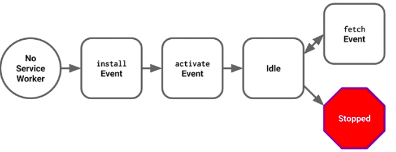
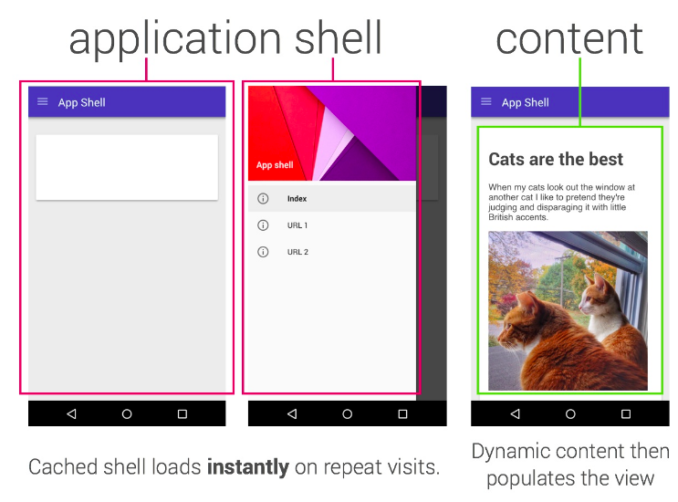
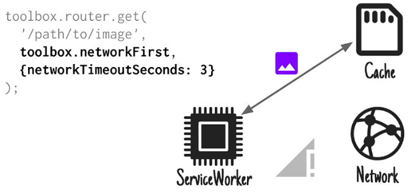
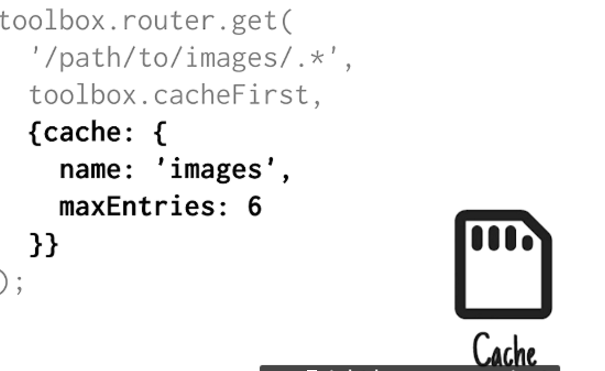

project_path: /web/_project.yaml
book_path: /web/fundamentals/_book.yaml

{# wf_updated_on: 2016-09-26 #}
{# wf_published_on: 2016-09-27 #}

# Ways To Architect Your PWA {: .page-title }



[Progressive Web Apps](/web/progressive-web-apps/) (PWAs) use modern web capabilities to deliver fast, engaging, and reliable mobile web experiences that are great for users and businesses. 

This guide describes the architectures and technologies that allow your web app to support offline experiences, background synchronization, and push notifications. This opens the door to functionality that previously required a native application.

## Instant Loading with Service Workers and Application Shells {: #instant-loading-app-shell }

Progressive Web Apps combine many of the advantages of native apps and the Web. PWAs evolve from pages in browser tabs to immersive apps by taking ordinary HTML and JavaScript and enhancing them to provide a first class native-like experience for the user. 

PWAs deliver a speedy experience even when the user is offline or on an unreliable network. They also provide the potential to incorporate features previously available only to native applications, such as push notifications. Developing web apps with offline functionality and high performance depends on using service workers combined with the [Cache Storage API](https://developer.mozilla.org/en-US/docs/Web/API/CacheStorage). 

**[Service Workers](/web/fundamentals/getting-started/primers/service-workers)**: Thanks to the caching and storage APIs available to service workers, PWAs can precache parts of a web app so that it loads instantly the next time a user opens it. Using a service worker gives your web app the ability to intercept and handle network requests, including managing multiple caches, minimizing data traffic, and saving offline user-generated data until the network is available again. This caching allows developers to focus on speed, giving web apps the same instant loading and regular updates seen in native applications. If you are unfamiliar with service workers, read [Introduction To Service Workers](web/fundamentals/primers/service-worker/) to learn more about what they can do, how their lifecycle works, and more.

A service worker performs its functions without the need for an open web page or user interaction. This enables new services such as Push Messaging or capturing user actions while offline and delivering them while online. (This is unlikely to bloat your application because the browser starts and stops the service worker as needed to manage memory.)

Service workers enable features such as: 

* Intercepting HTTP/HTTPS requests so your app can decide what gets served from a cache, the local data store, or the network. A service worker cannot access the DOM but it can access the [Cache Storage API](https://developer.mozilla.org/en-US/docs/Web/API/CacheStorage), make network requests using the [Fetch API](https://developer.mozilla.org/en-US/docs/Web/API/Fetch_API), and persist data using the [IndexedDB API](https://developer.mozilla.org/en/docs/Web/API/IndexedDB_API). Besides intercepting network requests, service workers can use [`postMessage()`](https://developer.mozilla.org/en-US/docs/Web/API/Window/postMessage) to communicate between the service worker and pages it controls (e.g. to request DOM updates).

* Receiving [push messages](web/fundamentals/engage-and-retain/push-notifications) from your server. The service worker runs independently from the rest of your web app and provides hooks into the underlying operating system. It responds to events from the OS, including push messages.

* Letting the user do work when offline by holding onto a set of tasks until the browser is on the network (that is, [background synchronization](/web/updates/2015/12/background-sync)). Think of a service worker as being a butler for your application, waking when needed and carrying out tasks for the app. Effectively, the service worker is an efficient background event handler in the browser. A service worker has an intentionally short lifetime. It wakes up when it gets an event and runs only as long as necessary to process it.

Caching is exciting because it lets you to support offline experiences and gives you complete control over those experiences. But, to take full advantage of the service worker and progressively incorporate more and more PWA capabilities also invites a new way of thinking about building web sites by using the *application shell architecture*. 

**Application shell (app shell)**: PWAs tend to be architected around an *application shell*. An application shell is a locally stored interface skeleton that works offline and populates its content using JavaScript.On repeat visits, the app shell allows you to get meaningful pixels on the screen really fast without the network. Using the app shell is not a hard requirement for building PWAs but it comes with significant performance gains.

The shell of the functionality is loaded and displayed to the user (and potentially cached offline by the service worker), and then the page content is loaded dynamically as the user navigates around the app. This reliably and instantly loads on your users’ screens, similar to what is seen in native applications.

The [What is an Application Shell?](#what-is-an-app-shell) section in this document goes into detail about using an app shell, which is the recommended approach to migrating existing single-page apps (SPAs) and structuring your PWA. This architecture provides connectivity resilience and it is what makes a PWA feel like a native app to the user, giving it application-like interaction and navigation, and reliable performance.

Service worker caching should be considered a progressive enhancement. If your web app conditionally registers a service worker only if it is supported, then you get offline support on browsers with service workers and on browsers that do not support service workers. The offline-specific code is never called and there is no overhead or breakage for older browsers. 

### Key Concepts {: #key-concepts }

The app shell approach relies on caching the "shell" of your web application using a service worker. Here is a high-level description of how it works:

1. When the user accesses your website the basic HTML, JavaScript, and CSS display. On the initial website visit, the page registers the service worker that controls future navigations on the site. Registration creates a new service worker instance and triggers the install event that the service worker responds to. Also, the app shell content is added to the cache. Once installed, the service worker controls future navigations on the site.

2. After the shell content loads, the app requests content to populate the view. The app shell plus dynamic content equals the compete, rendered page. Next, the SPA requests content (for example, via [XMLHttpRequest](https://developer.mozilla.org/en-US/docs/Web/API/XMLHttpRequest) or the [Fetch API](https://developer.mozilla.org/en-US/docs/Web/API/Fetch_API)) and page content is fetched and used to populate the view. After those handlers complete, your service worker enters into an idle state.  

  <figure id="swidleness">
    
    <figcaption>So, the service worker is running but it is not doing anything until a network request fires off a new event. In response to a network request, a fetch event handler intercepts the request and responds as you see fit. After a period of idleness your service worker script is stopped automatically. But, when the next network request is made or when the page is loaded again the service worker is started back up and can immediately respond to fetch events. </figcaption>
  </figure>

Note: Once for every given version of a service worker, the service worker is registered and activated and, if necessary, performs cache cleanup of any out-of-date resources that are no longer needed in your shell.

**What about browsers that do not support service workers?**

The app shell model is great but how does it work in browsers that do not support service workers? Don’t worry. Your web app can still be loaded even if a browser is used without service workers. Everything necessary to load your UI (e.g. HTML, CSS, JavaScript) is the same whether or not you use service workers. The service worker simply enables native-like features to your app like offline-caching. Without a service worker, your app continues to operate via HTTPS requests instead of cached assets. In other words, when service workers are not supported, the assets are not cached offline but the content is still fetched over the network and the user still gets a basic experience. 

### Components {: #components }

<table>
  <tr>
    <th>Component</th>
    <th>Description</th>
  </tr>
  <tr>
    <td>app shell</td>
    <td>The minimal HTML, CSS, and JavaScript and any other static resources that provide the structure for your page, minus the actual content specific to the page. </td>
  </tr>
  <tr>
    <td>cache</td>
    <td>There are two types of cache: the automatic browser cache and program-controlled caches (<a href="https://developer.mozilla.org/en-US/docs/Web/API/Cache">Cache API</a> and <a href="https://developer.mozilla.org/en-US/docs/Web/API/IndexedDB_API">IndexedDB</a>). 
The browser cache is a temporary storage location on your computer for files downloaded by your browser to display websites. Files that are cached locally include any documents that make up a website, such as HTML files, CSS style sheets, JavaScript scripts, as well as graphic images and other multimedia content.
The service worker also creates a cache independent of the browser cache using the Cache Storage API or IndexedDB. The cache objects hold the same kinds of assets as a browser cache but make them offline accessible. The service worker provides these to enable offline support in browsers. This is referred to as "Cache (Storage) API" in this document.

The cache objects are one tool you can use when building your app, but you must use them appropriately for each resource. Several caching strategies are described in Determine the Best Caching Strategy. </td>
  </tr>
  <tr>
    <td>client-side rendering (CSR)</td>
    <td>Client-side rendering means JavaScript running in the browser produces HTML (probably via templating). The benefit is you can update the screen instantly when the user clicks, rather than waiting a few hundred milliseconds at least while the server is contacted to ask what to display. Sites where you mostly navigate and view static content can get away with mostly server-side rendering. Any portion of a page that is animated or highly interactive (a draggable slider, a sortable table, a dropdown menu) almost certainly uses client-side rendering.</td>
  </tr>
  <tr>
    <td>dynamic content
</td>
    <td>Dynamic content is all of the data, images, and other resources that your web app needs to function, but exists independently from your app shell. Although the app shell is intended to quickly populate the content of your site, users might expect dynamic content, in which case your app must fetch data specific to the user’s needs. Sometimes an app pulls this data from external, third-party APIs, and sometimes from first-party data that is dynamically generated or frequently updated.</td>
  </tr>
  <tr>
    <td>Fetch API</td>
    <td>You can optionally use the <a href="https://developer.mozilla.org/en-US/docs/Web/API/Fetch_API">Fetch API</a> to fetch resources. For example, if your web app is for a newspaper, it might make use of a first-party API to fetch recent articles, and a third-party API to fetch the current weather. Both of those types of requests fall into the category of dynamic content.</td>
  </tr>
  <tr>
    <td>progressive enhancement</td>
    <td>An approach to web development that begins with common browser features, and then adds in functionality or enhancements when the user’s browser supports more modern technologies.</td>
  </tr>
  <tr>
    <td>PWA architecture styles</td>
    <td>Any of several approaches to building PWAs based on the back-end technologies available and the performance requirements. The patterns include using an app shell, server-side rendering, client-side rendering, and others. These patterns are listed in Choose an Architecture.  </td>
  </tr>
  <tr>
    <td>server-side rendering (SSR)</td>
    <td>SSR means when the browser navigates to a URL fetches the page, it immediately gets back HTML describing the page. SSR is nice because the page loads faster (this can be a server-rendered version of the full page, just the app shell or the content). There's no white page displayed while the browser downloads the rendering code and data and runs the code.  If rendering content on the server-side, users can get meaningful text on their screens even if a spotty network connection prevents assets like JavaScript from being fully fetched and parsed. SSR also maintains the idea that pages are documents, and if you ask a server for a document by its URL, the text of the document is returned, rather than a program that generates that text using a complicated API.</td>
  </tr>
  <tr>
    <td>service worker</td>
    <td>A type of web worker that runs alongside your web app but with a life span that is tied to the execution of the app’s events. Some of its services include a network proxy written in JavaScript that intercepts HTTP/HTTPS requests made from web pages. It also receives push messages. Additional features are planned in the future.</td>
  </tr>
  <tr>
    <td>sw-precache</td>
    <td>The <A href="https://github.com/GoogleChrome/sw-precache">sw-precache</a> library integrates with your build process and generates code for  caching and maintaining all the resources in your app shell. Note that sw-precache and sw-toolbox (listed next) are tools to simplify your Service Worker caching implementation and are not requirements.</td>
  </tr>
  <tr>
    <td>sw-toolbox</td>
    <td>The <a href="https://github.com/GoogleChrome/sw-toolbox">sw-toolbox</a> library is loaded by your service worker at run time and provides pre-written tools for applying common caching strategies to different URL patterns.</td>
  </tr>
  <tr>
    <td>Universal JavaScript rendering</td>
    <td><a href="https://strongloop.com/strongblog/the-foundations-of-universal-or-isomorphic-javascript/">Universal or Isomorphic JavaScript</a> apps have code that can run on the client-side and the server-side. This means that some of your application view logic can be executed on both the server and the client. It provides better performance for first paint and more stateful web apps. Universal apps come with interesting sets of challenges around routing (ideally, having a single set of routes mapping URI patterns to route handlers), universal data fetching (describing resources for a component independent from the fetching mechanism so they can be rendered entirely on the server or the client) and view rendering. (Views must be renderable on either the client or the server depending on our app needs.)</td>
  </tr>
  <tr>
    <td>web app manifest</td>
    <td>The app shell is deployed alongside a <a href="https://developer.mozilla.org/en-US/docs/Web/Manifest">Web App Manifest</a>, which is a simple JSON file that controls how the application appears to the user and how it can be launched. (This is typically named manifest.json.) When connecting to a network for the first time, a web browser reads the manifest file, downloads the resources listed in it and stores them locally. Then, if there is no network connection, the browser uses the local cache to render the web app while offline.

Note: Do not confuse this with the older .manifest file used by AppCache. PWAs should use the service worker to implement caching and the web app manifest to enable “add to homescreen” and push messaging. </td>
  </tr>
</table>

## Architectural Styles and Patterns {: #architectural-styles-and-patterns }

Building a PWA does not mean starting from scratch. If you are building a modern single-page app, then you are probably using something similar to an app shell already whether you call it that or not. The details might vary a bit depending upon which libraries or architectures you are using, but the concept itself is framework agnostic. PWA builds on the web architectures you already know. 

The prevalent architecture up until recently has been to use server-side rendering.

**Server-side rendering (SSR)** is when the browser fetches the page over HTTP/HTTPS and it immediately gets back a complete page with any dynamic data pre-rendered. Server-side rendering is nice because:

* SSR usually provides a quick time to first render and your content is visible to search engines like Google. On the other hand, the consequence of reloading a SSR page is you end up throwing away your entire DOM for each navigation. That means having to pay the cost of parsing, rendering, and laying out the resources on the page each time. 

* SSR is a mature technique with a significant amount of tooling to support it. Also, SSR pages normally work across a range of browsers without concern over differences in JavaScript implementations or the differing features implemented in each browser.

Sites where you mostly navigate and view static content can get away with using a strictly SSR approach. For sites that are more dynamic, the disadvantage is that SSR throws away the entire DOM whenever you navigate to a new page. And, because of this delay, the app loses its perception of being fast, and users are quickly frustrated and abandon your app. 

**Client-side rendering (CSR)** is when JavaScript runs in the browser and manipulates the DOM. The benefit of CSR is you can update the screen instantly when new data is received from the server, or following user interaction. As with SSR, the consequence of reloading is you end up replacing your entire DOM for each navigation. That means reparsing, rerendering, and laying out the resources on the page each time even if it’s only a small portion of the page that changed. Practically every website does some CSR, especially now with the strong trend toward mobile web usage. Any portion of a page that is animated or highly interactive (a draggable slider, a sortable table, a dropdown menu) likely uses client-side rendering.

It is typical to render a page on the server and then *update it dynamically on the client using JavaScript* — or, alternatively, to implement the same features entirely on the client side. Some sites use the same rendering code on the server and client, an approach known as [Universal (or Isomorphic)](https://medium.com/@mjackson/universal-javascript-4761051b7ae9#.36085girb) rendering. 

However, the fact is that you do not have to make an "either SSR or CSR" decision. The server is always responsible for getting the data (e.g. from a database) and including it in the initial navigation response, or providing it when the client asks for it after the page has loaded. There is no reason why it cannot do both! Likewise, modern tools such as [Node.js](https://nodejs.org) have made it easier than ever to migrate CSR code to the server and use it for SSR, and vice versa.

Whenever possible, the best practice is to combine SSR and CSR so that you first render the page on the server side using data from the server directly. When the client gets the page, the service worker caches everything it needs for the shell (interactive widgets and all). Once the shell is cached, it can query the server for data and re-render the client (the rendering switches to dynamically getting data and displaying fresh updates). In essence, the initial page loads quickly using SSR and after that initial load the client has the option of re-rendering the page with only the parts that must be updated. 

This option presumes you can render the same way on the client and server. The reason server-side and client-side rendering is problematic is because they are typically done in different programming environments and in different languages. For websites that blend static, navigable content and app-like interactivity, this can become a huge pain.

Note: If you are using a Universal JavaScript framework, the same templating code might run on both the server and the client but that is not a requirement for using the service worker and app shell model.

In an app shell architecture, a server-side component should be able to treat the content separately from how it is presented on the UI. Content could be added to a HTML layout during a SSR of the page, or it could be served up on its own to be dynamically pulled in. Static content sites such as news outlets can use PWAs and so can dynamic sites such as social media or shopping. What’s important is that the app does something meaningful when offline. 

### PWA Architectural Patterns {: #pwa-architectural-patterns }

PWAs can be built with any architectural style (SSR, CSR, or a hybrid of the two) but service workers imply some subtle changes in how you build your application architecture. 

The following patterns are known styles for building PWAs, listed in recommended order. See the [Table of Known Patterns for Building PWAs](#table-of-known-patterns-for-building-pwas) for examples of real-world businesses using each pattern. 

**Application shell (SSR) + use JavaScript to fetch content once the app shell is loaded.** 

SSR is optional. Your shell is likely to be highly static, but SSR provides slightly better performance in some cases.

**Application shell (SSR both shell + content for entry page) + use JavaScript to fetch content for any further routes and do a "take over"**

Notes:

* In the future, consider a server-side render of UI with Streams for body content model (even better). See [https://jakearchibald.com/2016/streams-ftw/](https://jakearchibald.com/2016/streams-ftw/) to learn more.
* If you are building a PWA using Polymer leveraging this pattern, then it might be worth exploring SSR of content in the Light DOM

3. Server-side rendering full page (full page caching)

Note: For browsers that do not support service workers, we gracefully degrade to still server-side rendering content (for example, iOS). 

**Full client-side or server-side rendering the full page (full page caching, potential for JSON payload bootstrapping via server)**

#### Table of Known Patterns for Building PWAs

<table>
  <tr>
    <th>Use-case</th>
    <th>Pattern</th>
    <th>Examples</th>
  </tr>
  <tr>
    <td>Publishing</td>
    <td>Full SSR</td>
    <td>
    <a href="https://babe.news">https://babe.news</a>
    </td>
  </tr>
  <tr>
    <td>Publishing</td>
    <td>Application Shell</td>
    <td>
    <a href="https://app.jalantikus.com/">https://app.jalantikus.com/</a>
    <a href="https://m.geo.tv/">https://m.geo.tv/</a>
    <a href="https://app.kompas.com/">https://app.kompas.com/</a>
    <a href="https://www.nfl.com/now/">https://www.nfl.com/now/</a>
    <a href="https://www.chromestatus.com">https://www.chromestatus.com</a>
 </td>
  </tr>
  <tr>
    <td>Publishing</td>
    <td>AppShell + SSR content for entry pages</td>
    <td>
    <a href="https://react-hn.appspot.com">https://react-hn.appspot.com</a> 
 </td>
  </tr>
  <tr>
    <td>Publishing</td>
    <td>Streams for body content / UI</td>
    <td><a href="https://wiki-offline.jakearchibald.com/wiki/The_Raccoons">https://wiki-offline.jakearchibald.com/wiki/The_Raccoons</a></td>
  </tr>
  <tr>
    <td>Social</td>
    <td>AppShell</td>
    <td><a href="https://web.telegram.org/">https://web.telegram.org/</a></td>
  </tr>
  <tr>
    <td>E-commerce</td>
    <td>Application Shell</td>
    <td>
    <a href="https://housing.com">housing.com</a>
    <a href="https://m.aliexpress.com/">https://m.aliexpress.com/</a>
    <a href="https://kongax.konga.com/">https://kongax.konga.com/</a>
    <a href="https://m.flipkart.com">https://m.flipkart.com (mobile/emulate)</a>
    <a href="https://m.airberlin.com/en/pwa">https://m.airberlin.com/en/pwa</a>
 </td>
  </tr>
  <tr>
    <td>E-commerce</td>
    <td>AppShell + SSR content for entry page</td>
    <td>
    <a href="https://selio.com/">https://selio.com (try on mobile/emulate)</a>
    <a href="https://lite.5milesapp.com/">https://lite.5milesapp.com/</a>
</td>
  </tr>
  <tr>
    <td>Conference</td>
    <td>AppShell</td>
    <td>
    <a href="https://events.google.com/io2016/schedule">https://events.google.com/io2016/schedule</a></td>
  </tr>
</table>

## Migrating an Existing Site to PWA {: #migrating-an-existing-site-to-pwa }

When migrating to a PWA, there are no hard and fast requirements around what to cache. You might, in fact, find it useful to think of your offline strategy as a series of milestones. It is feasible to begin by adding a simple service worker and just caching static assets, such as stylesheets and images, so these can be quickly loaded on repeat visits. 

The next step might be caching the full-page HTML or caching the app shell to serve the empty UI first, and then allow the data layer to be pulled in from the server. This is the equivalent of a server sending down a rendered page without any results. 

Each milestone allows you to deploy separately, measure the potential performance gains from each step you explore, and progressively roll out a better PWA. 

Note: Understanding the network traffic is key to successful migration. You can use the guidelines in [Measure Resource Loading Times](https://developers.google.com/web/tools/chrome-devtools/profile/network-performance/resource-loading) to get started using the Network DevTools panel.

### Migrating an Existing Site with Server Rendering to PWA

Server-rendered pages can vary in complexity, either being (primarily) static HTML pages or involve more dynamic content. It is useful to think about how you might want to handle dynamic content as a number of different offline caching strategies can be used here. Jake Archibald's [Offline Cookbook](/web/fundamentals/instant-and-offline/offline-cookbook/) is a good reference point once you moved your site over to [HTTPS](/web/fundamentals/security/encrypt-in-transit/why-https?hl=en), added a [Web App manifest](https://w3c.github.io/manifest/) and can start crafting your service worker story.

Once you decide on a strategy for caching then you must implement it. A SPA architecture is often recommended when using an app shell, but it can take some time to refactor an existing site/app over to this architecture. If refactoring is a daunting task or if using an exclusively SSR approach is your only option for now, then you can still take advantage of service worker caching. But, you might end up treating your UI app shell the same way you would dynamic content. 

* A cache-first strategy will not be entirely safe here if your server-rendered content is not entirely static and may change.

* A [cache/network race](/web/fundamentals/instant-and-offline/offline-cookbook/#cache-network-race) approach might work as with some combinations of hardware, getting resources from the network can be quicker than going to disk. Just keep in mind that requesting content from the network when the user has some copy of it on their device can waste potentially costly data.

* A [network-first approach that falls back to the cache](/web/fundamentals/instant-and-offline/offline-cookbook/#network-falling-back-to-cache) might also work. Effectively, provide online users with the most up to date version of the content, but offline users get an older cached version. If a network request succeeds, then ensure the cached version gets updated. 

Any of these strategies implements a web app that works offline. However, it is possible for data (any common HTML between `/route1`, `/route2` , `/route3`, etc) to be cached twice. There can be performance and bandwidth hits when going to the network for the full content of the page as opposed to the app shell approach only fetches content (instead of content + UI). This can be mitigated using proper [HTTP browser caching headers](/web/fundamentals/performance/optimizing-content-efficiency/http-caching).

If you have time for a larger refactor, then try to implement a hybrid approach that relies on server-side rendering for non-service worker controlled navigations. This then upgrades to an SPA-style experience when the service worker is installed. To accomplish this, use a JavaScript framework that supports universal rendering so that the code to render pages is shared between the server and client. React, Ember and Angular are examples of solutions that have universal rendering options.

### Additional Migration and Architectural Considerations {: #additional-considerations }

* The app shell architecture comes with some challenges because the network request for content is delayed by the app shell loading from the cache, the JavaScript executing, and initiating the fetch. Eventually, Streams is a viable option in this case. Until then, the four known patterns described earlier for building PWAs are valid approaches.

* The app shell should be managed with a [cache-first](/web/fundamentals/instant-and-offline/offline-cookbook/) strategy (cache-first, network-fallback). The point is to get reliable performance and to achieve this you must get the cache out of the network. See the [Table of Common Caching Strategies](#common-caching-strategies) for more information.

## What is an Application Shell? {: #what-is-an-app-shell }

Using the application shell architecture is one way to build PWAs that reliably and instantly load on your users’ screens, similar to what you see in native applications. An app shell is the recommended approach to migrating existing single-page apps (SPAs) and structuring your PWA. This architecture provides connectivity resilience and it is what makes a PWA feel like a native app to the user, giving it application-like interaction and navigation, and reliable performance.

An **application shell (or app shell)** refers to the local resources that your web app needs to load the skeleton of your user interface (UI). Think of your app’s shell like the bundle of code you would publish to a native app store when building a native app. It is the load needed to get off the ground but might not be the whole story. For example, if you have a native news application, you upload all of the views and fonts and images necessary to render the basic skeleton of the app but not the actual news stories. The news is the dynamic content that is not  uploaded to the native app store but is fetched at runtime when the app is opened.

For SPAs with JavaScript-heavy architectures, an application shell is the go-to approach. This approach relies on aggressively caching the "shell" of your web application (typically the basic HTML, JavaScript, and CSS) needed to display your layout and to get the application running. Next, the dynamic content loads for each page using JavaScript. An app shell is useful for getting some initial HTML to the screen fast without a network.

An app shell always includes HTML, usually includes JavaScript and CSS, and might include any other static resources that provide the structure for your page. However, it does not include the actual content specific to the page. In other words, the app shell contains the parts of the page that change infrequently and can be cached so that they can be loaded instantly from the cache on repeat visits. Generally, this includes the pieces of your UI commonly across a few different pages of your site—headers, toolbars, footers and so on—that compose everything other than the primary content of the page. Some static web apps, where the page content does not change at all, consist entirely of an app shell. 

The app shell should:

* Load fast
* Use as little data as possible
* Use static assets from a local cache
* Separate content from navigation
* Retrieve and display page-specific content (HTML, JSON, etc.)
* Optionally, cache dynamic content

All resources that are precached are fetched by a service worker that runs in a separate thread. It is important to be judicious in what you retrieve because fetching files that are nonessential (large images that are not shown on every page, for instance) result in browsers downloading more data than is strictly necessary when the service worker is first installed. This can result in delayed loading and consume valuable data, and that often leads to user frustration and abandonment.

The app shell keeps your UI local and pulls in content dynamically through an API but does not sacrifice the linkability and discoverability of the web. The next time the user accesses your app, the latest version displays automatically. There is no need to download new versions before using it. 

Building a PWA does not mean starting from scratch. If you are building a modern [single-page app (SPA)](https://en.wikipedia.org/wiki/Single-page_application), then you are probably using something similar to an app shell already whether you call it that or not. The details might vary a bit depending upon which libraries or frameworks you are using, but the concept itself is framework agnostic. 

To see how Google built an app shell architecture, take a look at [Building the Google I/O 2016 Progressive Web App](/web/showcase/2016/iowa2016). This real-world app started with a SPA to create a PWA that pre caches content using a service worker, dynamically loads new pages, gracefully transitions between views, and reuses content after the first load. 

When should you use the app shell architecture?  It makes the most sense for apps and sites with relatively unchanging navigation but changing content. A number of modern JavaScript frameworks and libraries already encourage splitting your application logic from the content, making this architecture more straightforward to apply. For a certain class of websites that only have static content you can still follow the same model but the site is 100% app shell.

### App Shell Features {: #app-shell-features }

PWAs use a service worker to cache the app shell and data content so that it always loads fast regardless of the network conditions, even when fully offline, retrieving from cache when appropriate and making live calls when appropriate. For instance, a service worker can redirect HTTP/HTTPS requests to a cache and serve dynamic data from a local database. But, unlike [the older AppCache standard](http://www.w3schools.com/html/html5_app_cache.asp) with its fixed rules, all of these decisions happen in the code that you write. Developers get to decide how network requests from apps are handled. 

### Benefits {: #app-shell-benefits }

The benefits of an app shell architecture with a service worker include:

* Reliable performance that is consistently fast. Repeat visits are extremely quick.  Static assets (e.g. HTML, JavaScript, images and CSS) are immediately cached locally so there is no need to re-fetch the shell (and optionally the content if that is cached too). The UI is cached locally and content is updated dynamically as required. 

* Application-like interactions. By adopting the *app shell**-plus-content* application model, you can create experiences  with application-like navigation and interactions, complete with offline support.

* Economical use of data. Design for minimal data usage and be judicious in what you cache because listing files that are non-essential (large images that are not shown on every page, for instance) result in browsers downloading more data than is strictly necessary. Even though data is relatively cheap in western countries, this is not the case in emerging markets where connectivity is expensive and data is costly.

### Example HTML for an App Shell {: #example-html-for-appshell }

The example separates the core application infrastructure and UI from the data. It is important to keep the initial load as simple as possible to display just the page’s layout as soon as the web app is opened. Some of it comes from your application’s index file (inline DOM, styles) and the rest is loaded from external scripts and stylesheets. 

All of the UI and infrastructure is cached locally using a service worker so that on subsequent loads, only new or changed data is retrieved, instead of having to load everything.

Assume you are building a simple blog reader. The components of a simple app shell include:

* A link to the manifest file
* Navigation UI and logic
* The code to display posts after they are retrieved from the server (and store them in a local database)
* The code to display comments (also storing them in the database)
* Optionally, the code for posting comments

Your `index.html` file in your work directory should look something like the following code. This is a subset of the actual contents and is not a complete index file. See [https://app-shell.appspot.com/](https://app-shell.appspot.com/) for a real-life look at a very simple app shell.

    <!DOCTYPE html>
    <html>
    <head>
      <meta charset="utf-8">
      <title>App Shell</title>
      <link rel="manifest" href="/manifest.json">
      <meta http-equiv="X-UA-Compatible" content="IE=edge">
      <meta name="viewport" content="width=device-width, initial-scale=1.0">
      <title>App Shell</title>
      <link rel="stylesheet" type="text/css" href="styles/inline.css">
    </head>

    <body>
      <header class="header">
        <h1 class="header__title">App Shell</h1>
      </header>
      <main class="main">
      ...
      </main>

      

      . . .
      

      

        <svg viewBox="0 0 32 32" width="32" height="32">
          <circle id="spinner" cx="16" cy="16" r="14" fill="none"></circle>
        </svg>
      

      
    </body>
    </html>

In this example, the key change is to add the link to the manifest file as shown in the bold text. The rest of this file is standard HTML.

### Real World Examples {: #real-world-examples }

You can see actual offline application shells demonstrated in Jake Archibald’s demo of an [offline Wikipedia app](https://wiki-offline.jakearchibald.com/wiki/Rick_and_Morty), [Flipkart Lite](http://tech-blog.flipkart.net/2015/11/progressive-web-app/) (an e-commerce company), and [Voice Memos](https://github.com/googlechrome/voice-memos) (a sample web app that records voice memos). For a very basic app shell plus service worker example with minimal options about frameworks or libraries, see [app-shell.appspot.com](http://app-shell.appspot.com). 

Other great examples include [AliExpress](https://developers.google.com/web/showcase/2016/aliexpress), one of the world's largest e-commerce sites, [BaBe](https://developers.google.com/web/showcase/2016/babe), an Indonesian news aggregator service, [United eXtra](https://developers.google.com/web/showcase/2016/extra), a leading retailer in Saudi Arabia, and [The Washington Post](https://www.washingtonpost.com/pr/wp/2016/05/19/the-washington-post-introduces-new-progressive-web-app-experience/), America’s most widely circulated newspaper.

## How to Create an App Shell

So, your next step could be to add a service worker to your existing web app. Using a service worker is one of the things that turns a single-page app into an app shell. (See the [App Shell Features](#app-shell-features) section earlier in this document for a description of the service worker.) 

However, there are many situations that can affect your strategy for structuring your PWA and its app shell. It is important to understand the network traffic so you know what to actually precache and what to request as far as dynamic content. These decisions cannot be arbitrary. 

You can use [Chrome Developer Tools](https://developer.chrome.com/devtools/docs/remote-debugging) to help analyze network traffic patterns. It is also important to ask yourself: "What are people trying to achieve when they visit my site?" 

### Exercise {: #exercise }

* What kind of app are you considering?
* What are its main features (for example, displaying blog posts, showing products and maintaining a shopping cart, and so on)?
* What data does the app get from the server (for example, product types and prices)?
* What should the user be able to do when off-line?
* How does your current non-PWA app display data? (for example, by getting it from a database and generating a HTML page on the server)?
    * Provide the data to a single-page app via HTTP/HTTPS (e.g. using REST)?
    * Provide the data to a single-page app via another mechanism (e.g. Socket.io)?

By using service workers, the appropriate architectural styles, APIs, and the appropriate caching strategies, you gain these benefits:

* Optimize load time for initial and return visitors
* Power your web app while offline 
* Offer substantial performance benefits while online

### Using Libraries to generate Service Workers {: #using-libraries-to-generate-service-workers }

Development with the service worker is not necessarily a trivial process. It is, by design, a low-level API and there can be a fair bit of code involved. While you could write your own service worker code, there are some [libraries](/web/tools/service-worker-libraries/) provided that automate many of the details for you while also following the best practices and avoiding common gotchas. 

The [sw-toolbox](https://github.com/GoogleChrome/sw-toolbox/) and [sw-precache](https://github.com/GoogleChrome/sw-precache/) libraries go together hand-in-hand and are built on top of the service worker primitives, like the Cache and Fetch APIs.The libraries abstract low level complexities and make it easier for developers to work with service workers.

#### The sw-toolbox Library {: #sw-toolbox-intro }

**sw-toolbox** is loaded by your service worker at run time and provides pre-written tools for  applying common caching strategies to different URL patterns. Specifically, it provides common caching patterns and an expressive approach to using those strategies for runtime requests. ([Caching Strategies Supported by sw-toolbox](#sw-toolbox-caching-strategies) describes this in more.)

##### Setting Up sw-toolbox for Common Caching Strategies {: #sw-toolbox-setup }

You can install sw-toolbox through npm, Bower or directly from [GitHub](https://github.com/GoogleChrome/sw-toolbox):

    npm install --save sw-toolbox

    bower install --save sw-toolbox

git clone [https://github.com/GoogleChrome/sw-toolbox.git](https://github.com/GoogleChrome/sw-toolbox.git)

To load sw-toolbox, use importScripts in your service worker file. For example:

    importScripts('js/sw-toolbox/sw-toolbox.js'); 
    // Update path to match your setup

A full code example is shown later in the [Using ](#heading=h.n98itzjb8ons)[sw-precache](#heading=h.n98itzjb8ons)[ to Create the App Shell](#heading=h.n98itzjb8ons) section.

More usage information is available in the [Tutorial](https://googlechrome.github.io/sw-toolbox/docs/master/tutorial-usage) on Github. 

##### Additional Caching Solutions with sw-toolbox {: #sw-toolbox-caching-solutions }

Besides applying common caching strategies, the sw-toolbox library is useful for solving a couple of additional problems that arise while fetching your content, making service worker caching even more useful in real world scenarios:  

**"Lie-fi"** is when the device is connected but the network connection is extremely unreliable or slow and the network request drags on and on before eventually failing. Users end up wasting precious seconds just waiting for the inevitable.

While your app shell should always be cached first, there might be some cases where you app uses the "network first" caching strategy to request the dynamic content used to populate your shell. You can avoid Lie-fi in those cases by using sw-toolbox to set an explicit network timeout. 

The following example uses the networkFirst caching strategy to set the timeout to three seconds when fetching an image across the network. If, after those three seconds there is no response from the network, then the app automatically falls back to the cached content. 

**Cache expiration** - As users go from page to page on your site you are probably caching the page-specific content such as the images associated with each page the user visits at run time. This ensures that the full page loads instantly (not just the app shell) on a repeat visit.

But, if you keep adding to dynamic caches indefinitely then your app consumes an ever increasing amount of storage. So sw-toolbox actually manages cache expiration for you, saving you the trouble of implementing it yourself. 

The following example configures sw-toolbox to use a dedicated cache for images with a maximum cache size of 6. 

Once the cache is full (as it is now) new images cause the least recently used images to be evicted. in addition to the *least recently used* expiration option, sw-toolbox also gives you a time-based expiration option where you can automatically expire everything once it reaches a certain age. 

#### The sw-precache Library {: #sw-precache-intro }

**sw-precache** integrates with your build process and automatically generates the service worker code that takes care of caching and maintains all the resources in your app shell. The sw-precache module hooks into your existing node-based build process (e.g. Gulp or Grunt) and generates a list of versioned resources, along with the service worker code needed to precache them. Your site can start working offline and load faster even while online by virtue of caching.

Because sw-precache is a build-time code generation tool, it has direct access to all your local resources, and can efficiently calculate the hash of each to keep track of when things change. It uses those changes to trigger the appropriate service worker lifecycle events and re-downloads only modified resources, meaning that updates are small and efficient, without requiring the developer to manage versioning.

The service worker code generated by sw-precache caches and serves the resources that you configure as part of your build process. For mostly static sites, you can have it precache every image, HTML, JavaScript, and CSS file that makes up your site. Everything works offline, and loads fast on subsequent visits without any extra effort. For sites with lots of dynamic content, or many large images that are not always needed, precaching a subset of your site often makes the most sense.

You can combine sw-precache with one of the service worker "recipes" or techniques outlined in the [Offline Cookbook](web/fundamentals/instant-and-offline/offline-cookbook/) to provide a robust offline experience with sensible fallbacks. For example, when a large, uncached image is requested offline, serve up a smaller, cached placeholder image instead. You can also use wildcards to precache all of the resources that match a given pattern. There is no list of files or URLs that require manual maintenance.

A code example is shown in the [Using sw-precache to Create the App Shell](#using-sw-precache-to-cache-the-app-shell) section. There is also a lot more information on the [GitHub project page](https://github.com/jeffposnick/sw-precache), including a demo project with [gulpfile.js](https://github.com/jeffposnick/sw-precache/blob/master/demo/gulpfile.js) and [Gruntfile.js](https://github.com/jeffposnick/sw-precache/blob/master/demo/Gruntfile.js) samples, and a [script](https://github.com/jeffposnick/sw-precache/blob/master/demo/app/js/service-worker-registration.js) you can use to register the generated service worker. To see it in action, look at the [app-shell-demo on Github](https://github.com/GoogleChrome/sw-precache/tree/master/app-shell-demo). 

### Caching Strategies Supported by sw-toolbox &amp; sw-precache {: #sw-toolbox-caching-strategies }

The best caching strategy for your dynamic content is not always clear-cut and there are many situations that can affect your strategy.  For example, when using video or large files, or you do not know the amount of storage on your customer devices, then that forces you to evaluate different strategies. 

The gold standard for caching is to use a cache-first strategy for your app shell. If you use sw-precache and sw-toolbox, then a default caching strategy is provided for you.

Use the following table to determine which caching strategy is most appropriate for the dynamic resources that populate your app shell.  

#### Table of Common Caching Strategies {: #common-caching-strategies }

<table>
  <tr>
    <th>Strategy</th>
    <th>The service worker...</th>
    <th>Best strategy for...</th>
    <th>Corresponding sw-toolbox handler</th>
  </tr>
  <tr>
    <td>Cache first,
Network fallback</td>
    <td>Loads the local (cached) HTML and JavaScript first, if possible, bypassing the network. If cached content is not available, then the service worker returns a response from the network instead. </td>
    <td>When dealing with remote resources that are very unlikely to change, such as static images. </td>
    <td>toolbox.cacheFirst</td>
  </tr>
  <tr>
    <td>Network first, Cache fallback</td>
    <td>Checks the network first for a response and, if successful, returns current data to the page. If the network request fails, then the service worker returns the cached entry instead. </td>
    <td>When data must be as fresh as possible, such as a real-time API response, but you still want to display something as a fallback when the network is unavailable.</td>
    <td>toolbox.networkFirst</td>
  </tr>
  <tr>
    <td>Cache/network race</td>
    <td>Fires the same request to the network and the cache simultaneously. In most cases, the cached data loads first and that is returned directly to the page. Meanwhile, the network response updates the previously cached entry. The cache updates keep the cached data relatively fresh. The updates occur in the background and do not block rendering of the cached content. </td>
    <td>When content is updated frequently, such as for articles, social media timelines, and game leaderboards. It can also be useful when chasing performance on devices with slow disk access where getting resources from the network might be quicker than pulling data from cache.</td>
    <td>toolbox.fastest</td>
  </tr>
  <tr>
    <td>Network only</td>
    <td>Only checks the network. There is no going to the cache for data. If the network fails, then the request fails. </td>
    <td>When only fresh data can be displayed on your site. </td>
    <td>toolbox.networkOnly</td>
  </tr>
  <tr>
    <td>Cache only</td>
    <td>The data is cached during the install event so you can depend on the data being there.</td>
    <td>When displaying static data on your site.</td>
    <td>toolbox.cacheOnly</td>
  </tr>
</table>

While you can implement these strategies yourself manually, using sw-toolbox is recommended for caching your app’s dynamic content. The last column in the table shows the sw-toolbox library that provides a canonical implementation of each strategy. If you do implement additional caching logic, put the code in a separate JavaScript file and include it using the importScripts() method.

Note that you do not have to choose just one strategy. The sw-toolbox routing syntax allows you apply different strategies to different URL patterns. For example:

    toolbox.router.get('/images', toolbox.cacheFirst);
    toolbox.router.get('/api', toolbox.networkFirst);
    toolbox.router.get('/profile', toolbox.fastest);

For more information about caching strategies, see Jake Archibald’s [Offline Cookbook](/web/fundamentals/instant-and-offline/offline-cookbook/).

#### Exercise: Determine the Best Caching Strategy for Your App {: #exercise-determine-best-caching-strategy }

Use the following table to identify which caching strategy provides the right balance between speed and data freshness for each of your data sources. Use the [Table of Common Caching Strategies](#common-caching-strategies) to fill in the last column. An example is provided after the table.

<table>
  <tr>
    <th>Kind of data</th>
    <th>When data changes...</th>
    <th>Caching Strategy</th>
  </tr>
  <tr>
    <td></td>
    <td>

☐ Almost never changes

☐ User can see old value

☐ User should see new value when possible

☐ User must always see latest value

☐ Secure information - do not cache
</td>
    <td></td>
  </tr>
  <tr>
    <td></td>
    <td>

☐ Almost never changes

☐ User can see old value

☐ User should see new value when possible

☐ User must always see latest value

☐ Secure information - do not cache
</td>
    <td></td>
  </tr>
  <tr>
    <td></td>
    <td>

☐ Almost never changes

☐ User can see old value

☐ User should see new value when possible

☐ User must always see latest value

☐ Secure information - do not cache
</td>
    <td></td>
  </tr>
  <tr>
    <td></td>
    <td>

☐ Almost never changes

☐ User can see old value

☐ User should see new value when possible

☐ User must always see latest value

☐ Secure information - do not cache
</td>
    <td></td>
  </tr>
</table>

#### Example

<table>
  <tr>
    <th>Kind of data</th>
    <th>When data changes...</th>
    <th>Caching Strategy</th>
  </tr>
  <tr>
    <td>User name</td>
    <td>

☑ Almost never changes

☐ User can see old value

☐ User should see new value when possible

☐ User must always see latest value

☐ Secure information - do not cache
</td>
    <td>Cache first, Network fallback</td>
  </tr>
  <tr>
    <td>Product description</td>
    <td>

☑ Almost never changes

☐ User can see old value

☐ User should see new value when possible

☐ User must always see latest value

☐ Secure information - do not cache
</td>
    <td>Cache first, Network fallback</td>
  </tr>
  <tr>
    <td>Product price</td>
    <td>

☐ Almost never changes

☐ User can see old value

☑ User should see new value when possible

☐ User must always see latest value

☐ Secure information - do not cache
</td>
    <td>Network first, Cache fallback 

or

Cache/network race</td>
  </tr>
  <tr>
    <td>Product availability</td>
    <td>

☐ Almost never changes

☐ User can see old value

☐ User should see new value when possible

☑ User must always see latest value

☐ Secure information - do not cache
</td>
    <td>Network only</td>
  </tr>
</table>

Regardless of which caching strategy you choose, you can use sw-precache to handle the implementation for you. All of the standard caching strategies, along with control over advanced options like maximum cache size and age, are supported via the automatic inclusion of the sw-toolbox library.

Note: sw-precache integrates with your build process, but sw-toolbox is loaded by your service worker at run time. sw-toolbox is the answer for dynamic, or runtime caching within your web apps. 

### Considerations

* Service worker caching should be considered a progressive enhancement. If your web app follows the model of conditionally registering a service worker only if it is supported (determined by `if('serviceWorker' in navigator)`), then you get offline support on browsers with service workers and on browsers that do not support service workers. The offline-specific code is never called and there is no overhead or breakage for older browsers. [Registering a Service Worker]() shows an example of this.

* All resources that are precached are fetched by a service worker running in a separate thread as soon as the service worker is installed. You should be judicious in what you cache, because listing files that are non essential (large images that are not shown on every page, for instance) result in browsers downloading more data than is strictly necessary.

* Precaching does not make sense for all architectures (described in the [PWA Architectural Styles and Patterns]() section and also outlined in the [Offline Cookbook](/web/fundamentals/instant-and-offline/offline-cookbook/),). Several [caching strategies](#sw-toolbox-caching-strategies) are described later in this document that can be used in conjunction with the sw-precache library to provide the best experience for your users. If you do implement additional caching logic, put the code in a separate JavaScript file and include it using the importScripts() method.

* The sw-precache library uses a [cache-first]() strategy, which results in a copy of any cached content being returned without consulting the network. A useful pattern to adopt with this strategy is to display an alert to your users when new content is available, and give them an opportunity to reload the page to pick up that new content (which the service worker adds to the cache, and makes available at the next page load). The code for listening for a service worker update lives in the JavaScript for the page that registers the service worker. To see an example, go to this [Github repository](https://github.com/GoogleChrome/sw-precache/blob/master/demo/app/js/service-worker-registration.js#L27). 

### The Key to Designing UIs for PWAs {: #key-to-designing-uis-for-pwas }

The following guidelines to great PWA user experience are taken from [Designing Great UIs for Progressive Web Apps](https://medium.com/@owencm/designing-great-uis-for-progressive-web-apps-dd38c1d20f7#.nqirhf8pp).

#### 1. Always test on real-world hardware

When you start each new project, find an old and decrepit mobile device and set up [remote debugging with Chrome](https://developer.chrome.com/devtools/docs/remote-debugging). Test every change to ensure you start fast and stay fast.

#### 2. Get user experience inspiration from native apps

It is possible to take a poor mobile website and slap on service worker caching to improve performance. This is worth doing, but it falls well short of providing the full benefit of a PWA.

1. Pay attention to detail because native apps have set a precedent for users expectations around touch interactions and information hierarchy that are important to match to avoid creating a jarring experience.

2. Try related native apps on iOS and Android and browse sites like [Dribbble](https://dribbble.com/) for design inspiration. Spend some time browsing the [Material Design Specification](https://www.google.com/design/spec/material-design/introduction.html) to level up your familiarity with common UI components and their interaction.

#### 3. Use these recommendations to ensure you avoid common errors. 

The following checklist is an abridged version of the original one in [Designing Great UIs for Progressive Web Apps](https://medium.com/@owencm/designing-great-uis-for-progressive-web-apps-dd38c1d20f7#.nqirhf8pp) by Owen Campbell-Moore that includes more information and great examples.

1. Screen transitions shouldn’t feel slow due to blocking on the network
2. Tappable areas should give touch feedback
3. Touching an element while scrolling shouldn’t trigger touch feedback
4. Content shouldn’t jump as the page loads
5. Pressing back from a detail page should retain scroll position on the previous list page
6. Buttons and ‘non-content’ shouldn’t be selectable
7. Ensure inputs aren’t obscured by keyboard
8. Provide an easy way to share content
9. Use system fonts
10. Avoid overly "web-like" design (use links sparingly and instead carefully place “buttons” and tappable regions)
11. Touch interactions should be implemented very well, or not at all

## Building Your App Shell {: #building-your-app-shell }

Structure your app for a clear distinction between the page shell and the dynamic content. In general, your app should load the simplest shell possible but include enough meaningful page content with the initial download. By now you have analyzed your app and the [architectural styles](), [APIs](), and [caching strategies](#sw-toolbox-caching-strategies) and determined the right balance between speed and data freshness for each of your data sources. 

### Prerequisites

* Make sure your site is served using HTTPS. Service Worker functionality is [only available](https://www.chromium.org/Home/chromium-security/prefer-secure-origins-for-powerful-new-features) on pages that are accessed via HTTPS. (http://localhost also works well to facilitate testing.)

* Create a web app manifest
* Edit the index.html to tell the browser where to find the manifest
* Register the service worker 
* Incorporate sw-precache into your node-based build script

### Use a Web App Manifest File

In essence, the manifest provides the ability to create user experiences that are more comparable to that of a native application. The web app manifest contains metadata provided by the web developer that can be used when a web app is added to a user's homescreen on Android. This includes things like a high-resolution icon, the web app's name, splash screen colors, and other properties. 

It is a simple JSON file that provides developers with:

* A centralized place to put metadata about a web site, such as fields for the application name, display mode information such as background color and font size, links to icons, and so on. 

* A way to declare a default orientation for their web application,and provide the ability to set the display mode for the application (e.g., in full screen). 

The following manifest file is for the simple app shell at [https://app-shell.appspot.com/](https://app-shell.appspot.com/).

    {
      "short_name": "App shell", 
      "name": "App shell",
      "start_url": "./?utm_source=web_app_manifest",
      "icons": [{
            "src": "images/icon-128x128.png",
            "sizes": "128x128",
            "type": "image/png"
          }, {
            "src": "images/icon-144x144.png",
            "sizes": "144x144",
            "type": "image/png"
          }, {
            "src": "images/icon-192x192.png",
            "sizes": "192x192",
            "type": "image/png"
          },{
            "src": "images/splashscreen-icon-512x512.png",
            "sizes": "512x512",
            "type": "image/png"
          }],
      "display": "standalone",
      "orientation": "portrait",
      "background_color": "#3E4EB8",
      "theme_color": "#2E3AA1"
    }

To include the manifest file in your app, include a link tag in your index.html to tell the browser where to find your manifest file:

    <!-- Add to your index.html -->
    <!-- Web Application Manifest -->
    <link rel="manifest” href=”manifest.json”>

**Tip:**

* To read the W3C draft specification, see the [W3C Web App Manifest](https://w3c.github.io/manifest/).
* To automatically generate a manifest from existing HTML, try the [ManifeStation](https://webmanife.st) website.
* To test the validity of a web manifest according to the rules from the W3C specification, try the [Web Manifest Validator](https://webmanife.st/validator). 

### Registering a Service Worker

Service worker caching should be considered a progressive enhancement. If you follow the model of conditionally registering a service worker only when supported by the browser (determined by if('serviceWorker' in navigator)), you get offline support on browsers with service workers and on browsers that do not support service workers, the offline-specific code is never called. There's no overhead/breakage for older browsers.

Here’s a high-level overview of the steps required to make your app work offline.

1. Register the service worker if it is supported by the browser

    1. Verify that the browser supports service workers.
    2. If it does, register the service worker JavaScript file in the browser.
    3. Create a JavaScript file containing the service worker.

For example, add the following code to your app:

    if ('serviceWorker' in navigator) {
      navigator.serviceWorker
              .register('./service-worker.js')
              .then(function() { console.log('Service Worker Registered'); });

    }

2. Cache the site assets

3. Serve the app shell from the cache

The above code snippet checks to see if the browser supports service workers, and if it does, calls the register method that returns a [Promise](https://developer.mozilla.org/en-US/docs/Web/JavaScript/Reference/Global_Objects/Promise). After the registration is completed, the browser resolves the Promise and calls the function in the `.then()` clause. (Note: this happens asynchronously.)

This is a very simple service worker registration snippet. From the main page, in addition to registering your service worker, you also have the opportunity to listen for service worker lifecycle events. For example, you could display a message to your users saying "Hey, something's been updated in the background, please refresh this page." 

You can see a more complete, sophisticated implementation of this sort of service worker lifecycle management code in [Github](https://github.com/GoogleChrome/sw-precache/blob/master/demo/app/js/service-worker-registration.js#L25).

### Caching the Application Shell

You can manually hand code an app shell or use the sw-precache service worker library to automatically generate it and minimize the amount of boilerplate code you must write.

Note: The examples are provided for general information and illustrative purposes only. The actual resources used, such as jQuery, may be different for your application.

#### Caching the App Shell Manually

    var cacheName = 'shell-content';
    var filesToCache = [
      '/css/bootstrap.css',
      '/css/main.css',
      '/js/bootstrap.min.js',
      '/js/jquery.min.js',

      '/offline.html’,

      '/’,
    ];

    self.addEventListener('install', function(e) {
      console.log('[ServiceWorker] Install');
      e.waitUntil(
        caches.open(cacheName).then(function(cache) {
          console.log('[ServiceWorker] Caching app shell');
          return cache.addAll(filesToCache);
        })
      );
    });

#### Using sw-precache to Cache the App Shell

The [sw-precache](#sw-precache-intro) section earlier in this document describes this API in detail. This section describes how you can run the [sw-precache](https://developer.mozilla.org/en-US/docs/Web/API/Cache) API as a command-line tool or as part of your build process. 

Caution: Every time you make changes to local files and are ready to deploy a new version of your site, re-run this step. To ensure this is done, include the task that generates your service worker code in your list of tasks that are automatically run as part of your deployment process. 

##### Using sw-precache From the Command Line

To test the result of using sw-precache without changing your build system for every version of the experiment, you can run the sw-precache API at from the command line. 

First, create a sw-precache-config.json file with our sw-precache configuration.  In this example `staticFileGlobs` indicates the path to each file that we want to precache and stripPrefix tells sw-precache what part of each file path to remove. 

    {
      "staticFileGlobs": [
        "app/index.html",
        "app/js/main.js",
        "app/css/main.css",
        "app/img/**/*.{svg,png,jpg,gif}"
      ],
      "stripPrefix": "app/"
    }

Once the sw-precache configuration is ready then run it with the following command:

    $ sw-precache --config=path/to/sw-precache-config.json --verbose

##### Using sw-precache From Gulp

The following code example uses the gulp command to build a project. It first creates a gulp task that uses the sw-precache module to generate a service-worker.js file. The following code is added to the gulp file:

    /*jshint node:true*/

    (function() {

      'use strict';

      var gulp = require('gulp');
      var path = require('path');
      var swPrecache = require('sw-precache');

      var paths = {
        src: 'app/'
      };

      gulp.task('generate-service-worker', function(callback) {
        swPrecache.write(path.join(paths.src, 'service-worker.js'), {
          // 1
          staticFileGlobs: [
            paths.src + 'index.html',
            paths.src + 'js/main.js',
            paths.src + 'css/main.css',
            paths.src + 'img/**/*.{svg,png,jpg,gif}'
          ],

          // 2
          importScripts: [
            paths.src + '/js/sw-toolbox.js',
            paths.src + '/js/toolbox-scripts.js'
          ],

          // 3
          stripPrefix: paths.src
        }, callback);
      });

    })();

#### What Happens Next?

When you run gulp you should see output similar to the following:

    $ gulp generate-service-worker

    [11:56:22] Using gulpfile ~/gulpfile.js

    [11:56:22] Starting 'generate-service-worker'...

    Total precache size is about 75.87 kB for 11 resources.

    [11:56:22] Finished 'generate-service-worker' after 49 ms

This process generates a new service-worker.js file in the app directory of your project. All resources that are precached are fetched by a service worker running in a separate thread as soon as the service worker is installed. 

Remember to rerun the command each time any of your app shell resources change to pick up the latest versions.

## Conclusion {: #conclusion }

Using the architectures and technologies in this document means you now have a key to unlock faster performance, push notifications, and offline operation. The *app shell + service worker* model is the one of the best ways to structure your web apps if you want reliable and instant load times. This model also allows you to progressively enhance your web app to support additional offline experiences, background synchronization, and push notifications.. 

Where does all of this leave you as a developer who wants to use PWA architectures? 

If you are starting from scratch and want inspiration or just want to see a finished real-world example, look at the iFixit API demo (app-shell):

* [Source code on GitHub](https://github.com/GoogleChrome/sw-precache/tree/master/app-shell-demo)
* [Deployed example](https://ifixit-pwa.appspot.com/)

or ReactHN (which uses both app-shell & server-side rendering for content):

* [Source code on GitHub](https://github.com/insin/react-hn)
* [Deployed example](https://react-hn.appspot.com/)

If you are building a modern single-page app and want to add a service worker to your existing web app, then get started by looking at Jake Archibald’s Offline Wikipedia demo.

* [Source code on GitHub](https://github.com/jakearchibald/offline-wikipedia)
* [Deployed example](https://wiki-offline.jakearchibald.com/)