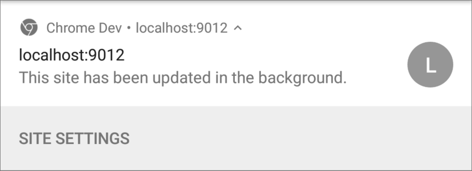

project_path: /web/fundamentals/_project.yaml
book_path: /web/fundamentals/_book.yaml

{# wf_updated_on: 2017-03-03 #}
{# wf_published_on: 2016-06-30 #}

# Push Events {: .page-title }



By this point covered subscribing a user for push sending them a message. The next step is to
receive this push message on the user's device and display a notification (as well as any other
work we might want to do).

## The Push Event

When a message is received, it'll result in a push event being dispatched in your service worker.

The code for setting up a push event listener should be pretty similar to any other event
listener you'd write in JavaScript:

    self.addEventListener('push', function(event) {
      if (event.data) {
        console.log('This push event has data: ', event.data.text());
      } else {
        console.log('This push event has no data.');
      }
    });

The weirdest bit of this code to most developers who are new to service workers is the `self`
variable. `self` is commonly used in Web Workers, which a service worker is. `self` refers to
the global scope, kind of like `window` in a web page. But for a web workers and service workers,
`self` refers to the the worker itself.

In the example above `self.addEventListener()` can be thought of as adding an event listener to
the service worker itself.

Inside the push event example we check if there is any data and print something to the terminal.

There are other ways you can parse data from a push event:

    // Returns string
    event.data.text()

    // Parses data as JSON string and returns an Object
    event.data.json()

    // Returns blob of data
    event.data.blob()

    // Returns an arrayBuffer
    event.data.arrayBuffer()

Most people use `json()` or `text()` depending on what they are expecting from their application.

This example demonstrates how to add a push event listener and how to access data, but it's
missing two very important pieces of functionality. It's not showing a notification and it's
not making use of `event.waitUntil()`.

### Wait Until

One of the things to understand about service workers is that you have little control over when
the service worker code is going to run. The browser decides when to wake it up and when to
terminate it. The only way you can tell the browser, "Hey I'm super busy doing important
stuff", is to pass a promise into the `event.waitUntil()` method. With this, the browser will
keep the service worker running until the promise you passed in has settled.

With push events there is an additional requirement that you must display a notification before
the promise you passed in has settled.

Here's a basic example of showing a notification:

    self.addEventListener('push', function(event) {
      const promiseChain = self.registration.showNotification('Hello, World.');

      event.waitUntil(promiseChain);
    });

Calling `self.registration.showNotification()` is the method that displays a notification to
the user and it returns a promise that will resolve once the notification has been displayed.

For the sake of keeping this example as clear as possible I've assigned this promise to a
variables called `promiseChain`. This is then passed into `event.waitUntil()`. I know this is
very verbose, but I've seen a number of issues that have culminated as a result of
misunderstanding what should be passed into `waitUntil()` or is the result of a broken promise
chains.

A more complicated example with a network request for data and tracking the push event with
analytics could look like this:

    self.addEventListener('push', function(event) {
      const analyticsPromise = pushReceivedTracking();
      const pushInfoPromise = fetch('/api/get-more-data')
        .then(function(response) {
          return response.json();
        })
        .then(function(response) {
          const title = response.data.userName + ' says...';
          const message = response.data.message;

          return self.registration.showNotification(title, {
            body: message
          });
        });

      const promiseChain = Promise.all([
        analyticsPromise,
        pushInfoPromise
      ]);

      event.waitUntil(promiseChain);
    });

Here we are calling a function that returns a promise `pushReceivedTracking()`,
which, for the sake of the example, we can pretend will make a network request
to our analytics provider. We are also making a network request, getting the
response and showing a notification using the responses data for the title and
message of the notification.

We can ensure the service worker is kept alive while both of these tasks are done by combining
these promises with `Promise.all()`. The resulting promise is passed into `event.waitUntil()`
meaning the browser will wait until both promises have finished before checking that a notification
has been displayed and terminating the service worker.

Note: If you ever find your promise chains confusing or a little messy,
I find that breaking things into functions helps to reduce complexity.
I'd also recommend
[this blog post by Philip Walton on untangling promise
chains](https://philipwalton.com/articles/untangling-deeply-nested-promise-chains/).
The main point to take away is that you should experiment with how promises can be written
and chained to find a style that works for you.

The reason we should be concerned about `waitUntil()` and how to use it is that one of the most
common issues developers face is that when the promise chain is incorrect / broken, Chrome will
show this "default" notification:

Chrome will only show the "This site has been updated in the background." notification when a
push message is received and the push event in the service worker **does not** show a
notification after the promise passed to `event.waitUntil()` has finished.

The main reason developers get caught by this is that their code will
often call `self.registration.showNotification()` but they **aren't** doing
anything with the promise it returns. This intermittently results in the default notification
being displayed. For example, we could remove the return for
`self.registration.showNotification()` in the example above and we run the risk of seeing this
notification.

    self.addEventListener('push', function(event) {
      const analyticsPromise = pushReceivedTracking();
      const pushInfoPromise = fetch('/api/get-more-data')
        .then(function(response) {
          return response.json();
        })
        .then(function(response) {
          const title = response.data.userName + ' says...';
          const message = response.data.message;

          self.registration.showNotification(title, {
            body: message
          });
        });

      const promiseChain = Promise.all([
        analyticsPromise,
        pushInfoPromise
      ]);

      event.waitUntil(promiseChain);
    });

You can see how it's an easy thing to miss.

Just remember - if you see that notification, check your promise chains and `event.waitUntil()`.

In the next section we're going to look at what we can do to style notifications and
what content we can display.
