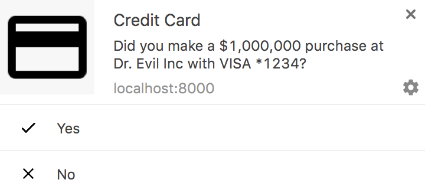

project_path: /web/fundamentals/_project.yaml
book_path: /web/fundamentals/_book.yaml
description: Push notifications are one of the most valuable capabilities of native apps, and this capability is now available on the web. To get the most out of them, notifications need to be timely, precise, and relevant.

{# wf_updated_on: 2017-06-14 #}
{# wf_published_on: 2016-06-30 #}

# Web Push Notifications: Timely, Relevant, and Precise {: .page-title }



If you ask a room of developers what mobile device features are missing from
the web, push notifications are always high on the list.

Web push notifications allow users to opt-in to timely updates from sites
they love and allow you to effectively re-engage them with customized,
relevant content.

The Push API and Notification API open a whole new set of possibilities for
you to re-engage with your users.

## Are service workers involved? {: #service-worker-involved }

Yes. Push is based on service workers because service workers operate in the
background. This means the only time code is run for a push notification (in
other words, the only time the battery is used) is when the user interacts with
a notification by clicking it or closing it.   If you're not familiar with them,
check out the  [service worker introduction][service-worker-primer]. We will use
service worker code in later sections when we show you how to implement pushes
and notifications.

## Two technologies {: #two-technologies }

Push and notification use different, but complementary, APIs:
[**push**](https://developer.mozilla.org/en-US/docs/Web/API/Push_API) is
invoked when a server supplies information to a service worker; a
[**notification**](https://developer.mozilla.org/en-US/docs/Web/API/Notifications_API)
is the action of a service worker or web page script showing information
to a user.

## A little notification anatomy {: #anatomy }

In the next section we're going to throw a bunch of pictures at you, but we
promised code. So, here it is. With a service worker registration you call
`showNotification` on a registration object.

    serviceWorkerRegistration.showNotification(title, options);

The `title` argument appears as a heading in the notification. The `options`
argument is an object literal that sets the other properties of a notification.
A typical options object looks something like this:

    {
      "body": "Did you make a $1,000,000 purchase at Dr. Evil...",
      "icon": "images/ccard.png",
      "vibrate": [200, 100, 200, 100, 200, 100, 400],
      "tag": "request",
      "actions": [
        { "action": "yes", "title": "Yes", "icon": "images/yes.png" },
        { "action": "no", "title": "No", "icon": "images/no.png" }
      ]
    }

This code produces a notification like the one in the image. It generally
provides the same capabilities as a native application. Before diving into the
specifics of implementing those capabilities, I'll show you how to use those
capabilities effectively.   We'll go on to describe the mechanics of
implementing push notifications, including handling permissions and
subscriptions, sending messages, and responding to them.

## How can I try it?

There are several ways you can play with the features before you completely
understand how they work, or have to implement them. First, check out
[our own sample](https://github.com/GoogleChrome/samples/tree/gh-pages/push-messaging-and-notifications).
Also available are Peter Beverloo's
[Notification Generator](https://tests.peter.sh/notification-generator/)
and Mozilla's [Push Payload Demo](https://serviceworke.rs/push-payload_demo.html).

Note: Unless you're using localhost, the Push API requires HTTPS.

<<../../_common-links.md>>
