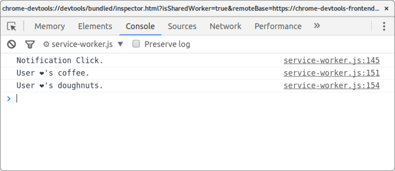
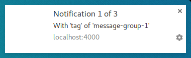
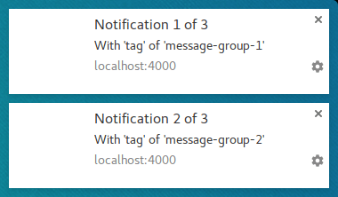
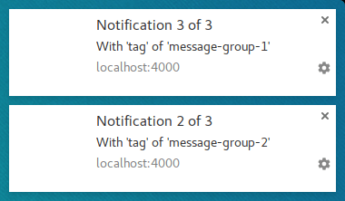

project_path: /web/fundamentals/_project.yaml
book_path: /web/fundamentals/_book.yaml

{# wf_updated_on: 2017-03-03 #}
{# wf_published_on: 2016-06-30 #}

# Notification Behaviour {: .page-title }



So far we've looked at the options that alter the visual appearance of a notification. There
are also options that alter the behaviour of notifications.

Be default, calling `showNotification()` with just visual options will have
the following behaviours:

- Clicking on the notification does nothing.
- Each new notification is shown one after the other. The browser will not collapse the
notifications in any way.
- The platform may play a sound or vibrate the user's devices (depending on the platform).
- On some platforms the notification will disappear after a short
period of time while others will show the notification unless the user interacts with it.
(For example, compare your notifications on Android and Desktop.)

In this section we are going to look at how we can alter these default behaviours using options
alone. These are relatively easy to implement and take advantage of.

### Notification Click Event

When a user clicks on a notification the default behaviour is for nothing
to happen. It doesn't even close or remove the notification.

The common practice for a notification click is for it to close and perform some other logic
(i.e. open a window or make some API call to the application).

To achieve this we need to add a 'notificationclick' event listener to our service worker. This
will be called when ever a notification is clicked.

    self.addEventListener('notificationclick', function(event) {
      const clickedNotification = event.notification;
      clickedNotification.close();

      // Do something as the result of the notification click
      const promiseChain = doSomething();
      event.waitUntil(promiseChain);
    });

As you can see in this example, the notification that was clicked can be
accessed via the `event.notification` parameter. From this we can access
the notifications properties and methods. In this case we call its
`close()` method and perform additional work.

Note: You still need to make use of event.waitUntil() to keep the service worker running
while your code is busy.

### Actions

Actions allow you to give users another level of interaction with your users
over just clicking the notification.

In the previous section you saw how to define actions when calling
`showNotification()`:

        const title = 'Actions Notification';
        const options = {
          actions: [
            {
              action: 'coffee-action',
              title: 'Coffee',
              icon: '/images/demos/action-1-128x128.png'
            },
            {
              action: 'doughnut-action',
              title: 'Doughnut',
              icon: '/images/demos/action-2-128x128.png'
            },
            {
              action: 'gramophone-action',
              title: 'gramophone',
              icon: '/images/demos/action-3-128x128.png'
            },
            {
              action: 'atom-action',
              title: 'Atom',
              icon: '/images/demos/action-4-128x128.png'
            }
          ]
        };

        const maxVisibleActions = Notification.maxActions;
        if (maxVisibleActions < 4) {
          options.body = `This notification will only display ` +
            `${maxVisibleActions} actions.`;
        } else {
          options.body = `This notification can display up to ` +
            `${maxVisibleActions} actions.`;
        }

        registration.showNotification(title, options);

If the user clicks an action button, check the `event.action` value in
the `noticationclick` event to tell which action button was clicked.

`event.action` will contain the `action` value set in the options. In the example above the
`event.action` values would be one of the following: 'coffee-action', 'doughnut-action',
'gramophone-action' or 'atom-action'.

With this we would detect notification clicks or action clicks like so:

    self.addEventListener('notificationclick', function(event) {
      if (!event.action) {
        // Was a normal notification click
        console.log('Notification Click.');
        return;
      }

      switch (event.action) {
        case 'coffee-action':
          console.log('User ❤️️\'s coffee.');
          break;
        case 'doughnut-action':
          console.log('User ❤️️\'s doughnuts.');
          break;
        case 'gramophone-action':
          console.log('User ❤️️\'s music.');
          break;
        case 'atom-action':
          console.log('User ❤️️\'s science.');
          break;
        default:
          console.log(`Unknown action clicked: '${event.action}'`);
          break;
      }
    });

{: .center-image }

### Tag

The *tag* option is essentially a string ID that "groups" notifications together, providing
an easy way to determine how multiple notifications are displayed to the user. This is easiest
to explain with an example.

Let's display a notification and give it a tag, of
'message-group-1'. We'd display the notification with this code:

        const title = 'Notification 1 of 3';
        const options = {
          body: 'With \'tag\' of \'message-group-1\'',
          tag: 'message-group-1'
        };
        registration.showNotification(title, options);

Which will show our first notification.

{: .center-image }

Let's display a second notification with a new tag of 'message-group-2', like so:

            const title = 'Notification 2 of 3';
            const options = {
              body: 'With \'tag\' of \'message-group-2\'',
              tag: 'message-group-2'
            };
            registration.showNotification(title, options);

 This will display a second notification to the user.

{: .center-image }

Now let's show a third notification but re-use the first tag of 'message-group-1'. Doing this
will close the first notification and replace it with our new notification.

            const title = 'Notification 3 of 3';
            const options = {
              body: 'With \'tag\' of \'message-group-1\'',
              tag: 'message-group-1'
            };
            registration.showNotification(title, options);

Now we have two notifications even though `showNotification()` was called three times.

{: .center-image }

The `tag` option is simply a way of grouping messages so that any old notifications that
are currently displayed will be closed if they have the same tag as a new notification.

A subtlety to using `tag` is that when it replaces a notification, it
will do so *without* a sound and vibration.

This is where the `renotify` option comes in.

### Renotify

This largely applies to mobile devices at the time of writing. Setting this option makes new
notifications vibrate and play a system sound.

There are scenarios where you might want a replacing notification to
notify the user rather than silently update. Chat applications are a good
example. In this case you should set `tag` and `renotify` to true.

            const title = 'Notification 2 of 2';
            const options = {
              tag: 'renotify',
              renotify: true
            };
            registration.showNotification(title, options);

**Note:** If you set `renotify: true` on a notification without a tag, you'll get the following
error:

    TypeError: Failed to execute 'showNotification' on 'ServiceWorkerRegistration':
    Notifications which set the renotify flag must specify a non-empty tag

### Silent

This option allows you to show a new notification but prevents the default
behavior of vibration, sound and turning on the device's display.

This is ideal if your notifications don't require immediate attention
from the user.

        const title = 'Silent Notification';
        const options = {
          silent: true
        };
        registration.showNotification(title, options);

**Note:** If you define both *silent* and *renotify*, silent will take precedence.

### Requires Interaction

Chrome on desktop will show notifications for a set time period before hiding them. Chrome on
Android doesn't have this behaviour. Notifications are displayed until
the user interacts with them.

To force a notification to stay visible until the user interacts with it
add the `requireInteraction` option. This will show the notification
until the user dismisses or clicks your notification.

        const title = 'Require Interaction Notification';
        const options = {
          body: 'With "requireInteraction: \'true\'".',
          requireInteraction: true
        };
        registration.showNotification(title, options);

Please use this option with consideration. Showing a notification and forcing the user to stop
what they are doing to dismiss your notification can be frustrating.

In the next section we are going to look at some of the common patterns used on the web for
managing notifications and performing actions such as opening pages when a notification is clicked.
