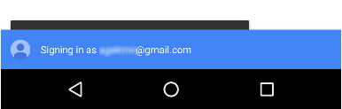
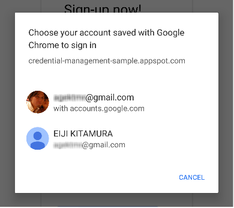

project_path: /web/fundamentals/_project.yaml
book_path: /web/fundamentals/_book.yaml

{# wf_updated_on: 2017-08-29 #}
{# wf_published_on: 2016-11-08 #}

# Sign in Users {: .page-title }




To sign in users, retrieve the credentials from the browser's password
manager and use those to automatically log in users.
For users with multiple accounts,
let them select the account with just one tap using the account chooser.

## Auto Sign-in

Auto sign-in can happen anywhere on your website;
not only the top page but other leaf pages too.
This is useful when users reach various pages in your website,
via a search engine.

To enable auto sign-in:

1. Get credential information.
2. Authenticate the user.
3. Update the UI or proceed to the personalized page.

### Get credential information

To get credential information, invoke
[`navigator.credential.get()`](https://developer.mozilla.org/en-US/docs/Web/API/CredentialsContainer/get).
Specify the type of credentials to request
by giving it a `password` or  `federated`.

Always use `mediation: 'silent'` for auto sign-ins,
so you can easily dismiss the process if the user:

* Has no credentials stored.
* Has multiple credentials stored.
* Is signed out.

Before getting a credential,
don’t forget to check if the user is already signed in:

    if (navigator.credentials) {
     if (!user.isSignedIn()) {
       navigator.credentials.get({
         password: true,
         federated: {
           providers: [
             'https://accounts.google.com'
           ]
         },
         mediation: 'silent'
       })
       // ...
      }
    }

When the `navigator.credentials.get()` resolves,
it returns either undefined or a credential object.
To determine whether it is a `PasswordCredential` or a `FederatedCredential`,
simply look at the `.type` property of the object,
which will be either `password` or `federated`.

If the `.type` is `federated`,
the `.provider` property is a string that represents the identity provider.

### Authenticate user

Once you have the credential,
run an authentication flow depending on the type of credential,
`password` or `federated`:

    }).then(c => {
     if (c) {
       switch (c.type) {
         case 'password':
           return sendRequest(c);
           break;
         case 'federated':
           return gSignIn(c);
           break;
       }
     } else {
       return Promise.resolve();
     }

When the function resolves,
check if you've received a credential object.
If not, it means auto sign-in couldn’t happen.
Silently dismiss the auto sign-in process.

### Update UI

If the authentication is successful,
update the UI or forward the user to the personalized page:

    }).then(profile => {
     if (profile) {
       updateUI(profile);
     }

### Don’t forget to show authentication error message

To avoid user confusion,
users should see a blue toast saying “Signing in”
at the time of getting the credential object:

  <figure>
    
  </figure>

One important tip: if you succeed in obtaining a credential object 
but fail to authenticate the user, you should show an error message:

        }).catch(error => {
          showError('Sign-in Failed');
        });
      }
    }

### Full code example

    if (navigator.credentials) {
     if (!user.isSignedIn()) {
       navigator.credentials.get({
         password: true,
         federated: {
           providers: [
             'https://accounts.google.com'
           ]
         },
         mediation: 'silent'
       }).then(c => {
         if (c) {
           switch (c.type) {
             case 'password':
               return sendRequest(c);
               break;
             case 'federated':
               return gSignIn(c);
               break;
           }
         } else {
           return Promise.resolve();
         }
       }).then(profile => {
         if (profile) {
           updateUI(profile);
         }
       }).catch(error => {
         showError('Sign-in Failed');
       });
     }
    }

## Sign-in via account chooser

If a user requires mediation, or has multiple accounts,
use the account chooser to let the user sign-in,
skipping the ordinary sign-in form, for example:

  <figure>
    
  </figure>

The steps to sign in via account chooser are the same as
[auto sign-in](#auto_sign-in),
with an additional call to show the account chooser
as part of getting credential information:

1. Get credential information and show account chooser.
2. [Authenticate the user](#authenticate_user).
3. [Update UI or proceed to a personalized page](#update_ui).

### Get credential information and show account chooser

Show an account chooser in response to a defined user action,
for example, when the user taps the "Sign-In" button. Call
[`navigator.credentials.get()`](https://developer.mozilla.org/en-US/docs/Web/API/CredentialsContainer/get),
and add `mediation: 'optional'` or `mediation: 'required'` to show the account chooser.

When `mediation` is `required`, the user is always shown an account chooser to sign in.
This option allows users with multiple accounts to easily switch between them.
When `mediation` is `optional`,
the user is explicitly shown an account chooser to sign in after a
[`navigator.credentials.preventSilentAccess()`](/web/fundamentals/security/credential-management/retrieve-credentials#turn_off_auto_sign-in_for_future_visits)
call.
This is normally to ensure automatic sign-in doesn't happen
after the user chooses to sign-out or unregister.

Example showing `mediation: 'optional'`:

    var signin = document.querySelector('#signin');
    signin.addEventListener('click', e => {
     if (navigator.credentials) {
       navigator.credentials.get({
         password: true,
         federated: {
           providers: [
             'https://accounts.google.com'
           ]
         },
         mediation: 'optional'
       }).then(c => {

Once the user selects an account,
the promise resolves with the credential.
If the users cancels the account chooser,
or there are no credentials stored,
the promise resolves with an undefined value.
In that case, fall back to the sign in form experience.

### Don't forget to fallback to sign-in form

You should fallback to a sign-in form for any of these reasons:

* No credentials are stored.
* The user dismissed the account chooser without selecting an account.
* The API is not available.

    }).then(profile => {
        if (profile) {
          updateUI(profile);
        } else {
          location.href = '/signin';
        }
    }).catch(error => {
        location.href = '/signin';
    });

### Full code example

    var signin = document.querySelector('#signin');
    signin.addEventListener('click', e => {
     if (navigator.credentials) {
       navigator.credentials.get({
         password: true,
         federated: {
           providers: [
             'https://accounts.google.com'
           ]
         },
         mediation: 'optional'
       }).then(c => {
         if (c) {
           switch (c.type) {
             case 'password':
               return sendRequest(c);
               break;
             case 'federated':
               return gSignIn(c);
               break;
           }
         } else {
           return Promise.resolve();
         }
       }).then(profile => {
         if (profile) {
           updateUI(profile);
         } else {
           location.href = '/signin';
         }
       }).catch(error => {
         location.href = '/signin';
       });
     }
    });

## Federated Login

Federated login lets users sign in with one tap and
without having to remember additional login details for your website.

To implement federated login:

1. Authenticate the user with a third-party identity.
2. Store the identity information.
3. [Update UI or proceed to a personalized page](#update_ui) (same as auto sign-in).

### Authenticate user with third-party identity

When a user taps on a federated login button,
run the specific identity provider authentication flow with the 
[`FederatedCredential`](https://developer.mozilla.org/en-US/docs/Web/API/FederatedCredential).

For example, if the provider is Google, use the
[Google Sign-In JavaScript library](/identity/sign-in/web/):

    
    navigator.credentials.get({
      password: true,
      mediation: 'optional',
      federated: {
        providers: [
          'https://account.google.com'
        ]
      }
    }).then(function(cred) {
      if (cred) {

        // Instantiate an auth object
        var auth2 = gapi.auth2.getAuthInstance();

        // Is this user already signed in?
        if (auth2.isSignedIn.get()) {
          var googleUser = auth2.currentUser.get();

          // Same user as in the credential object?
          if (googleUser.getBasicProfile().getEmail() === cred.id) {
            // Continue with the signed-in user.
            return Promise.resolve(googleUser);
          }
        }

        // Otherwise, run a new authentication flow.
        return auth2.signIn({
          login_hint: id || ''
        });

      }
    });

Google Sign-In results in an ID token as a proof of authentication.

In general, federated logins are built on top of standard protocols such as
[OpenID Connect](http://openid.net/connect/) or
[OAuth](https://oauth.net/2/).
To learn how to authenticate with federated accounts,
refer to respective federated identity providers' docs.
Popular examples include:

* [Google Sign-In](/identity/sign-in/web/)
* [Facebook Login](https://developers.facebook.com/docs/facebook-login)
* [Twitter Sign-in](https://dev.twitter.com/web/sign-in/implementing)
* [GitHub OAuth](https://developer.github.com/v3/oauth/)

### Store identity information

Once authentication is done, you can store the identity information.
The information you’ll store here is the `id` from the identity provider
and a provider string that represents the identity provider
(`name` and `iconURL` are optional).
Learn more about this information in the
[Credential Management specification](https://w3c.github.io/webappsec-credential-management/#credential).

To store federated account details, instantiate a new 
[`FederatedCredential`](https://developer.mozilla.org/en-US/docs/Web/API/FederatedCredential),
object with the user's identifier and the provider's identifier.
Then invoke
[`navigator.credentials.store()`](https://developer.mozilla.org/en-US/docs/Web/API/CredentialsContainer/store)
to store the identity information.

After successful federation,
instantiate a `FederatedCredential` synchronously, or asynchronously:

Example of synchronous approach:

    // Create credential object synchronously.
    var cred = new FederatedCredential({
      id:       id,                           // id in IdP
      provider: 'https://account.google.com', // A string representing IdP
      name:     name,                         // name in IdP
      iconURL:  iconUrl                       // Profile image url
    });

Example of asynchronous approach:

    // Create credential object asynchronously.
    var cred = await navigator.credentials.create({
      federated: {
        id:       id,
        provider: 'https://accounts.google.com',
        name:     name,
        iconURL:  iconUrl
      }
    });

Then store the credential object:

    // Store it
    navigator.credentials.store(cred)
    .then(function() {
      // continuation
    });

## Sign out {: #sign-out }

Sign out your users when the sign-out button is tapped.
First terminate the session,
then turn off auto sign-in for future visits.
(How you terminate your sessions is totally up to you.)

### Turn off auto sign-in for future visits

Call
`navigator.credentials.preventSilentAccess()`:

    signoutUser();
    if (navigator.credentials) {
     navigator.credentials.preventSilentAccess();
    }

This will ensure the auto sign-in won’t happen until next time the user enables auto sign-in.
To resume auto sign-in, a user can choose to intentionally sign-in
by choosing the account they wish to sign in with, from the account chooser.
Then the user is always signed back in until they explicitly sign out.

