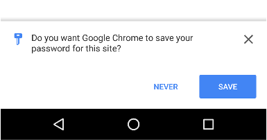

project_path: /web/fundamentals/_project.yaml
book_path: /web/fundamentals/_book.yaml

{# wf_updated_on: 2017-07-24 #}
{# wf_published_on: 2016-11-08 #}

# Store Credentials {: .page-title }




Store and update user credentials is easy with the 
`navigator.credentials.store()` API.

## Store a user's credential

After a user successfully signs up, signs in, or changes a password, store
or update the user's credential.

### Store username and password details

Key Point: Create a new `PasswordCredential` object and save it with 
`navigator.credentials.store()`.

Once the user has signed in, and you've verified their credentials, create
a new [`PasswordCredential`](https://developer.mozilla.org/en-US/docs/Web/API/PasswordCredential)
object and pass it to `navigator.credentials.store()` to save it.

    // After a successful sign-in, sign-up or password change,
    // Instantiate a `PasswordCredential` object
    var c = new PasswordCredential({
      id:       id,
      password: password,
      name:     name,
      iconrURL: iconUrl
    });

    // Store the credential
    navigator.credentials.store(c)
    .then(function() {
      // done
    });

<figure class="attempt-right">
  
  <figcaption>Notification for auto signed-in user</figcaption>
</figure>

When the Chrome browser obtains credential information,
a notification pops up asking to store a credential
(or federation provider)

### Store username and password from a form

Key Point: Use a well annotated form to easily create a new `PasswordCredential`
object and save it with `navigator.credentials.store()`.

In addition to manually creating the `PasswordCredential`, you can simply
pass a [well annotated](https://html.spec.whatwg.org/multipage/forms.html#autofill)
`form` element, to `PasswordCredential`.

For example:

    <form id="form" method="post">
      <input type="text" name="id" autocomplete="username" />
      <input type="password" name="password" autocomplete="current-password" />
      <input type="hidden" name="csrf_token" value="*****" />
    </form>

Then create a new `PasswordCredential` object by passing a reference to the
form element:

    var form = document.querySelector('#form');
    var cred = new PasswordCredential(form);
    // Store it
    navigator.credentials.store(cred)
    .then(function() {
      // continuation
    });

Any additional form fields will be automatically added to the
`PasswordCredential` as part of the `.additionalData` parameter.

## Store a credential for a federated account

Key Point: Create a new `FederatedCredential` object and save it with 
`navigator.credentials.store()`.

To store federated account details, instantiate a new 
[`FederatedCredential`](https://developer.mozilla.org/en-US/docs/Web/API/FederatedCredential),
object with the user's identifier and the provider's identifier. Then call 
`navigator.credentials.store()` to store the credential.

For example:

    // After a successful federation, instantiate a FederatedCredential
    var cred = new FederatedCredential({
      id:       id,                           // id in IdP
      provider: 'https://account.google.com', // A string representing IdP
      name:     name,                         // name in IdP
      iconURL:  iconUrl                       // Profile image url
    });

    // Store it
    navigator.credentials.store(cred)
    .then(function() {
      // continuation
    });

<table class="responsive properties">
  <tbody>
    <tr>
      <th colspan=2>Parameters</th>
    </tr>
    <tr>
      <td>
        <code>id</code>
      </td>
      <td>
        <code>string</code> 
        User identifier when invoking the identity provider specific
        authentication flow, typically as a value for <code>login_hint</code>
        in OAuth.
      </td>
    </tr>
    <tr>
      <td>
        <code>provider</code>
      </td>
      <td>
        <code>string</code> 
        ASCII serialization of the origin the provider uses for sign in. 
        For example, Facebook would be represented by 
        <code>https://www.facebook.com</code> and Google by 
        <code>https://accounts.google.com</code>.
      </td>
    </tr>
    <tr>
      <td>
        <code>name</code>
      </td>
      <td>
        <code>string</code> (optional) 
        Obtained from the identity provider.
      </td>
    </tr>
    <tr>
      <td>
        <code>iconURL</code>
      </td>
      <td>
        <code>string</code> (optional) 
        Obtained from the identity provider.
      </td>
    </tr>
  </tbody>
</table>

