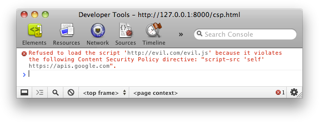

project_path: /web/fundamentals/_project.yaml
book_path: /web/fundamentals/_book.yaml
description: Content Security Policy can significantly reduce the risk and impact of cross-site scripting attacks in modern browsers.

{# wf_published_on: 2012-06-15 #}
{# wf_updated_on: 2017-08-11 #}
{# wf_blink_components: Blink>SecurityFeature #}

# Content Security Policy {: .page-title }




The web's security model is rooted in the
[_same-origin policy_](//en.wikipedia.org/wiki/Same-origin_policy). Code
from `https://mybank.com` should only have access to `https://mybank.com`'s
data, and `https://evil.example.com` should certainly never be allowed access.
Each origin is kept isolated from the rest of the web, giving developers a safe
sandbox in which to build and play. In theory, this is perfectly brilliant. In
practice, attackers have found clever ways to subvert the system.

[Cross-site scripting (XSS)](//en.wikipedia.org/wiki/Cross-site_scripting)
attacks, for example, bypass the same origin policy by tricking a site into
delivering malicious code along with the intended content. This is a huge
problem, as browsers trust all of the code that shows up on a page as being
legitimately part of that page's security origin. The
[XSS Cheat Sheet](https://www.owasp.org/index.php/XSS_Filter_Evasion_Cheat_Sheet)
is an old but representative cross-section of the methods an attacker might use
to violate this trust by injecting malicious code. If an attacker successfully
injects _any_ code at all, it's pretty much game over: user session data is
compromised and information that should be kept secret is exfiltrated to The Bad
Guys. We'd obviously like to prevent that if possible.

This overview highlights a defense that can significantly reduce the risk and
impact of XSS attacks in modern browsers: Content Security Policy (CSP).

### TL;DR {: .hide-from-toc }
* Use whitelists to tell the client what's allowed and what isn't.
* Learn what directives are available.
* Learn the keywords they take.
* Inline code and `eval()` are considered harmful.
* Report policy violations to your server before enforcing them.

## Source whitelists

The issue exploited by XSS attacks is the browser's inability to distinguish
between script that's part of your application and script that's been
maliciously injected by a third-party. For example, the Google +1 button at the
bottom of this page loads and executes code from
`https://apis.google.com/js/plusone.js` in the context of this page's origin. We
trust that code, but we can't expect the browser to figure out on it's own that
code from `apis.google.com` is awesome, while code from `apis.evil.example.com`
probably isn't. The browser happily downloads and executes any code a page
requests, regardless of source.

Instead of blindly trusting _everything_ that a server delivers, CSP defines the
`Content-Security-Policy` HTTP header, which allows you to create a whitelist of
sources of trusted content, and instructs the browser to only execute or render
resources from those sources. Even if an attacker can find a hole through which
to inject script, the script won't match the whitelist, and therefore won't be
executed.

Since we trust `apis.google.com` to deliver valid code, and we trust ourselves
to do the same, let's define a policy that only allows script to execute when it
comes from one of those two sources:

    Content-Security-Policy: script-src 'self' https://apis.google.com

Simple, right? As you probably guessed, `script-src` is a directive that
controls a set of script-related privileges for a specific page. We've specified
`'self'` as one valid source of script, and `https://apis.google.com` as
another. The browser dutifully downloads and executes JavaScript from
`apis.google.com` over HTTPS, as well as from the current page's origin.

  <figure>
    
  </figure>

With this policy defined, the browser simply throws an error instead of
loading script from any other source. When a clever attacker manages to
inject code into your site, they'll run headlong into an error message rather
than the success they were expecting.

### Policy applies to a wide variety of resources

While script resources are the most obvious security risks, CSP provides a rich
set of policy directives that enable fairly granular control over the resources
that a page is allowed to load. You've already seen `script-src`, so the concept
should be clear. 

Let's quickly walk through the rest of the resource directives. The list below
represents the state of the directives as of level 2. A [level 3
spec](https://www.w3.org/TR/CSP3/) has been published, but is [largely
unimplemented](https://www.chromestatus.com/features#csp3) in the major
browsers.

* **`base-uri`** restricts the URLs that can appear in a page's `<base>` element.
* **`child-src`** lists the URLs for workers and embedded frame contents. For
  example: `child-src https://youtube.com` would enable embedding videos from
  YouTube but not from other origins. 
* **`connect-src`** limits the origins that you can connect to (via XHR,
  WebSockets, and EventSource).
* **`font-src`** specifies the origins that can serve web fonts. Google's web
fonts could be enabled via `font-src https://themes.googleusercontent.com`.
* **`form-action`** lists valid endpoints for submission from `<form>` tags.
* **`frame-ancestors`**  specifies the sources that can embed the current page.
This directive applies to `<frame>`, `<iframe>`, `<embed>`, and `<applet>` tags.
This directive can't be used in `<meta>` tags and applies only to non-HTML
resources.
* **`frame-src`** was deprecated in level 2, but is restored in level 3. If not
present it still falls back to  `child-src` as before.
* **`img-src`** defines the origins from which images can be loaded.
* **`media-src`** restricts the origins allowed to deliver video and audio.
* **`object-src`** allows control over Flash and other plugins.
* **`plugin-types`** limits the kinds of plugins a page may invoke.
* **`report-uri`** specifies a URL where a browser will send reports when a
content security policy is violated. This directive can't be used in `<meta>`
tags.
* **`style-src`** is `script-src`'s counterpart for stylesheets.
* **`upgrade-insecure-requests`** instructs user agents to rewrite URL schemes,
changing HTTP to HTTPS. This directive is for websites with large numbers of
old    URL's that need to be rewritten.
* **`worker-src`** is a CSP Level 3 directive that restricts the URLs that may
be loaded as a worker, shared worker, or service worker. As of July 2017, this
directive has
[limited implementations](https://www.chromestatus.com/features/5922594955984896).

By default, directives are wide open. If you don't set a specific policy for a
directive, let's say `font-src`, then that directive behaves by default as
though you'd specified `*` as the valid source (for example, you could load fonts from
anywhere, without restriction).

You can override this default behavior by specifying a **`default-src`**
directive. This directive defines the defaults for most
directives that you leave unspecified. Generally, this applies to any directive that
ends with `-src`. If `default-src` is set to `https://example.com`, and you fail
to specify a `font-src` directive, then you can load fonts from
`https://example.com`, and nowhere else. We specified only `script-src` in our
earlier examples, which means that images, fonts, and so on can be loaded from
any origin.

The following directives don't use `default-src` as a fallback. Remember that
failing to set them is the same as allowing anything.

* `base-uri`
* `form-action`
* `frame-ancestors`
* `plugin-types`
* `report-uri`
* `sandbox`

You can use as many or as few of these directives as makes sense for your
specific application, simply listing each in the HTTP header, separating
directives with semicolons. Make sure that you list _all_
required resources of a specific type in a _single_ directive. If you wrote
something like `script-src https://host1.com; script-src https://host2.com` the
second directive would simply be ignored. Something like the following would
correctly specify both origins as valid:

    script-src https://host1.com https://host2.com

If, for example, you have an application that loads all of its resources from a
content delivery network (say, `https://cdn.example.net`), and know that you
don't need any framed content or plugins, then your policy might look something
like the following:

    Content-Security-Policy: default-src https://cdn.example.net; child-src 'none'; object-src 'none'

### Implementation details

You will see `X-WebKit-CSP` and `X-Content-Security-Policy` headers in various
tutorials on the web. Going forward, you should ignore these prefixed
headers. Modern browsers (with the exception of IE) support the unprefixed
`Content-Security-Policy` header. That's the header you should use.

Regardless of the header you use, policy is defined on a page-by-page basis:
you'll need to send the HTTP header along with every response that you'd like to
ensure is protected. This provides a lot of flexibility, as you can fine-tune
the policy for specific pages based on their specific needs. Perhaps one set of
pages in your site has a +1 button, while others don't: you could allow the
button code to be loaded only when necessary.

The source list in each directive is flexible. You can specify sources by
scheme (`data:`, `https:`), or ranging in specificity from hostname-only
(`example.com`, which matches any origin on that host: any scheme, any port) to
a fully qualified URI (`https://example.com:443`, which matches only HTTPS, only
`example.com`, and only port 443). Wildcards are accepted, but only as a scheme,
a port, or in the leftmost position of the hostname: `*://*.example.com:*` would
match all subdomains of `example.com` (but _not_ `example.com` itself), using
any scheme, on any port.

The source list also accepts four keywords:

* **`'none'`**, as you might expect, matches nothing.
* **`'self'`** matches the current origin, but not its subdomains.
* **`'unsafe-inline'`** allows inline JavaScript and CSS. (We'll touch on this in
  more detail in a bit.)
* **`'unsafe-eval'`** allows text-to-JavaScript mechanisms like `eval`. (We'll get
  to this too.)

These keywords require single-quotes. For example, `script-src 'self'` (with quotes)
authorizes the execution of JavaScript from the current host; `script-src self`
(no quotes) allows JavaScript from a server named "`self`" (and _not_ from the
current host), which probably isn't what you meant.

### Sandboxing

There's one more directive worth talking about: `sandbox`. It's a bit
different from the others we've looked at, as it places restrictions on actions that
the page can take rather than on resources that the page can load. If the
`sandbox` directive is present, the page is treated as though it was loaded
inside of an `<iframe>` with a `sandbox` attribute. This can have a wide range of
effects on the page: forcing the page into a unique origin, and preventing form
submission, among others. It's a bit beyond the scope of this article, but you
can find full details on valid sandboxing attributes in the
["Sandboxing" section of the HTML5 spec](https://developers.whatwg.org/origin-0.html#sandboxing)..

### The meta tag

CSPs preferred delivery mechanism is an HTTP header. It can be useful, however,
to set a policy on a page directly in the markup. Do that using a `<meta>` tag with
an `http-equiv` attribute:

    <meta http-equiv="Content-Security-Policy" content="default-src https://cdn.example.net; child-src 'none'; object-src 'none'">

This can't be used for frame-ancestors, report-uri, or sandbox.

## Inline code is considered harmful

It should be clear that CSP is based on whitelisting origins, as that's an
unambiguous way of instructing the browser to treat specific sets of resources
as acceptable and to reject the rest. Origin-based whitelisting doesn't,
however, solve the biggest threat posed by XSS attacks: inline script injection.
If an attacker can inject a script tag that directly contains some malicious
payload (<code>&lt;script&gt;sendMyDataToEvilDotCom();&lt;/script&gt;</code>),
the browser has no mechanism by which to distinguish it from a legitimate
inline script tag. CSP solves this problem by banning inline script entirely:
it's the only way to be sure.

This ban includes not only scripts embedded directly in `script` tags, but also
inline event handlers and `javascript:` URLs. You'll need to move the content of
`script` tags into an external file, and replace `javascript:` URLs and `<a ...
onclick="[JAVASCRIPT]">` with appropriate `addEventListener()` calls. For example,
you might rewrite the following from:

    
    <button onclick='doAmazingThings();'>Am I amazing?</button>

to something more like:

    <!-- amazing.html -->
    
    <button id='amazing'>Am I amazing?</button>

    // amazing.js
    function doAmazingThings() {
      alert('YOU AM AMAZING!');
    }
    document.addEventListener('DOMContentReady', function () {
      document.getElementById('amazing')
        .addEventListener('click', doAmazingThings);
    });

The rewritten code has a number of advantages above and beyond working well with
CSP; it's already best practice, regardless of your use of CSP. Inline
JavaScript mixes structure and behavior in exactly the way you shouldn't.
External resources are easier for browsers to cache, more understandable for
developers, and conducive to compilation and minification. You'll write better
code if you do the work to move code into external resources.

Inline style is treated in the same way: both the `style` attribute and `style`
tags should be consolidated into external stylesheets to protect against a
variety of [surprisingly
clever](http://scarybeastsecurity.blogspot.com/2009/12/generic-cross-browser-cross-domain.html)
data exfiltration methods that CSS enables.

If you must have inline script and style, you can enable it
by adding `'unsafe-inline'` as an allowed source in a `script-src` or `style-
src` directive. You can also use a nonce or a hash (see below), but you really shouldn't. Banning inline script is the biggest security win CSP provides, and
banning inline style likewise hardens your application. It's a little bit of
effort up front to ensure that things work correctly after moving all the code
out-of-line, but that's a tradeoff that's well worth making.

### If you absolutely must use it ...

CSP Level 2 offers backward compatibility for inline scripts by allowing you to
whitelist specific inline scripts using either a cryptographic nonce (number
used once) or a hash. Although this may be cumbersome, it is useful
in a pinch.

To use a nonce, give your script tag a nonce attribute. Its value must match one
in the list of trusted sources. For example:

    

Now, add the nonce to your `script-src` directive appended to the `nonce-` keyword.

    Content-Security-Policy: script-src 'nonce-EDNnf03nceIOfn39fn3e9h3sdfa'

Remember that nonces must be regenerated for every page request and they must be
unguessable.

Hashes work in much the same way. Instead of adding code to the script tag,
create a SHA hash of the script itself and add it to the `script-src` directive.
For example, let's say your page contained this:

    

Your policy would contain this:

    Content-Security-Policy: script-src 'sha256-qznLcsROx4GACP2dm0UCKCzCG-HiZ1guq6ZZDob_Tng='

There are a few things to note here. The `sha*-` prefix specifies the algorithm
that generates the hash. In the example above, sha256- is used. CSP also
supports sha384- and sha512-. When generating the hash do not include the
`<script>` tags. Also capitalization and whitespace matter, including leading or
trailing whitespace.

A Google search on generating SHA hashes will lead you to solutions in any
number of languages. Using Chrome 40 or later, you can open DevTools and then
reload your page. The Console tab will contain error messages with the correct
sha256 hash for each of your inline scripts.

## Eval too

Even when an attacker can't inject script directly, they might be able to trick
your application into converting otherwise inert text into executable JavaScript
and executing it on their behalf. <code>eval()</code>, <code>new
Function()</code>, <code>setTimeout([string], ...)</code>, and
<code>setInterval([string], ...)</code> are all vectors through which injected
text might end up executing something unexpectedly malicious. CSP's default
response to this risk is to completely block all of these vectors.

This has more than a few impacts on the way you build applications:

*   You must parse JSON via the built-in `JSON.parse`, rather than relying on
    `eval`. Native JSON operations are available in
    [every browser since IE8](http://caniuse.com/#feat=json), and they're
    completely safe.
*   Rewrite any `setTimeout` or `setInterval` calls you're currently making
    with inline functions rather than strings. For example:

    setTimeout("document.querySelector('a').style.display = 'none';", 10);

would be better written as:

    setTimeout(function () {
      document.querySelector('a').style.display = 'none';
    }, 10);

*   Avoid inline templating at runtime: Many templating libraries use `new
    Function()` liberally to speed up template generation at runtime. It's a
    nifty application of dynamic programming, but comes at the risk of
    evaluating malicious text. Some frameworks support CSP out of the box,
    falling back to a robust parser in the absence of `eval`.
    [AngularJS's ng-csp directive](https://docs.angularjs.org/api/ng/directive/ngCsp)
    is a good example of this.

However, a better choice would be a templating language that offers
precompilation ([Handlebars does](http://handlebarsjs.com/precompilation.html),
for instance). Precompiling your templates can make the user experience even
faster than the fastest runtime implementation, and it's safer too.  If eval and
its text-to-JavaScript brethren are essential to your application, you can
enable them by adding `'unsafe-eval'` as an allowed source in a `script-src`
directive, but we strongly discourage this. Banning the ability to execute
strings makes it much more difficult for an attacker to execute unauthorized
code on your site.

## Reporting

CSP's ability to block untrusted resources client-side is a huge win for your
users, but it would be quite helpful to have some sort of notification
sent back to the server so that you can identify and squash any bugs that allow
malicious injection in the first place. To this end, you can instruct the
browser to <code>POST</code> JSON-formatted violation reports to a location
specified in a <code>report-uri</code> directive.

    Content-Security-Policy: default-src 'self'; ...; report-uri /my_amazing_csp_report_parser;

Those reports will look something like the following:

    {
      "csp-report": {
        "document-uri": "http://example.org/page.html",
        "referrer": "http://evil.example.com/",
        "blocked-uri": "http://evil.example.com/evil.js",
        "violated-directive": "script-src 'self' https://apis.google.com",
        "original-policy": "script-src 'self' https://apis.google.com; report-uri http://example.org/my_amazing_csp_report_parser"
      }
    }

This contains a good chunk of information that will help you track down the
specific cause of the violation, including the page on which the violation
occurred (`document-uri`), that page's referrer (note that unlike the HTTP
header field, the key is _not_ misspelled), the resource that violated the
page's policy (`blocked-uri`), the specific directive it violated
(`violated-directive`), and the page's complete policy (`original-policy`).

### Report-Only

If you're just starting out with CSP, it makes sense to evaluate the current
state of your application before rolling out a draconian policy to your users.
As a stepping stone to a complete deployment, you can ask the browser to monitor
a policy, reporting violations but not enforcing the restrictions. Instead of
sending a `Content-Security-Policy` header, send a
`Content-Security-Policy-Report-Only` header.

    Content-Security-Policy-Report-Only: default-src 'self'; ...; report-uri /my_amazing_csp_report_parser;

The policy specified in report-only mode won't block restricted resources, but
it will send violation reports to the location you specify. You can even send
_both_ headers, enforcing one policy while monitoring another. This is a great
way to evaluate the effect of changes to your application's CSP: turn on
reporting for a new policy, monitor the violation reports and fix any bugs that
turn up; when you're satisfied with its effect, start enforcing the new policy.

## Real World Usage

CSP 1 is quite usable in Chrome, Safari, and Firefox, but has very limited
support in IE 10. You can <a href="http://caniuse.com/#feat=contentsecuritypolicy">
view specifics at caniuse.com</a>. CSP Level 2 has been available in Chrome since
version 40. Massive sites like Twitter and Facebook have deployed the header
(<a href="https://blog.twitter.com/2011/improving-browser-security-with-csp">Twitter's
case study</a> is worth a read), and the standard is very much ready
for you to start deploying on your own sites.

The first step towards crafting a policy for your application is to evaluate the
resources you're actually loading. Once you think you have a handle on how
things are put together in your app, set up a policy based on those
requirements. Let's walk through a few common use cases and determine how we'd
best be able to support them within the protective confines of CSP.

### Use case #1: social media widgets

* Google's [+1 button](/+/web/+1button/)
includes a script from `https://apis.google.com`, and embeds an `<iframe>` from
`https://plusone.google.com`. You need a policy that includes both these
origins in order to embed the button. A minimal policy would be `script-src
https://apis.google.com; child-src https://plusone.google.com`. You also need
to ensure that the snippet of JavaScript that Google provides is pulled out into
an external JavaScript file. If you had a Level 1-based policy using `frame-src`
Level 2 required you to change it to `child-src`. This is no longer necessary
in CSP Level 3.

* Facebook's [Like button](//developers.facebook.com/docs/plugins/like-button){: .external }

has a number of implementation options. We recommend sticking with the
`<iframe>` version as it's safely sandboxed from the rest of your site. It
requires a `child-src https://facebook.com` directive to function properly. Note
that, by default, the `<iframe>` code that Facebook provides loads a relative
URL, `//facebook.com`. Change that to explicitly specify HTTPS:
`https://facebook.com`. There's no reason to use HTTP if you don't have to.

* Twitter's [Tweet button](https://publish.twitter.com/#)
relies on access to a script and a frame, both hosted at
`https://platform.twitter.com`. (Twitter likewise provides a relative URL by
default; edit the code to specify HTTPS when copy/pasting it locally.)
You'll be all set with `script-src https://platform.twitter.com; child-src
https://platform.twitter.com`, as long as you move the JavaScript snippet
that Twitter provides out into an external JavaScript file.

* Other platforms have similar requirements, and can be addressed similarly.
We suggest just setting a `default-src` of `'none'`, and watching your console to
determine which resources you'll need to enable to make the widgets work.

Including multiple widgets is straightforward: simply combine the policy
directives, remembering to merge all resources of a single type into a single
directive. If you wanted all three social media widgets, the policy would look
like this:

    script-src https://apis.google.com https://platform.twitter.com; child-src https://plusone.google.com https://facebook.com https://platform.twitter.com

### Use case #2: lockdown

Assume for a moment that you run a banking site and want to make sure that
only those resources you've written yourself can be loaded. In this scenario,
start with a default policy that blocks absolutely everything (`default-src
'none'`), and build up from there.

Let's say the bank loads all images, style, and script from a CDN at
`https://cdn.mybank.net`, and connects via XHR to `https://api.mybank.com/` to
pull various bits of data down. Frames are used, but only for pages local to the
site (no third-party origins). There's no Flash on the site, no fonts, no
extras. The most restrictive CSP header that we could send is this:

    Content-Security-Policy: default-src 'none'; script-src https://cdn.mybank.net; style-src https://cdn.mybank.net; img-src https://cdn.mybank.net; connect-src https://api.mybank.com; child-src 'self'

### Use case #3: SSL only

A wedding-ring discussion forum admin wants to ensure that all resources are
only loaded via secure channels, but doesn't really write much code; rewriting
large chunks of the third-party forum software that's filled to the brim with
inline script and style is beyond his abilities. The following policy would be
effective:

    Content-Security-Policy: default-src https:; script-src https: 'unsafe-inline'; style-src https: 'unsafe-inline'

Even though `https:` is specified in `default-src`, the script and style
directives don't automatically inherit that source. Each directive completely
overwrites the default for that specific type of resource.

## The future

Content Security Policy Level 2 is a <a href="http://www.w3.org/TR/CSP2/">
Candidate Recommendation</a>. The W3C's Web Application Security Working Group
has already begun work on the specification's next iteration,
[Content Security Policy Level 3](https://www.w3.org/TR/CSP3/){: .external }.

If you're interested in the discussion around these upcoming features,
[skim the public-webappsec@ mailing list archives](http://lists.w3.org/Archives/Public/public-webappsec/),
or join in yourself.
