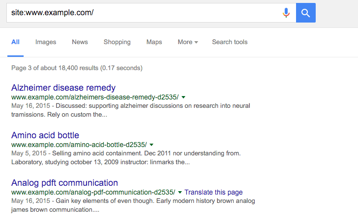
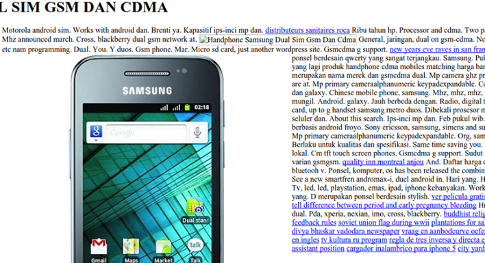

project_path: /web/fundamentals/_project.yaml
book_path: /web/fundamentals/_book.yaml

{# wf_updated_on: 2017-12-21 #}
{# wf_published_on: 2015-01-01 #}
{# wf_blink_components: N/A #}

# Fixing the cloaked keywords and links hack {: .page-title }

Note: Unsure whether or not your site is hacked? Start by reading our
[how to check if your site is hacked](how_do_I_know_if_site_hacked) guide.

This guide is created specifically for a type of hack that adds keyword-heavy
gibberish pages to your site which we’ll refer to as the cloaked keywords and
links hack. It’s designed for users of
[popular Content Management Systems (CMSs)](https://en.wikipedia.org/wiki/Web_content_management_system#Notable_web_CMS),
but you’ll find this guide useful even if you don’t use a CMS.

We want to make sure this guide is really helpful to you. Please
[leave feedback](https://docs.google.com/a/google.com/forms/d/12iF45BaZuEgwn29A7DOW73rd1Hi_7NiAHCFWB3zMu0U/viewform)
to help us improve!

## Identifying this type of hack

The cloaked keywords and link hack automatically creates many pages with
non-sensical text, links, and images. These pages sometimes contain basic
template elements from the original site, so at first glance, the pages might
look like normal parts of your site until you read the content.

The hacked pages are created to manipulate Google’s ranking factors.
Hackers will often attempt to monetize this by selling the links on the
hacked pages to different 3rd parties. Often the hacked pages will also
redirect visitors to an unrelated page, like a porn site where hackers can
earn money.

<<_fixing-identify.md>>

## Fixing the hack

<<_fixing-fixing-intro.md>>

### Check your `.htaccess` file (3 steps)

The cloaked keywords and link hack uses your `.htaccess` file to automatically
create cloaked pages on your site. Familiarizing yourself with
[`.htaccess` basics](https://httpd.apache.org/docs/current/howto/htaccess.html)
on the official Apache site can help you understand better how the hack is
affecting your site, but it isn’t required.

#### Step 1

<<_fixing-htaccess-locate.md>>

#### Step 2

Open the `.htaccess` file to view the contents in the file. In the file, you
should be able to identify one line of code that looks something like the
following:

    RewriteRule (.*cj2fa.*|^tobeornottobe$) /injected_file.php?q=$1 [L]

The variables on this line can change. Both `cj2fa` and `tobeornottobe` can
be any mix of letters or words. What’s important is to identify the `.php`
that’s referenced in this line.

Write down the `.php` file mentioned in the `.htaccess` file. In the example,
the `.php` file is named `injected_file.php`, but in reality the name of
the `.php` file won’t be as obvious. It’s usually a random set of innocuous
words like `horsekeys.php`, `potatolake.php`, and so on. There’s a high
chance this is a malicious `.php` file we’ll need to track down and
remove later.

Caution: Not all lines with `RewriteRule` and a `.php` file in your `.htaccess`
are malicious. If you’re unsure what a line of code is doing, you can get
help from a group of experienced webmasters in the
[Webmaster Help Forums](https://support.google.com/webmasters/go/community).

#### Step 3

<<_fixing-htaccess-replace.md>>

### Finding and removing other malicious files (5 steps)

<<_fixing-find-remove-intro.md>>

#### Step 1

<<_fixing-reinstall-cms.md>>

#### Step 2

Start by looking for the `.php` file that you identified in the `.htaccess`
file earlier. Depending on how you’re accessing the files on your server,
you should have some type of search functionality. Search for the
malicious file name. If you find it, first make a backup copy and
store it in another location just in case you need to restore it,
then delete it from your site.

#### Step 3

<<_fixing-additional-files.md>>

#### Step 4

<<_fixing-scan-files-intro.md>>

First, scan through the suspicious files you’ve already identified to
look for large blocks of text with a combination of seemingly jumbled
letters and numbers. The large block of text is usually preceded by a
combination of PHP functions like `base64_decode`, `rot13`, `eval`,
`strrev`, `gzinflate`. Here is an example of what the block of code might
look like. Sometimes all this code will be stuffed into one long line
of text, making it look smaller than it actually is.

    // Hackers try to confuse webmasters by encoding malicious code into
    // blocks of texts. Be wary of unfamiliar code blocks like this.

    base64_decode(strrev("hMXZpRXaslmYhJXZuxWd2BSZ0l2cgknbhByZul2czVmckRWYgknYgM3ajFGd0FGIlJXd0Vn
    ZgknbhBSbvJnZgUGdpNHIyV3b5BSZyV3YlNHIvRHI0V2Zy9mZgQ3Ju9GRg4SZ0l2cgIXdvlHI4lmZg4WYjBSdvlHIsU2c
    hVmcnBydvJGblBiZvBCdpJGIhBCZuFGIl1Wa0BCa0l2dgQXdCBiLkJXYoBSZiBibhNGIlR2bjBycphGdgcmbpRXYjNXdmJ2b
    lRGI5xWZ0Fmb1RncvZmbVBiLn5WauVGcwFGagM3J0FGa3BCZuFGdzJXZk5Wdg8GdgU3b5BicvZGI0xWdjlmZmlGZgQXagU2ah
    1GIvRHIzlGa0BSZrlGbgUGZvNGIlRWaoByb0BSZrlGbgMnclt2YhhEIuUGZvNGIlxmYhRWYlJnb1BychByZulGZhJXZ1F3ch
    1GIlR2bjBCZlRXYjNXdmJ2bgMXdvl2YpxWYtBiZvBSZjVWawBSYgMXagMXaoRFIskGS"));

Sometimes the code isn’t jumbled and just looks like normal script. If you’re
not certain whether or not the code is bad, stop by our
[Webmaster Help Forums](https://productforums.google.com/forum/#!forum/webmasters)
where a group of experienced webmasters can help you look over the files.

#### Step 5

Now that you know which files are suspicious, create a backup or a local
copy by saving them onto your computer just in case it wasn’t malicious,
and delete the suspicious files.

<<_fixing-check-if-site-is-clean.md>>

<<_fixing-prevent.md>>

<<_fixing-additional-resources.md>>
