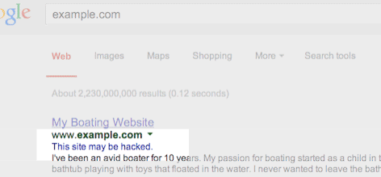

project_path: /web/fundamentals/_project.yaml
book_path: /web/fundamentals/_book.yaml

{# wf_updated_on: 2017-10-30 #}
{# wf_published_on: 2015-01-01 #}

# Help, I think I've been hacked! {: .page-title }

<figure class="attempt-right">
  
  <figcaption>
    If you're a site owner and you see one of these, you might have been hacked.
  </figcaption>
</figure>

Every day, cybercriminals compromise thousands of websites. Hacks are
often invisible to users, yet remain harmful to anyone viewing the page
— including the site owner. For example, unbeknownst to the site owner,
the hacker may have infected their site with harmful code which in turn
can record keystrokes on visitors’ computers, stealing login credentials
for online banking or financial transactions. If you’re not sure whether
or not your site was hacked, start by reading
[how do I know if my site is hacked?](how_do_I_know_if_site_hacked)

## Learn more about hacking

  <iframe class="devsite-embedded-youtube-video" data-video-id="mbJvL61DOZg"
          data-autohide="1" data-showinfo="0" frameborder="0" allowfullscreen>
  </iframe>

This video covers:

* How and why sites are hacked
* The process for recovering a site and removing any user-facing warnings
* Approximate time to fix the site
* Fixing it yourself or hiring a professional

