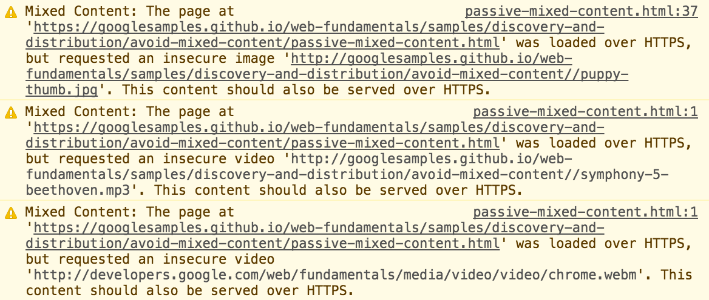
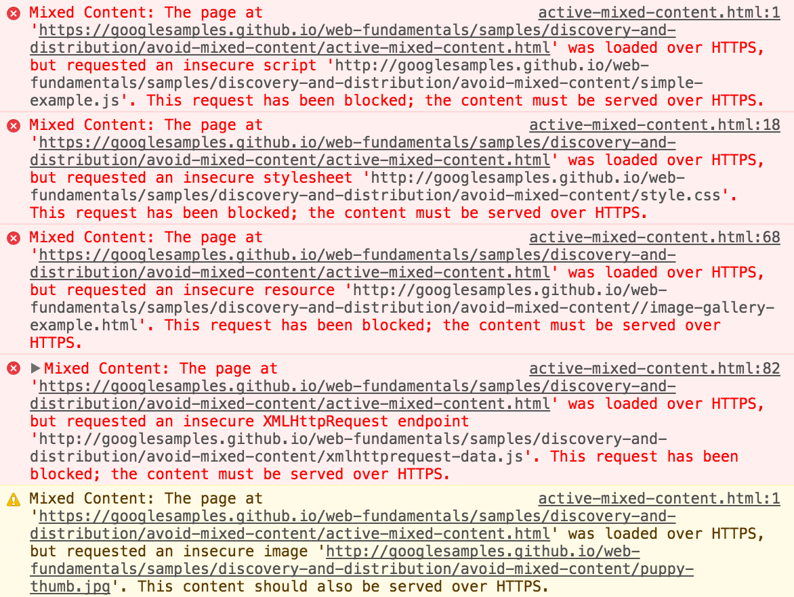
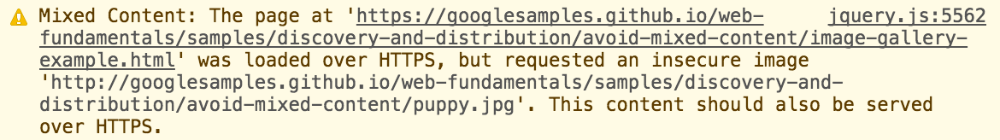
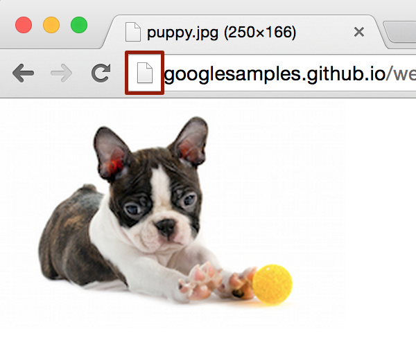
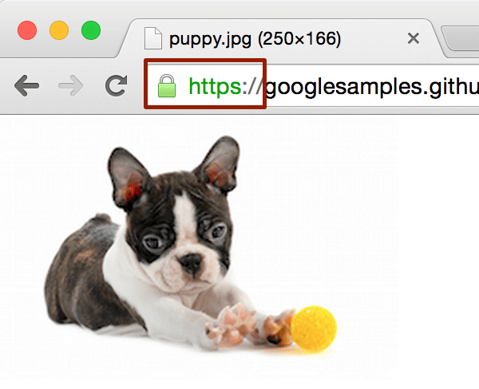
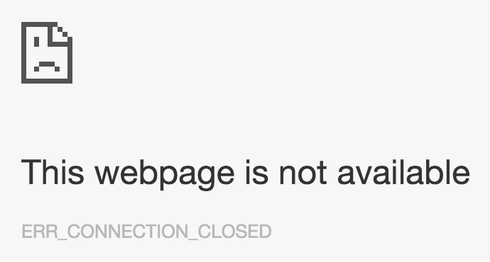
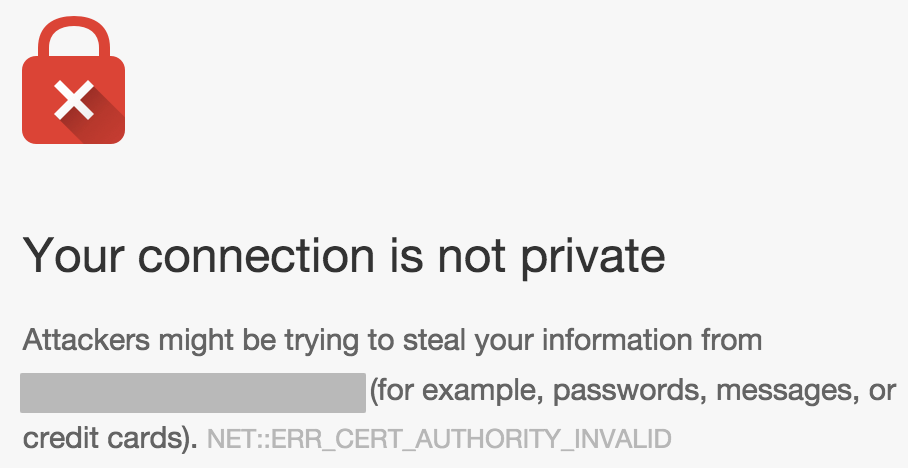

project_path: /web/fundamentals/_project.yaml
book_path: /web/fundamentals/_book.yaml
description: Finding and fixing mixed content is an important task, but it can be time-consuming. This guide discusses some tools that are available to help with the process.

{# wf_published_on: 2015-09-28 #}
{# wf_updated_on: 2019-12-10 #}
{# wf_blink_components: Blink>SecurityFeature #}

# Preventing Mixed Content {: .page-title }



Success: Supporting HTTPS for your website is an important step to protecting your site and your users from attack, but mixed content can render that protection useless. To protect your site and your users, it is very important to find and fix mixed content issues.

Finding and fixing mixed content is an important task, but it can be time-consuming. This guide discusses some tools and techniques that are available to help with the process. For more information on mixed content itself, see [What is Mixed Content](./what-is-mixed-content).

### TL;DR {: .hide-from-toc }

* Always use https:// URLs when loading resources on your page.
* Use the `Content-Security-Policy-Report-Only` header to monitor mixed content errors on your site.
* Use the `upgrade-insecure-requests` CSP directive to protect your visitors from insecure content.

## Find and fix mixed content

Manually finding mixed content can be time consuming, depending on the number of issues you have. The process described in this document uses the Chrome browser; however most modern browsers provide similar tools to help with this process.

### Finding mixed content by visiting your site

When visiting an HTTPS page in Google Chrome, the browser alerts you to mixed
content as errors and warnings in the JavaScript console.

To view these alerts, go to our passive mixed content or active mixed content sample page and open the Chrome JavaScript console. You can open the console either from the View menu: _View_ -&gt; _Developer_ -&gt; _JavaScript Console_, or by right-clicking the page, selecting _Inspect Element_, and then selecting _Console_.

The [passive mixed content example](https://googlesamples.github.io/web-fundamentals/fundamentals/security/prevent-mixed-content/passive-mixed-content.html){: .external} on the [What Is Mixed Content](what-is-mixed-content#passive-mixed-content){: .external} page causes mixed content warnings to be displayed, like the ones below:

<figure>
  
</figure>

[Try it](https://googlesamples.github.io/web-fundamentals/fundamentals/security/prevent-mixed-content/passive-mixed-content.html){: target="_blank" .external }

While the active mixed content example causes mixed content errors to be
displayed:

<figure>
  
</figure>

[Try it](https://googlesamples.github.io/web-fundamentals/fundamentals/security/prevent-mixed-content/active-mixed-content.html){: target="_blank" .external }

You need to fix the http:// URLs listed in these errors and warnings, in your site's source. It's helpful to make a list of these URLs, along with the page you found them on, for use when you fix them.

Note: Mixed content errors and warnings are only shown for the page you are currently viewing, and the JavaScript console is cleared every time you navigate to a new  page. This means you will have to view every page of your site individually to find these errors. Some errors may only show up after you interact with part of the page, see the image gallery mixed content example from our previous guide.

### Finding mixed content in your source code

You can search for mixed content directly in your source code. Search for
`http://` in your source and look for tags that include HTTP URL attributes.
Specifically, look for tags listed in the [mixed content types & security threats associated](what-is-mixed-content#mixed-content-types--security-threats-associated){: .external} section of our previous guide.
Note that having `http://` in the `href` attribute of anchor tags (`<a>`)
is often not a mixed content issue, with some notable exceptions discussed later.

If you have a list of HTTP URLs from Chrome mixed content errors and warnings,
you can also search for these complete URLs in your source to find where they
are included in your site.

### Fixing mixed content

Once you've found where the mixed content is included in your site's source,
follow these steps to fix it.

Using the following mixed content error in Chrome as an example:

<figure>
  
</figure>

Which you found in source here:

    

#### Step 1

Check that the URL is available over HTTPS by opening a new tab in
your browser, entering the URL in the address bar, and changing `http://` to `https://`.

If the resource displayed is the same over **HTTP** and **HTTPS**, everything is OK.
Proceed to [Step 2](#step-2).

  <figure>
    
    <figcaption class="success">
      HTTP image loads without error.
     </figcaption>
  </figure>

  <figure>
    
    <figcaption class="success">
      HTTPS image loads without error, and image is the same as HTTP. Go to <a href="#step-2">step 2</a>!
     </figcaption>
  </figure>

If you see a certificate warning, or if the content can't be displayed over
**HTTPS**, it means the resource is not available securely.

  <figure>
    
    <figcaption class="warning">
      Resource not available over HTTPS.
     </figcaption>
  </figure>

  <figure>
    
    <figcaption class="warning">
      Certificate warning when attempting to view resource over HTTPS.
     </figcaption>
  </figure>

In this case, you should consider one of the following options:

* Include the resource from a different host, if one is available.
* Download and host the content on your site directly, if you are legally allowed to do so.
* Exclude the resource from your site altogether.

#### Step 2

Change the URL from `http://` to `https://`, save the source file, and redeploy the updated file if necessary.

#### Step 3

View the page where you found the error originally and verify that the error no longer appears.

### Beware of non-standard tag usage

Beware of non-standard tag usage on your site. For instance, anchor (`<a>`)
tag URLs don't cause mixed content by themselves, as they cause the browser to
navigate to a new page. This means they usually don't need to be fixed. However
some image gallery scripts override the functionality of the `<a>` tag and
load the HTTP resource specified by the `href` attribute into a lightbox display
on the page, causing a mixed content problem.

<pre class="prettyprint">

</pre>

[Try it](https://googlesamples.github.io/web-fundamentals/fundamentals/security/prevent-mixed-content/image-gallery-example.html){: target="_blank" .external }

In the code above, it may seem safe to leave the `<a>` tag's `href` as `http://`;
however if you view the sample and click the image, you'll see that it loads
a mixed content resource and displays it on the page.

## Handle mixed content at scale

The manual steps above work well for smaller websites; but for large websites
or sites with many separate development teams, it can be tough to keep track of
all the content being loaded. To help with this task, you can use content
security policy to instruct the browser to notify you about mixed content and
ensure that your pages never unexpectedly load insecure resources.

### Content security policy

[**Content security policy**](/web/fundamentals/security/csp/) (CSP) is a
multi-purpose browser feature that you can use to manage mixed content at
scale. The CSP reporting mechanism can be used to track the mixed content on
your site; and the enforcement policy, to protect users by upgrading or
blocking mixed content.

You can enable these features for a page by including the
`Content-Security-Policy` or `Content-Security-Policy-Report-Only` header in the
response sent from your server. Additionally you can set `Content-Security-Policy` (but
**not** `Content-Security-Policy-Report-Only`) using a `<meta>` tag
in the `<head>` section of your page. See examples in the following
sections.

CSP is useful for many things outside of its mixed content uses. Information about other CSP directives is available at the following resources:

* [Mozilla's intro to CSP](https://developer.mozilla.org/en-US/docs/Web/Security/CSP/Introducing_Content_Security_Policy){: .external}
* [HTML5 Rocks' intro to CSP](//www.html5rocks.com/en/tutorials/security/content-security-policy/){: .external}
* [CSP playground](http://www.cspplayground.com/){: .external }
* [CSP spec](//www.w3.org/TR/CSP/){: .external }

Note: Browsers enforce <b>all</b> content security policies that they receive.
Multiple CSP header values received by the browser in the response header or
<code>&lt;meta&gt;</code> elements are combined and enforced as a single policy;
reporting policies are likewise combined. Policies are combined by taking the
intersection of the policies; that is to say, each policy after the first can
only further restrict the allowed content, not broaden it.

### Finding mixed content with content security policy

You can use content security policy to collect reports of mixed content on your
site. To enable this feature, set the `Content-Security-Policy-Report-Only`
directive by adding it as a response header for your site.

Response header:

    Content-Security-Policy-Report-Only: default-src https: 'unsafe-inline' 'unsafe-eval'; report-uri https://example.com/reportingEndpoint

Whenever a user visits a page on your site, their browser sends JSON-formatted
reports regarding anything that violates the content security policy to
`https://example.com/reportingEndpoint`. In this case, anytime a
subresource is loaded over HTTP, a report is sent. These reports include the
page URL where the policy violation occurred and the subresource URL that
violated the policy. If you configure your reporting endpoint to log these
reports, you can  track the mixed content on your site without visiting each
page yourself.

The two caveats to this are:

* Users have to visit your page in a browser that understands the CSP header.
  This is true for most modern browsers.
* You only get reports for pages visited by your users. So if you have pages
  that don't get much traffic, it might be some time before you get reports for
  your entire site.

For more information on CSP header format, see the [Content Security Policy specification](https://w3c.github.io/webappsec/specs/content-security-policy/#violation-reports){: .external}.

If you don't want to configure a reporting endpoint yourself,
[https://report-uri.io/](https://report-uri.io/){: .external} is a reasonable
alternative.

### Upgrading insecure requests

One of the newest and best tools to automatically fix mixed content is the
[**`upgrade-insecure-requests`**](//www.w3.org/TR/upgrade-insecure-requests/){: .external}
CSP directive. This directive instructs the browser to upgrade insecure URLs
before making network requests.

As an example, if a page contains an image tag with an HTTP URL:

    

The browser instead makes a secure request for
<code><b>https:</b>//example.com/image.jpg</code>, thus saving the user from mixed
content.

You can enable this behavior either by sending a `Content-Security-Policy` header
with this directive:

    Content-Security-Policy: upgrade-insecure-requests

Or by embedding that same directive inline in the document's `<head>`
section using a `<meta>` element:

    <meta http-equiv="Content-Security-Policy" content="upgrade-insecure-requests">

It is worth noting, that if the resource is not available over HTTPS, the
upgraded request fails and the resource is not loaded. This maintains the
security of your page.

The `upgrade-insecure-requests` directive cascades into `<iframe>` documents,
ensuring the entire page is protected.

### Blocking all mixed content

Not all browsers support the `upgrade-insecure-requests` directive, so an
alternative for protecting users is the
[**`block-all-mixed-content`**](http://www.w3.org/TR/mixed-content/#strict-checking){: .external}
CSP directive. This directive instructs the browser to never load mixed content;
all mixed content resource requests are blocked, including both active and
passive mixed content. This option also cascades into `<iframe>` documents,
ensuring the entire page is mixed content free.

A page can opt itself into this behavior either by sending a
`Content-Security-Policy` header with this directive:

    Content-Security-Policy: block-all-mixed-content

Or by embedding that same directive inline in the document's `<head>`
section using a `<meta>` element:

    <meta http-equiv="Content-Security-Policy" content="block-all-mixed-content">

The downside of using `block-all-mixed-content` is, perhaps obviously, that all
content is blocked. This is a security improvement, but it means that these
resources are no longer available on the page. This might break features and
content that your users expect to be available.

### Alternatives to CSP

If your site is hosted for you by a platform such as Blogger, you may not have
access to modify headers & add a CSP.
Instead, a viable alternative could be to use a website crawler to find issues
across your site for you, such as
[HTTPSChecker](https://httpschecker.net/how-it-works#httpsChecker){: .external }
or
[Mixed Content Scan](https://github.com/bramus/mixed-content-scan){: .external }.

## Feedback {: #feedback }


