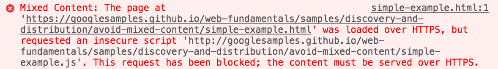
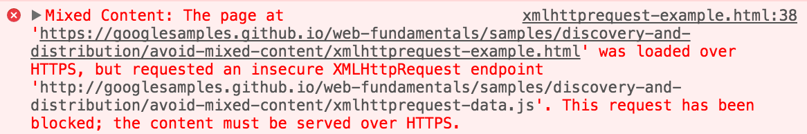

project_path: /web/fundamentals/_project.yaml
book_path: /web/fundamentals/_book.yaml
description: Mixed occurs when initial HTML is loaded over a secure HTTPS connection, but other resources are loaded over an insecure HTTP connection.

{# wf_updated_on: 2016-08-24 #}
{# wf_published_on: 2015-09-25 #}
{# wf_blink_components: Blink>SecurityFeature #}

# What Is Mixed Content? {: .page-title }



**Mixed content** occurs when initial HTML is loaded over a secure HTTPS
connection, but other resources (such as images, videos, stylesheets, scripts)
are loaded over an insecure HTTP connection. This is called mixed content
because both HTTP and HTTPS content are being loaded to display the same page,
and the initial request was secure over HTTPS. Modern browsers display warnings
about this type of content to indicate to the user that this page contains
insecure resources.

### TL;DR {: .hide-from-toc }

* HTTPS is important to protect both your site and your users from attack.
* Mixed content degrades the security and user experience of your HTTPS site.

## Resource requests and web browsers

When a browser _visits_ a website page, it is requesting for an HTML resource. The web server then returns the HTML content, which the browser parses and displays to users. Often a single HTML file isn't enough to display a complete page, so the HTML file includes references to other resources that the browser needs to request. These subresources can be things like images, videos, extra HTML, CSS, or JavaScript, which are each fetched using separate requests.

## HTTPS benefits

When a browser requests resources over HTTPS&mdash;which stands for HTTP Secure&mdash;it
uses an encrypted connection to communicate with the web server.

Using HTTPS has three main benefits:

* Authentication
* Data integrity
* Secrecy

### Authentication

_Is the website I'm talking to who they claim to be?_

HTTPS lets the browser check that it has opened the correct website and hasn't
been redirected to a malicious site. When navigating to your bank's website,
your browser _authenticates_ the website, thus preventing an attacker from
impersonating your bank and stealing your login credentials.

### Data integrity

_Has anyone tampered with the content that I'm sending or receiving?_

HTTPS lets the browser detect if an attacker has changed any data the browser
receives. When transferring money using your bank's website, this prevents an
attacker from changing the destination account number while your request is in
transit.

### Secrecy

_Can anyone see the content I am sending or receiving?_

HTTPS prevents an attacker from eavesdropping on the browser's requests,
tracking the websites visited, or stealing information sent or received.

### HTTPS, TLS, and SSL

HTTPS stands for HTTP Secure, Hyper(t)ext Transfer Protocol Secure. The
**secure** portion here comes from the encryption added to the requests sent
and received by the browser. Currently, most browsers use the TLS protocol to
provide encryption; **TLS** is sometimes referred to as SSL.

Details of HTTPS, TLS, and SSL are beyond the scope of this article, but if
you want to learn more, the following resources are a good place to start:

* [Wikipedia HTTPS](https://en.wikipedia.org/wiki/HTTPS){: .external}
* [Wikipedia TLS](https://en.wikipedia.org/wiki/Transport_Layer_Security){: .external}
* [Khan Academy Cryptography course](https://www.khanacademy.org/computing/computer-science/cryptography){: .external}
* [TLS chapter](http://chimera.labs.oreilly.com/books/1230000000545/ch04.html){: .external} in [High Performance Browser Networking](http://chimera.labs.oreilly.com/books/1230000000545){: .external} by Ilya Grigorik

## Mixed content weakens HTTPS

Requesting subresources using the insecure HTTP protocol weakens the security of
the entire page, as these requests are vulnerable to **man-in-the-middle
attacks**, where an attacker eavesdrops on a network connection and views or
modifies the communication between two parties. Using these resources, an
attacker can often take complete control over the page, not just the compromised
resource.

Although many browsers report mixed content warnings to the user, by the time
this happens, it is too late: the insecure requests have already been performed
and the security of the page is compromised. This scenario is, unfortunately,
quite common on the web, which is why browsers can't just block all mixed
requests without restricting the functionality of many sites.

<figure>
  
  <figcaption>
    It's up to you, the developer, to fix mixed content issues in your application.
  </figcaption>
</figure>

### A simple example

Loading an insecure script from an HTTPS page.

Viewing this sample page over **HTTPS**&mdash;[**https**://googlesamples.github.io/web-fundamentals/.../simple-example.html](https://googlesamples.github.io/web-fundamentals/fundamentals/security/prevent-mixed-content/simple-example.html){: .external}&mdash;includes an **HTTP** script tag which attempts to load mixed content.

<pre class="prettyprint">

</pre>

[Try it](https://googlesamples.github.io/web-fundamentals/fundamentals/security/prevent-mixed-content/simple-example.html){: target="_blank" .external }

In this example, the script `simple-example.js` is loaded with an **HTTP** URL. This is the simplest case of mixed content. When the browser requests the `simple-example.js` file, an attacker can inject code into the returned content
and take control of the entire page.

Thankfully, most modern browsers block this type of dangerous content by
default. See [browser behavior with mixed content](#browser-behavior-with-mixed-content){: .external}.

<figure>
  
  <figcaption>Chrome blocks the insecure script.</figcaption>
</figure>

### An XMLHttpRequest example

Loading insecure data with XMLHttpRequest.

Viewing this sample page over **HTTPS**&mdash;[**https**://googlesamples.github.io/web-fundamentals/.../xmlhttprequest-example.html](https://googlesamples.github.io/web-fundamentals/fundamentals/security/prevent-mixed-content/xmlhttprequest-example.html){: .external}&mdash;includes an `XMLHttpRequest` over **HTTP** to fetch mixed content `JSON` data.

<pre class="prettyprint">

</pre>

[Try it](https://googlesamples.github.io/web-fundamentals/fundamentals/security/prevent-mixed-content/xmlhttprequest-example.html){: target="_blank" .external }

Here the **HTTP** URL is constructed dynamically in JavaScript, and is eventually
used  by `XMLHttpRequest` to load an insecure resource. Like the simple example
above, when the browser requests the `xmlhttprequest-data.js` file, an
attacker can inject code into the returned content and take control of the
entire page.

Most modern browsers block these dangerous requests as well.

<figure>
  
  <figcaption>Chrome blocks the insecure XMLHttpRequest.</figcaption>
</figure>

### An image gallery example

Loading insecure images with jQuery lightbox.

When viewing this sample page over **HTTPS**&mdash;[**https**://googlesamples.github.io/web-fundamentals/.../image-gallery-example.html](https://googlesamples.github.io/web-fundamentals/fundamentals/security/prevent-mixed-content/image-gallery-example.html){: .external}&mdash;initially it does not have any mixed content problems; however, when the thumbnail image is clicked, a full size mixed content image is loaded over **HTTP**.

<pre class="prettyprint">

</pre>

[Try it](https://googlesamples.github.io/web-fundamentals/fundamentals/security/prevent-mixed-content/image-gallery-example.html){: target="_blank" .external }

Image galleries often rely on the `` tag `src` attribute to display
thumbnail images on the page, the anchor (`<a>`) tag `href` attribute is
then used to load the full sized image for the gallery overlay. Normally
`<a>` tags do not cause mixed content, but in this case, the jQuery code
overrides the default link behavior&mdash;to navigate to a new page&mdash;and instead
loads the **HTTP** image on this page.

<figure>
  
</figure>

Insecure images degrade the security of your site, but they are not as dangerous
as other types of mixed content. Modern browsers still load mixed content
images, but display warnings to the user as well.

## Mixed content types & security threats associated

The two types of mixed content are: active and passive.

**Passive mixed content** refers to content that doesn't interact with the rest
of the page, and thus a man-in-the-middle attack is restricted to what they can
do if they intercept or change that content. Passive mixed content includes
images, video, and audio content, along with other resources that cannot interact
with the rest of the page.

**Active mixed content** interacts with the page as a whole and allows an
attacker to do almost anything with the page. Active mixed content includes
scripts, stylesheets, iframes, flash resources, and other code that the browser can
download and execute.

### Passive mixed content

Passive mixed content still poses a security threat to your site and your users.
For example, an attacker can intercept HTTP requests for images on your site and
swap or replace these images; the attacker can swap the _save_ and _delete_
button images, causing your users to delete content without intending to;
replace your product diagrams with lewd or pornographic content, defacing your
site; or replace your product pictures with ads for a different site or product.

Even if the attacker doesn't alter the content of your site, you still have a
large privacy issue where an attacker can track users using mixed content
requests. The attacker can tell which pages a user visits and which products
they view based on images or other resources that the browser loads.

The following is an example of passive mixed content:

<pre class="prettyprint">

</pre>

[Try it](https://googlesamples.github.io/web-fundamentals/fundamentals/security/prevent-mixed-content/passive-mixed-content.html){: target="_blank" .external }

Most browsers still render this type of mixed content to the user, however a
warning is also displayed as this poses a security and privacy risk to your site
and users.

<figure>
  
  <figcaption>Mixed content warnings from the Chrome JavaScript console.</figcaption>
</figure>

### Active mixed content

Active mixed content poses a greater threat than passive. An attacker can
intercept and rewrite active content, thereby taking full control of your page or
even your entire website. This allows the attacker to change anything about the
page, including displaying entirely different content, stealing user passwords
or other login credentials, stealing user session cookies, or redirecting the
user to a different site entirely.

Due to the severity of this threat, many browsers block this type of content by
default to protect users, but functionality varies between browser vendors and
versions.

The following contains examples of active mixed content:

<pre class="prettyprint">

</pre>

[Try it](https://googlesamples.github.io/web-fundamentals/fundamentals/security/prevent-mixed-content/active-mixed-content.html){: target="_blank" .external }

<figure>
  
  <figcaption>Mixed content errors from the Chrome JavaScript console.</figcaption>
</figure>

## Browser behavior with mixed content

Due to the threats described above, it would be ideal for browsers to block all
mixed content. However, this would break a large number of websites that millions
of users rely on every day. The current compromise is to block the most
dangerous types of mixed content and allow the less dangerous types to still be
requested.

Modern browsers follow [mixed content specification](https://w3c.github.io/webappsec/specs/mixedcontent/){: .external }, which defines [**optionally blockable content**](https://w3c.github.io/webappsec/specs/mixedcontent/#category-optionally-blockable){: .external} and [**blockable content**](https://w3c.github.io/webappsec/specs/mixedcontent/#category-blockable){: .external} categories.

From the spec, a resource qualifies as optionally blockable content "when the risk
of allowing its usage as mixed content is outweighed by the risk of breaking
significant portions of the web"; this is a subset of the [passive mixed
content](#passive-mixed-content) category described above. At the time of this writing, images,
video, and audio resources, as well as prefetched links, are the only
resource types included in optionally blockable content. This category is
likely to get smaller as time goes on.

All content that is not **optionally blockable** is considered **blockable**,
and is blocked by the browser.

### Browser versions

It is important to remember that not every visitor to your website use
the most up-to-date browsers. Different versions from different browser vendors
each behave differently with mixed content. At worst, some browsers and versions
don't block any mixed content at all, which is very unsafe for the user.

The exact behavior of each browser is constantly changing, so we won't include
specifics here. If you're interested in how a specific browser behaves, look for
information published by the vendors directly.

Note: Your users are counting on you to protect them when they visit your website. It is important to fix your mixed content issues to protect <b>all</b> your visitors, including those on older browsers.

