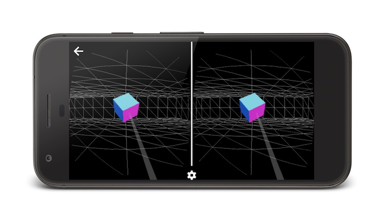
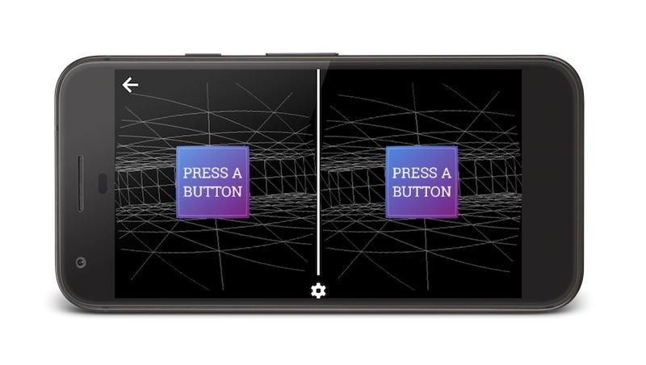

project_path: /web/fundamentals/_project.yaml
book_path: /web/fundamentals/_book.yaml
description: Discover how to use the Ray Input library to add input to your WebVR scene.

{# wf_updated_on: 2016-12-12 #}
{# wf_published_on: 2016-12-12 #}
{# wf_blink_components: Blink>WebVR #}

# Adding Input to a WebVR Scene {: .page-title }



Warning: WebVR is still experimental and subject to change.

In the [Getting Started with WebVR section](../getting-started-with-webvr/) we looked at how to take a WebGL scene and add WebVR functionality to it. While that works, and you can look around the scene in VR, there’s so much more fun to be had when you can interact with entities in the scene.

With WebVR (and 3D in general) there can be a variety of inputs, and ideally speaking we want to not only account for all of them, but switch between them as the user’s context changes.

A quick survey of input types available today includes:

* **Mouse.**
* **Touch.**
* **Accelerometer & Gyroscope.**
* **Controllers with no degrees of freedom** (like Cardboard). These are controllers that are tied entirely to the viewport, and typically the interaction is assumed to originate in the center of the viewport.
* **Controllers with 3 degrees of freedom** (like the Daydream Controller). A controller with 3 degrees provides orientation information, but not location information. Typically such controllers are assumed to be held in the person’s left or right hand, and their position in 3D space is estimated.
* **Controllers with 6 degrees of freedom** (like the Oculus Rift or Vive). Any controller with 6 degrees of freedom will provide both orientation and location information. These are typically at the upper end of capabilities range, and have the best accuracy.

In the future, as WebVR matures, we may even see new input types, which means our code needs to be as future-proof as possible. Writing code to handle all input permutations, however, can get complicated and unwieldy. The [Ray Input](https://github.com/borismus/ray-input) library by Boris Smus already provides a flying start, supporting the majority of input types available today, so we will start there.

Starting from our previous scene, let’s [add input handlers with Ray Input](https://googlechrome.github.io/samples/web-vr/basic-input/). If you want to look at the final code you should check out the [Google Chrome samples repo](https://github.com/GoogleChrome/samples/tree/gh-pages/web-vr/basic-input/).

## Add the Ray Input library to the page

For simplicity’s sake, we can add Ray Input directly with a script tag:

    <!-- Must go after Three.js as it relies on its primitives -->
    

If you’re using Ray Input as part of a bigger build system, you can import it that way, too. The [Ray Input README has more info](https://github.com/borismus/ray-input/blob/master/README.md), so you should check that out.

## Get access to inputs

After getting access to any VR Displays we can request access to any inputs that are available. From there we can add event listeners, and we’ll update the scene to default our box’s state as "deselected".

    this._getDisplays().then(_ => {
      // Get any available inputs.
      this._getInput();
      this._addInputEventListeners();

      // Default the box to 'deselected'.
      this._onDeselected(this._box);
    });

Let’s take a look inside both the `_getInput` and `_addInputEventListeners` functions.

    _getInput () {
      this._rayInput = new RayInput.default(
          this._camera, this._renderer.domElement);

      this._rayInput.setSize(this._renderer.getSize());
    }

Creating a Ray Input involves passing it the Three.js camera from the scene, and an element onto which it can bind mouse, touch and any other event listeners it needs. If you don’t pass through an element as the second parameter it will default to binding to `window`, which may be prevent parts of your User Interface (‘UI’) from receiving input events!

The other thing you need to do is tell it how big an area it needs to work with, which in most cases is the area of the WebGL canvas element.

## Enable interactivity for scene entities

Next we need to tell Ray Input what to track, and what events we’re interested in receiving.

    _addInputEventListeners () {
      // Track the box for ray inputs.
      this._rayInput.add(this._box);

      // Set up a bunch of event listeners.
      this._rayInput.on('rayover', this._onSelected);
      this._rayInput.on('rayout', this._onDeselected);
      this._rayInput.on('raydown', this._onSelected);
      this._rayInput.on('rayup', this._onDeselected);
    }

As you interact with the scene, whether by mouse, touch, or other controllers, these events will fire. In the scene we can make our box’s opacity change based on whether the user is pointing at it.

    _onSelected (optMesh) {
      if (!optMesh) {
        return;
      }

      optMesh.material.opacity = 1;
    }

    _onDeselected (optMesh) {
      if (!optMesh) {
        return;
      }

      optMesh.material.opacity = 0.5;
    }

For this to work we’ll need to make sure that we tell Three.js that the box’s material should support transparency.

    this._box.material.transparent = true;

That should now cover mouse and touch interactions. Let’s see what’s involved with adding in a controller with 3 degrees of freedom, like the Daydream controller.

## Enable the Gamepad API extensions

There are two important notes to understand about using the Gamepad API in WebVR today:

* In Chrome 56 you will need to enable the Gamepad Extensions flag in `chrome://flags`. If you have an [Origin Trial](https://github.com/jpchase/OriginTrials/blob/gh-pages/developer-guide.md) the Gamepad Extensions will already be enabled along with the WebVR APIs. **For local development you’ll need the flag enabled**.

* Pose information for the gamepad (which is how you get access to those 3 degrees of freedom) are **only enabled once a user has pressed a button on their VR controller**.

Because the user needs to interact before we can show them a pointer in the scene, we’ll need to ask them to press a button on their controller. The best time to do that is after we begin to present to the Head Mounted Display (‘HMD’).

    this._vr.display.requestPresent([{
      source: this._renderer.domElement
    }])
    .then(_ => {
      **this._showPressButtonModal();**
    })
    .catch(e => {
      console.error(`Unable to init VR: ${e}`);
    });

Typically you might expect to use HTML Elements to show such information to users, but the HMD is displaying a WebGL context (and nothing else), so we must draw the message there. Three.js has a [Sprite primitive](https://threejs.org/docs/#Reference/Objects/Sprite) which will always face towards the camera (typically called “Billboarding”), and into which we can draw an image.

The code to do that looks something like this.

    _showPressButtonModal () {
      // Get the message texture, but disable mipmapping so it doesn't look blurry.
      const map = new THREE.TextureLoader().load('./images/press-button.jpg');
      map.generateMipmaps = false;
      map.minFilter = THREE.LinearFilter;
      map.magFilter = THREE.LinearFilter;

      // Create the sprite and place it into the scene.
      const material = new THREE.SpriteMaterial({
        map, color: 0xFFFFFF
      });

      this._modal = new THREE.Sprite(material);
      this._modal.position.z = -4;
      this._modal.scale.x = 2;
      this._modal.scale.y = 2;
      this._scene.add(this._modal);

      // Finally set a flag so we can pick this up in the _render function.
      this._isShowingPressButtonModal = true;
    }

Finally in the `_render` function we can watch for interactions, and use that to hide the modal. We also need to tell Ray Input when to update, similarly to the way we call `submitFrame()` against the HMD to flush the canvas to it.

    _render () {
      if (this._rayInput) {
        if (this._isShowingPressButtonModal &&
            this._rayInput.controller.wasGamepadPressed) {
          this._hidePressButtonModal();
        }

        this._rayInput.update();

      }
      …
    }

## Add the pointer mesh to the scene

As well as allowing interactions it’s highly likely that we will want to display something to the user that shows where they’re pointing. Ray Input provides a mesh that you can add to your scene to do just that.

    this._scene.add(this._rayInput.getMesh());

With this we get a reticle for HMDs with no freedom of movement in their controller (like Cardboard), and a beam-like ray for those with freedom of movement. For mouse and touch there are no reticles shown.

## Closing thoughts

There are some things to keep in mind as you add input to your experiences.

* **You should embrace Progressive Enhancement.** Since a person may come to what you’ve built with any particular permutation of inputs from the list you should endeavor to plan your UI such that it can adapt properly between types. Where you can, test a range of devices and inputs to maximize reach.

* **Inputs may not be perfectly accurate.** In particular a Daydream controller has 3 degrees of freedom, but it’s operating in a space which supports 6. That means that while its orientation is correct its position in 3D space has to be assumed. To account for this you may wish to make your input targets larger and ensure proper spacing to avoid confusion.

Adding input to your scene is vital to making an immersive experience, and with [Ray Input](https://github.com/borismus/ray-input) it’s much easier to get going.

Let us know how you get on!

