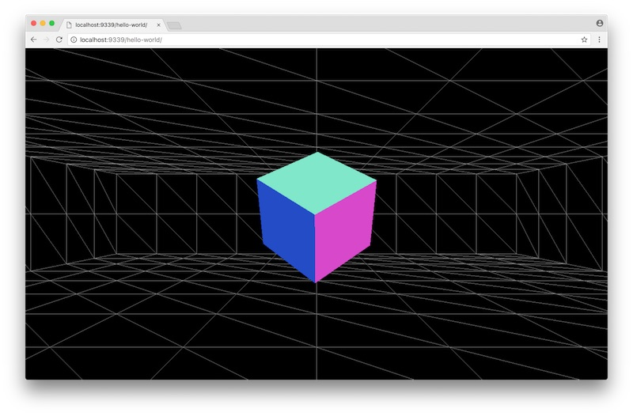
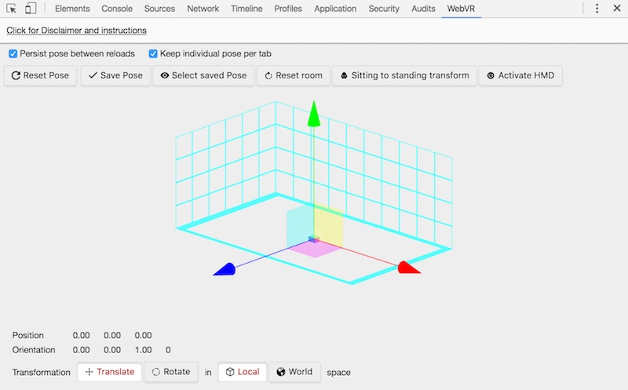

project_path: /web/fundamentals/_project.yaml
book_path: /web/fundamentals/_book.yaml
description: Learn how to take a WebGL scene in Three.js and add WebVR capabilities.

{# wf_updated_on: 2017-07-24 #}
{# wf_published_on: 2016-12-12 #}
{# wf_blink_components: Blink>WebVR #}

# Getting Started with WebVR {: .page-title }




Warning: WebVR is still experimental and subject to change.

In this guide we will be exploring the WebVR APIs, and using them to enhance a simple WebGL scene built with [Three.js](https://threejs.org/). For production work, however, you may want to starting with existing solutions, like [WebVR Boilerplate](https://github.com/borismus/webvr-boilerplate). If you’re totally new to Three.js, you can use this [handy starting guide](https://aerotwist.com/tutorials/getting-started-with-three-js/). The community is also extremely supportive, so if you get stuck, definitely give them a shout.

Let’s start with [a scene that puts a box inside a wireframe room](https://googlechrome.github.io/samples/web-vr/hello-world/), the code for which is on the [Google Chrome samples repo](https://github.com/GoogleChrome/samples/tree/gh-pages/web-vr/hello-world).

### A small note on support

WebVR is available in Chrome 56+ behind a runtime flag. Enabling the flag (head to `chrome://flags` and search for "WebVR") will allow you to build and test your VR work locally. If you want to support WebVR for your visitors, you can opt into an [Origin Trial](https://github.com/jpchase/OriginTrials/blob/gh-pages/developer-guide.md), which will allow you to have WebVR enabled for your origin.

You can also use the [Web VR polyfill](https://github.com/googlevr/webvr-polyfill), but bear in mind that there are significant performance penalties when using polyfills. You should definitely test on your target devices, and avoid shipping anything that does not keep up with the device’s refresh rate. A poor or variable frame rate can result in significant discomfort for the people using your experience!

For more information, take a look at [the WebVR Status](../status/) page.

## Get access to VR Displays

So with a WebGL scene, what do we need to do get it working with WebVR? Well, firstly we need to query the browser to discover if there are any VR displays available, which we can do with navigator.getVRDisplays().

    navigator.getVRDisplays().then(displays => {
      // Filter down to devices that can present.
      displays = displays.filter(display => display.capabilities.canPresent);

      // If there are no devices available, quit out.
      if (displays.length === 0) {
        console.warn('No devices available able to present.');
        return;
      }

      // Store the first display we find. A more production-ready version should
      // allow the user to choose from their available displays.
      this._vr.display = displays[0];
      this._vr.display.depthNear = DemoVR.CAMERA_SETTINGS.near;
      this._vr.display.depthFar = DemoVR.CAMERA_SETTINGS.far;
    });

There are a few things to notice in this code.

1. **Not every device can "present" to a Head Mounted Display.** There are devices which allow for — say — accelerometer usage, or a pseudo-VR experience, but do not make use of an HMD. For those devices the canPresent boolean will be false, and it’s something to be checked.

2. **There may be no VR devices available.** We should aim to create experiences that work just fine for non-VR settings, and treat the availability of VR as Progressive Enhancement.

3. **There may be several VR devices available. **Equally it’s perfectly possible that someone will have multiple VR devices available, and we should allow for that if at all possible, letting them choose the most appropriate.

## Install a WebVR Emulation Chrome DevTools Extension

Perhaps you find yourself not having a VR-capable device to test against. If that’s the case, help is at hand! Jaume Elias has created a [Chrome DevTools Extension which emulates a VR device](https://chrome.google.com/webstore/detail/webvr-api-emulation/gbdnpaebafagioggnhkacnaaahpiefil).

While it’s always preferable to test on real devices (especially for performance testing!) having this extension to hand can help you quickly debug during your builds.

## Request presentation from the device

To begin presenting in "VR mode", we have to request it from the device:

    this._vr.display.requestPresent([{
      source: this._renderer.domElement
    }]);

`requestPresent` takes an array of what the [Web VR spec](https://w3c.github.io/webvr/#vrlayer) calls "VRLayers", which is essentially a wrapper around a Canvas element given to the VR device. In the code snippet above we’re taking the Canvas element — `WebGLRenderer.domElement` — provided by Three.js, and passing it in as the source property of a single VRLayer. In return, `requestPresent` will give you a [Promise](/web/fundamentals/getting-started/primers/promises), which will resolve if the request is successful, and will reject if not.

## Draw your VR scene

Finally, we’re ready to present the user with a VR scene, which is really exciting!

Firstly let’s talk about what we need to do.

* Ensure we use the device’s `requestAnimationFrame` callback.
* Request the current pose, orientation, and eye information from the VR device.
* Split our WebGL context into two halves, one for each eye, and draw each.

Why do we need to use a different `requestAnimationFrame` to the one provided with the window object? Because we’re working with a display whose refresh rate may differ from the host machine! If the headset has a refresh rate of 120Hz, we need to generate frames according to that rate, even if the host machine refreshes its screen at 60Hz. The WebVR API accounts for that by giving us a different `requestAnimationFrame` API to call. In the case of a mobile device, there is typically only one display (and on Android today the refresh rate is 60Hz), but even so we should use the correct API to make our code future-proof and as broadly compatible as possible.

    _render () {
      // Use the VR display's in-built rAF (which can be a diff refresh rate to
      // the default browser one).  _update will call _render at the end.

      this._vr.display.requestAnimationFrame(this._update);
      …
    }

Next up we need to request the information about where the person’s head is, its rotation, and any other information we need to be able to do the drawing correctly, which we do with `getFrameData()`.

    // Get all the latest data from the VR headset and dump it into frameData.
    this._vr.display.getFrameData(this._vr.frameData);

`getFrameData()` will take an object on which it can place the information we need. It needs to be a `VRFrameData` object, which we can create with `new VRFrameData()`.

    this._vr.frameData = new VRFrameData();

There’s lots of interesting information in the frame data, so let’s take a quick look over that.

* **timestamp**. The timestamp of the update from the device. This value starts at 0 the first time getFrameData is invoked on the VR display.

* **leftProjectionMatrix** and **rightProjectionMatrix**. These are the matrices for the camera that account for the perspective of the eyes in the scene. We’ll talk more about these in a moment.

* **leftViewMatrix** and **rightViewMatrix**. These are two more matrices that provide about the location of each eye in the scene.

If you’re new to 3D work Projection matrices and Model-View matrices can appear daunting. While there is some math behind what these do, we don’t technically need to know exactly how they work, more what they do.

* **Projection Matrices.** These are used to create an impression of perspective within a scene. They typically do this by distorting the scale of objects in the scene as they move further away from the eye.

* **Model-View Matrices.** These are used to position an object in 3D space. Because of the way matrices work you can create scene graphs and work your way down the graph, multiplying each node’s matrix, arriving at the final model-view matrix for the object in question.

There are many good guides around the web that explain Projection and Model-View matrices in much more depth, so have a google around if you want to get more background information.

## Take control of the scene rendering

Since we have the matrices we need, let’s draw the view for the left eye. To begin with we will need to tell Three.js not to clear out the WebGL context every time we call render, since we need to draw twice and we don’t want to lose the image for the left eye when we draw it for the right.

    // Make sure not to clear the renderer automatically, because we will need
    // to render it ourselves twice, once for each eye.
    this._renderer.autoClear = false;

    // Clear the canvas manually.
    this._renderer.clear();

Next let’s set the renderer to only draw the left half:

    this._renderer.setViewport(
        0, // x
        0, // y
        window.innerWidth * 0.5,
        window.innerHeight);

This code assumes that the GL context is full screen (`window.inner*`), which is a pretty good bet for VR. We can now plug in the two matrices for the left eye.

    const lViewMatrix = this._vr.frameData.leftViewMatrix;
    const lProjectionMatrix = this._vr.frameData.leftProjectionMatrix;

    // Update the scene and camera matrices.
    this._camera.projectionMatrix.fromArray(lProjectionMatrix);
    this._scene.matrix.fromArray(lViewMatrix);

    // Tell the scene to update (otherwise it will ignore the change of matrix).
    this._scene.updateMatrixWorld(true);
    this._renderer.render(this._scene, this._camera);

There are a couple of implementation details that are important.

* **We move the world, not the camera.** It may seem a little odd if you’ve not encountered it before, but it’s common in graphics work to leave the camera at the origin (0, 0, 0) and move the world. Without getting too philosophical, if I move 10 metres forward did I move 10 metres forward or did the world move 10 metres backward? It’s relative to your point-of-view, and it doesn’t matter from a mathematical perspective which one we do. Since the WebVR API returns the "*inverse* of the model matrix of the eye" we’re expected to apply it to the world (`this._scene` in our code) not the camera itself.

* **We must manually update the matrix after we change its values.** Three.js caches values very heavily (which is great for performance!), but that means that you *must* tell it that something has changed in order to see changes. This is done with the `updateMatrixWorld()` method, which takes a boolean for ensuring the calculations propagate down the scene graph.

We’re nearly there! The final step is repeat the process for the right eye. Here we’ll clear the renderer’s depth calculations after drawing the view for the left eye, since we don’t want it to affect the rendering of the right eye’s view. Then we update the viewport to be the right hand side, and draw the scene again.

    // Ensure that left eye calcs aren't going to interfere with right eye ones.
    this._renderer.clearDepth();
    this._renderer.setViewport(
        window.innerWidth * 0.5, // x
        0, // y
        window.innerWidth * 0.5,
        window.innerHeight);

We can now plug in the two matrices for the right eye.

    const rViewMatrix = this._vr.frameData.rightViewMatrix;
    const rProjectionMatrix = this._vr.frameData.rightProjectionMatrix;

    // Update the scene and camera matrices.
    this._camera.projectionMatrix.fromArray(rProjectionMatrix);
    this._scene.matrix.fromArray(rViewMatrix);

    // Tell the scene to update (otherwise it will ignore the change of matrix).
    this._scene.updateMatrixWorld(true);
    this._renderer.render(this._scene, this._camera);

And we’re done! Actually, not quite...

## Tell the device to update

If you run things as they stand you’ll notice that the display never updates. This is because we can do a bunch of rendering to the WebGL context, and the HMD doesn’t know when to actually update its own display. It’s inefficient to update after — say — each individual eye’s image is rendered. So we take control of that ourselves by calling submitFrame.

    // Call submitFrame to ensure that the device renders the latest image from
    // the WebGL context.
    this._vr.display.submitFrame();

With that code we really *are* done this time. If you want the final version, don’t forget you can check out the [Google Chrome Samples repo](https://github.com/GoogleChrome/samples/tree/gh-pages/web-vr/hello-world).

## Closing thoughts and resources

WebVR is a really awesome way to add immersion to your content, and using libraries like Three.js makes it much easier to get going with WebGL. There are some important things to remember, though.

* **Build in Progressive Enhancement from the start.** As we’ve mentioned several times in this guide, it’s important to build a good base level experience, onto which you can layer WebVR. Many experiences can be implemented with mouse / touch control, and can upgrade through accelerometer controls, to fully-fledged VR experiences. Maximizing your audience is always worthwhile.

* **Remember you’re going to render your scene twice.** You may need to think about Level of Detail (LOD) and other techniques to ensure that when you render the scene twice it scales down the computation workload for the CPU and GPU. Above all else you must maintain a solid frame rate! No amount of showbiz is worth someone feeling extreme discomfort from motion sickness!

* **Test on a real device.** This is related to the previous point. You should try and get a hold of real devices on which you can test what you’re building, especially if you’re targeting mobile devices. As the saying goes, ["your laptop is a filthy liar"](https://youtu.be/4bZvq3nodf4?list=PLNYkxOF6rcIBTs2KPy1E6tIYaWoFcG3uj&t=405).

While we’re here, there are plenty of resources out there to give you a flying start when it comes to making WebVR content:

* **[VRView](https://github.com/googlevr/vrview)**. This library helps you embed 360-degree panoramic photos and videos.

* **[WebVR Boilerplate](https://github.com/borismus/webvr-boilerplate)**. For getting started with WebVR and Three.js

* **[WebVR Polyfill](https://github.com/googlevr/webvr-polyfill)**. To back-fill required APIs for WebVR. Please remember that there are performance penalties for using polyfills, so while this does provide functionality your users may be better off with your non-VR experience.

* **[Ray-Input](https://github.com/borismus/ray-input)**. A library to help you handle the various types of input for VR- and non-VR-devices, such as mouse, touch, and VR Gamepad controllers.

Now go and make some awesome VR!
