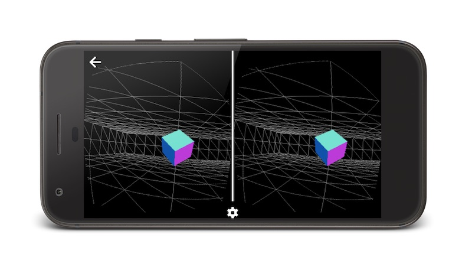
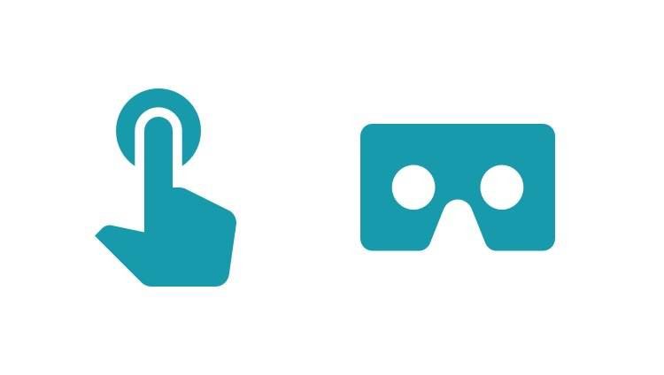

project_path: /web/fundamentals/_project.yaml
book_path: /web/fundamentals/_book.yaml
description: WebVR

{# wf_updated_on: 2017-07-24 #}
{# wf_published_on: 2016-12-12 #}
{# wf_blink_components: Blink>WebVR #}

# WebVR {: .page-title }

Warning: WebVR is still experimental and subject to change.

  <iframe class="devsite-embedded-youtube-video" data-video-id="jT2mR9WzJ7Y"
          data-autohide="1" data-showinfo="0" frameborder="0" allowfullscreen>
  </iframe>

WebVR is a JavaScript API that makes use of any VR headset and a VR-capable
device your users have — such as a [Daydream headset](https://vr.google.com/daydream/)
and Pixel phone — to create fully immersive 3D experiences in your browser.

## Support and Availability

Today the WebVR API is available in:

* Chrome Beta (M56+), via an [Origin Trial](https://github.com/jpchase/OriginTrials/blob/gh-pages/developer-guide.md).
* Firefox Nightly.
* Samsung Internet for Android and for Gear VR.

For browsers that don’t support WebVR, or perhaps have older versions of the
APIs, you can fall back to the [WebVR Polyfill](https://github.com/googlevr/webvr-polyfill).
Bear in mind, however, that VR is *extremely performance-sensitive* and
polyfills typically have a relatively large performance cost, so it may be worth
considering whether or not you wish to use the polyfill for a user who doesn’t
have native support for WebVR.

When in doubt, avoid giving people motion sickness through poorly-performing
experiences!

[Get the latest status on WebVR.](./status/)

## Creating WebVR Content

To make WebVR content, you will need to make use of some brand new APIs, as well
as existing technologies like [WebGL](https://developer.mozilla.org/en-US/docs/Web/API/WebGL_API/Tutorial)
and [Web Audio](https://developer.mozilla.org/en-US/docs/Web/API/Web_Audio_API),
as well as accounting for different input types and headsets.

  <h3>Get Started with WebVR</h3>
  
  

    Make a flying start with WebVR by taking a WebGL scene and adding VR APIs. 
    <a href="./getting-started-with-webvr/">Learn More</a>
  

  <h3>Add Input to a WebVR Scene</h3>
  
  

    Interaction is a crucial part of providing an engaging and immersive experience. 
    <a href="./adding-input-to-a-webvr-scene/">Get Started</a>
  

### More resources

There are some excellent WebVR resources beginning to appear around the web.

* [Learn about the WebVR APIs](https://developer.mozilla.org/en-US/docs/Web/API/WebVR_API)
* [See the WebVR Samples](https://webvr.info/samples/)
* [Designing for Google Cardboard](https://www.google.com/design/spec-vr/designing-for-google-cardboard/a-new-dimension.html)

## Keep track of your performance

In order to minimize discomfort for the people using WebVR experiences, they
must maintain a consistent (and high) frame rate. Failing to do so can give
users motion sickness!

On mobile devices the refresh rate is typically 60Hz, which means the target is
60fps (or 16ms per frame *including* the per-frame browser’s overhead). On
desktop the target is typically 90Hz (11ms including overhead).

To meet those goals you will need to test [regularly on your target devices](/web/tools/chrome-devtools/remote-debugging/),
and should [use Chrome DevTools’ Timeline to measure your per-frame costs](/web/tools/chrome-devtools/evaluate-performance/timeline-tool).

## Embrace Progressive Enhancement

What are you to do if your users don’t have a Head Mounted Display (‘HMD’) or
VR-capable device? The best answer is to use Progressive Enhancement.

1. Assume the user is using traditional input, such as a keyboard, mouse, or
touchscreen with no access to a VR headset.
2. Adapt to changes in input and headset availability at runtime.

Thankfully the [WebVR APIs](https://developer.mozilla.org/en-US/docs/Web/API/WebVR_API)
make it possible to detect changes in the VR environment for us to discover and
adapt to changes in the inputs and viewing options in the user’s device.

By assuming a non-VR environment first you can maximize the reach of your
experiences, and ensure that you’re providing the best possible experience no
matter what setup your users have.

For more, read our guide on [adding input to a WebVR scene](./adding-input-to-a-webvr-scene/).
