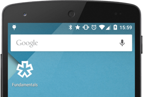
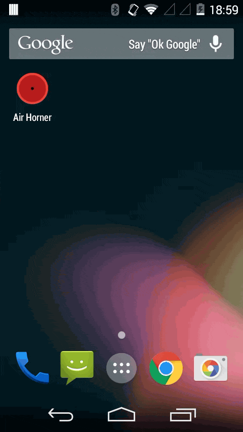
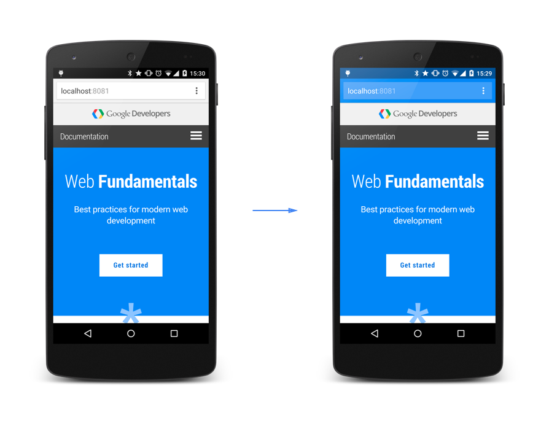
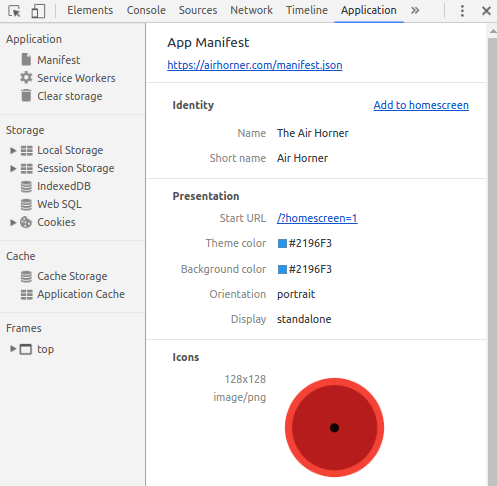

project_path: /web/fundamentals/_project.yaml
book_path: /web/fundamentals/_book.yaml
description: The web app manifest is a JSON file that gives you the ability to control how your web app or site appears to the user in areas where they would expect to see native apps (for example, a device's home screen), direct what the user can launch, and define its appearance at launch.

{# wf_updated_on: 2017-07-24 #}
{# wf_published_on: 2016-02-11 #}

# The Web App Manifest {: .page-title }




The [web app manifest](https://developer.mozilla.org/en-US/docs/Web/Manifest) is a simple JSON file that gives you, the developer, the ability to control how your app appears to the user in areas where they would expect to see apps (for example, a mobile device's home screen), direct what the user can launch, and define its appearance at launch.

Web app manifests provide the ability to save a site bookmark to a device's home screen. When a site is launched this way: 

* It has a unique icon and name so that users can distinguish it from other sites.
* It displays something to the user while resources are downloaded or restored from cache.
* It provides default display characterstics to the browser to avoid too abrupt transition when site resources become available. 

It does all this through the simple mechanism of metadata in a text file. That's the web app manifest.

Note: Though you can use a web app manifest on any site, they are required for [progressive web apps](/web/progressive-web-apps/).

### TL;DR {: .hide-from-toc }
- Creating a manifest and linking it to your page are straightforward processes.
- Control what the user sees when launching from the home screen.
- This includes things like a splash screen, theme colors, and even the URL that's opened. 

## Create the manifest

Before diving into details of a web app manifest, let's create a basic
manifest and link a web page to it.

You can call the manifest whatever you want. Most people use `manifest.json`. Here's an example:

    {
      "short_name": "AirHorner",
      "name": "Kinlan's AirHorner of Infamy",
      "icons": [
        {
          "src": "launcher-icon-1x.png",
          "type": "image/png",
          "sizes": "48x48"
        },
        {
          "src": "launcher-icon-2x.png",
          "type": "image/png",
          "sizes": "96x96"
        },
        {
          "src": "launcher-icon-4x.png",
          "type": "image/png",
          "sizes": "192x192"
        }
      ],
      "start_url": "index.html?launcher=true"
    }
    

Make sure to include the following: 

* A `short_name` for use as the text on the users home screen.  
* A `name` for use in the Web App Install banner.  
  

## Tell the browser about your manifest

When you have created the manifest and it's on your site, add
a `link` tag to all the pages that encompass your web app, as follows:

    <link rel="manifest" href="/manifest.json">
  
## Set a start URL

If you don't provide a `start_url`, the current page is used, which
is unlikely to be what your users want. But that's not the only reason to
include it. Because you can now define how your app is launched, add a query
string parameter to the `start_url` that indicates how it was launched. 

    "start_url": "/?utm_source=homescreen"

This can be anything you want; the value we're using has the advantage of being meaningful to Google Analytics.
 

## Customize the icons

<figure class="attempt-right">
  
  <figcaption>Add to Home Screen Icon</figcaption>
</figure>

 When a user adds your site to their home screen, you can define a set of icons for the browser to use. You can define them with a type and size, as follows:

    "icons": [{
        "src": "images/touch/icon-128x128.png",
        "type": "image/png",
        "sizes": "128x128"
      }, {
        "src": "images/touch/apple-touch-icon.png",
        "type": "image/png",
        "sizes": "152x152"
      }, {
        "src": "images/touch/ms-touch-icon-144x144-precomposed.png",
        "type": "image/png",
        "sizes": "144x144"
      }, {
        "src": "images/touch/chrome-touch-icon-192x192.png",
        "type": "image/png",
        "sizes": "192x192"
      }],
    

Note: When saving an icon to the home screen, Chrome first looks for icons that match the density of the display and are sized to 48dp screen density. If none are found, it searches for the icon that most closely matches the device characteristics. If, for whatever reason, you want be specific about targeting an icon at a particular pixel density, you can use the optional <code>density</code> member, which takes a number. When you don’t declare density, it defaults to 1.0. This means: “use this icon for screen densities 1.0 and up”, which is normally what you want.

## Add a splash screen

<figure class="attempt-right">
  
  <figcaption>Background color for launch screen</figcaption>
</figure>

When you launch your web app from the home screen a number of things happen behind the
scenes:

1. Chrome launches.
2. The renderer that displays the page starts up.
3. Your site loads from the network (or from cache if it has a service worker).

While this is happening the screen goes white and appears to be stalled.
This is especially apparent if you are loading your web page from the network where it 
takes more than one or two seconds for pages to become visible on the homepage.

To provide a better user experience, you can replace the white screen with a title, color, and images. 

### Set an image and title

If you've been following from the beginning, you've set an image and title already. Chrome infers the image and title from specific members of the manifest. What's important here is knowing the specifics. 

A splash screen image is drawn from the `icons` array. Chrome chooses the image that is closest to 128dp for the device. The title is simply pulled from the `name` member.

### Set the background color 

Specify background color using the appropriately named `background_color`
property. Chrome uses this color the instant the web app is launched
and the color remains on the screen until the web app's first render.

To set the background color, set the following in your manifest:

    "background_color": "#2196F3",
    

Now, no white screen appears as your site is launched from the home screen.

A good suggested value for this property is the background color of the load page.  Using the same colors as the load page allows for a smooth transition from the
splash screen to the homepage.

### Set a theme color

Specify a theme color using the `theme_color` property. This property
sets the color of the toolbar. For this we also suggest duplicating an existing
color, specifically the `theme-color` `<meta>`.

## Set the launch style

<figure class="attempt-right">
  
  <figcaption>Manifest Display Options</figcaption>
</figure>

Use the web app manifest to control the display type and page orientation.

### Customize the display type

You make your web app hide the browser's UI by setting the `display` type to `standalone`:

    "display": "standalone"
    

If you think users would prefer to view your page as a normal site in a browser, you can set the `display` type to `browser`:

    "display": "browser"
    

### Specify the initial orientation of the page

<figure class="attempt-right">
  
  <figcaption>Web App Manifest Orientation Options</figcaption>
</figure>

You can enforce a specific orientation, which is advantageous for apps 
that work in only one orientation, such as games for example. Use this 
selectively. Users prefer selecting the orientation.

    "orientation": "landscape"

    

## Provide a site-wide theme color

<figure class="attempt-right">
  
  <figcaption>Theme color</figcaption>
</figure>

Chrome introduced the concept of a theme color for your site in 2014. The theme color
is a hint from your web page that tells the browser what color to tint
[UI elements such as the address bar](/web/fundamentals/design-and-ux/browser-customization/).  

Without a manifest, you have to define the theme color on every single page, and if 
you have a large site or legacy site, making a lot of site wide changes is not feasible.

Add a `theme_color` attribute to your manifest, and when the site is launched
from the home screen every page in the domain will automatically get the theme color.

    "theme_color": "#2196F3"
    

<figure>
  
  <figcaption>Sitewide theme color</figcaption>
</figure>

## Test your manifest {: #test }

If you want to manually verify that your web app manifest is set up correctly,
use the **Manifest** tab on the **Application** panel of Chrome DevTools.

This tab provides a human-readable version of many of your manifest's
properties. See [Web app
manifest](/web/tools/chrome-devtools/progressive-web-apps#manifest) over
at the Chrome DevTools docs for more information on this tab. You can
also simulate Add to Homescreen events from here. See [Testing the app install
banner](/web/fundamentals/engage-and-retain/app-install-banners/#testing-the-app-install-banner)
for more on this topic.

If you want an automated approach towards validating your web app manifest,
check out [Lighthouse](/web/tools/lighthouse/). Lighthouse is a web app auditing
tool that you run as a Chrome Extension or as an NPM module. You provide
Lighthouse with a URL, it runs a suite of audits against that page, and then
displays the results in a report. Lighthouse audits related to web app manifests
include checking that:

* The app can be added to the homescreen.
* After being added, the app launches with a custom splash screen.
* The color of the browser's address bar is customized.
* The app is on HTTPS (a prerequisite for Add to Homescreen).

## More information

This article has given you a quick introduction to web app manifests, but
there's more to learn.

* If you're using a web app manifest, you'll probably want set up an
[app install banner](/web/fundamentals/engage-and-retain/app-install-banners/) as well. 

* [A complete reference](https://developer.mozilla.org/en-US/docs/Web/Manifest)
to the web app manifest is available on the Mozilla Developer Network.

* If you want feature descriptions from the engineers who created web app
manifests, you can read the [actual W3C specification](http://www.w3.org/TR/appmanifest/){: .external }.

Note: If you update your `manifest.json` file in the future, those changes won't
be automatically picked up by the users unless they re-add your app to their
home screen.
