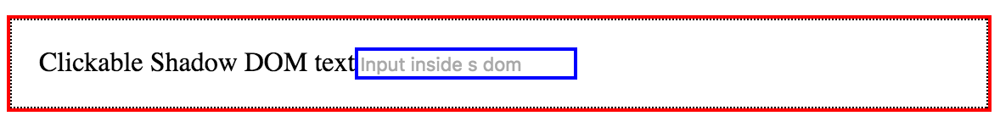
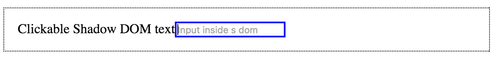
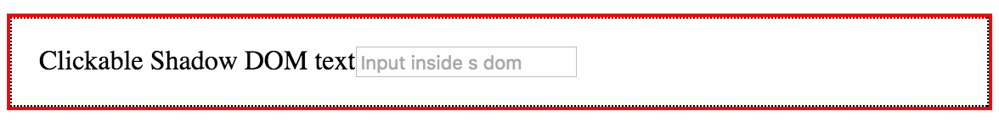
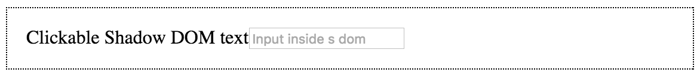

project_path: /web/fundamentals/_project.yaml
book_path: /web/fundamentals/_book.yaml
description: Shadow DOM allows web developers to create compartmentalized DOM and CSS for web components

{# wf_updated_on: 2017-08-14 #}
{# wf_published_on: 2016-08-01 #}
{# wf_blink_components: Blink>DOM #}

# Shadow DOM v1: Self-Contained Web Components {: .page-title }



### TL;DR {: #tldr .hide-from-toc}

Shadow DOM removes the brittleness of building web apps. The brittleness
comes from the global nature of HTML, CSS, and JS. Over the years we've
invented an exorbitant [number](http://getbem.com/introduction/)
[of](https://github.com/css-modules/css-modules)
[tools](https://www.smashingmagazine.com/2011/12/an-introduction-to-object-oriented-css-oocss/)
to circumvent the issues. For example, when you use a new HTML id/class,
there's no telling if it will conflict with an existing name used by the page.
[Subtle bugs](http://www.2ality.com/2012/08/ids-are-global.html) creep up,
CSS specificity becomes a huge issue (`!important` all the things!), style
selectors grow out of control, and
[performance can suffer](/web/updates/2016/06/css-containment). The list
goes on.

**Shadow DOM fixes CSS and DOM**. It introduces **scoped styles** to the web
platform. Without tools or naming conventions, you can **bundle CSS with
markup**, hide implementation details, and **author self-contained
components** in vanilla JavaScript.

## Introduction {: #intro}

Note: **Already familiar with Shadow DOM?** This article describes the new
<a href="http://w3c.github.io/webcomponents/spec/shadow/" target="_blank">
Shadow DOM v1 spec</a>. If you've been using Shadow DOM, chances are you're
familiar with the <a href="https://www.chromestatus.com/features/4507242028072960">
v0 version that shipped in Chrome 35</a>, and the webcomponents.js polyfills.
The concepts are the same, but the v1 spec has important API differences. It's
also the version that all major browsers have agreed to implement, with
implementations already in Safari Tech Preview and Chrome Canary. Keep reading
to see what's new or check out the section on <a href="#historysupport">
History and browser support</a> for more info.

Shadow DOM is one of the four Web Component standards:
[HTML Templates](https://www.html5rocks.com/en/tutorials/webcomponents/template/),
[Shadow DOM][sd_spec_whatwg],
[Custom elements](/web/fundamentals/web-components/customelements) and
[HTML Imports](https://www.html5rocks.com/en/tutorials/webcomponents/imports/).

You don't have to author web components that use shadow DOM. But when you do,
you take advantage of its benefits (CSS scoping, DOM encapsulation,
composition) and build reusable
[custom elements](/web/fundamentals/web-components/customelements),
which are resilient, highly configurable, and extremely reusable. If custom
elements are the way to create a new HTML (with a JS API), shadow DOM is the
way you provide its HTML and CSS. The two APIs combine to make a component
with self-contained HTML, CSS, and JavaScript.

Shadow DOM is designed as a tool for building component-based apps. Therefore,
it brings solutions for common problems in web development:

- **Isolated DOM**: A component's DOM is self-contained (e.g.
  `document.querySelector()` won't return nodes in the component's shadow DOM).
- **Scoped CSS**: CSS defined inside shadow DOM is scoped to it. Style rules
  don't leak out and page styles don't bleed in.
- **Composition**: Design a declarative, markup-based API for your component.
- **Simplifies CSS** - Scoped DOM means you can use simple CSS selectors, more
  generic id/class names, and not worry about naming conflicts.
- **Productivity** - Think of apps in chunks of DOM rather than one large
  (global) page.

Note: Although you can use the shadow DOM API and its benefits outside of web
components, I'm only going to focus on examples that build on custom elements.
I'll be using the custom elements v1 API in all examples.

#### `fancy-tabs` demo {: #demo}

Throughout this article, I'll be referring to a demo component (`<fancy-tabs>`)
and referencing code snippets from it. If your browser supports the APIs, you
should see a live demo of it just below. Otherwise, check out the
<a href="https://gist.github.com/ebidel/2d2bb0cdec3f2a16cf519dbaa791ce1b" target="_blank">
full source on Github</a>.

<figure class="demoarea">
  <iframe
    style="height:360px;width:100%;border:none"
    src="https://rawgit.com/ebidel/2d2bb0cdec3f2a16cf519dbaa791ce1b/raw/fancy-tabs-demo.html">
  </iframe>
  <figcaption>
    <a href="https://gist.github.com/ebidel/2d2bb0cdec3f2a16cf519dbaa791ce1b" target="_blank">
      View source on Github
    </a>
  </figcaption>
</figure>

## What is shadow DOM? {: #what}

#### Background on DOM {: #sdbackground}

HTML powers the web because it's easy to work with. By declaring a few tags, you
can author a page in seconds that has both presentation and structure. However,
by itself HTML isn't all that useful. It's easy for humans to understand a text-
based language, but machines need something more. Enter the Document Object
Model, or DOM.

When the browser loads a web page it does a bunch of interesting stuff. One of
the things it does is transform the author's HTML into a live document.
Basically, to understand the page's structure, the browser parses HTML (static
strings of text) into a data model (objects/nodes). The browser preserves the
HTML's hierarchy by creating a tree of these nodes: the DOM. The cool thing
about DOM is that it's a live representation of your page. Unlike the static
HTML we author, the browser-produced nodes contain properties, methods, and best
of all...can be manipulated by programs! That's why we're able to create DOM
elements directly using JavaScript:

    const header = document.createElement('header');
    const h1 = document.createElement('h1');
    h1.textContent = 'Hello world!';
    header.appendChild(h1);
    document.body.appendChild(header);

produces the following HTML markup:

    <body>
      <header>
        <h1>Hello DOM</h1>
      </header>
    </body>

All that is well and good. Then
[what the heck is _shadow DOM_](https://glazkov.com/2011/01/14/what-the-heck-is-shadow-dom/)?

#### DOM...in the shadows {: #sddom}

Shadow DOM is just normal DOM with two differences: 1) how it's created/used and
2) how it behaves in relation to the rest of the page. Normally, you create DOM
nodes and append them as children of another element. With shadow DOM, you
create a scoped DOM tree that's attached to the element, but separate from its
actual children. This scoped subtree is called a **shadow tree**. The element
it's attached to is its **shadow host**. Anything you add in the shadows becomes
local to the hosting element, including ` <!-- styles are scoped to fancy-tabs! -->
          
...

          
...

        `;
      }
      ...
    });

There are a couple of interesting things going on here. The first is that the
custom element **creates its own shadow DOM** when an instance of `<fancy-tabs>`
is created. That's done in the `constructor()`. Secondly, because we're creating
a shadow root, the CSS rules inside the `
      <slot name="icon"></slot>
      
        <slot>Button</slot>
      

**Flattened DOM tree**

The result of the browser distributing the user's light DOM into your shadow
DOM, rendering the final product. The flattened tree is what you ultimately see
in the DevTools and what's rendered on the page.

    <better-button>
      #shadow-root
        
        <slot name="icon">
          
        </slot>
        
          <slot>
            Settings
          </slot>
        
    </better-button>

### The &lt;slot&gt; element {: #slots}

Shadow DOM composes different DOM trees together using the `<slot>` element.
**Slots are placeholders inside your component that users _can_ fill with their
own markup**. By defining one or more slots, you invite outside markup to render
in your component's shadow DOM. Essentially, you're saying _"Render the user's
markup over here"_.

Note: Slots are a way of creating a "declarative API" for a web component. They
mix-in the user's DOM to help render the overall component, thus, **composing
different DOM trees together**.

Elements are allowed to "cross" the shadow DOM boundary when a `<slot>` invites
them in. These elements are called **distributed nodes**. Conceptually,
distributed nodes can seem a bit bizarre. Slots don't physically move DOM; they
render it at another location inside the shadow DOM.

A component can define zero or more slots in its shadow DOM. Slots can be empty
or provide fallback content. If the user doesn't provide [light DOM](#lightdom)
content, the slot renders its fallback content.

    <!-- Default slot. If there's more than one default slot, the first is used. -->
    <slot></slot>

    <slot>fallback content</slot> <!-- default slot with fallback content -->

    <slot> <!-- default slot entire DOM tree as fallback -->
      <h2>Title</h2>
      
Description text

    </slot>

You can also create **named slots**. Named slots are specific holes in your
shadow DOM that users reference by name.

**Example** - the slots in `<fancy-tabs>`'s shadow DOM:

    #shadow-root
      

        <slot id="tabsSlot" name="title"></slot> <!-- named slot -->
      

      

        <slot id="panelsSlot"></slot>
      

Component users declare `<fancy-tabs>` like so:

    <fancy-tabs>
      <button slot="title">Title</button>
      <button slot="title" selected>Title 2</button>
      <button slot="title">Title 3</button>
      <section>content panel 1</section>
      <section>content panel 2</section>
      <section>content panel 3</section>
    </fancy-tabs>

    <!-- Using <h2>'s and changing the ordering would also work! -->
    <fancy-tabs>
      <h2 slot="title">Title</h2>
      <section>content panel 1</section>
      <h2 slot="title" selected>Title 2</h2>
      <section>content panel 2</section>
      <h2 slot="title">Title 3</h2>
      <section>content panel 3</section>
    </fancy-tabs>

And if you're wondering, the flattened tree looks something like this:

    <fancy-tabs>
      #shadow-root
        

          <slot id="tabsSlot" name="title">
            <button slot="title">Title</button>
            <button slot="title" selected>Title 2</button>
            <button slot="title">Title 3</button>
          </slot>
        

        

          <slot id="panelsSlot">
            <section>content panel 1</section>
            <section>content panel 2</section>
            <section>content panel 3</section>
          </slot>
        

    </fancy-tabs>

Notice our component is able to handle different configurations, but the
flattened DOM tree remains the same. We can also switch from `<button>` to
`<h2>`. This component was authored to handle different types of children...just
like `<select>` does!

## Styling  {: #styling}

There are many options for styling web components. A component that uses shadow
DOM can be styled by the main page, define its own styles, or provide hooks (in
the form of [CSS custom properties][css_props]) for users to override defaults.

### Component-defined styles {: #host}

Hands down the most useful feature of shadow DOM is **scoped CSS**:

- CSS selectors from the outer page don't apply inside your component.
- Styles defined inside don't bleed out. They're scoped to the host element.

**CSS selectors used inside shadow DOM apply locally to your component**.  In
practice, this means we can use common id/class names again, without worrying
about conflicts elsewhere on the page. Simpler CSS selectors are a best practice
inside Shadow DOM. They're also good for performance.

**Example** - styles defined in a shadow root are local

    #shadow-root
      
      

        ...
      

      

        ...
      

Stylesheets are also scoped to the shadow tree:

    #shadow-root
      <!-- Available in Chrome 54+ -->
      <!-- WebKit bug: https://bugs.webkit.org/show_bug.cgi?id=160683 -->
      <link rel="stylesheet" href="styles.css">
      

        ...
      

      

        ...
      

Ever wonder how the `<select>` element renders a multi-select widget (instead of
a dropdown) when you add the `multiple` attribute:

<select multiple>
  <option>Do</option>
  <option selected>Re</option>
  <option>Mi</option>
  <option>Fa</option>
  <option>So</option>
</select>

`<select>` is able to style _itself_ differently based on the attributes you
declare on it. Web components can style themselves too, by using the `:host`
selector.

**Example** - a component styling itself

    

One gotcha with `:host` is that rules in the parent page have higher specificity
than `:host` rules defined in the element. That is, outside styles win. This
allows users to override your top-level styling from the outside. Also, `:host`
only works in the context of a shadow root, so you can't use it outside of
shadow DOM.

The functional form of `:host(<selector>)` allows you to target the host if it
matches a `<selector>`. This is a great way for your component to encapsulate
behaviors that react to user interaction or state or style internal nodes based
on the host.

    

### Styling based on context {: #contextstyling}

`:host-context(<selector>)` matches the component if it or any of its ancestors
matches `<selector>`. A common use for this is theming based on a component's
surroundings. For example, many people do theming by applying a class to
`<html>` or `<body>`:

    <body class="darktheme">
      <fancy-tabs>
        ...
      </fancy-tabs>
    </body>

`:host-context(.darktheme)` would style `<fancy-tabs>` when it's a descendant
of `.darktheme`:

    :host-context(.darktheme) {
      color: white;
      background: black;
    }

`:host-context()` can be useful for theming, but an even better approach is to
[create style hooks using CSS custom properties](#stylehooks).

### Styling distributed nodes {: #stylinglightdom}

`::slotted(<compound-selector>)` matches nodes that are distributed into a
`<slot>`.

Let's say we've created a name badge component:

    <name-badge>
      <h2>Eric Bidelman</h2>
      
        Digital Jedi, Google
      
    </name-badge>

The component's shadow DOM can style the user's `<h2>` and `.title`:

    
    <slot></slot>

If you remember from before, `<slot>`s do not move the user's light DOM. When
nodes are distributed into a `<slot>`, the `<slot>` renders their DOM but the
nodes physically stay put. **Styles that applied before distribution continue to
apply after distribution**. However, when the light DOM is distributed, it _can_
take on additional styles (ones defined by the shadow DOM).

Another, more in-depth example from `<fancy-tabs>`:

    const shadowRoot = this.attachShadow({mode: 'open'});
    shadowRoot.innerHTML = `
      
      

        <slot id="tabsSlot" name="title"></slot>
      

      

        <slot id="panelsSlot"></slot>
      

    `;

In this example, there are two slots: a named slot for the tab titles, and a
slot for the tab panel content. When the user selects a tab, we bold their selection
and reveal its panel. That's done by selecting distributed nodes that have the
`selected` attribute. The custom element's JS (not shown here) adds that
attribute at the correct time.

### Styling a component from the outside {: #stylefromoutside}

There are a couple of ways to style a component from the outside. The easiest
way is to use the tag name as a selector:

    fancy-tabs {
      width: 500px;
      color: red; /* Note: inheritable CSS properties pierce the shadow DOM boundary. */
    }
    fancy-tabs:hover {
      box-shadow: 0 3px 3px #ccc;
    }

**Outside styles always win over styles defined in shadow DOM**. For example,
if the user writes the selector `fancy-tabs { width: 500px; }`, it will trump
the component's rule: `:host { width: 650px;}`.

Styling the component itself will only get you so far. But what happens if you
want to style the internals of a component? For that, we need CSS custom
properties.

#### Creating style hooks using CSS custom properties {: #stylehooks}

Users can tweak internal styles if the component's author provides styling hooks
using [CSS custom properties][css_props]. Conceptually, the idea is similar to
`<slot>`. You create "style placeholders" for users to override.

**Example** - `<fancy-tabs>` allows users to override the background color:

    <!-- main page -->
    
    <fancy-tabs background>...</fancy-tabs>

Inside its shadow DOM:

    :host([background]) {
      background: var(--fancy-tabs-bg, #9E9E9E);
      border-radius: 10px;
      padding: 10px;
    }

In this case, the component will use `black` as the background value since the
user provided it. Otherwise, it would default to `#9E9E9E`.

Note: As the component author, you're responsible for letting developers know
about CSS custom properties they can use. Consider it part of your component's
public interface. Make sure to document styling hooks!

## Advanced topics {: #advanced}

### Creating closed shadow roots (should avoid) {: #closed}

There's another flavor of shadow DOM called "closed" mode. When you create a
closed shadow tree, outside JavaScript won't be able to access the internal DOM
of your component. This is similar to how native elements like `<video>` work.
JavaScript cannot access the shadow DOM of `<video>` because the browser
implements it using a closed-mode shadow root.

**Example** - creating a closed shadow tree:

    const div = document.createElement('div');
    const shadowRoot = div.attachShadow({mode: 'closed'}); // close shadow tree
    // div.shadowRoot === null
    // shadowRoot.host === div

Other APIs are also affected by closed-mode:

- `Element.assignedSlot` / `TextNode.assignedSlot` returns `null`
- `Event.composedPath()` for events associated with elements inside the shadow
  DOM, returns []

Note: Closed shadow roots are not very useful. Some developers will see closed
mode as an artificial security feature. But let's be clear, it's **not** a
security feature. Closed mode simply prevents outside JS from drilling into an
element's internal DOM.

Here's my summary of why you should never create web components with
`{mode: 'closed'}`:

1. Artificial sense of security. There's nothing stopping an attacker from
   hijacking `Element.prototype.attachShadow`.

2. Closed mode **prevents your custom element code from accessing its own
   shadow DOM**. That's complete fail. Instead, you'll have to stash a reference
   for later if you want to use things like `querySelector()`. This completely
   defeats the original purpose of closed mode!

        customElements.define('x-element', class extends HTMLElement {
          constructor() {
            super(); // always call super() first in the ctor.
            this._shadowRoot = this.attachShadow({mode: 'closed'});
            this._shadowRoot.innerHTML = '

';
          }
          connectedCallback() {
            // When creating closed shadow trees, you'll need to stash the shadow root
            // for later if you want to use it again. Kinda pointless.
            const wrapper = this._shadowRoot.querySelector('.wrapper');
          }
          ...
        });

3. **Closed mode makes your component less flexible for end users**. As you
   build web components, there will come a time when you forget to add a
   feature. A configuration option. A use case the user wants. A common
   example is forgetting to include adequate styling hooks for internal nodes.
   With closed mode, there's no way for users to override defaults and tweak
   styles. Being able to access the component's internals is super helpful.
   Ultimately, users will fork your component, find another, or create their
   own if it doesn't do what they want :(

### Working with slots in JS {: #workwithslots}

The shadow DOM API provides utilities for working with slots and distributed
nodes. These come in handy when authoring a custom element.

#### slotchange event {: #slotchange}

The `slotchange` event fires when a slot's distributed nodes changes. For
example, if the user adds/removes children from the light DOM.

    const slot = this.shadowRoot.querySelector('#slot');
    slot.addEventListener('slotchange', e => {
      console.log('light dom children changed!');
    });

Note: `slotchange` does not fire when an instance of the component is
first initialized.

To monitor other types of changes to light DOM, you can setup a
[`MutationObserver`](https://developer.mozilla.org/en-US/docs/Web/API/MutationObserver)
in your element's constructor.

#### What elements are being rendering in a slot? {: #slotnodes}

Sometimes it's useful to know what elements are associated with a slot. Call
`slot.assignedNodes()` to find which elements the slot is rendering. The
`{flatten: true}` option will also return a slot's fallback content (if no nodes
are being distributed).

As an example, let's say your shadow DOM looks like this:

    <slot><b>fallback content</b></slot>

<table>
  <thead><th>Usage</th><th>Call</th><th>Result</th></thead>
  <tr>
    <td>&lt;my-component&gt;component text&lt;/my-component&gt;</td>
    <td><code>slot.assignedNodes();</code></td>
    <td><code>[component text]</code></td>
  </tr>
  <tr>
    <td>&lt;my-component>&lt;/my-component&gt;</td>
    <td><code>slot.assignedNodes();</code></td>
    <td><code>[]</code></td>
  </tr>
  <tr>
    <td>&lt;my-component&gt;&lt;/my-component&gt;</td>
    <td><code>slot.assignedNodes({flatten: true});</code></td>
    <td><code>[&lt;b&gt;fallback content&lt;/b&gt;]</code></td>
  </tr>
</table>

#### What slot is an element assigned to? {: #assignedslot}

Answering the reverse question is also possible. `element.assignedSlot` tells
you which of the component slots your element is assigned to.

### The Shadow DOM event model {: #events}

When an event bubbles up from shadow DOM it's target is adjusted to maintain the
encapsulation that shadow DOM provides. That is, events are re-targeted to look
like they've come from the component rather than internal elements within your
shadow DOM. Some events do not even propagate out of shadow DOM.

The events that **do** cross the shadow boundary are:

- Focus Events: `blur`, `focus`, `focusin`, `focusout`
- Mouse Events: `click`, `dblclick`, `mousedown`, `mouseenter`, `mousemove`, etc.
- Wheel Events: `wheel`
- Input Events: `beforeinput`, `input`
- Keyboard Events: `keydown`, `keyup`
- Composition Events: `compositionstart`, `compositionupdate`, `compositionend`
- DragEvent: `dragstart`, `drag`, `dragend`, `drop`, etc.

**Tips**

If the shadow tree is open, calling `event.composedPath()` will return an array
of nodes that the event traveled through.

#### Using custom events {: #customevents}

Custom DOM events which are fired on internal nodes in a shadow tree do not
bubble out of the shadow boundary unless the event is created using the
`composed: true` flag:

    // Inside <fancy-tab> custom element class definition:
    selectTab() {
      const tabs = this.shadowRoot.querySelector('#tabs');
      tabs.dispatchEvent(new Event('tab-select', {bubbles: true, composed: true}));
    }

If `composed: false` (default), consumers won't be able to listen for the event
outside of your shadow root.

    <fancy-tabs></fancy-tabs>
    

### Handling focus {: #focus}

If you recall from [shadow DOM's event model](#events), events that are fired
inside shadow DOM are adjusted to look like they come from the hosting element.
For example, let's say you click an `<input>` inside a shadow root:

    <x-focus>
      #shadow-root
        <input type="text" placeholder="Input inside shadow dom">

The `focus` event will look like it came from `<x-focus>`, not the `<input>`.
Similarly, `document.activeElement` will be `<x-focus>`. If the shadow root
was created with `mode:'open'` (see [closed mode](#closed)), you'll also be
able access the internal node that gained focus:

    document.activeElement.shadowRoot.activeElement // only works with open mode.

If there are multiple levels of shadow DOM at play (say a custom element within
another custom element), you need to recursively drill into the shadow roots to
find the `activeElement`:

    function deepActiveElement() {
      let a = document.activeElement;
      while (a && a.shadowRoot && a.shadowRoot.activeElement) {
        a = a.shadowRoot.activeElement;
      }
      return a;
    }

Another option for focus is the `delegatesFocus: true` option, which expands the
focus behavior of element's within a shadow tree:

- If you click a node inside shadow DOM and the node is not a focusable area,
  the first focusable area becomes focused.
- When a node inside shadow DOM gains focus, `:focus` applies to the host in
  addition to the focused element.

**Example** - how `delegatesFocus: true` changes focus behavior

    

    <x-focus></x-focus>

    

**Result**

Above is the result when `<x-focus>` is focused (user click, tabbed into,
`focus()`, etc.), "Clickable Shadow DOM text" is clicked, or the internal
`<input>` is focused (including `autofocus`).

If you were to set `delegatesFocus: false`, here's what you would see instead:

<figure>
  
  <figcaption>
    <code>delegatesFocus: false</code> and the internal <code>&lt;input></code> is focused.
  </figcaption>
</figure>

<figure>
  
  <figcaption>
    <code>delegatesFocus: false</code> and <code>&lt;x-focus></code>
    gains focus (e.g. it has <code>tabindex="0"</code>).
  </figcaption>
</figure>

<figure>
  
  <figcaption>
    <code>delegatesFocus: false</code> and "Clickable Shadow DOM text" is
    clicked (or other empty area within the element's shadow DOM is clicked).
  </figcaption>
</figure>

## Tips & Tricks {: #tricks}

Over the years I've learned a thing or two about authoring web components. I
think you'll find some of these tips useful for authoring components and
debugging shadow DOM.

### Use CSS containment {: #containment}

Typically, a web component's layout/style/paint is fairly self-contained. Use
[CSS containment](/web/updates/2016/06/css-containment) in `:host` for a perf
win:

    

### Resetting inheritable styles {: #reset}

Inheritable styles (`background`, `color`, `font`, `line-height`, etc.) continue
to inherit in shadow DOM. That is, they pierce the shadow DOM boundary by
default. If you want to start with a fresh slate, use `all: initial;` to reset
inheritable styles to their initial value when they cross the shadow boundary.

    

    

      
I'm outside the element (big/white)

      <my-element>Light DOM content is also affected.</my-element>
      
I'm outside the element (big/white)

    

    



  

  

    
I'm outside the element (big/white)

    <my-element>Light DOM content is also affected.</my-element>
    
I'm outside the element (big/white)

  

 


### Finding all the custom elements used by a page {: #findall}

Sometimes it's useful to find custom elements used on the page. To do so, you
need to recursively traverse the shadow DOM of all elements used on the page.

    const allCustomElements = [];

    function isCustomElement(el) {
      const isAttr = el.getAttribute('is');
      // Check for <super-button> and <button is="super-button">.
      return el.localName.includes('-') || isAttr && isAttr.includes('-');
    }

    function findAllCustomElements(nodes) {
      for (let i = 0, el; el = nodes[i]; ++i) {
        if (isCustomElement(el)) {
          allCustomElements.push(el);
        }
        // If the element has shadow DOM, dig deeper.
        if (el.shadowRoot) {
          findAllCustomElements(el.shadowRoot.querySelectorAll('*'));
        }
      }
    }

    findAllCustomElements(document.querySelectorAll('*'));


Some browsers also support using shadow DOM v0's `/deep/` combinator in `querySelectorAll()`:

    const allCustomElements = Array.from(document.querySelectorAll('html /deep/ *')).filter(el => {
      const isAttr = el.getAttribute('is');
      return el.localName.includes('-') || isAttr && isAttr.includes('-');
    });

For now, `/deep/` [continues to work in `querySelectorAll()` calls](https://bugs.chromium.org/p/chromium/issues/detail?id=633007).


### Creating elements from a &lt;template&gt; {: #fromtemplate}

Instead of populating a shadow root using `.innerHTML`, we can use a declarative
`<template>`. Templates are an ideal placeholder for declaring the structure of
a web component.

See the example in
["Custom elements: building reusable web components"](/web/fundamentals/web-components/customelements).

## History & browser support {: #historysupport}

If you've been following web components for the last couple of years, you'll
know that Chrome 35+/Opera have been shipping an older version of shadow DOM for
some time. Blink will continue to support both versions in parallel for some
time. The v0 spec provided a different method to create a shadow root
(`element.createShadowRoot` instead of v1's `element.attachShadow`). Calling the
older method continues to create a shadow root with v0 semantics, so existing v0
code won't break.

If you happen to be interested in the old v0 spec, check out the html5rocks
articles:
[1](https://www.html5rocks.com/en/tutorials/webcomponents/shadowdom/),
[2](https://www.html5rocks.com/en/tutorials/webcomponents/shadowdom-201/),
[3](https://www.html5rocks.com/en/tutorials/webcomponents/shadowdom-301/).
There's also a great comparison of the
[differences between shadow DOM v0 and v1][differences].

### Browser support {: #support}

Chrome 53 ([status](https://www.chromestatus.com/features/4667415417847808)),
Opera 40, and Safari 10 are shipping shadow DOM v1. Edge is under consideration
[with high priority](https://developer.microsoft.com/en-us/microsoft-edge/platform/status/shadowdom/).
Mozilla has an [open bug](https://bugzilla.mozilla.org/show_bug.cgi?id=811542)
to implement.

To feature detect shadow DOM, check for the existence of `attachShadow`:

    const supportsShadowDOMV1 = !!HTMLElement.prototype.attachShadow;

#### Polyfill {: #polyfill}

Until browser support is widely available, the
[shadydom](https://github.com/webcomponents/shadydom) and
[shadycss](https://github.com/webcomponents/shadycss) polyfills give you v1
feature. Shady DOM mimics the DOM scoping of Shadow DOM and shadycss polyfills
CSS custom properties and the style scoping the native API provides.

Install the polyfills:

    bower install --save webcomponents/shadydom
    bower install --save webcomponents/shadycss

Use the polyfills:

    function loadScript(src) {
     return new Promise(function(resolve, reject) {
       const script = document.createElement('script');
       script.async = true;
       script.src = src;
       script.onload = resolve;
       script.onerror = reject;
       document.head.appendChild(script);
     });
    }

    // Lazy load the polyfill if necessary.
    if (!supportsShadowDOMV1) {
      loadScript('/bower_components/shadydom/shadydom.min.js')
        .then(e => loadScript('/bower_components/shadycss/shadycss.min.js'))
        .then(e => {
          // Polyfills loaded.
        });
    } else {
      // Native shadow dom v1 support. Go to go!
    }

See the [https://github.com/webcomponents/shadycss#usage](https://github.com/webcomponents/shadycss)
for instructions on how to shim/scope your styles.

## Conclusion

For the first time ever, we have an API primitive that does proper CSS scoping,
DOM scoping, and has true composition. Combined with other web component APIs
like custom elements, shadow DOM provides a way to author truly encapsulated
components without hacks or using older baggage like `<iframe>`s.

Don't get me wrong. Shadow DOM is certainly a complex beast! But it's a beast
worth learning. Spend some time with it. Learn it and ask questions!

#### Further reading

- [Differences between Shadow DOM v1 and v0][differences]
- ["Introducing Slot-Based Shadow DOM API"](https://webkit.org/blog/4096/introducing-shadow-dom-api/)
  from the WebKit Blog.
- [Web Components and the future of Modular CSS](https://philipwalton.github.io/talks/2015-10-26/)
  by [Philip Walton](https://twitter.com/@philwalton)
- ["Custom elements: building reusable web components"](/web/fundamentals/web-components/customelements)
  from Google's WebFundamentals.
- [Shadow DOM v1 spec][sd_spec_whatwg]
- [Custom elements v1 spec][ce_spec]

## FAQ

**Can I use Shadow DOM v1 today?**

With a polyfill, yes. See [Browser support](#support).

**What security features does shadow DOM provide?**

Shadow DOM is not a security feature. It's a lightweight tool for scoping CSS
and hiding away DOM trees in component. If you want a true security boundary,
use an `<iframe>`.

**Does a web component have to use shadow DOM?**

Nope! You don't have to create web components that use shadow DOM. However,
authoring [custom elements that use Shadow DOM](#elements) means you can take
advantage of features like CSS scoping, DOM encapsulation, and composition.

**What's the difference between open and closed shadow roots?**

See [Closed shadow roots](#closed).

[ce_spec]: https://html.spec.whatwg.org/multipage/scripting.html#custom-elements
[ce_article]: (/web/fundamentals/web-components/customelements)
[sd_spec]: http://w3c.github.io/webcomponents/spec/shadow/
[sd_spec_whatwg]: https://dom.spec.whatwg.org/#shadow-trees
[differences]: http://hayato.io/2016/shadowdomv1/
[css_props]: https://developer.mozilla.org/en-US/docs/Web/CSS/Using_CSS_variables
