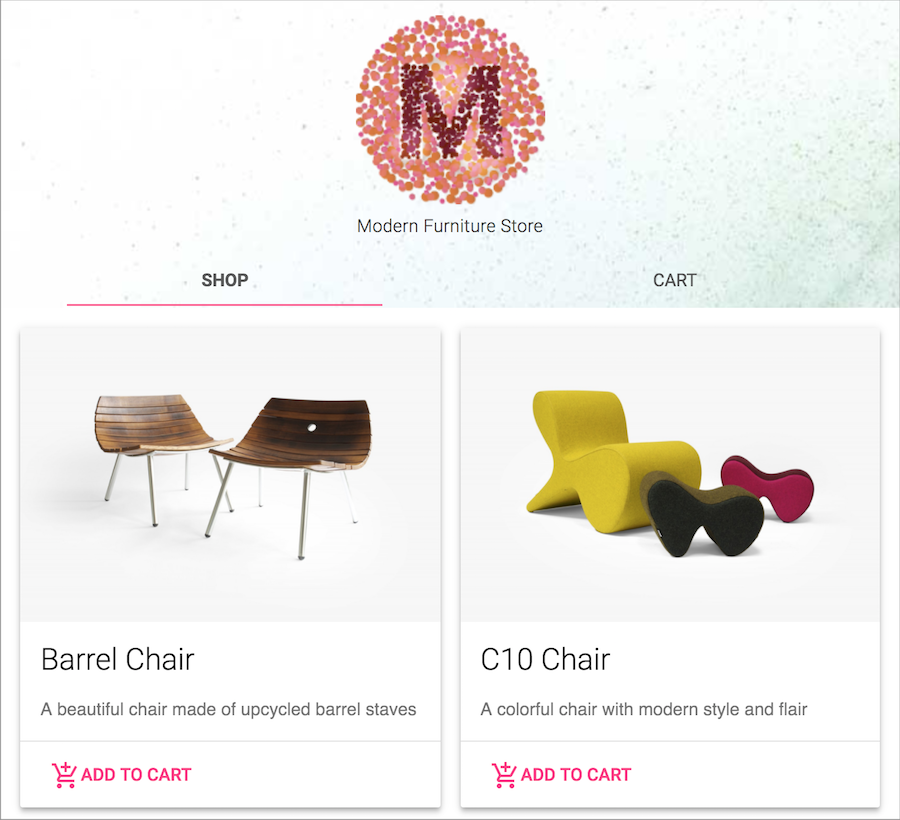
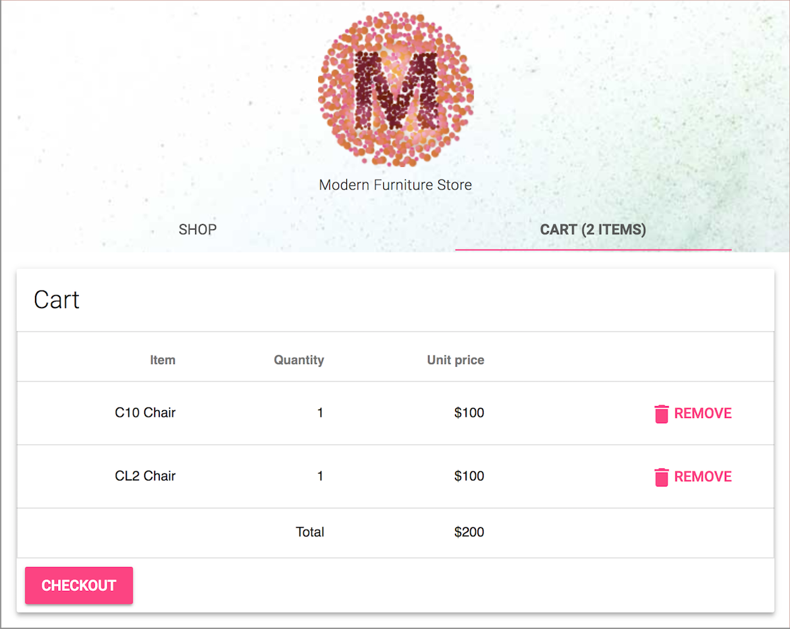

project_path: /web/_project.yaml
book_path: /web/ilt/pwa/_book.yaml

{# wf_auto_generated #}
{# wf_blink_components: N/A #}
{# wf_updated_on: 2019-04-26 #}
{# wf_published_on: 2016-01-01 #}

# Challenge: Convert an E-Commerce site to a PWA {: .page-title }


## Overview

In this challenge, you'll use the skills you've learned during the training to build a complete Progressive Web App (PWA).

#### What you will do

* Precache the app shell for instant loading
* Dynamically cache runtime assets
* Use Workbox to integrate service worker development into a build process
* Make the app work offline
* Make the app home screen addable

#### What you should know

* Intermediate JavaScript, including familiarity with ES2015  [Promises](/web/fundamentals/primers/promises)
* Familiarity with service workers and Workbox (see  [Lab: Workbox](/web/ilt/pwa/lab-workbox))
* Some familiarity with  [Gulp](https://gulpjs.com/) and  [Node.js](https://nodejs.org/en/) is recommended (see:  [Lab: Gulp Setup](/web/ilt/pwa/lab-gulp-setup))

#### What you will need

* Computer with terminal/shell access
* Connection to the internet
* A  [browser that supports service workers](https://jakearchibald.github.io/isserviceworkerready/)
* Node.js installed on your computer
* A text editor

The app you'll be working on is a storefront for a modern furniture store:

Unlike the other labs, this is a self-guided exercise - only the setup is explained, the rest is up to you!

## 1. Get set up

Install the  [LTS version of Node.js](https://nodejs.org/en/).

Clone the E-Commerce lab repository with Git using the following command:

    git clone https://github.com/google-developer-training/pwa-ecommerce-demo.git

Alternatively, you can  [download the repo](https://github.com/google-developer-training/pwa-ecommerce-demo/archive/master.zip) from GitHub.

After you have downloaded the repo, open the `pwa-ecommerce-demo/project/` folder in your preferred text editor. The `project/` folder is where you will be working.

Take a moment to look through the code and get familiar with the app's structure. The `app/` folder contains the app's source files.

The `package.json` file specifies the app's development dependencies. You don't need to be familiar with these specific packages, but they're required to build the app. In the command line, navigate to the `project/` directory and install these packages (this may take a moment to complete):

    cd pwa-ecommerce-demo/project
    npm install

After the dependencies have been installed, run the server:

    npm run serve

You can terminate the server at any time by pressing `ctrl + c` in the command line.

The `serve` command is aliased in `package.json` to run the gulp `serve` task. This task first runs the `default` task in `gulpfile.babel.js`. Open the gulpfile and explore the contents. You don't need to understand all the tasks. The overall build flow (defined by the `default` task) is as follows:

* The `dist/` folder and all of its contents are removed
* The HTML, CSS, and scripts are processed (minified, compiled for browser support, etc.) and the images are minified
* The necessary assets are copied to the `dist/` folder
* A development server is started in the `dist/` directory

Open your browser and navigate to `localhost:8080` to examine the app.

Note: [Unregister](tools-for-pwa-developers#unregister) any service workers and [clear all service worker caches](tools-for-pwa-developers#clearcache) for localhost so that they do not interfere with the lab.

Note: The e-commerce app is based on Google's  [Web Starter Kit](https://github.com/google/web-starter-kit/), which is an "opinionated boilerplate" designed as a starting point for new projects. It allows us to take advantage of several preconfigured tools that facilitate development, and are optimized for both speed and multiple devices. You can learn more about the Web Starter Kit  [here](/web/tools/starter-kit/).

Solution code for this lab can be found in the `solution/` folder.

## 2. Specification

Now you're ready to start. Here is your challenge:

### 2.1 Service worker

#### Features

Use the Service Worker API to achieve the following:

* Register the service worker in `scripts/main.js` (see Constraints)
* Precache the app shell files (`index.html`, all scripts, all styles, and all images except the ones in the `products/` directory)
* Dynamically cache the images in the `images/products/` directory and serve them with a cache-first strategy
* Dynamically cache Google fonts (`https://fonts.(?:googleapis|gstatic).com/(.*)`) and MDL styles (`https://code.getmdl.io/(.*)`) and serve them with a `staleWhileRevalidate` strategy
* Configure the service worker to call  [`skipWaiting`](https://developer.mozilla.org/en-US/docs/Web/API/ServiceWorkerGlobalScope/skipWaiting) and  [`Clients.claim`](https://developer.mozilla.org/en-US/docs/Web/API/Clients/claim) so that updated service workers will immediately activate and claim all clients

#### Constraints

* The service worker must only be registered in supporting browsers, and must register after the page has loaded.
* You must use  [workbox-build](/web/tools/workbox/guides/precache-files/workbox-build#using_with_gulp) to inject the precache manifest automatically as part of the gulp build process. You should write a gulp task as described in the  [documentation](/web/tools/workbox/guides/precache-files/workbox-build#using_with_gulp) and add the task to those called in the `runSequence` call of the `default` task. The source service worker is `app/sw.js`, and the destination service worker is `dist/sw.js`.
* You must use  [Workbox routing](/web/tools/workbox/modules/workbox-routing) and  [strategies](/web/tools/workbox/reference-docs/latest/workbox.strategies) to implement all of the dynamic caching.

#### Optional challenges

* Name the products images cache "furniture-store-images" and configure it to accept a maximum of 10 entries. Set a cache lifetime for the entries to one week.

#### Hints

* See the  [Workbox precaching guide](/web/tools/workbox/guides/precache-files/workbox-build) for documentation on precaching files and injecting a precache manifest with gulp.
* Check out the  [Workbox routing guide](/web/tools/workbox/guides/route-requests#handling_a_route_with_a_workbox_strategy)  and  [common recipes](/web/tools/workbox/guides/common-recipes) for documentation on runtime caching strategies and routes.
* See the  [workbox module documentation](/web/tools/workbox/modules/workbox-sw#skip_waiting_and_clients_claim) for configuring `skipWaiting` and `Clients.claim`.

#### Testing

If implemented correctly:

* You should see the service worker [registered in developer tools](tools-for-pwa-developers#accesssw)
* The home page should be served from the cache after the first visit and you should see `index.html`, scripts, CSS, and images [in the cache](tools-for-pwa-developers#cache)
* Previously fetched products images should be available on subsequent loads and should be visible [in the cache](tools-for-pwa-developers#cache)
* Updated service workers should immediately activate on each new page load

If you're using Chrome, you should also run an  [audit with Lighthouse](/web/tools/lighthouse/). The final app should pass all PWA tests except those concerned with HTTPS (the Add to Homescreen tests are completed in the next section).

See the solution code in the `solution/` directory if you get stuck.

### 2.2 Optional: Add to Homescreen

#### Features

* Add a manifest file to enable Add to Homescreen functionality
* The manifest should be configured to open the `index.html` page in `standalone` mode
* Theme color is `#2F3BA2` and the background color is `#3E4EB8`
* The name is "Modern Furniture Store" and the short name is "Furniture Store"
* `meta` tags should be supplied for browsers that don't support the `manifest.json` file

#### Hints

* Note that the touch icons are already available in `images/touch/`.
* Use a manifest generator like  [this one](https://app-manifest.firebaseapp.com/) or  [this one](https://tomitm.github.io/appmanifest/), which also generates `<meta>` tags for browsers that don't support the manifest file.

#### Testing

* In Chrome DevTools, the manifest properties can be examined under __Application__ > __Manifest__, where you can also  [test Add to Homescreen](/web/fundamentals/app-install-banners/#test)
* The  [Lighthouse](/web/tools/lighthouse/) PWA audit will also confirm that the manifest is configured correctly

## Congratulations!

You have made the E-commerce app available offline and enabled a returning user to add the app to their device's homescreen!

