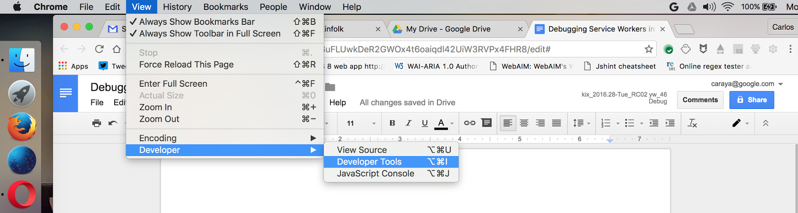
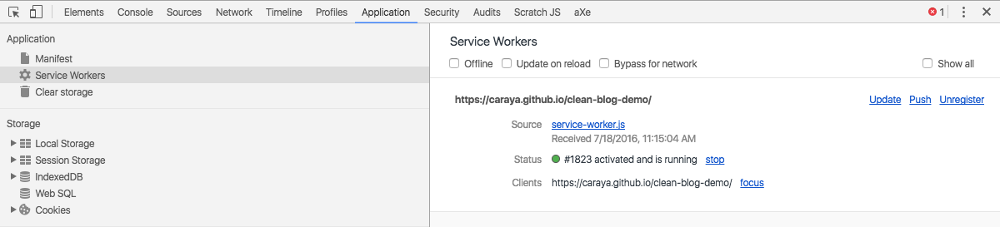
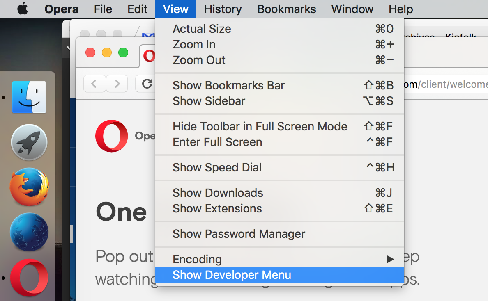
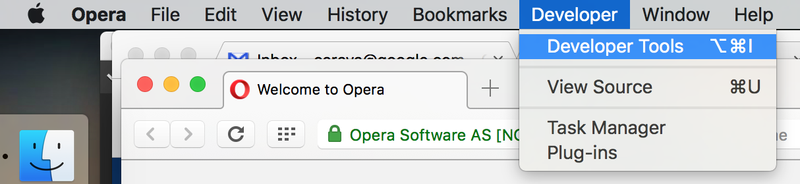
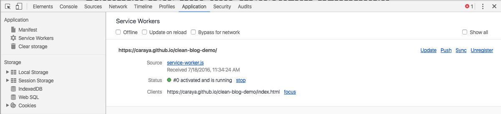
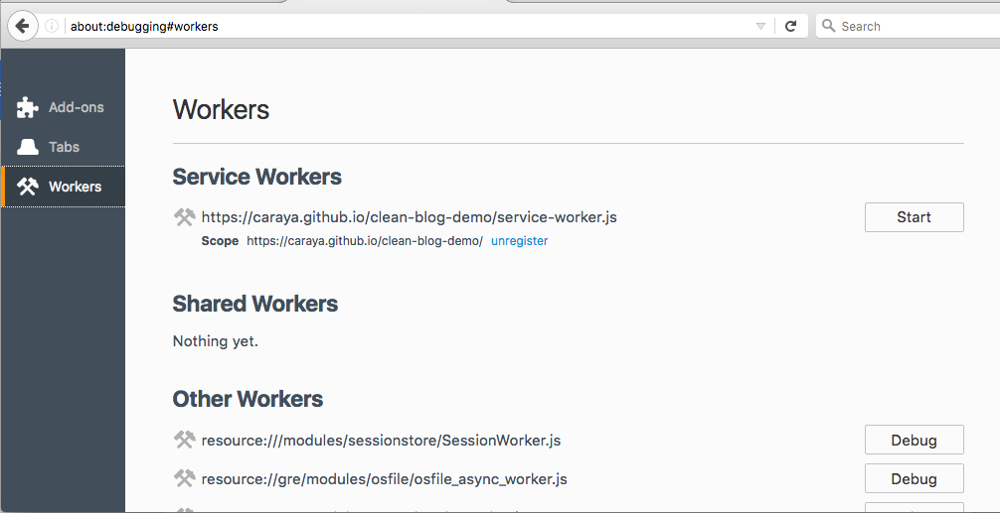
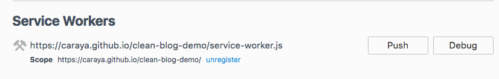

project_path: /web/_project.yaml
book_path: /web/ilt/_book.yaml

{# wf_auto_generated #}
{# wf_updated_on: 2017-02-22T21:31:45Z #}
{# wf_published_on: 2016-01-01 #}

# Debugging Service Workers in Browsers {: .page-title }

## Chrome

Open DevTools with __F12__ or  __Ctrl+Shift+I__ on Windows Or __Cmd+Opt+I__ on Mac

The command is also available under the __ *View > Developer > Developer tools* __ as shown in the image below:

Once in DevTools you can check the status of your service worker under application. When you click the application tab you will see the current page's service worker in the right side of the screen along with some developer helpers to make working with the service worker easier. 

There are three checkboxes: 

* __Offline__: forces the browser offline, simulating no network connectivity
* __Update on Reload__: reloads the service worker every time the browser reloads, picking up all changes during development
* __Bypass for network__: Ignores the service worker and fetches all resources from the network

For more information:  [https://developers.google.com/web/tools/chrome-devtools/](/web/tools/chrome-devtools/)

## Opera

To activate Devtools in Opera first show the developer menu. From the __View__ menu click __Show Developer Menu__

Then from the __Developer__ menu, open the Developer Tools by clicking on __Developer Tools__ or using __F12__ or __Ctrl+Shift+I__ on Windows Or __Cmd+Opt+I__ on Mac

Once in Devtools you can check the status of your service worker under application. When you click the application tab you will see the current page's service worker in the right side of the screen along with some developer helpers to make working with the service worker easier. 

There are three checkboxes: 

* __Offline__: forces the browser offline, simulating no network  connectivity
* __Update on Reload__: reloads the service worker every time the browser reloads, picking up all changes during development
* __Bypass for network__: Ignores the service worker and fetches all resources from the network

## Firefox

Firefox service worker debugging tools work slightly different that Chrome and Opera. Rather than opening the Dev Tools window, type the following in your location bar:

__about:debugging__

This will open the debugger window. It is a global tool; from here you can debug add-ons, tabs and their content as well as workers (web workers, shared workers and service workers).

An active service worker looks like the image below:

From here we can unregister the service worker, push messages to active clients and debug it in Firefox's Javascript debugger. 

