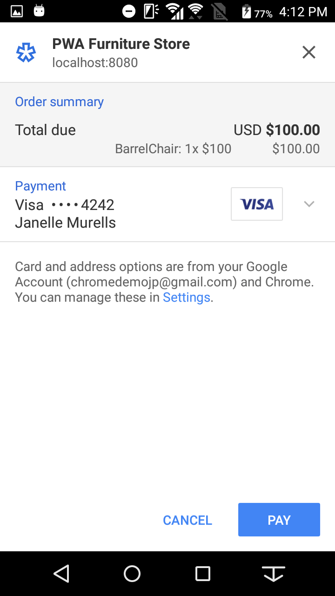
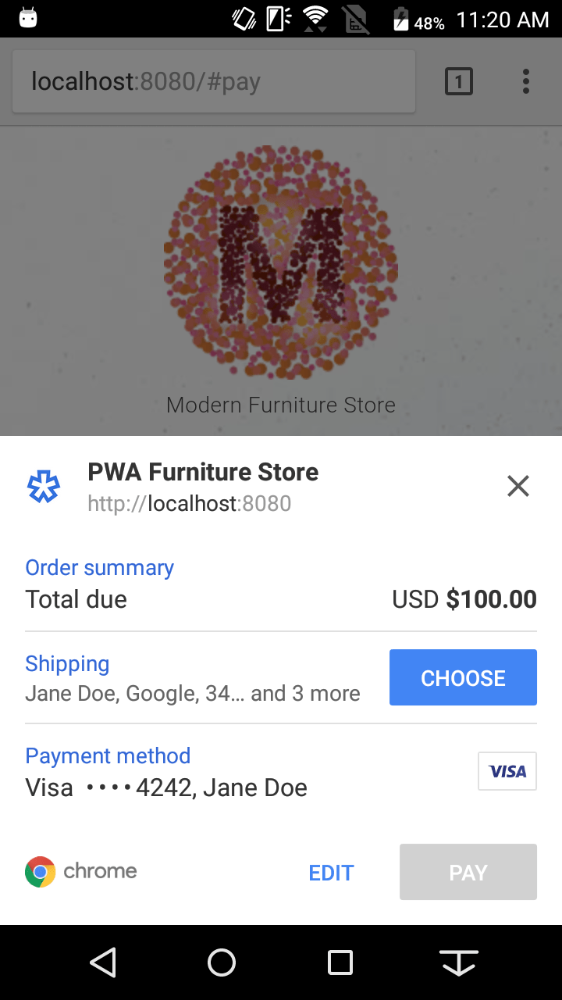
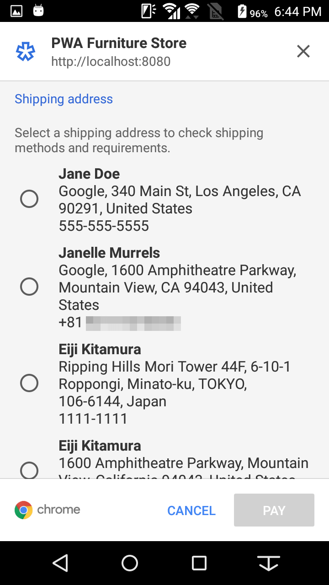
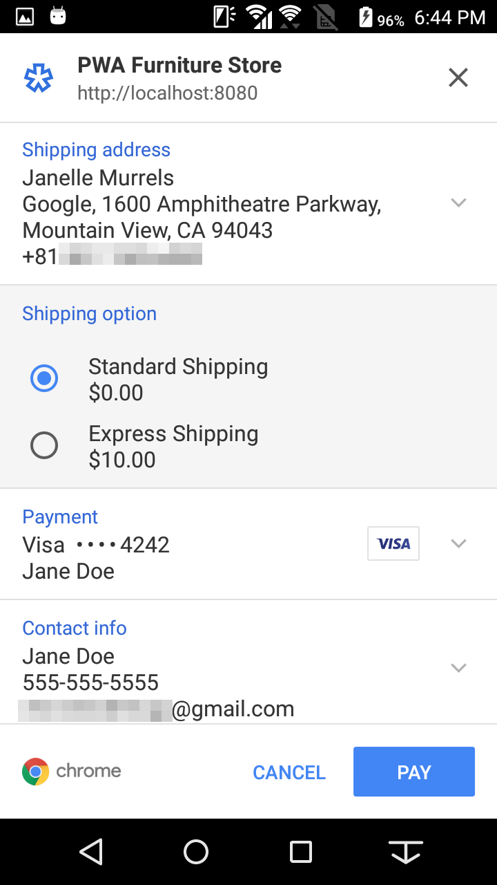
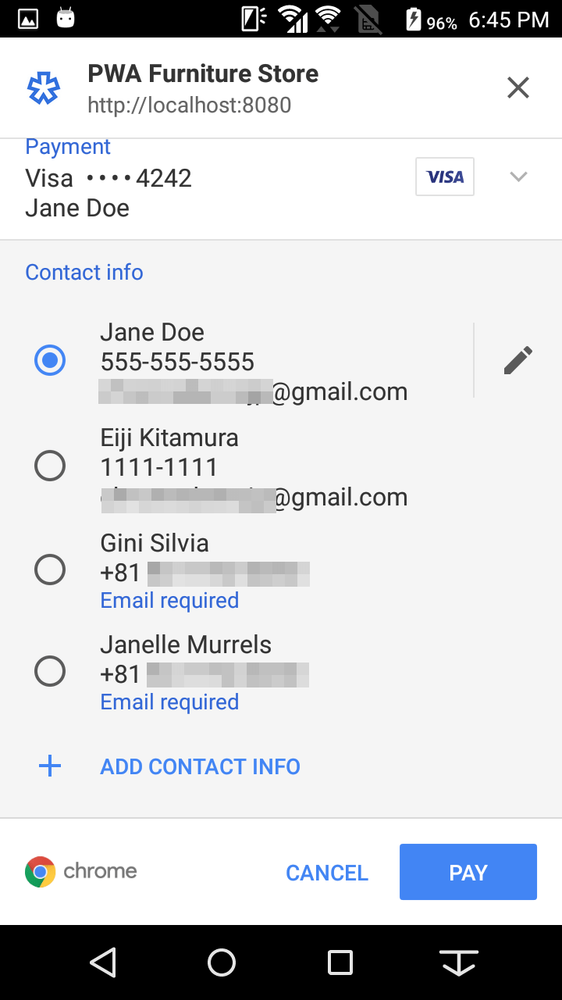
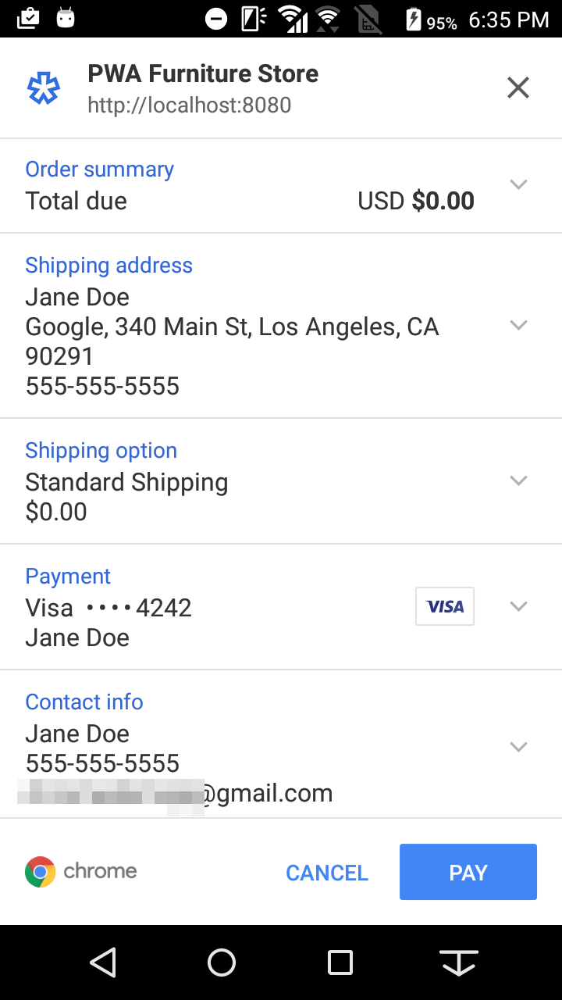

project_path: /web/_project.yaml
book_path: /web/ilt/pwa/_book.yaml

{# wf_auto_generated #}
{# wf_updated_on: 2017-11-07 #}
{# wf_published_on: 2016-01-01 #}


# E-Commerce Lab 3: Payment Request API {: .page-title }


<div id="overview"></div>


## Overview


#### What you will do

* Integrate the Payment Request API in the e-commerce app

#### What you should know

* Basic JavaScript and HTML
* Familiarity with the concept and basic syntax of ES2015  [Promises](http://www.html5rocks.com/en/tutorials/es6/promises/)

#### What you will need

* USB cable to connect an Android device to your computer
* Computer with terminal/shell access
* Connection to the internet
* Chrome for Android version 56 or higher
* A text editor

<div id="1"></div>


## 1. Get set up


If you have a text editor that lets you open a project, then open the __project__ folder in the __pwa-ecommerce-demo__ folder. This will make it easier to stay organized. Otherwise, open the folder in your computer's file system. The __project__ folder is where you will build the app.


If you have completed the E-Commerce App labs up to this point, your app is already set up and you can skip to step 2.


If you did not complete the previous labs, copy the contents of the __lab3-payments__ folder and overwrite the contents of the __project__ directory. Then run `npm install` in the command line at the __project__ directory.

At the project directory, run `npm run serve` to build the application in __dist__. Open your browser and navigate to `localhost:8080` to see the initial state of the app.


Note: The e-commerce app is based on Google's  [Web Starter Kit](https://github.com/google/web-starter-kit/), which is an "opinionated boilerplate" designed as a starting point for new projects. It allows us to take advantage of several preconfigured tools that facilitate development, and are optimized both for speed and multiple devices. You can learn more about Web Starter Kit  [here](/web/tools/starter-kit/).


Note: Solution code for this lab can be found in the __solution__ folder.


From here, you will be implementing the Payment Request API.

The Payment Request API is not yet supported on desktop as of Chrome 58, so you will need an Android device with Chrome installed to test the code. Follow the instructions in the  [Access Local Servers](/web/tools/chrome-devtools/remote-debugging/local-server) article to set up port forwarding on your Android device. This lets you host the e-commerce app on your phone.

<div id="2"></div>


## 2. Create a PaymentRequest


### 2.1 Detect feature availability

First, let's add add a feature detection for the Payment Request API. And if it's available, let a user process payment with it.

Replace "TODO PAY-2.1" in __app/scripts/modules/app.js__ with the following code and remove the dummy conditional of `if (false) {` to add PaymentRequest feature detection:

#### app.js

```
if (window.PaymentRequest) {
```

#### Explanation

The feature detection is as simple as examining if `window.PaymentRequest` returns `undefined` or not.

### 2.2 Create a PaymentRequest

Create a Payment Request object using the PaymentRequest constructor.

Replace TODO PAY-2.2 in __app/scripts/modules/payment-api.js__ with the following code to create a new `PaymentRequest` object:

#### payment-api.js

```
let request = new window.PaymentRequest(supportedInstruments, details, paymentOptions);
```

Save the file.

#### Explanation

The constructor takes three parameters.

__supportedInstruments:
__The first argument is a required set of data about supported payment methods. This can include basic credit cards as well as payment processors like Android Pay. We'll use only basic credit cards in this codelab.

__details:
__The second argument is required information about the transaction. This must include the information to display the total to the user (i.e., a label, currency, and value amount), but it can also include a breakdown of items in the transaction.

__paymentOptions:
__The third argument is an optional parameter for things like shipping. This allows you to require additional information from the user, like payer name, phone, email, and shipping information.

### Try it out

You should now be able to try the Payment Request API. If you are not running your server, `npm run serve` and try it using your Android device. Follow the instructions in the  [Access Local Servers](/web/tools/chrome-devtools/remote-debugging/local-server) article to set up port forwarding on your Android device.

```
$ npm run serve
```

The `PaymentRequest` UI displays when you click __Checkout__.


Note: The information you enter here won't be posted anywhere other than your local server, but you should use fake information. However, since credit card information requires validation, you can use following fake number so it can accept a random CVC: `4242 4242 4242 4242`


Be aware, this is just the first step and there is more work to be done for the API to complete successfully. Let's continue.

<div id="3"></div>


## 3. Add payment methods


At this point, most of the arguments are empty arrays or objects. Let's configure the payment method (`supportedInstruments`) with proper values.

Replace the JSON block below TODO PAY-3 in __app/scripts/modules/payment-api.js__ with this:

#### payment-api.js

```
{
  supportedMethods: ['basic-card'],
  data: {
    supportedNetworks: ['visa', 'mastercard', 'amex',
      'jcb', 'diners', 'discover', 'mir', 'unionpay']
  }
}
```

Save the file.

#### Explanation

The first argument of the `PaymentRequest` constructor takes a list of supported payment methods as JSON objects.

`supportedMethods` takes a list of supported method names as an array. Supported methods can be `basic-card` or a URL representing a payment app. These are defined in the  [Payment Method Identifiers](https://www.w3.org/TR/payment-method-id/) specification.

In the case of `basic-card`, `supportedNetworks` under `data` takes a list of supported credit card brands as defined at  [Card Network Identifiers Approved for use with Payment Request API](https://www.w3.org/Payments/card-network-ids). This will filter and show only the credit cards available for the user in the Payment Request UI.

<div id="4"></div>


## 4. Add payment details


Next, let's provide information about items a user is trying to purchase.

### 4.1 Define the details object

The second argument of the `PaymentRequest` constructor takes details about the purchase. It takes a list of items to display and the total price information.

This portion is already implemented in the `buildPaymentDetails()` function in __app/scripts/modules/payment-api.js__. You don't have to do anything at this time, but see what's happening here.

#### payment-api.js

```
let details = {
  displayItems: displayItems,
  total: {
    label: 'Total due',
    amount: {currency: 'USD', value: String(total)}
  }
  // TODO PAY-6.2 - allow shipping options
};
return details;
```

Save the file.

#### Explanation

A required `total` parameter consists of a label, currency and total amount to be charged.

An optional `displayItems` parameter indicates how the final amount was calculated.

The `displayItems` parameter is not intended to be a line-item list, but is rather a summary of the order's major components: subtotal, discounts, tax, shipping costs, etc. Let's define it in the next section.

### 4.2 Define the display items

The `displayItems` variable should be defined based on items added to the cart.

Replace "TODO PAY-4.2" in __app/scripts/modules/payment-api.js__ with the following code and remove the existing `let displayItems = [];`:

#### payment-api.js

```
let displayItems = cart.cart.map(item => {
  return {
    label: `${item.sku}: ${item.quantity}x $${item.price}`,
    amount: {currency: 'USD', value: String(item.total)}
  };
});
```

Save the file.

#### Explanation

The payment UI should look like this. Try expanding "Order summary":



Notice that the display items are present in the "Order summary" row. We gave each item a `label` and `amount`. `label` is a display label containing information about the item. `amount` is an object that constructs price information for the item.

<div id="5"></div>


## 5. Complete the PaymentRequest


You've put the minimum required options to run a Payment Request. Let's allow a user to complete the payment.

Replace "TODO PAY-5" and the existing `return request.show();` in __app/scripts/modules/payment-api.js__ with the following code:

#### payment-api.js

```
    return request.show()
      .then(r => {
        // The UI will show a spinner to the user until
        // `request.complete()` is called.
        response = r;
        let data = r.toJSON();
        console.log(data);
        return data;
      })
      .then(data => {
        return sendToServer(data);
      })
      .then(() => {
        response.complete('success');
        return response;
      })
      .catch(e => {
        if (response) {
          console.error(e);
          response.complete('fail');
        } else if (e.code !== e.ABORT_ERR) {
          console.error(e);
          throw e;
        } else {
          return null;
        }
      });
```

#### Explanation

The `PaymentRequest` interface is activated by calling its `show()` method. This method invokes a native UI that allows the user to examine the details of the purchase, add or change information, and pay. A `Promise` (indicated by its `then()` method and callback function) that resolves will be returned when the user accepts or rejects the payment request.

Calling `toJSON()` serializes the response object. You can then POST it to a server to process the payment. This portion differs depending on what payment processor / payment gateway you are using.

Once the server returns a response, call `complete()` to tell the user if processing the payment was successful or not by passing it `success` or `fail`.

### Try out the app

Awesome! Now you have completed implementing the basic Payment Request API features in your app. If you are not running your server, `npm run serve` and try it using your Android device.

```
$ npm run serve
```

The `PaymentRequest` UI displays when you click __Checkout__.

<div id="6"></div>


## 6. Allow shipping options


So far you've learned how to integrate the Payment Request API when it doesn't involve shipping items. Moving forward you will learn how to collect shipping information and options from the user.

### 6.1 Define the shipping options

When you want to collect the user's address information in order to ship items, add `requestShipping: true` in the third property of the `PaymentRequest` constructor.

Replace "TODO PAY-6.1" in __app/scripts/modules/payment-api.js__ with the following code:

#### payment-api.js

```
requestShipping: true,
```

You also need to provide list of shipping options.

Replace "TODO PAY-6.2" in __app/scripts/modules/payment-api.js__ with the following code:

#### payment-api.js

```
,
shippingOptions: displayedShippingOptions
```

Luckily `SHIPPING_OPTIONS` is predefined in the __app/scripts/modules/payment-api.js__; you can parse it and construct the `displayShippingOptions` object from it.

Replace TODO PAY-6.3 in __app/scripts/modules/payment-api.js__ with the following code:

#### payment-api.js

```
let displayedShippingOptions = [];
if (shippingOptions.length > 0) {
  let selectedOption = shippingOptions.find(option => {
    return option.id === shippingOptionId;
  });
  displayedShippingOptions = shippingOptions.map(option => {
    return {
      id: option.id,
      label: option.label,
      amount: {currency: 'USD', value: String(option.price)},
      selected: option.id === shippingOptionId
    };
  });
  if (selectedOption) total += selectedOption.price;
}
```

Save the file.

#### Explanation

`id` is a unique identifier of the shipping option item. `label` is a displayed label of the item. `amount` is an object that constructs price information for the item. `selected` is a boolean that indicates if the item is selected.



Notice that these changes add a section to the Payment Request UI, "Shipping". But beware, selecting shipping address will cause UI to freeze and timeout. To resolve this, you will need to handle `shippingaddresschange` event in the next section.


Note: The address information available here is retrieved from the browser's autofill information. Depending on the user's browser status, users will get address information pre-filled without typing any text. They can also add a new entry on the fly.


<div id="7"></div>


## 7. Add event handlers


What if a user specifies a shipping address that's outside of your target countries and not deliverable? How do you charge a user when the user changes a shipping option? The answer is to receive events upon the user's making changes and update with relevant information.

### 7.1 Add `shippingaddresschange` event listener

When the user changes a shipping address, you will receive the `shippingaddresschange` event.

Replace "TODO PAY-7.1" in __app/scripts/modules/payment-api.js__ with the following code:

#### payment-api.js

```
// When user selects a shipping address, add shipping options to match
request.addEventListener('shippingaddresschange', e => {
  e.updateWith((_ => {
    // Get the shipping options and select the least expensive
    shippingOptions = this.optionsForCountry(request.shippingAddress.country);
    selectedOption = shippingOptions[0].id;
    let details = this.buildPaymentDetails(cart, shippingOptions, selectedOption);
    return Promise.resolve(details);
  })());
});
```

#### Explanation

Upon receiving the `shippingaddresschange` event, the `request` object's `shippingAddress` information is updated. By examining it, you can determine if

* The item is deliverable.
* Shipping cost needs to be added/updated.

This code looks into the country of the shipping address and provides free shipping and express shipping inside the US, and provides international shipping otherwise. Checkout `optionsForCountry()` function in __app/scripts/modules/payment-api.js__ to see how the evaluation is done.



Note that passing an empty array to `shippingOptions` indicates that shipping is not available for this address. You can display an error message via `shippingOption.error` in that case.

### 7.2 Add `shippingoptionchange` event listener

When the user changes a shipping option, you will receive the `shippingoptionchange` event.

Replace "TODO PAY-7.2" in __app/scripts/modules/payment-api.js__ with the following code:

#### payment-api.js

```
// When user selects a shipping option, update cost, etc. to match
request.addEventListener('shippingoptionchange', e => {
  e.updateWith((_ => {
    selectedOption = request.shippingOption;
    let details = this.buildPaymentDetails(cart, shippingOptions, selectedOption);
    return Promise.resolve(details);
  })());
});
```

#### Explanation

Upon receiving the `shippingoptionchange` event, the `request` object's `shippingOption` is updated. The `shippingOption`It indicates the `id` of the selected shipping options. The `id` is passed to `buildPaymentsDetails`, which looks for the price of the shipping option and updates the display items so that the user knows the total cost is changed. `buildPaymentsDetails alsoAlso` changes the shipping option's `selected` property to `true` to indicate that the user has chosen the item. Checkout `buildPaymentDetails()` function in __app/scripts/modules/payment-api.js__ to see how it works.



<div id="8"></div>


## 8. Add payment options


In addition to the shipping address, there are options to collect payer's information such as email address, phone number, and name.

Replace "TODO PAY-8" in __app/scripts/modules/payment-api.js__ with the following payment options:

#### payment-api.js

```
requestPayerEmail: true,
requestPayerPhone: true,
requestPayerName: true
```

Save the file.

#### Explanation



By adding `requestPayerPhone: true`, `requestPayerEmail: true`, `requestPayerName: true` to the third argument of the `PaymentRequest` constructor, you can request the payer's phone number, email address, and name.

<div id="9"></div>


## 9. Test it out


Phew! You have now completed implementing the Payment Request API with shipping option. Let's try it once again by running your server if it's stopped.

```
$ npm run serve
```



Try: add random items to the card, go to checkout, change shipping address and options, and finally make a payment.

Follow the instructions in the  [Access Local Servers](/web/tools/chrome-devtools/remote-debugging/local-server) article to set up port forwarding on your Android device. This lets you host the e-commerce app on your phone.

Once you have the app running on your phone, add some items to your cart and go through the checkout process. The `PaymentRequest` UI displays when you click __Checkout__.

The payment information won't go anywhere, but you might be hesitant to use a real credit card number. Use "4242 4242 4242 4242" as a fake one. Other information can be anything.


The service worker is caching resources as you use the app, so be sure to unregister the service worker and run `npm run serve` if you want to test new changes.


<div id="congrats"></div>


## Congratulations!


You have added Payment integration to the e-commerce app. Congratulations!

To learn more about the Payment Request API, visit the following links.


## Resources


*  [Bringing Easy and Fast Checkout with Payment Request API](/web/updates/2016/07/payment-request)
*  [Payment Request API: an Integration Guide](/web/fundamentals/discovery-and-monetization/payment-request/)
*  [Web Payments session video at Chrome Dev Summit 2017](https://www.youtube.com/watch?v=U0LkQijSeko)

### Specs

*  [Payment Request API](https://w3c.github.io/browser-payment-api/)
*  [Payment Handler API](https://w3c.github.io/webpayments-payment-apps-api/)

### Demos

*  [https://paymentrequest.show/demo/](https://paymentrequest.show/demo/)
*  [https://googlechrome.github.io/samples/paymentrequest/](https://googlechrome.github.io/samples/paymentrequest/)
*  [https://woocommerce.paymentrequest.show/](https://woocommerce.paymentrequest.show/)


