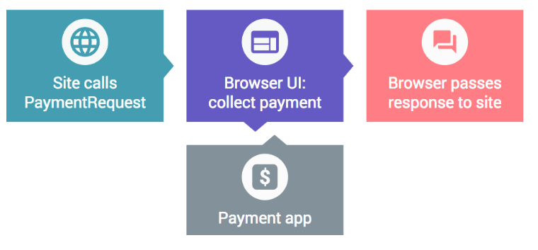

project_path: /web/_project.yaml
book_path: /web/ilt/pwa/_book.yaml

{# wf_auto_generated #}
{# wf_updated_on: 2017-07-12T22:13:18Z #}
{# wf_published_on: 2016-01-01 #}

# Introduction to the Payment Request API {: .page-title }

The Payment Request API improves mobile web checkout (shopping cart) and accepts credit cards electronically (and eventually a number of other payment services and solutions in the wild). 

The Payment Request API allows merchants to easily collect payment information with minimal integration. The API is an open and cross-browser standard that replaces traditional checkout flows by allowing merchants to request and accept any payment in a single API call. The API eliminates manual and tedious entry by storing the user's information securely in the browser. The browser passes addresses and credit card (or other payment) details directly to the website. And, because the browser is collecting payment information from the user, making a payment goes from " *n* " taps to one tap.

Note: The <a href="https://github.com/w3c/browser-payment-api">Payment Request API</a> is very new and still subject to developmental changes, especially while it is under development in the  [W3C Web Payments Working Group](https://www.w3.org/TR/payment-request/). Google tracks updates on <a class="https://developers.google.com/web/fundamentals/primers/payment-request/">this page</a>. Please keep checking back. Also on this page is <a class="https://storage.googleapis.com/prshim/v1/payment-shim.js">a shim</a> that you can embed on your site to paper over API differences for two major Chrome versions.

## About Web Payments

For mobile device users, making purchases on the web, particularly on mobile devices, can be a frustrating experience. Every web site has its own flow and its own validation rules, and most require us to manually type in the same set of information over and over again. Likewise, it is difficult and time consuming for developers to create good checkout flows that support various payment schemes.

For businesses, checkout can be a complicated process to develop and complete. That's why it is worthwhile investing in capabilities such as the  [Payment Request API](https://github.com/w3c/browser-payment-api/) and enhanced autofill to assist your users with the task of accurately filling in forms. 

Mobile users are likely to abandon online purchase forms that are user-intensive, difficult to use, slow to load and refresh, and require multiple steps to complete. This is because two primary components of online payments – security and convenience – often work at cross-purposes, where more of one typically means less of the other. 

Any system that improves or solves one or more of those problems is a welcome change. We've found that forms and payments are completed 25% more when autofill is available, increasing odds for conversion. We started solving the problem already with  [Autofill](/web/updates/2015/06/checkout-faster-with-autofill), but now we're talking about a more comprehensive solution called the Payment Request API.

## Introduction to the Payment Request API

The Payment Request API is a system that is meant  *to eliminate checkout forms* . It vastly improves user workflow during the purchase process, providing a more convenient and consistent user experience and enabling web merchants to easily leverage disparate payment methods. The Payment Request API is not a new payment method, nor does it integrate directly with payment processors. Rather, it is a process layer whose goals are:

* To let the browser act as intermediary among merchants, users, and payment methods
* To standardize the payment communication flow as much as possible
* To seamlessly support different secure payment methods
* To work on any browser, device, or platform—mobile or otherwise

The Payment Request API is currently under development by the  [W3C Web Payments Working Group](https://www.w3.org/TR/payment-request/). The group's goal is to create a universal cross-browser standard for any website to accept any form of payment. See the  [Can I use](http://caniuse.com/#feat=payment-request) website for up-to-date browser support.

The Payment Request API's open-web approach is designed:

* For developers to minimize the need to fill out checkout forms and improve user's payment experience from the ground up. This API follows the recommendations in the  [W3C Payment Request API specification](https://www.w3.org/TR/payment-request/) published by the  [Web Payments Working Group](https://www.w3.org/Payments/WG/). 
* For users to check out, make a payment, or fill in forms with minimal use of the mobile device keyboard. 

The API uses securely cached data to facilitate payment interaction between the user and the merchant's site. The API also gets the data necessary to process transactions as quickly as possible.

The Payment Request API is a standards-based way to enable checkout on the web that:

* Provides a native user interface for users to select or add a payment method, a shipping address, a shipping option, and contact information in an easy, fast, and secure way.
* Provides standardized (JavaScript) APIs for developers to obtain user's payment preferences in a consistent format.
* Brings secure, tokenized payments to the web (browser as middleman) using secure origin,  HTTPS.
* Always returns a payment credential that a merchant can use to get paid (credit card, push payment, token, etc).
* Is designed so that additional functionality can be added in, depending on your particular product requirements (shipping information, email, and phone number collection).

### Goals of the Payment Request API

The Payment Request API is an open and cross-browser standard that replaces traditional checkout flows by allowing merchants to request and accept any payment in a single API call. The API allows the web page to exchange information with the browser while the user is providing input, before approving or denying a payment request. 

It vastly improves user workflow during the purchase process, providing a more consistent user experience and enabling web merchants to easily leverage disparate payment methods. The Payment Request API is neither a new payment method, nor does it integrate directly with payment processors. Rather, it is a process layer whose goals are to:

* Allow the browser act as intermediary among merchants, users, and payment methods
* Standardize the payment communication flow as much as possible
* Seamlessly support different secure payment methods
* Eventually work on any browser, device, or platform, including mobile devices and otherwise (as of this writing the Payment Request API is available on Chrome for Android (v53), Samsung Internet (v5.0), and partially supported on Edge (v15), but other third-party solutions will be supported in the future)

Best of all, the browser acts as an intermediary, storing all the information necessary for a fast checkout so users can just confirm and pay with a single tap or click.

### Demos

Payment Request demos are available at these URLs:

* Demo:  [https://emerald-eon.appspot.com/](https://emerald-eon.appspot.com/)
* Polymer Shop demo:  [https://polykart-credential-payment.appspot.com/](https://polykart-credential-payment.appspot.com/)
* Simple demos and sample code:  [https://googlechrome.github.io/samples/paymentrequest/](https://googlechrome.github.io/samples/paymentrequest/)
* Deep dive documentation:  [https://developers.google.com/web/fundamentals/discovery-and-monetization/payment-request/deep-dive-into-payment-request](/web/fundamentals/discovery-and-monetization/payment-request/deep-dive-into-payment-request)
* Samsung Internet demos: 
*  [https://samsunginter.net/examples/payment-request-demo-simple/](https://samsunginter.net/examples/payment-request-demo-simple/)
*  [https://samsunginter.net/examples/payment-request-demo-options/](https://samsunginter.net/examples/payment-request-demo-options/)

## How Payment Request Processing Works

Using the Payment Request API, the transaction process is made as seamless as possible for both users and merchants.

The process begins when the merchant site creates a new `PaymentRequest` and passes to the browser all the information required to make the purchase: the amount to be charged, what currency they expect payment in, and what payment methods are accepted by the site. The browser determines compatibility between the accepted payment methods for the site and the methods the user has installed on the target device.

The browser then presents the payments UI to the user, who selects a payment method and authorizes the transaction. A payment method can be as straightforward as a credit card that is already stored by the browser, or as esoteric as a third-party system (for example, Android Pay or PayPal) written specifically to deliver payments to the site (this functionality is coming soon). After the user authorizes the transaction, all the necessary payment details are sent directly back to the site. For example, for a credit card payment, the site gets a card number, a cardholder name, an expiration date, and a CVC.

`PaymentRequest` can also be extended to return additional information, such as shipping addresses and options, payer email, and payer phone. This allows you to get all the information you need to finalize a payment without ever showing the user a checkout form.

From the user's perspective, all the previously tedious interaction—request, authorization, payment, and result—now takes place in a single step; from the web site's perspective, it requires only a single JavaScript API call. From the payment method's perspective, there is no process change whatsoever.

## Using the Payment Request API

[Bringing Easy and Fast Checkout with Payment Request API](/web/updates/2016/07/payment-request)

[Payment Request API: an Integration Guide](/web/fundamentals/primers/payment-request/)

## Resources

To learn more about Payment Request API, see these documents and resources:

*  [Official specification](http://ift.tt/1WHbRmb)
*  [Payment Request API integration guide](http://ift.tt/2alR15H)
*  [Demo](http://ift.tt/2ayc1cO)
*  [Simple demos and sample code](http://ift.tt/2alPZ9Q)

